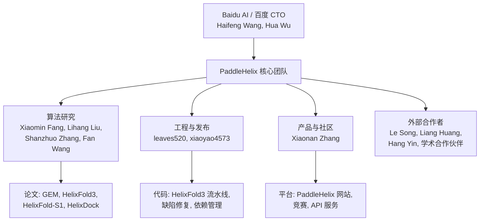

---
slug:5-about-contributors
blog_type:buzz
---

PaddleHelix（螺旋桨）并非典型的开源项目，其贡献者网络并非松散连接。它是百度内部生物计算研究团队的延伸，其提交历史、论文署名以及公开活动均表明，这是一个由全职研究员和工程师紧密协同的团队。了解他们是谁至关重要——这并非出于对层级的盲目崇拜，而是因为编写代码的人与定义算法的论文作者是同一批人，这意味着缺陷报告和设计审查的反馈闭环异常短暂。

以下是对该仓库核心成员的剖析，信息源自他们在 GitHub 上的足迹、发表记录（[ORCID](https://orcid.org/0000-0002-7563-5268)、[Semantic Scholar](https://www.semanticscholar.org/author/Xiaomin-Fang/2138518775)）以及公开活动的出席情况。

---

## 研发核心

PaddleHelix 横跨学术界与工业界：学术发表与工业工程。该项目最活跃的贡献者在百度担任“主任工程师”或“研究员”等职务，且仓库中几乎每一个主要特性都直接对应一篇经过同行评审的论文。这一点值得强调，因为它解释了项目优势的来源（深厚的算法严谨性），也解释了其短板（文档缺失、问题处理缓慢）。

### Xiaomin Fang（GitHub: xiaoyao4573）

如果说有一个人与 PaddleHelix 的关联最为紧密，那非 **Xiaomin Fang** 莫属。Fang 在 ORCID 上的身份为[百度主任工程师](https://orcid.org/0000-0002-7563-5268)，他是该项目最具影响力出版物的主要作者或通讯作者：

| 论文 | 发表期刊/会议 | 年份 | 角色 |
|-------|-------|------|------|
| Geometry-enhanced molecular representation learning for property prediction (GEM) | Nature Machine Intelligence | 2022 | 第一作者 |
| A method for MSA-free protein structure prediction using a protein language model (HelixFold-Single) | Nature Machine Intelligence | 2023 | 第一作者 |
| HelixFold3 技术报告 | arXiv:2408.16975 | 2024 | 末位作者（通讯） |
| HelixFold-S1: Strategic Conformational Exploration | arXiv:2507.09251 | 2025 | 末位作者（通讯） |
| State-Specific Peptide Design Targeting GPCRs | 期刊论文 | 2025 | 共同作者 |

在 GitHub 上，xiaoyao4573 负责版本发布管理（从 v1.0b 到 v1.2.2 的[六个标签版本](https://github.com/PaddlePaddle/PaddleHelix/releases)均由该账号发布）并合并主要的 Pull Request——最近一次是 2026 年 3 月的 [HelixFold-S1 开源发布](https://github.com/PaddlePaddle/PaddleHelix/commit/8e3991ab1209134b148b05d44e784a43eaa4484d)。据 [GetProg.ai](https://www.getprog.ai/profile/5843577) 统计，在大约两年的时间里，Fang 在 PaddleHelix 上提交了 224 次代码，完成了 55 次代码审查，并交付了 8 个版本，重点关注 LinearFold C++ 后端、`pahelix` 工具包以及教程维护。

Fang 的发表记录至少可追溯至 2014 年（ACM SIGKDD）和 2015 年（AAAI），远早于 PaddleHelix 的诞生。其早期研究集中于推荐系统和强化学习，这使得他转向计算生物学的历程显得尤为引人瞩目。

### Lihang Liu

**Lihang Liu** 是 [HelixFold3 技术报告](https://www.semanticscholar.org/paper/Technical-Report-of-HelixFold3-for-Biomolecular-Liu-Zhang/bf3d434ba30e19cee27affa1c32da27e02501039)和 [HelixFold-S1 论文](https://arxiv.org/abs/2507.09251)的第一作者，这使其成为 PaddleHelix 蛋白质结构预测流水线的主要架构师。HelixFold-S1 的研究于 2025 年 7 月提交，引入了一种引导式规划方法用于构象采样，“战略性定位构象空间中最具信息量的区域”——这是对结构预测中无引导扩散采样低效问题的直接回应。

Liu 还共同撰写了 [HelixDock 论文](https://arxiv.org/abs/2310.19436)（基于大规模生成对接构象的预训练）和 [GEM 论文](https://www.nature.com/articles/s42256-021-00438-4)。这种广度——从分子属性预测到分子对接，再到蛋白质折叠——表明 Liu 担任着该项目蛋白质/结构方向的“首席算法工程师”角色。

### Shanzhuo Zhang

**Shanzhuo Zhang** 的名字出现在 GEM、HelixADMET（发表于 [Bioinformatics, 2022](https://pubmed.ncbi.nlm.nih.gov/35794723)）、HelixFold3、HelixFold-S1 的共同作者列表中，最近还出现在 2025 年初发表的关于[靶向 TLR4 的药物发现](https://paddlehelix.baidu.com/news/achieve)的合作论文中。Zhang 同时参与项目的计算端（GEM、HelixFold3）和应用端（与印虹实验室的药物发现合作），表明其在平台团队与外部学术合作伙伴之间扮演着桥梁角色。

### Fan Wang

**Fan Wang** 是 HelixFold-Single Nature Machine Intelligence 论文、GEM 论文、HelixADMET 论文以及[多模态 PPI 预训练论文](https://proceedings.mlr.press/v165/xue22a.html)（MLCB 2022）的共同作者。Wang 的名字在该项目的药物发现垂直领域频繁出现，特别是在 ADMET 预测和蛋白质-蛋白质相互作用建模方面。

---

## 工程与运营层

研究论文无法自行发表。在算法作者背后，有一小群工程师负责处理依赖管理、缺陷修复和文档编写等枯燥工作。

### leaves520 / leaves（GitHub）

在 2024 至 2026 年期间，**leaves520** 账号（在合并提交中也显示为 **leaves**）是 `dev` 分支上最高产的提交者。以下是其近期工作的部分梳理：

- [feat: HelixFold-S1 初始开源发布](https://github.com/PaddlePaddle/PaddleHelix/commit/c83d99dc0d39274987169071b2314acd3d7a3218)（2026 年 3 月）
- [feat(helixfold3): 升级版本，重构代码，增加修饰支持](https://github.com/PaddlePaddle/PaddleHelix/commit/dc7058336557c8ffadf17f844e92580905cf9677)（2025 年 7 月）
- [feat(helixfold3): 更新 HelixFold3.2 的 README 并优化依赖配置](https://github.com/PaddlePaddle/PaddleHelix/commit/c48e99c608707d720689110bd91b707e33050096)（2025 年 7 月）
- [修复缺失 mmcif 结构坐标导致的错误](https://github.com/PaddlePaddle/PaddleHelix/commit/b8a83566ec26563880d4d251d7906449a8673bc3)（2024 年 11 月）
- [添加聚合物末端原子](https://github.com/PaddlePaddle/PaddleHelix/commit/73cd80b)（2024 年 9 月）——修复了 [#345](https://github.com/PaddlePaddle/PaddleHelix/issues/345) 中报告的羧基末端氧原子问题

该账号实际上充当了 HelixFold3 及其子变体的发布工程师。他们创建特性分支、推送修复并处理合并，且几乎没有公开讨论。值得注意的是，leaves520 还负责将 PR 推送到 `dev` 分支（而非 `main`），这表明团队采用了以 `dev` 作为集成分支的开发工作流。

### Xiaonan Zhang（张肖男）

Xiaonan Zhang 公开身份为百度的 **PaddleHelix 产品负责人**，她曾作为嘉宾出席了 2024 年 12 月在清华大学药学院举办的[第二届 AI 药物发现算法竞赛](https://www.sps.tsinghua.edu.cn/info/1042/2285.htm)。该活动由清华大学、百度飞桨和英特尔联合举办，吸引了 505 支队伍和 656 名参与者。Zhang 在其中的角色偏向组织与布道，而非技术层面——代表了百度在培养 AI+制药跨学科人才方面的投入。

在研究方面，Zhang 是 HelixFold3 和 HelixFold-S1 论文、[GPCR 肽段设计论文](https://paddlehelix.baidu.com/news/achieve)（2025 年）以及 HelixFold-Single Nature Machine Intelligence 论文的共同作者。这种双重身份——产品经理与发表论文的研究员——相对罕见，表明 Zhang 游走于团队的学术产出与商业平台策略的交界处。

---

## 高层领导与学术合作者

### Hua Wu 与 Haifeng Wang

**Hua Wu** 与 **Haifeng Wang**（百度 CTO）作为资深共同作者出现在该项目最早的高影响力论文中，包括 GEM 的 Nature Machine Intelligence 论文和 HelixADMET。他们的参与释放了来自百度最高技术领导层的机构支持信号。Haifeng Wang 的名字在百度的 NLP 和知识图谱研究中屡见不鲜，他出现在生物计算论文上表明，PaddleHelix 最初是在百度更广泛的 AI 研究体系下孵化的，而非作为一个独立的生物计算项目起步。

### Le Song

**Le Song**（现任职于 MBZUAI，前佐治亚理工学院教授）是 HelixFold-Single Nature Machine Intelligence 论文的共同作者。Song 是图表示学习和分子机器学习领域的知名人物，他的参与很可能为 HelixFold-Single 开创的蛋白质语言模型方法提供了理论基础。

### Liang Huang

**Liang Huang**（俄勒冈州立大学 / 前百度）编写了构成 PaddleHelix RNA 结构预测骨干的基础算法 [LinearFold](https://github.com/PaddlePaddle/PaddleHelix/blob/dev/apps/vaccine_design/LinearRNA/README.md) 和 [LinearPartition](https://paddlehelix.baidu.com/news/achieve)。这些算法通过束搜索实现了线性时间的 RNA 折叠预测——这是一项早于 PaddleHelix 的重大算法贡献，但从一开始就被整合到了该平台中。

---

## 团队组织架构

提交历史和论文署名揭示了一种清晰的分工：

这不是一个像 scikit-learn 或 PyTorch 那样由社区驱动的开源项目。它是一个**研究团队的代码发布**，绝大部分贡献来自百度员工。外部贡献确实存在——该仓库有 228 个 fork 和 8 个处于开启状态的 Pull Request——但核心的开发节奏几乎完全由内部团队驱动。

---

## 这对使用 PaddleHelix 的开发者意味着什么

了解贡献者结构有助于建立合理的预期：

1. **缺陷修复取决于团队的空闲时间。** 像 [Hopper 架构上的 Paddle GPU 不兼容问题](https://github.com/PaddlePaddle/PaddleHelix/issues/369)或[预训练权重不匹配问题](https://github.com/PaddlePaddle/PaddleHelix/issues/364)之所以持续处于开启状态，是因为团队的主要动力在于发表论文和发布新特性，而非为每种硬件配置维护向后兼容性。

2. **代码反映的是研究优先级，而非产品打磨。** [requirements.txt 安装失败](https://github.com/PaddlePaddle/PaddleHelix/issues/374)的问题（HelixFold3 目录中包含了过期的 `paddlepaddle_gpu-0.0.0.post116-cp37-cp37m-linux_x86_64.whl` 引用）是典型的症状：研究代码库在缺乏专门 DevOps 支持的情况下被公开。

3. **撰写论文的人正是合并 PR 的人。** 这一点确实非常有价值。当你在 HelixFold3 的模板特征提取中发现缺陷时（[#351](https://github.com/PaddlePaddle/PaddleHelix/issues/351)），修复它的人（[该提交](https://github.com/PaddlePaddle/PaddleHelix/commit/b8a83566ec26563880d4d251d7906449a8673bc3)）很可能在原论文的层面上理解底层算法。从发现缺陷到修复的反馈闭环具备充分的技术依据，哪怕速度较慢。

4. **学术合作受到欢迎。** 团队参与清华 AI 药物发现竞赛以及与外部实验室（如北京大学印虹课题组）的发表记录表明，他们对学术合作持开放态度。正式的合作咨询很可能通过 [PaddleHelix 官网](https://paddlehelix.baidu.com)上注明的 baidubio_cooperate@baidu.com 进行对接。

---

## 致谢全体团队

尽管本页重点介绍了最显眼的贡献者，但 PaddleHelix 的产出——涵盖 GEM、HelixFold、HelixFold-Single、HelixFold3、HelixFold-S1、HelixDock、HelixADMET、LinearRNA 等——是一个更大团队的结晶。在[项目发表列表](https://paddlehelix.baidu.com/news/achieve)中反复出现的其他名字还包括 **Yang Xue、Kunrui Zhu、Jingbo Zhou、Zijing Liu、Xianbin Ye、Yuxin Li、Zhiyuan Chen、Yueyang Huang 和 Yingfei Xiang** 等。每个人都对特定的垂直领域做出了贡献——从少样本分子属性预测到 RNA 语言建模，再到抗原-抗体结构预测。

想要进一步探索的话，历届贡献者的完整名单可在 [GitHub 贡献者图表](https://github.com/PaddlePaddle/PaddleHelix/graphs/contributors)中查看。