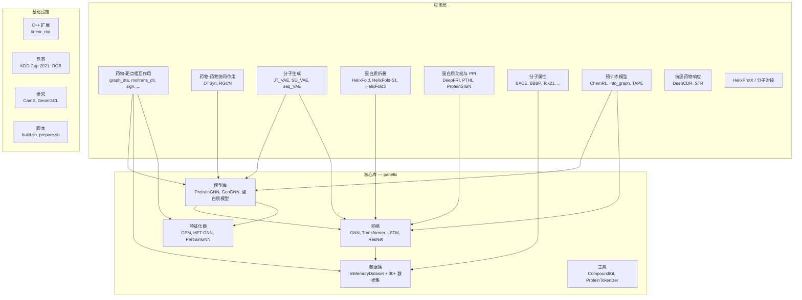
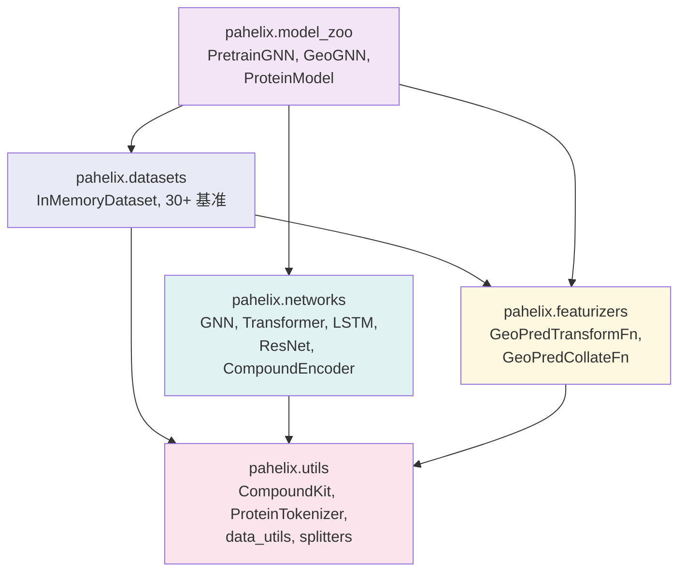

---
slug:6-architecture-overview
blog_type:normal
---

PaddleHelix 是一个基于 PaddlePaddle 构建的大规模生物医学 AI 工具包，旨在用于药物发现、蛋白质结构预测以及分子属性任务。本页提供了整个代码库的结构图——从驱动每个模型的核心库，到展示实际应用价值的应用层实验。理解此布局是浏览后续深度剖析页面的先决条件。

## 高层架构

PaddleHelix 遵循**分层架构**，在可复用的基础设施与特定领域的应用之间有着清晰的界限。其核心是 `pahelix` Python 包——一个独立的库，提供分子图表示、神经网络构建块和数据集管理功能。围绕它的 `apps/` 目录托管了端到端的应用流水线，这些流水线导入并组合了 `pahelix` 中的组件。支撑基础设施涵盖了用于计算化学的 C++ 扩展（`c/`）、竞赛基准解决方案（`competition/`）以及活跃的研究原型（`research/`）。

来源：[setup.py](/setup.py#L115-L134)、[pahelix/__init__.py](/pahelix/__init__.py#L15-L19)

## 代码库布局

代码库根目录分为六个顶层目录，各自承担不同的职责：

| 目录 | 用途 | 核心内容 |
|---|---|---|
| `pahelix/` | 核心 Python 库（安装时名为 `paddlehelix`） | 数据集、特征化器、神经网络、模型库、工具 |
| `apps/` | 端到端应用流水线 | DTI、分子生成、蛋白质折叠、属性预测、预训练 |
| `competition/` | 基准竞赛解决方案 | KDD Cup 2021 PCQM4M-LSC、OGB MolHIV |
| `research/` | 活跃的研究原型 | CamE、GeomGCL |
| `c/` | C++ 扩展 | LinearRNA 工具包 |
| `tutorials/` | 交互式 Jupyter Notebook | 属性预测、DTI、分子生成、蛋白质预训练 |

来源：[setup.py](/setup.py#L122-L134)、[tutorials/README.md](/tutorials/README.md)

## 核心库：`pahelix/`

`pahelix` 包（版本 `1.0.0b`，包名 `paddlehelix`）是整个框架的可复用基础。它作为一个可通过 pip 安装的库发布，依赖于 numpy、pandas、networkx 和 scikit-learn。该包内部依赖 PGL（Paddle Graph Learning）进行图神经网络操作，并依赖 RDKit 处理分子化学。下面我们将逐一剖析各个子包。

### 数据集 (`pahelix/datasets/`)

数据集层以 `InMemoryDataset` 为锚点，这是一个通用容器，用于管理 `data_list`——一个字典列表，其中每个字典将特征名映射到 numpy 数组。该设计有意借鉴了 PyTorch Geometric 的数据集理念：数据被完整加载到内存中（或通过内存映射从 `.npz` 缓存中加载），并通过 `__getitem__` 和 `__len__` 魔术方法访问元素。该类支持通过 `transform()` 进行多进程转换，并通过 `get_data_loader()` 直接与 PGL 的 `Dataloader` 集成，以实现批量图采样。

在此基础之上，PaddleHelix 附带了**30 余种特定领域的数据集类**，涵盖了分子机器学习的主要基准——MoleculeNet（BACE、BBBP、ClinTox、HIV、MUV、SIDER、Tox21、ToxCast、ESOL、FreeSolv、Lipophilicity）、量子化学（QM7、QM8、QM9）、药物-靶点相互作用（Davis、KIBA）、蛋白质-蛋白质相互作用以及 OGB 挑战赛。

来源：[inmemory_dataset.py](/pahelix/datasets/inmemory_dataset.py#L33-L146)、[datasets/__init__.py](/pahelix/datasets/__init__.py#L20-L40)

### 特征化器 (`pahelix/featurizers/`)

特征化器在原始分子数据（SMILES 字符串）与神经网络所消耗的图结构之间架起桥梁。该目录包含了针对每种特征化方案专门的转换和整理函数：

- **`pretrain_gnn_featurizer.py`** —— 改编自 pretrain-gnns 框架的基础特征化器。它定义了用于将 SMILES 转换为图数据的 `GeoPredTransformFn`，以及用于将异构图特征（原子、键、键角、键长）整理成兼容 PGL 的图对象的 `GeoPredCollateFn`。
- **`gem_featurizer.py`** —— 通过 GEM 特有的掩码策略（`mask_context_of_geognn_graph`）扩展了预训练特征化器，从而实现自监督预训练任务，如上下文预测、官能团预测和键角回归。
- **`het_gnn_featurizer.py`** 和 **`lite_gem_featurizer.py`** —— 分别针对异构分子图和轻量级 GEM 配置的专用变体。

来源：[gem_featurizer.py](/pahelix/featurizers/gem_featurizer.py#L170-L244)、[featurizers/__init__.py](/pahelix/featurizers/__init__.py#L18-L20)

### 网络 (`pahelix/networks/`)

网络子包提供了按架构范式组织的可组合构建块。这是功能最丰富的子包，包含八个模块，涵盖了生物医学 AI 中使用的全部深度学习原语：

| 模块 | 架构范式 | 核心组件 |
|---|---|---|
| `basic_block.py` | 基础层 | `Activation`、`MLP`、`RBF`（径向基函数） |
| `compound_encoder.py` | 分子嵌入 | `AtomEmbedding`、`AtomFloatEmbedding`、`BondEmbedding`、`BondFloatRBF`、`BondAngleFloatRBF` |
| `gnn_block.py` | 图神经网络 | `GIN`（图同构网络）、`GraphNorm`、`MeanPool` |
| `transformer_block.py` | 注意力机制 | `multi_head_attention`、`positionwise_feed_forward`、`transformer_encoder_layer`、`transformer_encoder` |
| `lstm_block.py` | 循环网络 | `lstm_encoder`（双向） |
| `resnet_block.py` | 卷积网络 | `resnet_encoder`（一维 ResNet） |
| `involution_block.py` | Involution | `Involution2D` |
| `pre_post_process.py` | 前/后处理 | `pre_post_process_layer`（残差 + LayerNorm + dropout） |

**分子编码器**尤为值得关注：它提供了从原始原子/键特征（原子序数、手性、杂化方式、键类型等）到稠密嵌入的完整流水线，通过学习到的查找表和用于连续特征的 RBF 扩展来实现。该编码器是框架中每个基于 GNN 的分子模型的标准入口。

来源：[compound_encoder.py](/pahelix/networks/compound_encoder.py#L28-L187)、[gnn_block.py](/pahelix/networks/gnn_block.py#L26-L92)、[transformer_block.py](/pahelix/networks/transformer_block.py#L24-L332)、[basic_block.py](/pahelix/networks/basic_block.py#L24-L87)、[pre_post_process.py](/pahelix/networks/pre_post_process.py#L24-L57)

### 模型库 (`pahelix/model_zoo/`)

模型库将网络、编码器和特征化器组装成完整的、可训练的模型。目前它公开了两个主要的 GNN 骨干网络和一套完整的蛋白质建模组件：

- **`PretrainGNNModel`** —— 一个可堆叠的基于 GIN 的图编码器，具有可配置的深度、归一化方式（批归一化/层归一化/图归一化）、Jumping Knowledge 聚合（求和/均值/最后一层）和池化操作。它同时产生节点级和图级的表示。它与 `AttrmaskModel`（自监督属性掩码）和 `SupervisedModel`（多任务监督学习）搭配使用。
- **`GeoGNNModel`** —— 一种双图架构（原子-键图 + 键角图），能够同时捕获拓扑和三维几何信息。用作 GEM 预训练的骨干网络，包含五个辅助任务：Cm（上下文）、Fg（官能团）、Bar、Blr 和 Adc 损失。
- **蛋白质序列模型** —— 一套全面的编码器架构（`LstmEncoderModel`、`ResnetEncoderModel`、`TransformerEncoderModel`）和任务头（`PretrainTaskModel`、`SeqClassificationTaskModel`、`ClassificationTaskModel`、`RegressionTaskModel`），通过 `ProteinModel` 包装器和 `ProteinCriterion` 损失管理器进行组合。

来源：[pretrain_gnns_model.py](/pahelix/model_zoo/pretrain_gnns_model.py#L31-L196)、[gem_model.py](/pahelix/model_zoo/gem_model.py#L32-L255)、[protein_sequence_model.py](/pahelix/model_zoo/protein_sequence_model.py#L24-L491)、[model_zoo/__init__.py](/pahelix/model_zoo/__init__.py#L18-L21)

### 工具 (`pahelix/utils/`)

工具层提供了所有其他层所依赖的化学和生物学基础：

- **`CompoundKit`** —— 一个基于 RDKit 构建的全面分子特征提取工具包。它定义了原子和键特征的词表（原子序数、度数、形式电荷、杂化方式、手性、芳香性；键类型、共轭性、是否成环），计算 Morgan/MACCS 指纹、Daylight 官能团计数、环大小以及 Gasteiger 部分电荷。配套的 `Compound3DKit` 增加了 3D 构象生成（MMFF、2D）和空间特征计算（键长、键角）功能。
- **`Compound3DKit`** —— 处理三维坐标生成和几何特征提取，包括键长和用于方向感知分子图的超边角。
- **`ProteinTokenizer`** —— 一个针对蛋白质氨基酸序列的 BERT 风格分词器，带有特殊标记（`<pad>`、`<mask>`、`<cls>`、`<sep>`、`<unk>`）和一个 25 标记的词表（20 种标准氨基酸 + 4 个特殊标记 + 未知标记）。
- **支撑模块** —— 数据工具（npz 序列化）、数据集拆分器（骨架拆分、随机拆分）、评估指标和语言模型工具。

来源：[compound_tools.py](/pahelix/utils/compound_tools.py#L155-L497)、[protein_tools.py](/pahelix/utils/protein_tools.py#L22-L111)

## 应用层：`apps/`

`apps/` 目录包含独立的、特定于任务的流水线，展示了核心库如何组合以用于真实的药物发现和结构生物学工作流。每个应用通常包括自己的训练脚本、数据预处理、模型配置（JSON）以及用于执行的 Shell 脚本。

### 药物发现应用

药物发现垂直领域涵盖四个主要任务类别：

- **药物-靶点相互作用 (DTI)** —— 七种模型实现（graph_dta、moltrans_dti、sign、sman、batchdta、giant、MTL_docking），用于预测药物化合物与蛋白质靶点之间的结合亲和力。`graph_dta` 应用 exemplifies 了这种架构：基于 GNN 的化合物编码结合基于 CNN/注意力的蛋白质编码，在 Davis/KIBA 基准数据集上进行训练。每个变体都提供不同的模型配置（GAT、GCN、GIN、pretrained-GNN）作为 JSON 文件。
- **分子生成** —— 三种生成方法：JT-VAE（接合树 VAE）、SD-VAE（自分布 VAE）和 seq-VAE（基于序列的 VAE），每种都实现了不同的分子表示策略。
- **小样本分子属性** —— 一个基于原型网络的实现，带有基于骨架的 episode 构建，用于低数据量的分子属性预测。
- **预训练化合物模型** —— ChemRL（强化学习）、InfoGraph（无监督图表示）和 pretrain-gnns 框架。

### 蛋白质应用

蛋白质垂直领域涵盖了从序列到结构的全过程：

- **蛋白质折叠** —— 三种 HelixFold 变体：完整的 AlphaFold2 复现版（`helixfold/`）、无 MSA 的单序列版本（`helixfold-single/`）以及下一代生物分子结构预测器（`helixfold3/`）。每个都是一个庞大的、独立的项目，拥有自己的训练流水线、推理脚本和依赖项。
- **蛋白质功能预测** —— DeepFRI（基于图卷积的功能预测）、PTHL 和 ProteinSIGN。
- **蛋白质预训练** —— TAPE（评估蛋白质嵌入的任务）基准实现。

来源：[apps/drug_target_interaction/graph_dta/model_configs](/apps/drug_target_interaction/graph_dta/model_configs)、[apps/protein_folding](/apps/protein_folding)

## 基础设施与支撑

还有三个附加目录提供了不属于核心-应用二元结构的补充功能：

**C++ 扩展 (`c/pahelix/toolkit/linear_rna/`)** —— 一个在 `pip install` 期间通过 CMake 编译的 C++ 扩展模块。它在 `setup.py` 中被注册为 `CMakeExtension`，并为 RNA 相关的计算提供性能关键型操作。构建过程使用了 `CMakeBuild`，这是一个处理 CMake 配置和编译的自定义构建后端。

**竞赛解决方案 (`competition/`)** —— 图机器学习竞赛的久经考验的解决方案。KDD Cup 2021 PCQM4M-LSC 参赛作品实现了用于量子化学属性预测的集成流水线，而 OGB MolHIV 解决方案则将 GNN 模型与基于指纹的随机森林相结合。

**研究原型 (`research/`)** —— 实验性模型，包括 CamE 和 GeomGCL（几何图对比学习），代表了对可能最终会被提升至核心库或应用层的新技术的积极探索。

来源：[setup.py](/setup.py#L19-L134)、[c/pahelix/toolkit/linear_rna](/c/pahelix/toolkit/linear_rna)

## 核心架构模式

在深入研究特定组件之前，代码库中浮现出几种值得理解的反复出现的设计模式：

**配置驱动的模型构建。** 模型库中的几乎每个模型都接受一个 `model_config` 字典，用于指定超参数（嵌入维度、层数、dropout 率、归一化类型等）。这避免了子类的急剧膨胀，并支持网格搜索。例如，`PretrainGNNModel` 读取十个配置键来构建其嵌入层、GNN 堆栈、归一化流水线和读出机制。

**双重表示输出。** GNN 编码器始终返回 `node_repr` 和 `graph_repr`——即节点级和图级的嵌入。这使得无需更改架构即可在不同粒度上执行下游任务（原子属性预测与分子属性预测）。

**编码器与任务分离。** 蛋白质模型遵循清晰的编码器/头部分解：编码器（LSTM、ResNet 或 Transformer）生成序列表示，而特定任务的头（分类、回归、预训练）则消费这些表示。`ProteinModel` 类将此形式化为 `encoder_model` 和任务配置的组合，允许在不更改任务级代码的情况下交换编码器。

**特征化器与整理器配对。** 每种特征化方案都同时提供 `TransformFn`（从原始数据中提取单个样本的特征）和 `CollateFn`（将批次级数据聚合为 PGL 图对象）。这种两阶段模式在 `GeoPredTransformFn`/`GeoPredCollateFn` 中得到了一致的应用，并呼应了 PyTorch 中 `Dataset`/`DataLoader` 的分离设计。

来源：[pretrain_gnns_model.py](/pahelix/model_zoo/pretrain_gnns_model.py#L38-L80)、[protein_sequence_model.py](/pahelix/model_zoo/protein_sequence_model.py#L393-L465)、[gem_featurizer.py](/pahelix/featurizers/gem_featurizer.py#L170-L244)

## 数据流：从 SMILES 到预测

下图追踪了分子属性预测任务中贯穿 PaddleHelix 技术栈的典型数据流，展示了各层之间如何交互：

```mermaid
flowchart LR
    SMILES["SMILES 字符串<br/>(原始输入)"]
    RAW["原始数据字典<br/>(smiles + label)"]
    GRAPH["图数据字典<br/>(节点/边特征)"]
    PGLG["PGL 图对象<br/>(批处理)"]
    NODE["节点嵌入<br/>(AtomEmbedding)"]
    NODEF["节点表示<br/>(GIN 层)"]
    GRAPHR["图表示<br/>(池化)"]
    PRED["预测结果<br/>(MLP 头)"]

    SMILES -->|"CompoundKit"| RAW
    RAW -->|"TransformFn<br/>(特征化器)"| GRAPH
    GRAPH -->|"CollateFn<br/>(批处理)"| PGLG
    PGLG -->|"AtomEmbedding<br/>+ BondEmbedding"| NODE
    NODE -->|"GNN 堆栈<br/>(归一化 + 残差)"| NODEF
    NODEF -->|"MeanPool /<br/>SumPool"| GRAPHR
    GRAPHR -->|"任务头<br/>(Linear + Loss)"| PRED

    style SMILES fill:#e1f5fe
    style PRED fill:#e8f5e9
    style PGLG fill:#fff3e0
```

<CgxTip>
每个 PaddleHelix GNN 模型都遵循以下模式：`CompoundKit → TransformFn → CollateFn → AtomEmbedding → GIN 层 → GraphNorm/残差 → 池化 → 任务头`。理解此流水线是阅读代码库中任何模型文件的关键。[pretrain_gnns_model.py#L108-L143](/pahelix/model_zoo/pretrain_gnns_model.py#L108-L143) 中的 `PretrainGNNModel.forward()` 方法是该模式的标准实现。
</CgxTip>

## 核心模块依赖图

`pahelix` 各子包之间的关系遵循严格的无环依赖顺序，这防止了循环导入，并使代码库的行为可预测：

<CgxTip>
`pahelix.utils` 是叶子节点依赖——它仅导入外部库（RDKit、numpy），在框架内部没有任何依赖。在使用新的特征化器或数据集扩展 PaddleHelix 时，首先请验证你所需的化学原语是否已存在于 `CompoundKit` 或 `ProteinTokenizer` 中，然后再添加新的工具代码。
</CgxTip>

## 后续步骤

本概述描绘了 PaddleHelix 的结构全貌。以下页面提供了深入剖析各层的自然进阶路径：

- **数据流水线** —— 从 [InMemoryDataset 与数据流水线](7-inmemorydataset-and-data-pipeline) 开始，了解原始数据如何从磁盘流向训练批次。
- **特征工程** —— 然后探索 [化合物与蛋白质特征化器](8-compound-and-protein-featurizers)，学习分子和蛋白质如何转换为图表示。
- **神经网络构建块** —— 深入 [化合物编码器与嵌入层](9-compound-encoder-and-embedding-layers) 了解分子嵌入流水线，接着通过 [GNN 模块与网络架构](10-gnn-blocks-and-network-architecture) 了解图神经网络堆栈。
- **预训练** —— 通过 [使用 GEM 进行化合物预训练](11-compound-pretraining-with-gem) 和 [Pretrain-GNNs 框架](12-pretrain-gnns-framework) 理解自监督学习。
- **应用** —— 在 [药物-靶点相互作用模型](14-drug-target-interaction-models)、[分子生成流水线](15-molecular-generation-pipelines) 中查看一切是如何组装的，或者从 [HelixFold：AlphaFold2 复现](17-helixfold-alphafold2-reproduction) 开始了解蛋白质结构预测系列。

如需实战入门，[教程与 Notebook](3-tutorials-and-notebooks) 页面提供了涵盖最常见工作流的交互式 Jupyter Notebook。