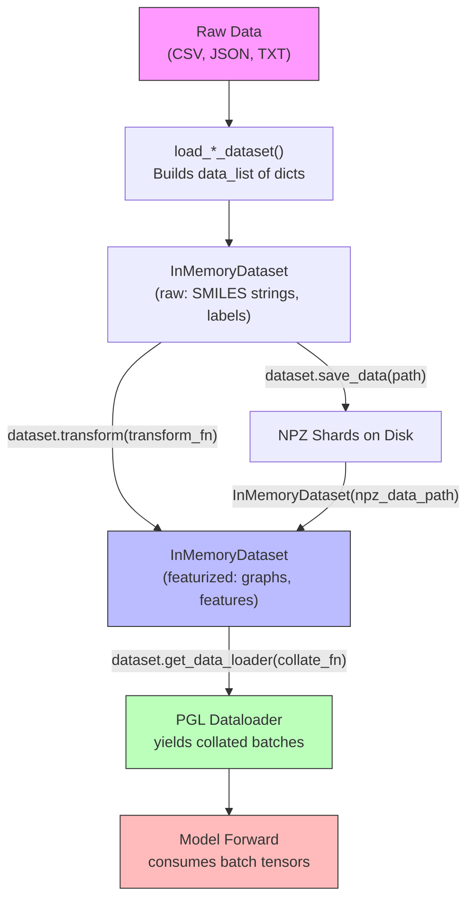
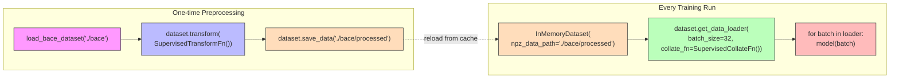

---
slug:7-inmemorydataset-and-data-pipeline
blog_type:normal
---


PaddleHelix 的数据层围绕一个看似简单却极为核心的抽象构建：**包含 numpy 数组的字典列表**。其他所有机制——数据持久化、并行转换、批处理以及分布式分片——都从这一核心不变量延伸而来。理解 `InMemoryDataset` 如何强制执行这一约定，以及特征化器生态系统如何向其输入数据，是在 Helix 框架下高效使用任何模型的关键。

## 核心抽象：`data_list` 约定

数据管道的核心在于 `InMemoryDataset`，这是一个容器类，包装了 `data_list`——一个 Python 列表，其中每个元素都是一个 `dict`，将字符串键映射到 numpy ndarray。给定列表中的所有字典共享相同的键，其值可以是标量、一维向量，或者是每个样本长度不一的不规则二维数组。这种设计反映了分子数据的异构特性：一个样本可能包含 SMILES 字符串的图表示（可变的节点/边数量）、固定大小的标签向量以及蛋白质序列 token 数组——它们各自存储在对应的键下。

来源：[inmemory_dataset.py](pahelix/datasets/inmemory_dataset.py#L33-L58)

## InMemoryDataset API

该类作为一个类似列表的包装器，提供三种构造路径、四个操作方法以及完整的序列协议支持。构造函数接受原始的 `data_list`、包含缓存 `.npz` 文件的目录路径，或显式的 `.npz` 文件路径列表——按此顺序解析，最后一次成功加载的数据将填充 `self.data_list`。

| 方法 | 签名 | 用途 |
|--------|-----------|---------|
| `__init__` | `(data_list=None, npz_data_path=None, npz_data_files=None)` | 从内存数据、目录或文件列表构造 |
| `save_data` | `(data_path)` | 序列化为分片的 `.npz` 文件（默认每个分片 1 万个样本） |
| `transform` | `(transform_fn, num_workers=4, drop_none=False)` | 原地并行应用特征化函数 |
| `get_data_loader` | `(batch_size, num_workers=4, shuffle=False, collate_fn=None)` | 返回一个 PGL `Dataloader`，生成合并后的批次 |
| `__getitem__` | `(key)` | 通过整数、切片（返回新的 `InMemoryDataset`）或列表进行索引 |
| `__len__` | `()` | 返回样本数量 |

来源：[inmemory_dataset.py](pahelix/datasets/inmemory_dataset.py#L59-L169)

### 索引语义

`__getitem__` 方法支持三种访问模式。整数索引返回单个原始 `dict`。切片索引返回包装该子集的**新 `InMemoryDataset`**——这对训练集/验证集/测试集划分至关重要。基于列表的索引同样返回新的 `InMemoryDataset`，从而支持基于索引的采样。

```python
# 之前：整数索引
data = dataset[3]          # → dict {'smiles': 'CCO', 'label': array([1.0])}

# 之前：切片索引  
subset = dataset[100:200]   # → 包含 100 个样本的新 InMemoryDataset
```

来源：[inmemory_dataset.py](pahelix/datasets/inmemory_dataset.py#L115-L130)

## 持久化层：NPZ 分片

数据的保存和加载对每个键采用双文件约定。对于每个特征键（例如 `"atom_type"`），序列化过程会将三个条目写入压缩的 numpy 归档文件：拼接后的值数组、记录每个样本长度的 `.seq_len` 数组，以及指示值是标量（形状为 `()`）还是数组的 `.singular` 标志。在重新加载时，`_split_data` 利用长度数组将拼接的数据块重新切分为逐样本的条目。

这种设计存在的原因在于分子图是**不规则的**——不同的分子具有不同数量的原子和化学键。与填充至最大尺寸（这会浪费内存和计算资源）不同，NPZ 格式将它们连续存储，并按需重建各个样本。

`_save_npz_data` 方法将输出分片为名为 `part-000000.npz`、`part-000001.npz` 等文件，其可配置的 `max_num_per_file` 默认值为 10,000 个样本。这不仅保持了单个文件大小可控，还实现了多 GPU 训练中使用的分布式数据加载模式。

来源：[data_utils.py](pahelix/utils/data_utils.py#L24-L86), [inmemory_dataset.py](pahelix/datasets/inmemory_dataset.py#L96-L103)

## 使用 `transform()` 进行并行转换

`transform` 方法使用多进程在整个 `data_list` 上应用 `transform_fn`。在内部，它委托给 [basic_utils.py](pahelix/utils/basic_utils.py#L27-L53) 中的 `mp_pool_map`，该函数将每个元素与其原始索引打包，通过 `batch_size=8` 的 PGL `Dataloader` 分发任务，收集结果并保持顺序，在返回前剔除索引。`drop_none` 标志会过滤掉转换结果为 `None` 的样本——当某些分子（如无效的 SMILES）特征化失败时，这非常实用。

```python
# 之后：数据集转换
dataset.transform(my_featurizer, num_workers=8, drop_none=True)
# self.data_list 现在被原地替换为特征化后的字典
```

来源：[inmemory_dataset.py](pahelix/datasets/inmemory_dataset.py#L135-L143), [basic_utils.py](pahelix/utils/basic_utils.py#L27-L53)

## 使用 `get_data_loader()` 进行批加载

`get_data_loader` 方法返回一个 PGL `Dataloader`，它包装了 `InMemoryDataset` 本身（该类实现了 `__len__` 和 `__getitem__`）。该加载器通过首先提取大小为 `batch_size` 的子列表来生成批次，然后应用 `collate_fn` 将逐样本的字典列表转换为适合模型消费的单个批次字典。这正是关键的**先转换后合并**分离发生的地方：转换仅运行一次（被缓存），而合并在每个 epoch 都会运行。

`collate_fn` 是异构逐样本数据与同构批次张量之间的桥梁。在 PaddleHelix 中，每个特征化器模块都同时提供 `TransformFn`（用于逐样本处理）和 `CollateFn`（用于批次组装）。

来源：[inmemory_dataset.py](pahelix/datasets/inmemory_dataset.py#L146-L168)

## 端到端数据管道

下图展示了从原始数据到模型输入的完整生命周期：



<CgxTip>
转换与合并的分离是该管道中最重要的架构洞察。**转换开销大且仅运行一次**（使用 RDKit 将 SMILES 转换为图数据）。**合并开销小且每个 epoch 都会运行**（将 numpy 数组堆叠为张量）。绝不要将 RDKit 操作放在 `collate_fn` 中——务必在训练开始前使用 `transform()` 进行特征化，并通过 `save_data()` 进行缓存。
</CgxTip>

## TransformFn / CollateFn 协议

PaddleHelix 中的每个特征化器模块都遵循双类模式。`TransformFn` 是一个可调用对象，用于将原始数据字典（包含 SMILES 字符串和标签）转换为特征化数据字典（包含图节点特征、边索引和处理后的标签）。`CollateFn` 也是一个可调用对象，它接收特征化字典列表，并将其合并为包含填充/拼接张量的单个批次字典。

该协议在所有特征化器模块中的实现方式完全一致：

| 特征化器模块 | TransformFn | CollateFn | 用例 |
|-------------------|-------------|-----------|----------|
| `gem_featurizer` | `GeoPredTransformFn` | `GeoPredCollateFn` | 感知 3D 几何的预训练 |
| `pretrain_gnn_featurizer` | `AttrmaskTransformFn` | `AttrmaskCollateFn` | 属性掩码预训练 |
| `pretrain_gnn_featurizer` | `SupervisedTransformFn` | `SupervisedCollateFn` | 有监督微调 |
| `het_gnn_featurizer` | 异构 GNN 转换器 | 异构合并器 | 药物-靶点相互作用 |
| `pretrain_gnn_featurizer` | `ContextPredTransformFn` | `ContextPredCollateFn` | 上下文预测 |

来源：[gem_featurizer.py](pahelix/featurizers/gem_featurizer.py#L170-L244), [pretrain_gnn_featurizer.py](pahelix/featurizers/pretrain_gnn_featurizer.py#L29-L131)

### 具体示例：Pretrain-GNN 特征化

Pretrain-GNN 特征化器中的 `SupervisedTransformFn` 接收包含 `smiles` 和 `label` 等键的原始字典，通过 `CompoundKit` 使用 RDKit 将 SMILES 字符串转换为分子图，生成节点特征（如 `atomic_num`、`degree` 等）和边特征（如 `bond_type` 等），并返回包含图数据和标签的新字典。随后，对应的 `SupervisedCollateFn` 接收一批这样的图字典，将批次中所有图的节点特征堆叠为连续张量，计算图边界的偏移数组，并创建填充后的标签张量。

来源：[pretrain_gnn_featurizer.py](pahelix/featurizers/pretrain_gnn_featurizer.py#L99-L131)

## 数据集加载器：从原始文件到 InMemoryDataset

`pahelix/datasets/` 中的每个数据集都提供了一个 `load_*_dataset()` 工厂函数，用于从目录中读取原始文件、构建逐样本的字典，并返回一个 `InMemoryDataset`。这些加载器遵循一致的模式，但根据数据领域的不同在复杂度上有所差异。

### 分子属性数据集（单模态）

像 BACE、QM9 和 ZINC 这样的数据集遵循最简单的模式：读取 CSV，提取 SMILES 和标签，为每行构建一个字典。

**BACE**（分类）：加载 152 个带有 SMILES 和二分类标签的化合物。请注意二分类目标使用 `replace(0, -1)` 的约定。

```python
# BACE 加载器模式（简化版）
data = {
    'smiles': smiles_list[i],        # 原始 SMILES 字符串
    'label': labels.values[i],       # numpy 数组，例如 array([1]) 或 array([-1])
}
```

来源：[bace_dataset.py](pahelix/datasets/bace_dataset.py#L46-L97)

**QM9**（回归）：加载量子化学属性（HOMO、LUMO、能隙）作为浮点数标签。还提供 `get_qm9_stat()` 用于计算归一化统计数据。

```python
# QM9 数据形状
data = {
    'smiles': 'C1=CC=CC=C1',
    'label': np.array([-0.35, 0.08, 0.43]),  # 3 个回归目标
}
```

来源：[qm9_dataset.py](pahelix/datasets/qm9_dataset.py#L35-L55)

**ZINC**（生成）：最简单的情况——仅包含 SMILES 字符串，没有标签。用于分子生成任务，其中 SMILES 本身就是目标。

来源：[zinc_dataset.py](pahelix/datasets/zinc_dataset.py#L35-L71)

### 药物-靶点相互作用数据集（多模态）

**DAVIS** 代表了一种更复杂的模式，其中每个样本将化合物图与蛋白质序列结合在一起。加载器从 JSON/pickle 文件中读取配体 SMILES、蛋白质序列和亲和力矩阵，使用 `mol_to_graph_data` 将 SMILES 转换为图数据，使用 `ProteinTokenizer` 对蛋白质序列进行分词，并将所有内容打包到每个样本的单个字典中。

```python
# DAVIS 数据形状（简化版）
data = {
    # 化合物图特征（来自 mol_to_graph_data）
    'num_atoms': ...,
    'atom_type': np.array([...]),
    'bond_type': np.array([...]),
    'edges': np.array([[src, dst], ...]),
    # 蛋白质特征
    'protein_token_ids': np.array([token_ids]),
    # 标签
    'Log10_Kd': np.array([7.32]),
}
```

<CgxTip>
DAVIS 加载器值得注意，因为它**在加载期间进行特征化**，而不是推迟到单独的转换步骤。化合物会立即通过 `mol_to_graph_data(Chem.MolFromSmiles(...))` 转换为图数据。这意味着返回的 `InMemoryDataset` 已经完成了特征化，可以直接传入 `get_data_loader()` 并仅提供 `collate_fn`。并非所有加载器都遵循此模式——在合并步骤之前，请检查是否需要调用 `transform()`。
</CgxTip>

来源：[davis_dataset.py](pahelix/datasets/davis_dataset.py#L40-L127)

### 蛋白质-蛋白质相互作用数据集

**PPI** 存储的是蛋白质对而非分子图，这展示了基于字典的模式的灵活性。

来源：[ppi_dataset.py](pahelix/datasets/ppi_dataset.py#L33-L74)

## 分布式数据加载

对于多 GPU 或多节点训练，[data_utils.py](pahelix/utils/data_utils.py#L89-L99) 中的 `get_part_files()` 通过轮询分配将 NPZ 分片文件分发到各个训练器。每个训练器接收分片文件的子集，通过 `npz_data_files` 仅从这些文件构造一个 `InMemoryDataset`，并独立进行训练。这避免了对中心化数据服务器或采样器协调的需求。

```python
# 分布式文件切分
part_files = get_part_files(data_path, trainer_id=0, trainer_num=4)
dataset = InMemoryDataset(npz_data_files=part_files)
```

来源：[data_utils.py](pahelix/utils/data_utils.py#L89-L99)

## 典型工作流模式

任何 PaddleHelix 模型的典型工作流都包含四个阶段。首先，使用 `load_*_dataset()` 函数将原始数据加载到 `InMemoryDataset` 中。其次，通过 `dataset.transform()` 应用合适的 `TransformFn`，将原始 SMILES 转换为图特征——这是开销较大的步骤，应运行一次并予以缓存。第三，使用 `dataset.save_data()` 保存特征化后的数据集以供将来运行使用。第四，使用 `dataset.get_data_loader(collate_fn=CollateFn(...))` 创建数据加载器以进行训练。



来源：[inmemory_dataset.py](pahelix/datasets/inmemory_dataset.py#L33-L168), [pretrain_gnn_featurizer.py](pahelix/featurizers/pretrain_gnn_featurizer.py#L99-L131), [bace_dataset.py](pahelix/datasets/bace_dataset.py#L46-L97)

## 内置数据集完整分类

`pahelix/datasets/` 包注册了 20 多个数据集加载器，涵盖分子属性预测、药物-靶点相互作用、蛋白质-蛋白质相互作用以及量子化学等领域。每个加载器都遵循相同的工厂函数模式，返回一个 `InMemoryDataset`。

| 领域 | 数据集 | `data` 字典中的典型键 |
|--------|----------|------------------------------|
| 分子分类 | BACE, BBBP, HIV, ClinTox, Tox21, ToxCast, MUV, SIDER, PTC_MR, MUTAG | `smiles`, `label` |
| 分子回归 | ESOL, FreeSolv, Lipophilicity, QM7, QM8, QM9 | `smiles`, `label`（浮点数组） |
| 分子生成 | ZINC, ChEMBL_filtered | 仅 `smiles` |
| 药物-靶点相互作用 | Davis, KIBA, PDBBind | 图特征, `protein_token_ids`, 亲和力标签 |
| 蛋白质-蛋白质相互作用 | PPI | `pair`（蛋白质名称元组） |
| 药物-药物相互作用 | DDI | 化合物对特征 |

来源：[__init__.py](pahelix/datasets/__init__.py#L19-L40)

## 下一步

在理解了数据层之后，顺理成章的下一步就是探索原始 SMILES 和蛋白质序列实际上是如何转换为存储在每个 `data` 字典中的数值图特征的。**[化合物与蛋白质特征化器](8-compound-and-protein-featurizers)** 页面涵盖了 `CompoundKit`、图构建工具以及蛋白质分词，它们构成了管道中所有 `TransformFn` 实现的基础。如需了解有关如何消费合并后批次的模型级细节，请继续阅读 **[GNN 模块与网络架构](10-gnn-blocks-and-network-architecture)**。