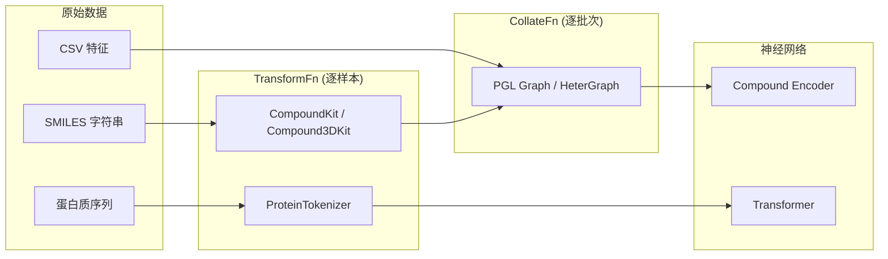
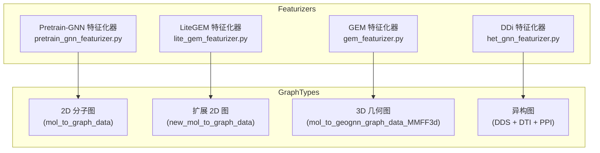

---
slug:8-compound-and-protein-featurizers
blog_type:normal
---


PaddleHelix 的特征化系统是原始生化数据（SMILES 字符串、蛋白质序列）与神经网络所消费的图/序列表示之间至关重要的桥梁。它遵循 **Transform–Collate**（转换-整理）两阶段流水线：首先由 *TransformFn* 将单个样本转换为特征字典，然后由 *CollateFn* 将其整理成批次并转换为 PaddlePaddle Graph (PGL) 对象。本页将深入剖析化合物工具包、蛋白质分词器，以及服务于不同预训练和下游任务的四种特征化器变体。

来源：[__init__.py](pahelix/featurizers/__init__.py#L15-L20)、[inmemory_dataset.py](pahelix/datasets/inmemory_dataset.py#L135-L145)

## 架构概述

特征化层位于数据加载流水线（[InMemoryDataset](7-inmemorydataset-and-data-pipeline)）与模型的嵌入层（[Compound Encoder](9-compound-encoder-and-embedding-layers)）之间。原始记录在到达模型之前，会流经两个可调用阶段：逐样本的转换（Transform）和逐批次的整理（Collate）。



来源：[pretrain_gnn_featurizer.py](pahelix/featurizers/pretrain_gnn_featurizer.py#L29-L131)、[gem_featurizer.py](pahelix/featurizers/gem_featurizer.py#L170-L248)

## 化合物特征工具包：`CompoundKit`

`CompoundKit` 是定义从每个分子中提取**哪些**特征的核心注册表。它包含两个将特征名称映射到其可能取值的词汇字典、一组浮点型特征名称、指纹生成器以及官能团匹配器。

### 原子特征词汇表

RDKit `Mol` 对象中的每个原子由 17 个类别特征和 3 个连续（浮点型）特征表征。类别词汇表定义在 `atom_vocab_dict` 中，并通过 `safe_index` 访问以生成整数 ID，同时设有一个通用的 `'misc'` 桶用于处理未见过的值。

| 特征名称 | 类型 | 词汇表大小 | 描述 |
|---|---|---|---|
| `atomic_num` | 类别 | 119 | 元素周期表中的元素序号（1–118 + misc） |
| `chiral_tag` | 类别 | 4 | 四面体手性（UNSPECIFIED、CW、CCW、OTHER） |
| `degree` | 类别 | 12 | 键合相邻原子数（0–10 + misc） |
| `explicit_valence` | 类别 | 14 | 显式键级之和（0–12 + misc） |
| `formal_charge` | 类别 | 17 | 形式电荷（−5 至 +10 + misc） |
| `hybridization` | 类别 | 7 | SP、SP2、SP3、SP3D、SP3D2 等 |
| `implicit_valence` | 类别 | 14 | 基于化合价的隐式氢计数（0–12 + misc） |
| `is_aromatic` | 类别 | 2 | 布尔型芳香性标志 |
| `total_numHs` | 类别 | 9 | 总氢原子数（0–8 + misc） |
| `num_radical_e` | 类别 | 6 | 自由基电子数（0–4 + misc） |
| `atom_is_in_ring` | 类别 | 2 | 布尔型是否成环标志 |
| `valence_out_shell` | 类别 | 9 | 来自元素周期表的外层电子数 |
| `in_num_ring_with_size{3..8}` | 类别 | 各 9 | 按环大小分类的成环成员（0–8，有上限） |
| `van_der_waals_radis` | **浮点型** | — | 来自元素周期表的范德华半径 |
| `partial_charge` | **浮点型** | — | Gasteiger 部分电荷（12 次迭代） |
| `mass` | **浮点型** | — | 原子质量 |

来源：[compound_tools.py](pahelix/utils/compound_tools.py#L156-L200)、[compound_tools.py](pahelix/utils/compound_tools.py#L203-L244)

### 键特征词汇表

键特征遵循相同的模式。`bond_vocab_dict` 提供了 5 个类别描述符，每个均通过 `get_bond_feature_id` 进行索引。

| 特征名称 | 词汇表大小 | 描述 |
|---|---|---|
| `bond_dir` | 5 | 键方向（NONE、BEGINWEDGE、ENDDASH 等） |
| `bond_type` | 13 | 单键、双键、三键、芳香键等 |
| `is_in_ring` | 2 | 布尔型是否成环标志 |
| `bond_stereo` | 6 | 立体构型（STEREONONE、CIS、TRANS 等） |
| `is_conjugated` | 2 | 布尔型共轭标志 |

来源：[compound_tools.py](pahelix/utils/compound_tools.py#L179-L186)、[compound_tools.py](pahelix/utils/compound_tools.py#L250-L274)

### 分子级指纹

除了逐原子和逐键特征外，`CompoundKit` 还计算三种类型的全局分子指纹，它们在预训练期间作为辅助信号：

- **Morgan FP**（200 位，半径为 2）：捕获相距 2 个键范围内的原子邻域的圆形指纹。
- **MACCS FP**（167 位）：基于预定义药效团模式的结构键指纹。
- **Daylight 官能团计数**：在 [`compound_constants.py`](pahelix/utils/compound_constants.py#L21-L162) 中定义的 152 种官能团 SMARTS 模式的计数，涵盖碳、氢、氮、氧、磷、硫和卤素基序。

来源：[compound_tools.py](pahelix/utils/compound_tools.py#L280-L304)、[compound_constants.py](pahelix/utils/compound_constants.py#L21-L162)

### 图构建函数

`CompoundKit` 本身不构建图；该职责属于 `compound_tools.py` 中的独立函数。图构建分为三个层次，每个层次都添加了更丰富的结构信息：

**`mol_to_graph_data(mol)`** — 基线 2D 图。提取 9 个原子特征、3 个键特征、边索引（双向 + 自环）以及三种指纹类型。原子特征 ID 偏移 +1（索引 0 保留给 OOV），自环使用专用的键特征 ID（`size + 2`）。质量存储为缩放后的浮点数（`× 0.01`）。

**`new_mol_to_graph_data(mol)`** — 扩展的 2D 图，包含来自 `atom_vocab_dict` 和 `atom_float_names` 的完整 17 个类别原子特征加上 3 个浮点型特征。自环使用键词汇表的最后一个索引（`size − 1`）。

**`mol_to_geognn_graph_data(mol, atom_poses, dir_type)`** — 在基础图上扩展了 3D 几何信息：原子位置、欧几里得键长以及**键角图**（连接共享同一原子的键对的超边，以它们之间的夹角作为边特征）。这是 GEM 和 GeoGNN 模型所需的表示形式。

<CgxTip>
`mol_to_graph_data` 与 `new_mol_to_graph_data` 之间的区别不仅仅是版本升级——它们在词汇表覆盖率（9 个与 17 个原子特征）、OOV 处理约定（自环的 +1 偏移与最后索引机制），以及消费这些特征的下游特征化器上都有所不同。Pretrain-GNN 流水线使用原始的 `mol_to_graph_data`，而 LiteGEM 使用 `new_smiles_to_graph_data`（其封装了 `new_mol_to_graph_data`）。
</CgxTip>

来源：[compound_tools.py](pahelix/utils/compound_tools.py#L574-L640)、[compound_tools.py](pahelix/utils/compound_tools.py#L509-L560)、[compound_tools.py](pahelix/utils/compound_tools.py#L652-L670)

## 3D 几何工具包：`Compound3DKit`

`Compound3DKit` 提供用于从 RDKit 构象中计算空间特征的静态方法。它是 GEM 中所有几何预训练任务的基础。

### 构象生成

主要的入口点是 `get_MMFF_atom_poses(mol, numConfs=None)`，它添加显式氢原子，使用 RDKit 的 ETKDG 方法嵌入多个构象，通过 MMFF 力场优化所有构象，选择能量最低的构象，然后去除氢原子。对于超过 400 个原子的分子，它会退化为通过 `Compute2DCoords` 生成 2D 坐标。另外还有一个 `get_2d_atom_poses(mol)` 始终使用 2D 布局。

### 空间特征计算

一旦获得了原子位置，就会提取两种几何特征：

- **`get_bond_lengths(edges, atom_poses)`**：计算每条边 `(i, j)` 的欧几里得距离 `‖pos_j − pos_i‖`。输出形状：`(E,)` float32。
- **`get_superedge_angles(edges, atom_poses, dir_type='HT')`**：对于每对共享头原子（`dir_type='HT'`）或尾原子（`dir_type='HH'`）的边，通过 `arccos` 计算它们方向向量之间的夹角。返回超边索引元组 `(src_edge_i, tar_edge_i)`、键角和方向标志的元组。空分子将产生零尺寸数组而不会报错。

来源：[compound_tools.py](pahelix/utils/compound_tools.py#L395-L470)、[compound_tools.py](pahelix/utils/compound_tools.py#L440-L494)

## 蛋白质分词器：`ProteinTokenizer`

蛋白质序列表示为可变长度的标记序列，遵循 TAPE（Tasks Assessing Protein Embeddings）规范。`ProteinTokenizer` 将单个氨基酸字符映射到固定词汇表内的整数 ID。

### 标记词汇表与特殊标记

该分词器定义了 5 个特殊用途的标记和 25 个标准氨基酸代码（包括稀有残基 B、O、U、X、Z），总词汇表大小为 30 个标记：

| 标记 | ID | 角色 |
|---|---|---|
| `<pad>` | 0 | 序列填充 |
| `<mask>` | 1 | 掩码语言建模目标 |
| `<cls>` | 2 | 分类标记（也是 `<start>`） |
| `<sep>` | 3 | 序列分隔符（也是 `<end>`） |
| `<unk>` | 4 | 未知氨基酸 |
| A–Z | 5–29 | 标准 + 扩展氨基酸残基 |

分词是基于字符级别的：序列中的每个氨基酸变成一个标记。`gen_token_ids` 方法在转换为 ID 之前，会用 `<cls>` 和 `<sep>` 包装序列。未知残基会静默映射为 `<unk>`（ID 4）。

来源：[protein_tools.py](pahelix/utils/protein_tools.py#L22-L70)、[protein_tools.py](pahelix/utils/protein_tools.py#L72-L129)

## 特征化器变体

PaddleHelix 在 `pahelix/featurizers/` 中提供了四个特征化器模块，每个模块服务于不同的模型或任务。它们都遵循相同的 Transform–Collate 契约，但在调用的图构建函数、是否应用掩码以及产生的辅助任务数据上有所不同。



### Pretrain-GNN 特征化器

定义在 [`pretrain_gnn_featurizer.py`](pahelix/featurizers/pretrain_gnn_featurizer.py) 中，该模块是特征化器包的默认导出。它提供两种任务模式：

**`AttrmaskTransformFn` / `AttrmaskCollateFn`** — 用于自监督预训练。转换函数调用 `mol_to_graph_data`（9 特征的 2D 图）。整理函数将单个 PGL 图整理成批次，然后通过将所有节点特征设置为 0（OOV）来随机掩蔽 `mask_ratio`（默认 15%）的原子。它返回被掩蔽的拼接图、被掩蔽原子的索引，以及它们原始的 `atomic_num` 标签，用于属性重建目标。

**`SupervisedTransformFn` / `SupervisedCollateFn`** — 用于下游微调。转换函数附加来自数据集的原始标签。整理函数将图整理成批次，并将标签从 `{-1, 1}` 归一化为 `{0, 1}`（通过 `(label + 1) / 2`），同时计算一个二值的 `valids` 掩码，条件为 label ≠ 0.5（即非缺失值）。

<CgxTip>
`SupervisedCollateFn` 中的标签归一化编码了 MoleculeNet 的三态约定：−1 代表负样本，+1 代表正样本，0 代表缺失/无效。经过 `(label + 1) / 2` 变换后，它们分别变为 0.0、1.0 和 0.5，而 `valids` 掩码会在计算损失时排除 0.5 的条目。
</CgxTip>

来源：[pretrain_gnn_featurizer.py](pahelix/featurizers/pretrain_gnn_featurizer.py#L29-L98)、[pretrain_gnn_featurizer.py](pahelix/featurizers/pretrain_gnn_featurizer.py#L99-L164)

### GEM (GeoGNN) 特征化器

定义在 [`gem_featurizer.py`](pahelix/featurizers/gem_featurizer.py) 中，该特征化器支持 GEM 的几何预训练任务。它是功能最丰富的变体。

**`GeoPredTransformFn`** 通过 `mol_to_geognn_graph_data_MMFF3d` 将 SMILES 字符串转换为完整的 3D 几何图，然后调用 `prepare_pretrain_task` 计算四个辅助数据结构：

- **键角回归**：节点三元组 `(i, j, k)` 及其在顶点 `j` 处的夹角，由 `get_pretrain_bond_angle` 通过枚举所有共享共同原子的边对计算得出。
- **键长回归**：具有欧几里得距离的边端点对。
- **原子距离预测**：使用 `sklearn.metrics.pairwise_distances` 将完整的成对距离矩阵展平为 `(N², 1)`。
- **上下文预测标签**：在整理阶段通过 `mask_context_of_geognn_graph` 计算，该函数会创建一个子图指纹字符串（中心原子类型 + 排序后的相邻原子类型 + 排序后的相邻键类型），使用 MD5 进行哈希处理，并映射到大小为 `subgraph_num` 的词汇表。

**`GeoPredCollateFn`** 将数据整理成**四个**独立的 PGL 图：原始的原子-键图、其键角图、被掩蔽的原子-键图，以及被掩蔽的键角图。`mask_context_of_geognn_graph` 函数执行掩码操作：它选择 `mask_ratio` 比例的原子，将它们及其邻居的特征在原子-键图和键角超边图中归零，并返回目标原子索引和上下文预测标签。

来源：[gem_featurizer.py](pahelix/featurizers/gem_featurizer.py#L39-L110)、[gem_featurizer.py](pahelix/featurizers/gem_featurizer.py#L170-L216)、[gem_featurizer.py](pahelix/featurizers/gem_featurizer.py#L242-L348)

### LiteGEM 特征化器

定义在 [`lite_gem_featurizer.py`](pahelix/featurizers/lite_gem_featurizer.py) 中，这是一个为在 ADMET 数据集上进行高效微调而设计的简化变体。

**`LiteGEMTransformFn`** 使用 `new_smiles_to_graph_data`（不带 3D 几何信息的扩展 17 特征 2D 图）。它从配置对象中读取原子和键特征名称，组装一个包含 `num_nodes`、`nfeat`（节点特征）、`efeat`（边特征）、`edges` 和 `label` 的字典，并将其作为新的图记录返回。

**`LiteGEMCollateFn`** 期望每个批次项暴露一个 `get_feature()` 方法（ADMET 数据项协议的一部分）。它根据这些特征构建 PGL 图，将标签转换为 PaddlePaddle 张量，并返回包含 `'graph'`（经过 `.tensor()` 转换的批量 PGL 图）和 `'labels'` 的字典。

来源：[lite_gem_featurizer.py](pahelix/featurizers/lite_gem_featurizer.py#L31-L61)、[lite_gem_featurizer.py](pahelix/featurizers/lite_gem_featurizer.py#L64-L88)

### DDi 异构图特征化器

定义在 [`het_gnn_featurizer.py`](pahelix/featurizers/het_gnn_featurizer.py) 中，该特征化器在架构上与分子图特征化器有显著区别——它操作于结合了药物、蛋白质及其相互作用的**异构图**上。

**`DDiFeaturizer.collate_fn`** 将药物-药物相互作用（DDI）、药物-靶标相互作用（DTI）和蛋白质-蛋白质相互作用（PPI）数据聚合到单个 `pgl.HeterGraph` 中。药物节点通过 `CID` 前缀标识；蛋白质节点则没有。药物特征从外部 CSV 文件加载（缩放后为 2325 维），而蛋白质节点使用零向量。该图具有三种边类型——`dds`、`dti`、`ppi`——每种类型都包含双向边。该方法返回一个结果元组，包含异构图、节点名称到索引的映射、原始字符串键标签以及整数索引标签。

一个辅助函数 `nx_graph_build` 将 PGL 异构图转换回具有字符串节点名称的 NetworkX 图，主要用于 PGL 之外的可视化或算法分析。

来源：[het_gnn_featurizer.py](pahelix/featurizers/het_gnn_featurizer.py#L28-L105)、[het_gnn_featurizer.py](pahelix/featurizers/het_gnn_featurizer.py#L120-L135)

## 特征化器对比矩阵

| 维度 | Pretrain-GNN | GEM | LiteGEM | DDi |
|---|---|---|---|---|
| **文件** | `pretrain_gnn_featurizer.py` | `gem_featurizer.py` | `lite_gem_featurizer.py` | `het_gnn_featurizer.py` |
| **图构建器** | `mol_to_graph_data` | `mol_to_geognn_graph_data_MMFF3d` | `new_smiles_to_graph_data` | 外部 CSV + 异构边 |
| **原子特征** | 9 个类别特征 + 质量 | 9 个类别特征 + 质量 | 17 个类别特征 + 3 个浮点型特征 | 2325 维预计算特征 |
| **3D 几何** | 无 | 有（MMFF 构象、键长、键角） | 无 | 无 |
| **掩码** | 原子属性掩码 | 子图上下文掩码 | 无 | 无 |
| **预训练任务** | 属性重建 | Cm、Fg、Bar、Blr、Adc | 无（仅微调） | DDI 预测 |
| **图类型** | `pgl.Graph`（批量） | `pgl.Graph` × 4（AB + BA + 掩蔽） | `pgl.Graph`（批量） | `pgl.HeterGraph` |
| **下游用途** | MoleculeNet 属性预测 | 3D 分子表示学习 | ADMET 属性预测 | 药物-药物协同作用 |

来源：[pretrain_gnn_featurizer.py](pahelix/featurizers/pretrain_gnn_featurizer.py#L1-L164)、[gem_featurizer.py](pahelix/featurizers/gem_featurizer.py#L1-L350)、[lite_gem_featurizer.py](pahelix/featurizers/lite_gem_featurizer.py#L1-L89)、[het_gnn_featurizer.py](pahelix/featurizers/het_gnn_featurizer.py#L1-L136)

## 与数据流水线的集成

特征化器通过 `InMemoryDataset.transform()` 和 `InMemoryDataset.get_data_loader()` 方法连接到数据集基础设施。典型的工作流是对数据集中的每条记录应用 `TransformFn`（可选地使用多进程），然后将生成的特征字典传递给数据加载器，由加载器使用 `CollateFn` 生成模型可用的批次。

```python
from pahelix.datasets import InMemoryDataset
from pahelix.featurizers import AttrmaskTransformFn, AttrmaskCollateFn

# 阶段 1：将每个 SMILES 转换为特征字典
dataset = InMemoryDataset(npz_data_path='data.npz')
dataset.transform(AttrmaskTransformFn(), num_workers=4, drop_none=True)

# 阶段 2：通过 CollateFn 进行批处理和掩码
collate_fn = AttrmaskCollateFn(
    atom_names=['atomic_num', 'chiral_tag', ...],
    bond_names=['bond_type', 'bond_dir', 'is_in_ring'],
    mask_ratio=0.15
)
data_loader = dataset.get_data_loader(batch_size=32, collate_fn=collate_fn)

for join_graph, masked_indices, masked_labels in data_loader:
    # join_graph: pgl.Graph 批次 —— 送入 GNN 编码器
    pass
```

来源：[inmemory_dataset.py](pahelix/datasets/inmemory_dataset.py#L135-L168)、[pretrain_gnn_featurizer.py](pahelix/featurizers/pretrain_gnn_featurizer.py#L53-L98)

## 后续导航

本页介绍了特征提取和图构建机制。接下来的逻辑步骤取决于你的关注点：

- **这些特征如何被嵌入**为供 GNN 消费的连续向量：[Compound Encoder and Embedding Layers](9-compound-encoder-and-embedding-layers)
- **预训练任务如何消费这些特征**（GEM 的上下文掩码、Pretrain-GNN 的属性掩码）：[Compound Pretraining with GEM](11-compound-pretraining-with-gem) 和 [Pretrain-GNNs Framework](12-pretrain-gnns-framework)
- **编排 Transform 和 Collate 的数据加载基础设施**：[InMemoryDataset and Data Pipeline](7-inmemorydataset-and-data-pipeline)
- **处理由这些特征化器构建的图的 GNN 层**：[GNN Blocks and Network Architecture](10-gnn-blocks-and-network-architecture)