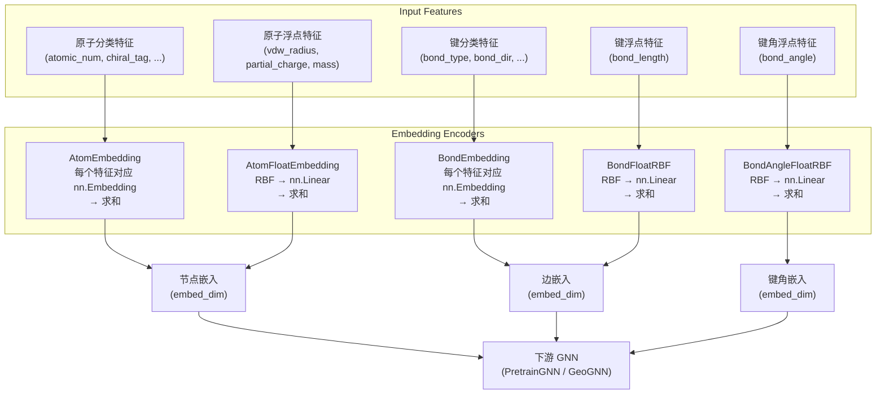
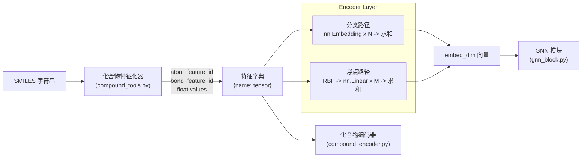

---
slug:9-compound-encoder-and-embedding-layers
blog_type:normal
---


本页文档介绍了**化合物嵌入子系统** —— 这是至关重要的第一阶段，负责将原始分子图特征（原子序数、键类型、范德华半径、键角等）转换为适用于下游图神经网络的连续向量表示。理解这一层至关重要，因为它准确定义了*哪些化学信息*进入你的模型，以及它们是*如何*被表示的。

## 架构概览

PaddleHelix 的化合物编码器完全位于 [`compound_encoder.py`](pahelix/networks/compound_encoder.py) 中，并采用**双通道设计**：离散的分类特征通过可学习的 `nn.Embedding` 表进行处理，而连续的浮点特征则先通过径向基函数（RBF）展开进行离散化，然后再进行线性投影。所有五个编码器类共享相同的结构模式 —— 一种对特征求和的聚合方式，为每个原子、键或键角生成单一的固定维度向量。



这种设计清晰地分离了关注点：**编码器**拥有特征到向量的逻辑，而**模型**（例如 `PretrainGNNModel`、`GeoGNNModel`）拥有图卷积逻辑和连接方式。编码器在模型构造函数内部实例化，并在每次 `forward` 传递开始时被调用。

来源：[compound_encoder.py](pahelix/networks/compound_encoder.py#L15-L27)

## 特征分类：哪些特征被嵌入

可用特征集由 [`CompoundKit`](pahelix/utils/compound_tools.py#L155-L189) 定义，它维护了两个词汇表字典和一个浮点特征名列表。词汇表大小决定了每个 `nn.Embedding` 表的 `num_embeddings` 参数，并且每个表都添加了 **+5 的填充**，以优雅地处理罕见或未见过的值。

### 原子特征

| 特征名 | 类型 | 词汇表大小 | 描述 |
|---|---|---|---|
| `atomic_num` | 分类 | 119 | 元素标识（H=1 到 Og=118 + 其他） |
| `chiral_tag` | 分类 | 可变（RdKit 枚举） | 四面体手性（CW, CCW 等） |
| `degree` | 分类 | 12 | 键合邻居数（0–10 + 其他） |
| `explicit_valence` | 分类 | 14 | 显式键价（0–12 + 其他） |
| `formal_charge` | 分类 | 18 | 形式电荷（−5 到 +10 + 其他） |
| `hybridization` | 分类 | 可变（RdKit 枚举） | 杂化状态（SP, SP2, SP3 等） |
| `implicit_valence` | 分类 | 14 | 隐式氢价（0–12 + 其他） |
| `is_aromatic` | 分类 | 2 | 二进制芳香性标志 |
| `total_numHs` | 分类 | 10 | 总氢数（0–8 + 其他） |
| `num_radical_e` | 分类 | 6 | 自由基电子数（0–4 + 其他） |
| `atom_is_in_ring` | 分类 | 2 | 二进制成环标志 |
| `valence_out_shell` | 分类 | 10 | 外层电子（周期表查找） |
| `in_num_ring_with_size[3-8]` | 分类 | 每项 10 | 包含此原子的每种尺寸环的数量 |

| 特征名 | 类型 | RBF 中心 | Gamma | 描述 |
|---|---|---|---|---|
| `van_der_waals_radis` | 浮点 | `np.arange(1, 3, 0.2)` → 10 个中心 | 10.0 | 来源于周期表的 vdW 半径 |
| `partial_charge` | 浮点 | `np.arange(-1, 4, 0.25)` → 20 个中心 | 10.0 | Gasteiger 偏电荷 |
| `mass` | 浮点 | `np.arange(0, 2, 0.1)` → 20 个中心 | 10.0 | 原子质量 |

### 键特征

| 特征名 | 类型 | 词汇表大小 | 描述 |
|---|---|---|---|
| `bond_dir` | 分类 | 可变（RdKit 枚举） | 键方向（ENDUPRIGHT, ENDDOWNRIGHT 等） |
| `bond_type` | 分类 | 可变（RdKit 枚举） | 键级（SINGLE, DOUBLE, TRIPLE, AROMATIC 等） |
| `is_in_ring` | 分类 | 2 | 二进制成环键标志 |
| `bond_stereo` | 分类 | 可变（RdKit 枚举） | 立体构型（STEREOANY, STEREONONE 等） |
| `is_conjugated` | 分类 | 2 | 二进制共轭标志 |

| 特征名 | 类型 | RBF 中心 | Gamma | 描述 |
|---|---|---|---|---|
| `bond_length` | 浮点 | `np.arange(0, 2, 0.1)` → 20 个中心 | 10.0 | 以埃为单位的 3D 键距离 |

### 键角特征

| 特征名 | 类型 | RBF 中心 | Gamma | 描述 |
|---|---|---|---|---|
| `bond_angle` | 浮点 | `np.arange(0, π, 0.1)` → 31 个中心 | 10.0 | 由两个连续键形成的角度（弧度） |

浮点特征名被声明为一个类属性：[compound_tools.py#L188](pahelix/utils/compound_tools.py#L188-L189) 处的 `atom_float_names = ["van_der_waals_radis", "partial_charge", "mass"]`。键浮点特征和键角浮点特征是可选的，仅被具备 3D 感知能力的模型（如 GeoGNN）使用。

来源：[compound_tools.py](pahelix/utils/compound_tools.py#L159-L189), [compound_constants.py](pahelix/utils/compound_constants.py#L15-L162)

## 分类嵌入：AtomEmbedding 与 BondEmbedding

`AtomEmbedding` 和 `BondEmbedding` 共享相同的设计模式。每个类为每个特征名创建一个**独立的 `nn.Embedding` 表**，使用 XavierUniform 初始化，并通过将所有按特征划分的嵌入**求和**来生成最终的嵌入。

```python
# 简化自 compound_encoder.py#L28-L52
class AtomEmbedding(nn.Layer):
    def __init__(self, atom_names, embed_dim):
        self.embed_list = nn.LayerList()
        for name in self.atom_names:
            vocab_size = CompoundKit.get_atom_feature_size(name) + 5  # 为 OOV 填充
            embed = nn.Embedding(vocab_size, embed_dim, 
                                 weight_attr=nn.initializer.XavierUniform())
            self.embed_list.append(embed)

    def forward(self, node_features):
        out_embed = 0
        for i, name in enumerate(self.atom_names):
            out_embed += self.embed_list[i](node_features[name])
        return out_embed  # 形状：(num_nodes, embed_dim)
```

**关键实现细节**：

- **词汇表大小 + 5 填充**：在 [compound_encoder.py#L39](pahelix/networks/compound_encoder.py#L39-L41) 处添加到 `CompoundKit.get_atom_feature_size(name)` 的 `+ 5` 为超出词汇表的值提供了索引余量。[`compound_tools.py`](pahelix/utils/compound_tools.py#L131-L139) 中的 `safe_index` 工具函数会将未知值映射到最后一个有效索引，因此该填充确保了不会引发 IndexError。
- **求和聚合**：每个特征获得其自己的维度为 `embed_dim` 的嵌入向量，最终的节点表示是它们的逐元素求和。这是一种刻意的设计选择 —— 与拼接不同，求和使输出维度独立于特征数量，这非常关键，因为不同的模型配置使用不同的特征子集。
- **输入格式**：两个编码器都期望输入为 `dict[str, paddle.Tensor]`，其中键是特征名，值是形状为 `(num_nodes,)` 或 `(num_edges,)` 的整数张量。

[compound_encoder.py#L94-L118](pahelix/networks/compound_encoder.py#L94-L118) 处的 `BondEmbedding` 对边特征遵循完全相同的模式，唯一的区别在于调用了 `CompoundKit.get_bond_feature_size(name)`。

<CgxTip>
**为什么使用求和而不是拼接？** 这是一种刻意的权衡。求和将编码器输出维度与活动特征数量解耦，这意味着无论配置如何，下游 GNN 层始终接收 `embed_dim` 维的向量。然而，这也意味着单个特征嵌入必须在同一个向量空间内竞争表示容量。如果你需要特定于特征的路径，请考虑为你的自定义编码器使用基于拼接的变体。
</CgxTip>

来源：[compound_encoder.py](pahelix/networks/compound_encoder.py#L28-L118)

## 连续特征编码：基于 RBF 的嵌入

三个编码器类处理连续（浮点）特征：`AtomFloatEmbedding`、`BondFloatRBF` 和 `BondAngleFloatRBF`。这三者都共享相同的两阶段流水线：**RBF 展开**后跟**线性投影**，并将按特征划分的结果求和为最终嵌入。

### RBF 基元

基础是 [`RBF` 类](pahelix/networks/basic_block.py#L71-L88) —— 一个无参数（不可学习）的层，通过计算以预定点为中心的高斯核，将标量输入映射为固定长度的向量：

```
RBF(x) = exp(-γ · (x - c₁)², -γ · (x - c₂)², ..., -γ · (x - cₙ)²)
```

其中 `c₁...cₙ` 是等距的中心，`γ` 是共享的锐度参数。这些中心**不可学习** —— 它们是在构建时从固定的 numpy 数组转换而来的张量。这在化学上是有依据的：选择这些中心是为了覆盖每个属性的生理相关范围（例如，偏电荷从 −1 到 +4，步长为 0.25）。

来源：[basic_block.py](pahelix/networks/basic_block.py#L71-L88)

### AtomFloatEmbedding

[`AtomFloatEmbedding`](pahelix/networks/compound_encoder.py#L55-L91) 编码三个逐原子的连续属性。其在 [compound_encoder.py#L64-L68](pahelix/networks/compound_encoder.py#L64-L68) 处的默认 RBF 参数为：

| 特征 | 中心范围 | 步长 | 中心数量 | Gamma |
|---|---|---|---|---|
| `van_der_waals_radis` | [1, 3) Å | 0.2 | 10 | 10.0 |
| `partial_charge` | [−1, 4) | 0.25 | 20 | 10.0 |
| `mass` | [0, 2) amu | 0.1 | 20 | 10.0 |

每个特征通过其自己的 RBF 进行处理（产生一个长度等于中心数量的向量），然后通过一个可学习的 `nn.Linear` 从 RBF 维度投影到 `embed_dim`。按特征划分的输出被求和。

### BondFloatRBF

[`BondFloatRBF`](pahelix/networks/compound_encoder.py#L121-L155) 使用单个默认特征 `bond_length` 编码键长，其中心位于 `np.arange(0, 2, 0.1)`（20 个中心，γ=10.0）。此编码器仅被具备 3D 感知能力的模型（如具备空间键距离信息的 GeoGNN）使用。

### BondAngleFloatRBF

[`BondAngleFloatRBF`](pahelix/networks/compound_encoder.py#L158-L192) 使用 `bond_angle` 编码键角，其中心位于 `np.arange(0, π, 0.1)`（31 个中心，γ=10.0）。与 `BondFloatRBF` 类似，这专属于从 3D 构象计算角度信息的 3D 分子模型。

来源：[compound_encoder.py](pahelix/networks/compound_encoder.py#L55-L192)

## 完整编码器类参考

| 类 | 输入 | 特征类型 | 输出形状 | 使用者 |
|---|---|---|---|---|
| `AtomEmbedding` | `node_features: dict` | 分类 | `(N, embed_dim)` | PretrainGNN, GeoGNN |
| `AtomFloatEmbedding` | `feats: dict` | 浮点 (RBF) | `(N, embed_dim)` | PretrainGNN |
| `BondEmbedding` | `edge_features: dict` | 分类 | `(E, embed_dim)` | PretrainGNN, GeoGNN |
| `BondFloatRBF` | `bond_float_features: dict` | 浮点 (RBF) | `(E, embed_dim)` | GeoGNN |
| `BondAngleFloatRBF` | `bond_angle_float_features: dict` | 浮点 (RBF) | `(A, embed_dim)` | GeoGNN |

其中 N = 原子数，E = 键数，A = 键角数（超级边）。

来源：[compound_encoder.py](pahelix/networks/compound_encoder.py#L28-L192)

## 模型如何连接编码器

编码器并非独立使用 —— 它们在下游模型类内部实例化。代码库中存在两种规范模式。

### 模式 1：PretrainGNN（2D 分子图）

[`PretrainGNNModel`](pahelix/model_zoo/pretrain_gnns_model.py#L31-L115) 仅使用**分类**原子和键特征。它创建一个单一的 `AtomEmbedding` 和逐层的 `BondEmbedding` 实例：

```python
# pretrain_gnns_model.py#L54-L61
self.atom_embedding = AtomEmbedding(self.atom_names, self.embed_dim)
self.bond_embedding_list = nn.LayerList()
for layer_id in range(self.layer_num):
    self.bond_embedding_list.append(BondEmbedding(self.bond_names, self.embed_dim))
```

来自 [`pregnn_paper.json`](apps/pretrained_compound/pretrain_gnns/model_configs/pregnn_paper.json) 的典型配置仅使用 `atom_names: ["atomic_num", "chiral_tag"]` 和 `bond_names: ["bond_dir", "bond_type"]` —— 这是一个刻意最小化的特征集，依赖于 GIN 消息传递层来学习结构不变量。`embed_dim` 为 300，反映了在提供较少输入特征时所需的高容量。

来源：[pretrain_gnns_model.py](pahelix/model_zoo/pretrain_gnns_model.py#L38-L96), [pregnn_paper.json](apps/pretrained_compound/pretrain_gnns/model_configs/pregnn_paper.json#L1-L15)

### 模式 2：GeoGNN（3D 分子图）

[`GeoGNNModel`](pahelix/model_zoo/gem_model.py#L61-L115) 使用**全部五种**编码器类型。它作用于两个并行的图结构 —— 原子-键图和键-角图 —— 并创建初始嵌入以及逐层的新嵌入：

```python
# gem_model.py#L81-L96
self.init_atom_embedding = AtomEmbedding(self.atom_names, self.embed_dim)
self.init_bond_embedding = BondEmbedding(self.bond_names, self.embed_dim)
self.init_bond_float_rbf = BondFloatRBF(self.bond_float_names, self.embed_dim)

for layer_id in range(self.layer_num):
    self.bond_embedding_list.append(BondEmbedding(self.bond_names, self.embed_dim))
    self.bond_float_rbf_list.append(BondFloatRBF(self.bond_float_names, self.embed_dim))
    self.bond_angle_float_rbf_list.append(
        BondAngleFloatRBF(self.bond_angle_float_names, self.embed_dim))
```

在 [gem_model.py#L131-L133](pahelix/model_zoo/gem_model.py#L131-L133) 处的前向传递中，通过加法合并分类和浮点键嵌入：`edge_hidden = bond_embed + self.init_bond_float_rbf(atom_bond_graph.edge_feat)`。[`geognn_l8.json`](apps/pretrained_compound/ChemRL/GEM/model_configs/geognn_l8.json) 配置使用了更丰富的 7 特征原子集和 3 特征键集，`embed_dim=32`，`layer_num=8`。

来源：[gem_model.py](pahelix/model_zoo/gem_model.py#L68-L115), [geognn_l8.json](apps/pretrained_compound/ChemRL/GEM/model_configs/geognn_l8.json#L1-L13)

### 模型配置对比

| 参数 | PretrainGNN (pregnn_paper) | GeoGNN (geognn_l8) |
|---|---|---|
| `atom_names` | `["atomic_num", "chiral_tag"]` | `["atomic_num", "formal_charge", "degree", "chiral_tag", "total_numHs", "is_aromatic", "hybridization"]` |
| `bond_names` | `["bond_dir", "bond_type"]` | `["bond_dir", "bond_type", "is_in_ring"]` |
| `bond_float_names` | —（未使用） | `["bond_length"]` |
| `bond_angle_float_names` | —（未使用） | `["bond_angle"]` |
| `embed_dim` | 300 | 32 |
| `layer_num` | 5 | 8 |
| 使用的编码器类 | `AtomEmbedding`, `BondEmbedding` | 全部 5 个类 |

这种对比揭示了一种刻意的权衡：PretrainGNN 使用**更少的特征但更高的嵌入维度**（300），让 GIN 层提取结构模式。GeoGNN 使用**包括 3D 几何在内的更多特征**但维度更低（32），因为空间信息已经提供了很强的归纳偏置。

<CgxTip>
**逐层嵌入与单一嵌入**：请注意，`AtomEmbedding` 在两个模型中都只创建一次，但 `BondEmbedding` 会在每个 GNN 层中重新创建。这是因为原子表示通过消息传递不断演化，需要一个稳定的初始编码；而键特征在每一层都是重新消耗的，以便从原始图结构重新计算边表示。如果你构建自定义模型，请遵循此约定 —— 一个 `AtomEmbedding`，但逐层使用 `BondEmbedding`。
</CgxTip>

来源：[gem_model.py](pahelix/model_zoo/gem_model.py#L81-L100), [pretrain_gnns_model.py](pahelix/model_zoo/pretrain_gnns_model.py#L54-L61)

## 添加自定义特征与 RBF 参数

编码器类在两个方面被设计为可扩展的。

### 添加新的分类特征

1. 在 [`CompoundKit.atom_vocab_dict`](pahelix/utils/compound_tools.py#L159-L178) 或 `bond_vocab_dict` 中注册词汇表
2. 将特征名添加到你的模型配置的 `atom_names` 或 `bond_names` 列表中
3. 编码器会自动创建一个具有正确词汇表大小的 `nn.Embedding` 表

### 自定义 RBF 参数

所有三个基于浮点的编码器在其构造函数中都接受可选的 `rbf_params` 字典覆盖。该字典将特征名映射到 `(centers_array, gamma)` 元组。例如：

```python
custom_rbf = {
    'van_der_waals_radis': (np.arange(0.5, 3.5, 0.1), 15.0),
    'partial_charge': (np.arange(-2, 3, 0.1), 20.0),
}
encoder = AtomFloatEmbedding(["van_der_waals_radis", "partial_charge"], 
                              embed_dim=64, rbf_params=custom_rbf)
```

在 [compound_encoder.py#L64-L68](pahelix/networks/compound_encoder.py#L64-L68)、[compound_encoder.py#L130-L131](pahelix/networks/compound_encoder.py#L130-L131) 和 [compound_encoder.py#L167-L168](pahelix/networks/compound_encoder.py#L167-L168) 处的默认 RBF 参数是针对典型的有机药物样分子调优的。如果你的领域涉及有机金属、肽或不寻常的官能团，调整中心范围可能会提高表示质量。

来源：[compound_encoder.py](pahelix/networks/compound_encoder.py#L59-L70), [compound_encoder.py](pahelix/networks/compound_encoder.py#L125-L134), [compound_encoder.py](pahelix/networks/compound_encoder.py#L162-L171)

## 数据流：从特征化器到 GNN

下图展示了化合物特征如何端到端地从特征化阶段通过编码器流入 GNN 骨干网络，将本页描述的概念与相邻页面涵盖的特征化流水线和 GNN 模块连接起来。



这就构成了全貌：**特征化器**（在[化合物与蛋白质特征化器](8-compound-and-protein-featurizers)中介绍）从原始 SMILES 生成整数 ID 和浮点值，**编码器**（本页）将它们映射为连续向量，而 **GNN 模块**（在[GNN 模块与网络架构](10-gnn-blocks-and-network-architecture)中介绍）在分子图上传播这些向量。

来源：[compound_tools.py](pahelix/utils/compound_tools.py#L203-L275), [gnn_block.py](pahelix/networks/gnn_block.py#L75-L92)

---

**后续步骤**：要了解这些嵌入是如何被图卷积层消耗和传播的，请继续阅读 [GNN 模块与网络架构](10-gnn-blocks-and-network-architecture)。要了解原始特征值的来源，请回顾[化合物与蛋白质特征化器](8-compound-and-protein-featurizers)。关于这些编码器如何参与预训练目标，请参阅[使用 GEM 进行化合物预训练](11-compound-pretraining-with-gem)与[Pretrain-GNNs 框架](12-pretrain-gnns-framework)。