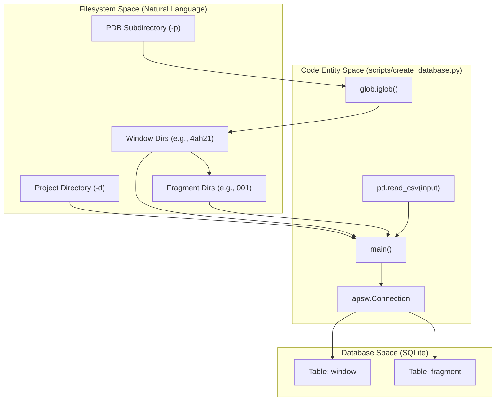

# Database Schema and Initialization

> **Relevant source files**
> * [scripts/create_database.py](https://github.com/kiharalab/idp_lzerd/blob/2d5565c2/scripts/create_database.py)
> * [scripts/shared.py](https://github.com/kiharalab/idp_lzerd/blob/2d5565c2/scripts/shared.py)

This page details the implementation of `scripts/create_database.py`, which initializes the central SQLite repository for an IDP-LZerD docking project. The script maps the hierarchical filesystem structure (windows and fragments) into a relational schema, enabling efficient querying and score aggregation during the assembly process.

## Overview and Purpose

The primary goal of `scripts/create_database.py` is to create a `scores_{complexid}.db` file that serves as the "source of truth" for all metadata related to IDP fragments [scripts/create_database.py L62-L63](https://github.com/kiharalab/idp_lzerd/blob/2d5565c2/scripts/create_database.py#L62-L63)

 It performs two main tasks:

1. **Filesystem Crawling**: It traverses the directory structure generated by Rosetta and docking steps to identify available windows and fragments [scripts/create_database.py L73-L92](https://github.com/kiharalab/idp_lzerd/blob/2d5565c2/scripts/create_database.py#L73-L92)
2. **Relational Mapping**: It merges this filesystem data with external sequence-based window definitions (provided via CSV) and populates the SQLite tables [scripts/create_database.py L94-L106](https://github.com/kiharalab/idp_lzerd/blob/2d5565c2/scripts/create_database.py#L94-L106)

### Data Flow: From Filesystem to SQLite

The following diagram illustrates how the `main` function in `create_database.py` translates the nested directory structure into the relational database.

**Entity Mapping Workflow**



**Sources:** [scripts/create_database.py L58-L106](https://github.com/kiharalab/idp_lzerd/blob/2d5565c2/scripts/create_database.py#L58-L106)

 [scripts/shared.py L59-L65](https://github.com/kiharalab/idp_lzerd/blob/2d5565c2/scripts/shared.py#L59-L65)

## Relational Schema

The database uses a normalized schema to track the relationship between sequence windows and the structural fragments generated for those windows.

### The window Table

This table stores the sequence boundaries and filesystem paths for each IDP segment. It is populated by merging directory names with the CSV input provided via the `-i` flag [scripts/create_database.py L94-L102](https://github.com/kiharalab/idp_lzerd/blob/2d5565c2/scripts/create_database.py#L94-L102)

| Column | Type | Description |
| --- | --- | --- |
| `windowindex` | INTEGER | Primary Key. The unique ID of the window (e.g., 1, 2, 3). |
| `window_wd` | TEXT | Absolute path to the window's directory on disk. |
| `res_start` | INTEGER | The starting residue index in the IDP sequence. |
| `res_end` | INTEGER | The ending residue index in the IDP sequence. |
| `position` | INTEGER | The relative position/order of the window. |
| `timestamp` | DATE | Automatic record creation time. |

**Sources:** [scripts/create_database.py L29-L39](https://github.com/kiharalab/idp_lzerd/blob/2d5565c2/scripts/create_database.py#L29-L39)

### The fragment Table

This table tracks the specific structural fragments (typically Rosetta-generated clusters) available for each window [scripts/create_database.py L41-L49](https://github.com/kiharalab/idp_lzerd/blob/2d5565c2/scripts/create_database.py#L41-L49)

| Column | Type | Description |
| --- | --- | --- |
| `windowindex` | INTEGER | Foreign Key referencing `window.windowindex`. |
| `fragmentindex` | INTEGER | The index of the fragment (e.g., 001, 002). |
| `timestamp` | DATE | Automatic record creation time. |

**Sources:** [scripts/create_database.py L41-L49](https://github.com/kiharalab/idp_lzerd/blob/2d5565c2/scripts/create_database.py#L41-L49)

## Implementation Details

### Filesystem Parsing Logic

The script uses `glob.iglob` to perform a multi-level crawl:

1. **Level 1 (Subdirectory):** Identifies the PDB ID directory [scripts/create_database.py L73](https://github.com/kiharalab/idp_lzerd/blob/2d5565c2/scripts/create_database.py#L73-L73)
2. **Level 2 (Windows):** Identifies directories named after the pattern `$PDBID$WINDOWINDEX` (e.g., `4ah21`). It extracts the `windowindex` by stripping the PDB ID and converting the remainder to an integer [scripts/create_database.py L77-L82](https://github.com/kiharalab/idp_lzerd/blob/2d5565c2/scripts/create_database.py#L77-L82)
3. **Level 3 (Fragments):** Within each window directory, it identifies subdirectories which are treated as `fragmentindex` values [scripts/create_database.py L86-L92](https://github.com/kiharalab/idp_lzerd/blob/2d5565c2/scripts/create_database.py#L86-L92)

### Database Interaction

The script utilizes the `shared.py` utility module for database operations:

* **Connection Management**: `shared.new_conn(complexdb)` is used to create the SQLite file with `SQLITE_OPEN_CREATE` and `SQLITE_OPEN_READWRITE` flags [scripts/shared.py L59-L65](https://github.com/kiharalab/idp_lzerd/blob/2d5565c2/scripts/shared.py#L59-L65)
* **Statement Generation**: `shared.create_insert_statement` dynamically builds the SQL strings (e.g., `INSERT INTO window (...) VALUES (:...)`) based on the DataFrame columns [scripts/shared.py L97-L111](https://github.com/kiharalab/idp_lzerd/blob/2d5565c2/scripts/shared.py#L97-L111)
* **Bulk Ingestion**: Data is inserted efficiently using `cursor.executemany` with lists of dictionaries [scripts/create_database.py L102-L106](https://github.com/kiharalab/idp_lzerd/blob/2d5565c2/scripts/create_database.py#L102-L106)

### Execution Flow

The initialization process follows a strict sequence to ensure data integrity.

**Initialization Sequence**

```mermaid
sequenceDiagram
  participant User
  participant create_database.py:main
  participant shared.py
  participant SQLite (scores_{id}.db)

  User->>create_database.py:main: Invoke with -d, -p, -r, -l, -i
  create_database.py:main->>shared.py: missing(complexdb)
  shared.py-->>create_database.py:main: False (if DB doesn't exist)
  create_database.py:main->>create_database.py:main: Read CSV into pandas DataFrame
  create_database.py:main->>create_database.py:main: Crawl directories to find windows/fragments
  create_database.py:main->>create_database.py:main: pd.merge(window_data, windows_found)
  create_database.py:main->>shared.py: new_conn(complexdb)
  shared.py->>SQLite (scores_{id}.db): Open/Create File
  create_database.py:main->>SQLite (scores_{id}.db): Execute window_schema
  create_database.py:main->>SQLite (scores_{id}.db): executemany(window_df)
  create_database.py:main->>SQLite (scores_{id}.db): Execute fragment_schema
  create_database.py:main->>SQLite (scores_{id}.db): executemany(fragments)
  create_database.py:main->>shared.py: Close connection (context manager)
```

**Sources:** [scripts/create_database.py L58-L107](https://github.com/kiharalab/idp_lzerd/blob/2d5565c2/scripts/create_database.py#L58-L107)

 [scripts/shared.py L59-L65](https://github.com/kiharalab/idp_lzerd/blob/2d5565c2/scripts/shared.py#L59-L65)

 [scripts/shared.py L97-L111](https://github.com/kiharalab/idp_lzerd/blob/2d5565c2/scripts/shared.py#L97-L111)

## Error Handling

The script defines a custom exception `CreateDatabaseError` [scripts/create_database.py L52-L56](https://github.com/kiharalab/idp_lzerd/blob/2d5565c2/scripts/create_database.py#L52-L56)

 A common failure point is the directory naming convention; if a window directory does not follow the `$PDBID$WINDOWINDEX` format (e.g., if `4ah21` cannot be parsed to extract `1`), the script raises an error to prevent malformed database entries [scripts/create_database.py L79-L82](https://github.com/kiharalab/idp_lzerd/blob/2d5565c2/scripts/create_database.py#L79-L82)

**Sources:** [scripts/create_database.py L52-L56](https://github.com/kiharalab/idp_lzerd/blob/2d5565c2/scripts/create_database.py#L52-L56)

 [scripts/create_database.py L79-L82](https://github.com/kiharalab/idp_lzerd/blob/2d5565c2/scripts/create_database.py#L79-L82)