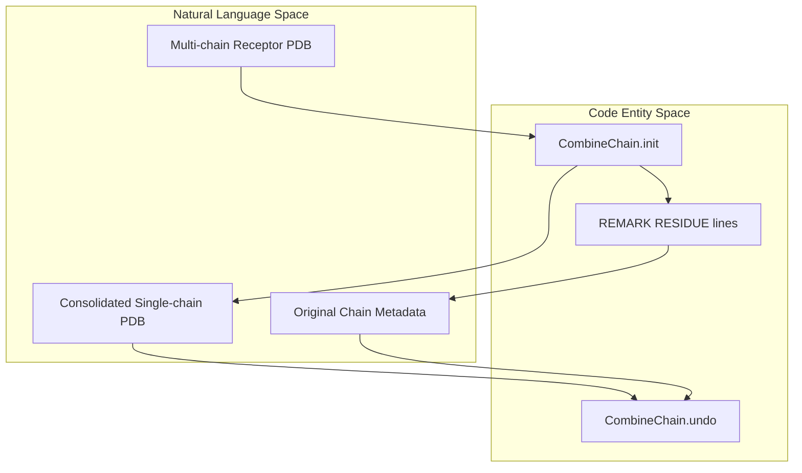

# Docking Decoy Generation

> **Relevant source files**
> * [README.md](https://github.com/kiharalab/idp_lzerd/blob/2d5565c2/README.md?plain=1)
> * [scripts/combine_receptor.py](https://github.com/kiharalab/idp_lzerd/blob/2d5565c2/scripts/combine_receptor.py)

The **Docking Decoy Generation** stage is the core sampling phase of the IDP-LZerD pipeline. After the IDP sequence has been fragmented into structural windows, each fragment is docked against the ordered receptor protein. This process generates thousands of potential binding poses (decoys) for every fragment, which are later scored and assembled into full-length models.

The pipeline utilizes the **LZerD** (or optionally ZDOCK) suite to perform rigid-body docking. Because LZerD typically expects single-chain inputs, a preprocessing step is required for multi-chain receptors. The orchestration of these tasks—from receptor preparation to fragment docking—is managed by a dedicated test suite and utility scripts.

### Receptor Preprocessing: CombineChain

Multi-chain receptors must be consolidated into a single chain to be compatible with standard docking software. The `CombineChain` class in `scripts/combine_receptor.py` performs this consolidation while preserving the original residue numbering and chain identifiers using a `REMARK`-based metadata scheme.

* **Chain Consolidation**: Multiple receptor chains are merged into the first chain, with residue numbers offset by multiples of 100 to avoid collisions [scripts/combine_receptor.py L102-L127](https://github.com/kiharalab/idp_lzerd/blob/2d5565c2/scripts/combine_receptor.py#L102-L127)
* **Metadata Preservation**: The script writes `REMARK RESIDUE=... CHAIN=... START=...` lines to the PDB header, allowing the operation to be reversed later [scripts/combine_receptor.py L139-L143](https://github.com/kiharalab/idp_lzerd/blob/2d5565c2/scripts/combine_receptor.py#L139-L143)
* **Reversibility**: The `undo` method uses the stored `REMARK` data to restore the original multi-chain structure after docking and scoring are complete [scripts/combine_receptor.py L160-L164](https://github.com/kiharalab/idp_lzerd/blob/2d5565c2/scripts/combine_receptor.py#L160-L164)

For details, see [Receptor Preprocessing: CombineChain](/kiharalab/idp_lzerd/3.1-receptor-preprocessing:-combinechain).

### Test Suite and Decoy Generation

The `test/` directory provides the orchestration logic for generating decoys at scale. The `test_decoys.sh` script serves as the primary entry point for running the docking pipeline on a specific complex (e.g., the 4AH2 test case).

* **Orchestration**: `test_decoys.sh` coordinates the execution of docking binaries and the `generate_decoys.py` script [README.md L56-L57](https://github.com/kiharalab/idp_lzerd/blob/2d5565c2/README.md?plain=1#L56-L57)
* **Decoy Layout**: The pipeline generates a specific directory structure for each fragment window (e.g., `4ah21`, `4ah27`), containing the docked models (e.g., `model1.pdb`) and their associated scores [README.md L78-L80](https://github.com/kiharalab/idp_lzerd/blob/2d5565c2/README.md?plain=1#L78-L80)
* **Integration**: The process invokes `PDBGEN` (part of the LZerD suite) to convert LZerD output files into PDB decoys [README.md L79](https://github.com/kiharalab/idp_lzerd/blob/2d5565c2/README.md?plain=1#L79-L79)

For details, see [Test Suite and Decoy Generation Script](/kiharalab/idp_lzerd/3.2-test-suite-and-decoy-generation-script).

### System Overview: Natural Language to Code Entity Space

The following diagrams map the high-level docking concepts to the specific code entities and files that implement them.

**Receptor Consolidation Workflow**

Sources: [scripts/combine_receptor.py L42-L145](https://github.com/kiharalab/idp_lzerd/blob/2d5565c2/scripts/combine_receptor.py#L42-L145)

 [scripts/combine_receptor.py L160-L182](https://github.com/kiharalab/idp_lzerd/blob/2d5565c2/scripts/combine_receptor.py#L160-L182)

**Docking Orchestration Flow**

Sources: [README.md L73-L81](https://github.com/kiharalab/idp_lzerd/blob/2d5565c2/README.md?plain=1#L73-L81)

 [scripts/combine_receptor.py L29-L33](https://github.com/kiharalab/idp_lzerd/blob/2d5565c2/scripts/combine_receptor.py#L29-L33)

### Docking Process Summary

| Component | Responsibility | Key File |
| --- | --- | --- |
| **Receptor Combiner** | Merges multi-chain receptors for LZerD compatibility | [scripts/combine_receptor.py](https://github.com/kiharalab/idp_lzerd/blob/2d5565c2/scripts/combine_receptor.py) |
| **Docking Driver** | Executes LZerD/ZDOCK for each fragment | `test/test_decoys.sh` |
| **Decoy Generator** | Converts docking output to PDB format | `scripts/generate_decoys.py` |
| **Metadata Handler** | Manages residue renumbering via PDB REMARKS | [scripts/combine_receptor.py L146-L157](https://github.com/kiharalab/idp_lzerd/blob/2d5565c2/scripts/combine_receptor.py#L146-L157) |

Sources: [README.md L21-L46](https://github.com/kiharalab/idp_lzerd/blob/2d5565c2/README.md?plain=1#L21-L46)

 [scripts/combine_receptor.py L1-L30](https://github.com/kiharalab/idp_lzerd/blob/2d5565c2/scripts/combine_receptor.py#L1-L30)