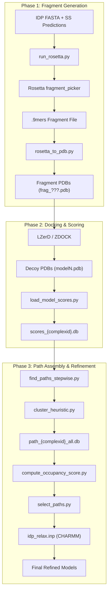
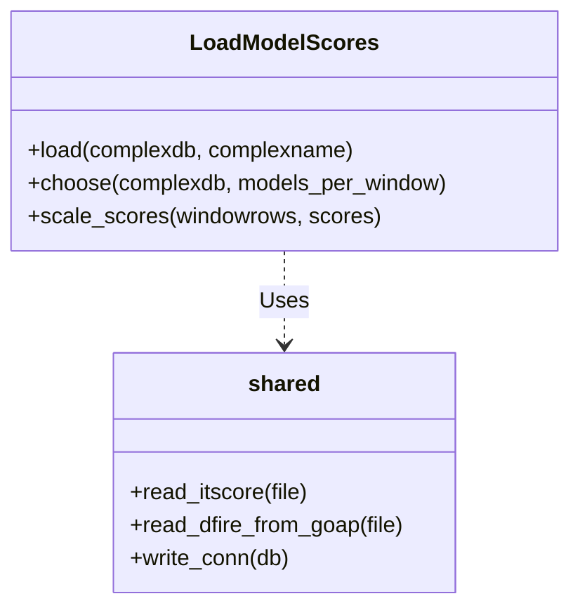

# End-to-End Pipeline Walkthrough

> **Relevant source files**
> * [README.md](https://github.com/kiharalab/idp_lzerd/blob/2d5565c2/README.md?plain=1)
> * [idp_relax.inp](https://github.com/kiharalab/idp_lzerd/blob/2d5565c2/idp_relax.inp)
> * [scripts/find_paths_stepwise.py](https://github.com/kiharalab/idp_lzerd/blob/2d5565c2/scripts/find_paths_stepwise.py)
> * [scripts/load_model_scores.py](https://github.com/kiharalab/idp_lzerd/blob/2d5565c2/scripts/load_model_scores.py)
> * [scripts/run_rosetta.py](https://github.com/kiharalab/idp_lzerd/blob/2d5565c2/scripts/run_rosetta.py)
> * [scripts/select_paths.py](https://github.com/kiharalab/idp_lzerd/blob/2d5565c2/scripts/select_paths.py)

This page provides a narrative technical walkthrough of the IDP-LZerD pipeline, which models the bound conformation of an intrinsically disordered protein (IDP) to an ordered receptor. The workflow transitions from raw sequence data to high-resolution refined structural models.

## Pipeline Overview

The IDP-LZerD pipeline is divided into three major phases:

1. **Fragment Preparation**: Generating structural fragments of the IDP using Rosetta.
2. **Docking & Scoring**: Performing rigid-body docking for each fragment and scoring them against the receptor.
3. **Path Assembly & Refinement**: Combinatorially assembling fragments into full-length paths, clustering them, and performing final MD relaxation.

### System Architecture Diagram

This diagram maps the logical stages to the specific scripts and data entities defined in the codebase.

Title: IDP-LZerD Data Flow and Code Entities

**Sources:** [README.md L4-L7](https://github.com/kiharalab/idp_lzerd/blob/2d5565c2/README.md?plain=1#L4-L7)

 [README.md L73-L81](https://github.com/kiharalab/idp_lzerd/blob/2d5565c2/README.md?plain=1#L73-L81)

 [scripts/find_paths_stepwise.py L54-L57](https://github.com/kiharalab/idp_lzerd/blob/2d5565c2/scripts/find_paths_stepwise.py#L54-L57)

 [scripts/load_model_scores.py L39-L54](https://github.com/kiharalab/idp_lzerd/blob/2d5565c2/scripts/load_model_scores.py#L39-L54)

---

## 1. Fragment Generation

The pipeline begins by breaking the IDP sequence into overlapping 9-residue windows. For each window, structural fragments are generated to represent the local conformational space.

* **Secondary Structure Input**: The system requires PSIPRED-format predictions from multiple servers (PSIPRED, Porter, Jpred, SSPro) [README.md L64-L72](https://github.com/kiharalab/idp_lzerd/blob/2d5565c2/README.md?plain=1#L64-L72)
* **Rosetta Invocation**: `run_rosetta.py` orchestrates `fragment_picker` using a quota-protocol [scripts/run_rosetta.py L48-L57](https://github.com/kiharalab/idp_lzerd/blob/2d5565c2/scripts/run_rosetta.py#L48-L57)  It generates a BLAST checkpoint using `blastpgp` and converts it to Rosetta format via `parse.pl` [scripts/run_rosetta.py L102-L113](https://github.com/kiharalab/idp_lzerd/blob/2d5565c2/scripts/run_rosetta.py#L102-L113)
* **PDB Conversion**: The resulting `.9mers` files are converted into individual PDB files by `rosetta_to_pdb.py` [README.md L74](https://github.com/kiharalab/idp_lzerd/blob/2d5565c2/README.md?plain=1#L74-L74)  These are then processed with Pulchra for full-atom backbone reconstruction and side-chain modeling (e.g., SCCOMP or Scwrl4) [README.md L76-L77](https://github.com/kiharalab/idp_lzerd/blob/2d5565c2/README.md?plain=1#L76-L77)

**Sources:** [README.md L64-L77](https://github.com/kiharalab/idp_lzerd/blob/2d5565c2/README.md?plain=1#L64-L77)

 [scripts/run_rosetta.py L42-L44](https://github.com/kiharalab/idp_lzerd/blob/2d5565c2/scripts/run_rosetta.py#L42-L44)

 [scripts/run_rosetta.py L102-L113](https://github.com/kiharalab/idp_lzerd/blob/2d5565c2/scripts/run_rosetta.py#L102-L113)

---

## 2. Docking and Database Initialization

Once fragments are generated, they are docked against the receptor protein.

* **Docking**: Each fragment is docked using LZerD or ZDOCK, producing thousands of decoys per window [README.md L79](https://github.com/kiharalab/idp_lzerd/blob/2d5565c2/README.md?plain=1#L79-L79)
* **Scoring**: Decoys are scored using ITScorePro and GOAP [README.md L80](https://github.com/kiharalab/idp_lzerd/blob/2d5565c2/README.md?plain=1#L80-L80)
* **Database Ingestion**: The `LoadModelScores` class in `load_model_scores.py` ingests these scores into a SQLite database (`scores_{complexid}.db`). * It creates the `allmodel` table [scripts/load_model_scores.py L42-L53](https://github.com/kiharalab/idp_lzerd/blob/2d5565c2/scripts/load_model_scores.py#L42-L53) * It filters and selects the top `models_per_window` (default 4500) based on a composite `di` score derived from ITScore and DFIRE [scripts/load_model_scores.py L136-L170](https://github.com/kiharalab/idp_lzerd/blob/2d5565c2/scripts/load_model_scores.py#L136-L170)

Title: Model Scoring and Selection Logic

**Sources:** [scripts/load_model_scores.py L39-L54](https://github.com/kiharalab/idp_lzerd/blob/2d5565c2/scripts/load_model_scores.py#L39-L54)

 [scripts/load_model_scores.py L73-L85](https://github.com/kiharalab/idp_lzerd/blob/2d5565c2/scripts/load_model_scores.py#L73-L85)

 [scripts/load_model_scores.py L136-L140](https://github.com/kiharalab/idp_lzerd/blob/2d5565c2/scripts/load_model_scores.py#L136-L140)

---

## 3. Path Assembly and Clustering

This stage assembles the full-length IDP binding pose by finding geometrically compatible sequences of fragment decoys.

* **Stepwise Assembly**: `find_paths_stepwise.py` builds paths window-by-window [scripts/find_paths_stepwise.py L82-L96](https://github.com/kiharalab/idp_lzerd/blob/2d5565c2/scripts/find_paths_stepwise.py#L82-L96)  Compatibility is determined by `edgescore` (geometric fit between adjacent fragments) and `nodescore` (docking scores) [scripts/find_paths_stepwise.py L59-L60](https://github.com/kiharalab/idp_lzerd/blob/2d5565c2/scripts/find_paths_stepwise.py#L59-L60)
* **Heuristic Clustering**: Because the number of possible paths is enormous, the system uses `ClusterPdb` from `cluster_heuristic.py` to group similar paths and identify "medoids" [scripts/find_paths_stepwise.py L97-L102](https://github.com/kiharalab/idp_lzerd/blob/2d5565c2/scripts/find_paths_stepwise.py#L97-L102)
* **Storage**: Results are stored in `path_{complexid}_all.db` in tables named `paths{n}` and `clusters{n}` [scripts/find_paths_stepwise.py L56-L57](https://github.com/kiharalab/idp_lzerd/blob/2d5565c2/scripts/find_paths_stepwise.py#L56-L57)

**Sources:** [scripts/find_paths_stepwise.py L54-L61](https://github.com/kiharalab/idp_lzerd/blob/2d5565c2/scripts/find_paths_stepwise.py#L54-L61)

 [scripts/find_paths_stepwise.py L82-L102](https://github.com/kiharalab/idp_lzerd/blob/2d5565c2/scripts/find_paths_stepwise.py#L82-L102)

---

## 4. Final Selection and Refinement

The final stage selects the best clustered paths and prepares them for atomic-level refinement.

* **Occupancy Scoring**: `compute_occupancy_score.py` calculates how often receptor residues are contacted by the IDP across the ensemble of medoid paths [scripts/select_paths.py L115-L121](https://github.com/kiharalab/idp_lzerd/blob/2d5565c2/scripts/select_paths.py#L115-L121)
* **Weighted Ranking**: `SelectPaths` ranks medoids using a weighted Z-score of four components: `nodescore`, `edgescores`, `clustersize`, and `occupancyscore` [scripts/select_paths.py L38-L42](https://github.com/kiharalab/idp_lzerd/blob/2d5565c2/scripts/select_paths.py#L38-L42)
* **PDB Assembly**: The `combine_paths` function merges fragment decoys into a single continuous PDB chain, averaging coordinates at overlapping regions [scripts/select_paths.py L160-L185](https://github.com/kiharalab/idp_lzerd/blob/2d5565c2/scripts/select_paths.py#L160-L185)
* **CHARMM Relaxation**: The script `idp_relax.inp` performs final refinement using the CHARMM27 force field and FACTS implicit solvation [idp_relax.inp L10-L11](https://github.com/kiharalab/idp_lzerd/blob/2d5565c2/idp_relax.inp#L10-L11)  [idp_relax.inp L42-L43](https://github.com/kiharalab/idp_lzerd/blob/2d5565c2/idp_relax.inp#L42-L43)  This includes: 1. Iterative minimization with decreasing harmonic constraints on the ligand [idp_relax.inp L58-L88](https://github.com/kiharalab/idp_lzerd/blob/2d5565c2/idp_relax.inp#L58-L88) 2. A 40 ps (20,000 steps at 2 fs) Langevin dynamics relaxation [idp_relax.inp L100-L109](https://github.com/kiharalab/idp_lzerd/blob/2d5565c2/idp_relax.inp#L100-L109)

**Sources:** [scripts/select_paths.py L37-L43](https://github.com/kiharalab/idp_lzerd/blob/2d5565c2/scripts/select_paths.py#L37-L43)

 [scripts/select_paths.py L130-L153](https://github.com/kiharalab/idp_lzerd/blob/2d5565c2/scripts/select_paths.py#L130-L153)

 [idp_relax.inp L58-L88](https://github.com/kiharalab/idp_lzerd/blob/2d5565c2/idp_relax.inp#L58-L88)

 [idp_relax.inp L100-L115](https://github.com/kiharalab/idp_lzerd/blob/2d5565c2/idp_relax.inp#L100-L115)