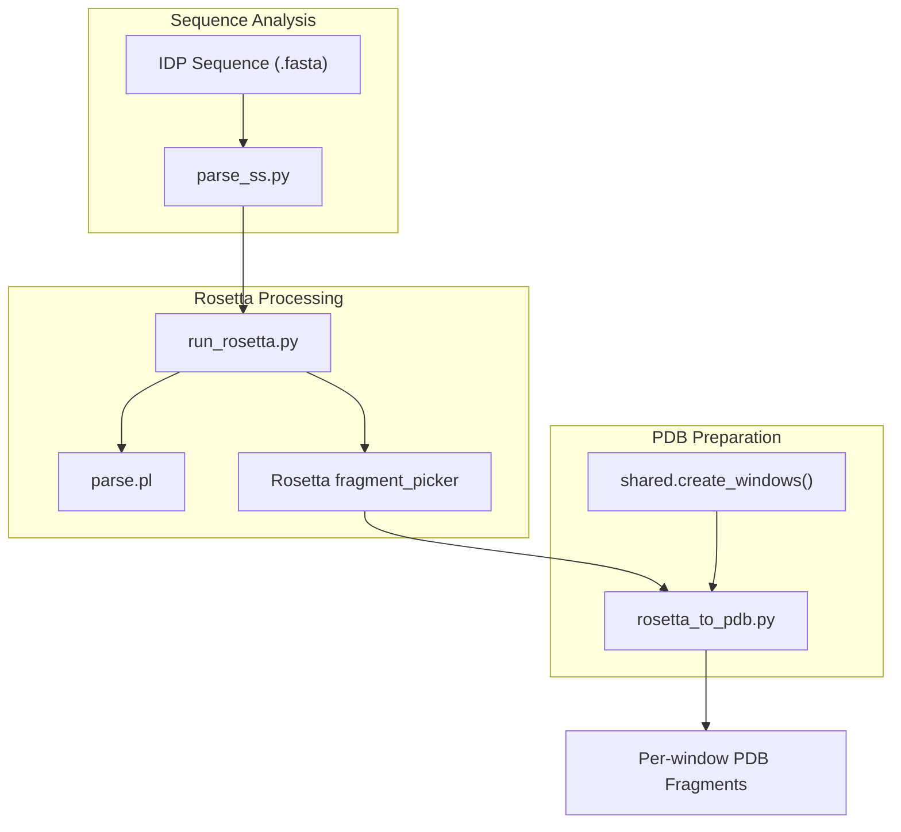
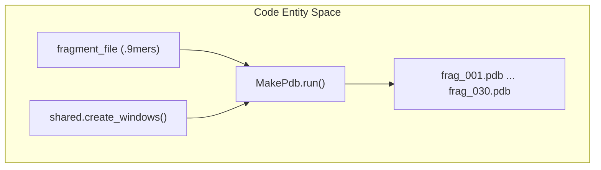

# Fragment Generation

> **Relevant source files**
> * [scripts/rosetta_to_pdb.py](https://github.com/kiharalab/idp_lzerd/blob/2d5565c2/scripts/rosetta_to_pdb.py)
> * [scripts/run_rosetta.py](https://github.com/kiharalab/idp_lzerd/blob/2d5565c2/scripts/run_rosetta.py)

The **Fragment Generation** stage is the first major phase of the IDP-LZerD pipeline. Because intrinsically disordered proteins (IDPs) do not have a stable global fold, IDP-LZerD models them as a collection of overlapping structural fragments. This stage transforms raw sequence data into a set of 9-residue structural candidates (9-mers) by leveraging multiple secondary structure predictors and the Rosetta modeling suite.

### Workflow Overview

The process begins by predicting the secondary structure of the IDP sequence using four different methods (PSIPRED, Porter, Jpred, and SSPro). These predictions are normalized and fed into the Rosetta `fragment_picker` using a "quota protocol," which ensures that structural fragments are selected to represent the diversity of these predictions. Finally, the resulting Rosetta-formatted fragment files are converted into standard PDB format for use in docking.

The following diagram illustrates the relationship between the primary scripts and the external tools they orchestrate:

**Fragment Generation Component Map**

Sources: [scripts/run_rosetta.py L42-L56](https://github.com/kiharalab/idp_lzerd/blob/2d5565c2/scripts/run_rosetta.py#L42-L56)

 [scripts/rosetta_to_pdb.py L64-L71](https://github.com/kiharalab/idp_lzerd/blob/2d5565c2/scripts/rosetta_to_pdb.py#L64-L71)

---

### 2.1 Secondary Structure Prediction Parsing

Before running Rosetta, the outputs from multiple secondary structure predictors must be converted into a format Rosetta understands (the PSIPRED VFORMAT or `.ss2`). The script `parse_ss.py` handles the normalization of outputs from:

* **PSIPRED**
* **Porter**
* **Jpred**
* **SSPro**

For details on the parsing logic and the unified format, see [Secondary Structure Prediction Parsing](/kiharalab/idp_lzerd/2.1-secondary-structure-prediction-parsing).

### 2.2 Rosetta Fragment Picking

The core structural generation is managed by `run_rosetta.py`. This script coordinates several sub-tasks:

1. **PSI-BLAST**: Generates a sequence profile (PSSM) and checkpoint file [scripts/run_rosetta.py L42](https://github.com/kiharalab/idp_lzerd/blob/2d5565c2/scripts/run_rosetta.py#L42-L42)
2. **Format Conversion**: Uses `parse.pl` to convert BLAST checkpoints into Rosetta-compatible formats [scripts/run_rosetta.py L113](https://github.com/kiharalab/idp_lzerd/blob/2d5565c2/scripts/run_rosetta.py#L113-L113)
3. **Quota Protocol**: Configures the Rosetta `fragment_picker` using templates for weights and flags to ensure a balanced selection of fragments based on the different secondary structure predictions [scripts/run_rosetta.py L115-L127](https://github.com/kiharalab/idp_lzerd/blob/2d5565c2/scripts/run_rosetta.py#L115-L127)

For details on the Rosetta invocation and configuration, see [Rosetta Fragment Picking](/kiharalab/idp_lzerd/2.2-rosetta-fragment-picking).

### 2.3 Rosetta-to-PDB Conversion

Rosetta outputs fragments in a custom text format (typically `.9mers`). The `rosetta_to_pdb.py` script parses these files and generates individual PDB files for each fragment. It uses the `shared.create_windows` logic to map these fragments to the sliding window coordinates used by the rest of the IDP-LZerD pipeline [scripts/rosetta_to_pdb.py L69-L71](https://github.com/kiharalab/idp_lzerd/blob/2d5565c2/scripts/rosetta_to_pdb.py#L69-L71)

**Fragment Data Flow**

Sources: [scripts/rosetta_to_pdb.py L64-L104](https://github.com/kiharalab/idp_lzerd/blob/2d5565c2/scripts/rosetta_to_pdb.py#L64-L104)

 [scripts/rosetta_to_pdb.py L129-L130](https://github.com/kiharalab/idp_lzerd/blob/2d5565c2/scripts/rosetta_to_pdb.py#L129-L130)

For details on the PDB generation and directory structure, see [Rosetta-to-PDB Conversion](/kiharalab/idp_lzerd/2.3-rosetta-to-pdb-conversion).

---

**Sources:**

* [scripts/run_rosetta.py L42-L150](https://github.com/kiharalab/idp_lzerd/blob/2d5565c2/scripts/run_rosetta.py#L42-L150)
* [scripts/rosetta_to_pdb.py L42-L165](https://github.com/kiharalab/idp_lzerd/blob/2d5565c2/scripts/rosetta_to_pdb.py#L42-L165)