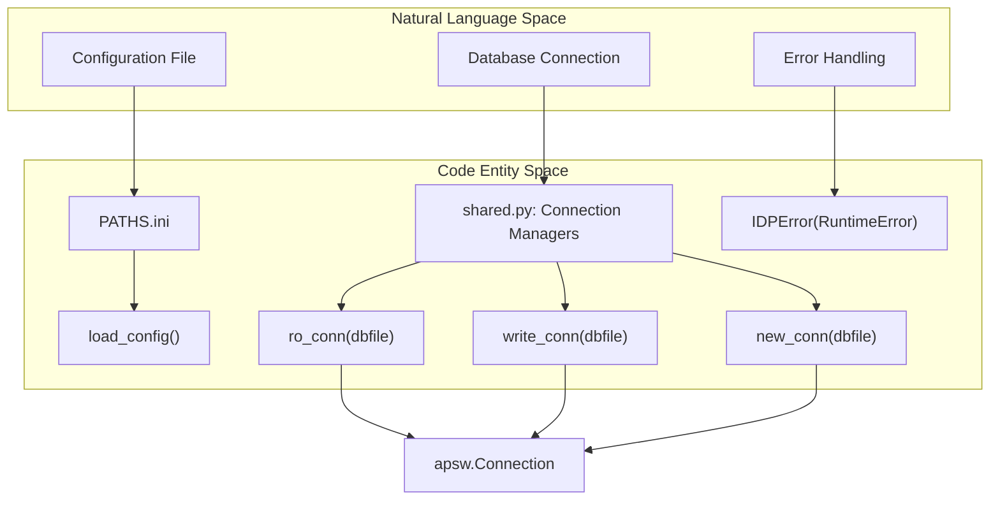
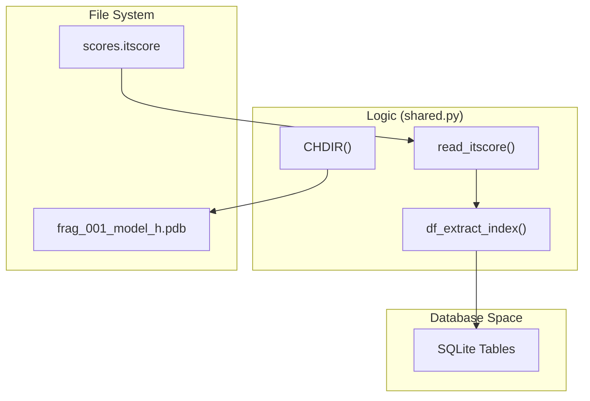

# Getting Started: Installation and Configuration

> **Relevant source files**
> * [PATHS.ini](https://github.com/kiharalab/idp_lzerd/blob/2d5565c2/PATHS.ini)
> * [README.md](https://github.com/kiharalab/idp_lzerd/blob/2d5565c2/README.md?plain=1)
> * [scripts/shared.py](https://github.com/kiharalab/idp_lzerd/blob/2d5565c2/scripts/shared.py)

This page provides a comprehensive guide for setting up the IDP-LZerD environment. It covers the installation of Python dependencies, the configuration of external binary tools via `PATHS.ini`, and the verification steps necessary to ensure the pipeline can execute the modeling of disordered protein interactions [README.md L4-L7](https://github.com/kiharalab/idp_lzerd/blob/2d5565c2/README.md?plain=1#L4-L7)

## System Requirements and Python Environment

IDP-LZerD is built primarily in Python and utilizes a SQLite backend for managing docking decoys and path assembly [scripts/shared.py L26-L65](https://github.com/kiharalab/idp_lzerd/blob/2d5565c2/scripts/shared.py#L26-L65)

### Python Dependencies

The following libraries are required for data processing, geometric calculations, and database management:

* **apsw**: SQLite wrapper used for high-performance database operations [scripts/shared.py L26](https://github.com/kiharalab/idp_lzerd/blob/2d5565c2/scripts/shared.py#L26-L26)
* **numpy / scipy**: Used for vectorized geometric calculations and RMSD computations.
* **pandas**: Utilized for handling score files and database ingestion [scripts/shared.py L27](https://github.com/kiharalab/idp_lzerd/blob/2d5565c2/scripts/shared.py#L27-L27)
* **Biopython**: Used for PDB parsing and structure manipulation.

Installation via Anaconda is recommended:

```
conda install numpy scipy pandas biopythonconda install -c conda-forge apsw
```

[README.md L31](https://github.com/kiharalab/idp_lzerd/blob/2d5565c2/README.md?plain=1#L31-L31)

## External Binary Dependencies

IDP-LZerD acts as an orchestrator for several specialized bioinformatics tools. These must be installed and accessible to the pipeline.

| Category | Tool | Purpose |
| --- | --- | --- |
| **Sequence Analysis** | BLAST+ (blastpgp & nr) | Generates sequence profiles for Rosetta fragment picking [README.md L35-L52](https://github.com/kiharalab/idp_lzerd/blob/2d5565c2/README.md?plain=1#L35-L52) |
| **Fragment Generation** | Rosetta | Generates structural fragments for IDP segments [README.md L37](https://github.com/kiharalab/idp_lzerd/blob/2d5565c2/README.md?plain=1#L37-L37) |
| **Docking Engine** | LZerD / ZDOCK | Performs rigid-body docking of fragments against the receptor [README.md L36-L79](https://github.com/kiharalab/idp_lzerd/blob/2d5565c2/README.md?plain=1#L36-L79) |
| **Structure Processing** | Pulchra | Converts CA-only backbones to full-atom models [README.md L38-L76](https://github.com/kiharalab/idp_lzerd/blob/2d5565c2/README.md?plain=1#L38-L76) |
| **Side-chain Modeling** | Scwrl4 / SCCOMP | Adds side-chains to docked fragment backbones [README.md L39-L77](https://github.com/kiharalab/idp_lzerd/blob/2d5565c2/README.md?plain=1#L39-L77) |
| **Scoring** | GOAP / ITScorePro | Evaluates the quality of docking decoys [README.md L44-L80](https://github.com/kiharalab/idp_lzerd/blob/2d5565c2/README.md?plain=1#L44-L80) |
| **Refinement** | CHARMM | Performs final energy minimization and MD relaxation [README.md L46-L60](https://github.com/kiharalab/idp_lzerd/blob/2d5565c2/README.md?plain=1#L46-L60) |

### Environment Configuration: PATHS.ini

The pipeline discovers these tools through the `PATHS.ini` file located in the root directory. Users must edit this file to match their local environment [README.md L51](https://github.com/kiharalab/idp_lzerd/blob/2d5565c2/README.md?plain=1#L51-L51)

**Example `PATHS.ini` Configuration:**

```
[paths]lzerd_path: $HOME/lzerddistributionrosetta_path: /apps/rosetta/w2016.08nr_path: /apps/blast+/databases/nrblastpgp_exe: /usr/bin/blastpgp
```

[PATHS.ini L1-L5](https://github.com/kiharalab/idp_lzerd/blob/2d5565c2/PATHS.ini#L1-L5)

> **Important:** A common failure point is the `nr` database path. Rosetta requires `blastpgp` and the `nr` database to generate the checkpoint files needed for fragment picking [README.md L52](https://github.com/kiharalab/idp_lzerd/blob/2d5565c2/README.md?plain=1#L52-L52)

## Infrastructure and Data Flow

The following diagram illustrates how the `shared.py` utility module bridges the configuration defined in `PATHS.ini` with the core data structures used throughout the pipeline.

### Configuration and Database Bridge

"This diagram maps the initialization logic in `shared.py` to the system's runtime state."



**Sources:** [scripts/shared.py L34-L65](https://github.com/kiharalab/idp_lzerd/blob/2d5565c2/scripts/shared.py#L34-L65)

 [README.md L51](https://github.com/kiharalab/idp_lzerd/blob/2d5565c2/README.md?plain=1#L51-L51)

## Directory Structure and Test Verification

Before running a full production pipeline, users should verify the installation using the provided `4ah2` test complex [README.md L54-L61](https://github.com/kiharalab/idp_lzerd/blob/2d5565c2/README.md?plain=1#L54-L61)

### Verification Workflow

1. **Configure Test Script**: Edit `test/test_decoys.sh` to point to the `IDP-LZerD` installation path [README.md L56](https://github.com/kiharalab/idp_lzerd/blob/2d5565c2/README.md?plain=1#L56-L56)
2. **Execute Test**: Run the orchestration script. Note that this requires significant disk space (~250 GB) for decoy storage [README.md L57](https://github.com/kiharalab/idp_lzerd/blob/2d5565c2/README.md?plain=1#L57-L57)
3. **Validate Outputs**: Check `test/4ah2ac3` for generated paths and ensure the SQLite database files are populated [README.md L58](https://github.com/kiharalab/idp_lzerd/blob/2d5565c2/README.md?plain=1#L58-L58)

### Data Interaction Model

The pipeline uses `pandas` to bridge the gap between flat score files (e.g., `scores.itscore`) and the SQLite database.



**Sources:** [scripts/shared.py L139-L149](https://github.com/kiharalab/idp_lzerd/blob/2d5565c2/scripts/shared.py#L139-L149)

 [scripts/shared.py L201-L224](https://github.com/kiharalab/idp_lzerd/blob/2d5565c2/scripts/shared.py#L201-L224)

## Implementation Details: shared.py

The `scripts/shared.py` module provides the foundational utilities used by all stages of the pipeline:

* **File Management**: `mkdir_p` provides a thread-safe way to create the deep directory hierarchies required for fragments, while `CHDIR` ensures scripts operate in the correct local context [scripts/shared.py L139-L156](https://github.com/kiharalab/idp_lzerd/blob/2d5565c2/scripts/shared.py#L139-L156)
* **PDB Preprocessing**: The `strip_h` function is used to remove hydrogens from models before certain docking or scoring steps that require heavy-atom-only structures [scripts/shared.py L181-L190](https://github.com/kiharalab/idp_lzerd/blob/2d5565c2/scripts/shared.py#L181-L190)
* **Index Extraction**: The `df_extract_index` function uses regular expressions (e.g., `model(\d+)\D*`) to parse fragment and model IDs from filenames, ensuring consistency between the filesystem and the database [scripts/shared.py L205-L214](https://github.com/kiharalab/idp_lzerd/blob/2d5565c2/scripts/shared.py#L205-L214)

**Sources:**

* [README.md L18-L81](https://github.com/kiharalab/idp_lzerd/blob/2d5565c2/README.md?plain=1#L18-L81)
* [PATHS.ini L1-L5](https://github.com/kiharalab/idp_lzerd/blob/2d5565c2/PATHS.ini#L1-L5)
* [scripts/shared.py L26-L65](https://github.com/kiharalab/idp_lzerd/blob/2d5565c2/scripts/shared.py#L26-L65)
* [scripts/shared.py L139-L160](https://github.com/kiharalab/idp_lzerd/blob/2d5565c2/scripts/shared.py#L139-L160)
* [scripts/shared.py L181-L224](https://github.com/kiharalab/idp_lzerd/blob/2d5565c2/scripts/shared.py#L181-L224)