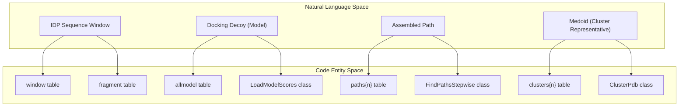
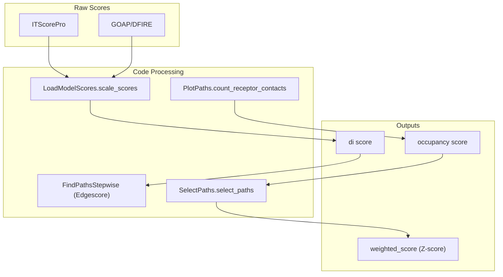

# Glossary

> **Relevant source files**
> * [README.md](https://github.com/kiharalab/idp_lzerd/blob/2d5565c2/README.md?plain=1)
> * [idp_relax.inp](https://github.com/kiharalab/idp_lzerd/blob/2d5565c2/idp_relax.inp)
> * [scripts/cluster_heuristic.py](https://github.com/kiharalab/idp_lzerd/blob/2d5565c2/scripts/cluster_heuristic.py)
> * [scripts/combine_receptor.py](https://github.com/kiharalab/idp_lzerd/blob/2d5565c2/scripts/combine_receptor.py)
> * [scripts/compute_occupancy_score.py](https://github.com/kiharalab/idp_lzerd/blob/2d5565c2/scripts/compute_occupancy_score.py)
> * [scripts/create_database.py](https://github.com/kiharalab/idp_lzerd/blob/2d5565c2/scripts/create_database.py)
> * [scripts/find_paths_stepwise.py](https://github.com/kiharalab/idp_lzerd/blob/2d5565c2/scripts/find_paths_stepwise.py)
> * [scripts/load_model_scores.py](https://github.com/kiharalab/idp_lzerd/blob/2d5565c2/scripts/load_model_scores.py)
> * [scripts/parse_ss.py](https://github.com/kiharalab/idp_lzerd/blob/2d5565c2/scripts/parse_ss.py)
> * [scripts/run_rosetta.py](https://github.com/kiharalab/idp_lzerd/blob/2d5565c2/scripts/run_rosetta.py)
> * [scripts/select_paths.py](https://github.com/kiharalab/idp_lzerd/blob/2d5565c2/scripts/select_paths.py)
> * [scripts/shared.py](https://github.com/kiharalab/idp_lzerd/blob/2d5565c2/scripts/shared.py)

This page provides technical definitions for domain-specific terminology, scientific jargon, and codebase-specific entities used in the IDP-LZerD pipeline. It serves as a bridge between the biophysical concepts of Intrinsically Disordered Proteins (IDPs) and their concrete implementations in the Python and SQLite infrastructure.

## System Architecture: Code to Concept Mapping

The following diagrams illustrate how scientific concepts are represented by specific classes and database structures within the codebase.

### Data Entity Relationship

This diagram maps the biological hierarchy (Fragments -> Models -> Paths) to the internal class and database representations.

**Sources:** [scripts/create_database.py L29-L55](https://github.com/kiharalab/idp_lzerd/blob/2d5565c2/scripts/create_database.py#L29-L55)

 [scripts/load_model_scores.py L39-L54](https://github.com/kiharalab/idp_lzerd/blob/2d5565c2/scripts/load_model_scores.py#L39-L54)

 [scripts/find_paths_stepwise.py L54-L63](https://github.com/kiharalab/idp_lzerd/blob/2d5565c2/scripts/find_paths_stepwise.py#L54-L63)

 [scripts/cluster_heuristic.py L101-L149](https://github.com/kiharalab/idp_lzerd/blob/2d5565c2/scripts/cluster_heuristic.py#L101-L149)

### Scoring and Selection Flow

This diagram tracks how raw scores are processed into a final ranked list of binding poses.

**Sources:** [scripts/load_model_scores.py L165-L170](https://github.com/kiharalab/idp_lzerd/blob/2d5565c2/scripts/load_model_scores.py#L165-L170)

 [scripts/find_paths_stepwise.py L250-L280](https://github.com/kiharalab/idp_lzerd/blob/2d5565c2/scripts/find_paths_stepwise.py#L250-L280)

 [scripts/compute_occupancy_score.py L103-L120](https://github.com/kiharalab/idp_lzerd/blob/2d5565c2/scripts/compute_occupancy_score.py#L103-L120)

 [scripts/select_paths.py L130-L152](https://github.com/kiharalab/idp_lzerd/blob/2d5565c2/scripts/select_paths.py#L130-L152)

---

## Domain Concepts & Technical Terms

### 9mers

Standard length (9 residues) for structural fragments used in Rosetta. The pipeline uses these to represent local conformational preferences of the IDP sequence.

* **Implementation:** Handled during fragment picking and converted to PDBs.
* **Code Pointer:** [scripts/run_rosetta.py L71-L72](https://github.com/kiharalab/idp_lzerd/blob/2d5565c2/scripts/run_rosetta.py#L71-L72)  [scripts/rosetta_to_pdb.py](https://github.com/kiharalab/idp_lzerd/blob/2d5565c2/scripts/rosetta_to_pdb.py)

### Batchsize

The number of path combinations processed in a single memory-to-disk operation during stepwise assembly.

* **Implementation:** Controlled in `FindPathsStepwise` to manage SQLite transaction overhead.
* **Code Pointer:** [scripts/find_paths_stepwise.py L52](https://github.com/kiharalab/idp_lzerd/blob/2d5565c2/scripts/find_paths_stepwise.py#L52-L52)

### Cluster Size (clustersize)

The number of assembled paths that are geometrically similar to a specific medoid. Used as a proxy for the entropy/probability of a specific binding pose.

* **Implementation:** Calculated during heuristic clustering and stored in `clusters{n}` tables.
* **Code Pointer:** [scripts/find_paths_stepwise.py L112-L115](https://github.com/kiharalab/idp_lzerd/blob/2d5565c2/scripts/find_paths_stepwise.py#L112-L115)  [scripts/cluster_heuristic.py L112-L133](https://github.com/kiharalab/idp_lzerd/blob/2d5565c2/scripts/cluster_heuristic.py#L112-L133)

### ComplexID

A unique string identifier for a protein complex, typically formed by concatenating the PDB ID, receptor chain ID, and ligand chain ID.

* **Implementation:** Used to name SQLite databases (e.g., `scores_{complexid}.db`).
* **Code Pointer:** [scripts/create_database.py L62-L63](https://github.com/kiharalab/idp_lzerd/blob/2d5565c2/scripts/create_database.py#L62-L63)  [scripts/find_paths_stepwise.py L71-L73](https://github.com/kiharalab/idp_lzerd/blob/2d5565c2/scripts/find_paths_stepwise.py#L71-L73)

### Di Score

A composite internal score calculated by scaling and summing ITScore and DFIRE/GOAP scores for a single fragment decoy.

* **Implementation:** Generated in `LoadModelScores.scale_scores`.
* **Code Pointer:** [scripts/load_model_scores.py L165-L170](https://github.com/kiharalab/idp_lzerd/blob/2d5565c2/scripts/load_model_scores.py#L165-L170)

### Edgescore

A geometric compatibility score between two adjacent IDP fragments. It measures how well the C-terminus of window $i$ aligns with the N-terminus of window $i+1$.

* **Implementation:** Stored in `modeldist` tables and aggregated into `edgescores` in the `paths{n}` tables.
* **Code Pointer:** [scripts/find_paths_stepwise.py L59-L60](https://github.com/kiharalab/idp_lzerd/blob/2d5565c2/scripts/find_paths_stepwise.py#L59-L60)  [scripts/load_model_scores.py L228-L250](https://github.com/kiharalab/idp_lzerd/blob/2d5565c2/scripts/load_model_scores.py#L228-L250)

### IDP (Intrinsically Disordered Protein)

A protein that lacks a fixed or ordered three-dimensional structure under physiological conditions. In this pipeline, the "ligand".

* **Code Pointer:** [README.md L4-L7](https://github.com/kiharalab/idp_lzerd/blob/2d5565c2/README.md?plain=1#L4-L7)

### ITScore / DFIRE / GOAP

External statistical potentials used to score the quality of a docking decoy (fragment vs. receptor).

* **Implementation:** Parsed from text files and ingested into the `allmodel` table.
* **Code Pointer:** [scripts/load_model_scores.py L104-L120](https://github.com/kiharalab/idp_lzerd/blob/2d5565c2/scripts/load_model_scores.py#L104-L120)  [scripts/shared.py L216-L235](https://github.com/kiharalab/idp_lzerd/blob/2d5565c2/scripts/shared.py#L216-L235)

### LRMSD (Ligand Root Mean Square Deviation)

A measure of the distance between two ligand poses when the receptor is fixed in space.

* **Implementation:** Vectorized calculation using `numpy` in the `ClusterLRMSD` class.
* **Code Pointer:** [scripts/cluster_heuristic.py L41-L90](https://github.com/kiharalab/idp_lzerd/blob/2d5565c2/scripts/cluster_heuristic.py#L41-L90)

### Medoid

The path in a cluster that has the minimum average distance to all other paths in that cluster. It serves as the cluster representative.

* **Implementation:** Identified during clustering and flagged in the `is_medoid` column of the `clusters{n}` table.
* **Code Pointer:** [scripts/cluster_heuristic.py L112-L133](https://github.com/kiharalab/idp_lzerd/blob/2d5565c2/scripts/cluster_heuristic.py#L112-L133)  [scripts/select_paths.py L104-L110](https://github.com/kiharalab/idp_lzerd/blob/2d5565c2/scripts/select_paths.py#L104-L110)

### Nodescore

The sum of the individual `di` scores for all fragment models constituting a full-length assembled path.

* **Implementation:** Calculated during the join operations in stepwise path finding.
* **Code Pointer:** [scripts/find_paths_stepwise.py L60](https://github.com/kiharalab/idp_lzerd/blob/2d5565c2/scripts/find_paths_stepwise.py#L60-L60)  [scripts/find_paths_stepwise.py L250-L280](https://github.com/kiharalab/idp_lzerd/blob/2d5565c2/scripts/find_paths_stepwise.py#L250-L280)

### Occupancy Score

A score representing how frequently a receptor residue is contacted by the ensemble of top-ranked IDP paths.

* **Implementation:** Computed using `Bio.PDB.NeighborSearch` across all medoid paths.
* **Code Pointer:** [scripts/compute_occupancy_score.py L103-L167](https://github.com/kiharalab/idp_lzerd/blob/2d5565c2/scripts/compute_occupancy_score.py#L103-L167)  [scripts/select_paths.py L115-L124](https://github.com/kiharalab/idp_lzerd/blob/2d5565c2/scripts/select_paths.py#L115-L124)

### Path

A sequence of specific docking decoys (one for each window) that represents a potential full-length binding pose for the IDP.

* **Implementation:** Represented as a row in the `paths{n}` table, where `n` is the number of windows.
* **Code Pointer:** [scripts/find_paths_stepwise.py L56](https://github.com/kiharalab/idp_lzerd/blob/2d5565c2/scripts/find_paths_stepwise.py#L56-L56)  [scripts/find_paths_stepwise.py L159-L180](https://github.com/kiharalab/idp_lzerd/blob/2d5565c2/scripts/find_paths_stepwise.py#L159-L180)

### Receptor Preprocessing (CombineChain)

The process of merging multiple receptor chains into a single virtual chain to satisfy docking software requirements, while maintaining metadata to reverse the process.

* **Implementation:** Handled by the `CombineChain` class using `REMARK` lines in the PDB header.
* **Code Pointer:** [scripts/combine_receptor.py L42-L145](https://github.com/kiharalab/idp_lzerd/blob/2d5565c2/scripts/combine_receptor.py#L42-L145)

### SS2 (PSIPRED VFORMAT)

A specific file format for secondary structure predictions that includes the probability for Coil (C), Helix (H), and Strand (E) at each residue.

* **Implementation:** The target format for the `ParseSs` class.
* **Code Pointer:** [scripts/parse_ss.py L35](https://github.com/kiharalab/idp_lzerd/blob/2d5565c2/scripts/parse_ss.py#L35-L35)  [scripts/parse_ss.py L197-L200](https://github.com/kiharalab/idp_lzerd/blob/2d5565c2/scripts/parse_ss.py#L197-L200)

### Window

A sliding segment of the IDP sequence (typically 9 residues long) used for fragment generation and docking.

* **Implementation:** Defined in the `window` table with `res_start` and `res_end` coordinates.
* **Code Pointer:** [scripts/create_database.py L29-L39](https://github.com/kiharalab/idp_lzerd/blob/2d5565c2/scripts/create_database.py#L29-L39)  [scripts/shared.py L303-L315](https://github.com/kiharalab/idp_lzerd/blob/2d5565c2/scripts/shared.py#L303-L315)