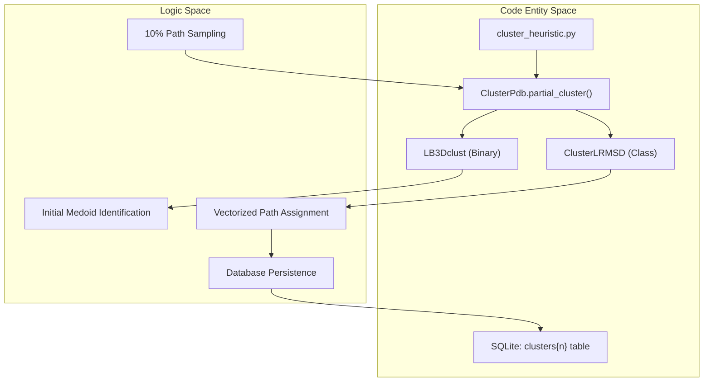
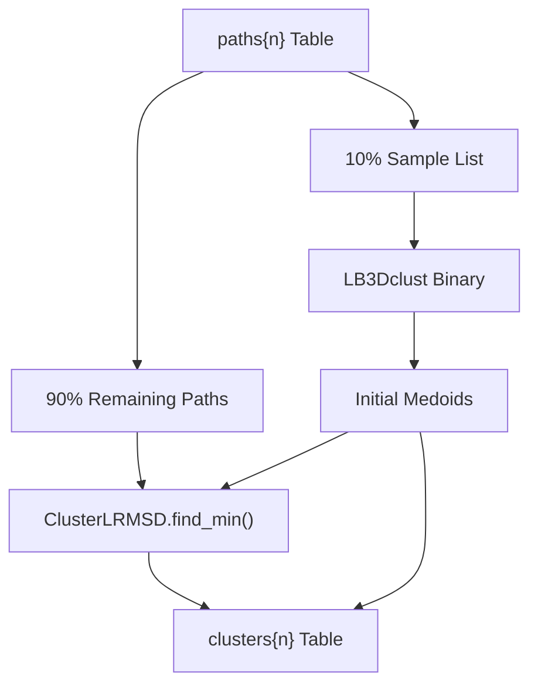

# Heuristic Clustering of Paths

> **Relevant source files**
> * [scripts/cluster_heuristic.py](https://github.com/kiharalab/idp_lzerd/blob/2d5565c2/scripts/cluster_heuristic.py)
> * [scripts/shared.py](https://github.com/kiharalab/idp_lzerd/blob/2d5565c2/scripts/shared.py)

The `cluster_heuristic.py` script implements a two-stage clustering strategy to manage the high dimensionality of assembled IDP paths. Given the combinatorial nature of path assembly, clustering all paths directly is computationally prohibitive. This module employs a 10% sampling strategy combined with the `LB3Dclust` binary and a vectorized LRMSD assignment for the remaining population.

### Technical Overview

The clustering process follows a specific sequence to ensure representative medoid selection while maintaining computational efficiency:

1. **Sampling**: A 10% random sample of paths is extracted from the `paths{n}` table [scripts/cluster_heuristic.py L188-L189](https://github.com/kiharalab/idp_lzerd/blob/2d5565c2/scripts/cluster_heuristic.py#L188-L189)
2. **Seed Clustering**: The sample is clustered using the `LB3Dclust` binary to define initial cluster centers (medoids) [scripts/cluster_heuristic.py L153](https://github.com/kiharalab/idp_lzerd/blob/2d5565c2/scripts/cluster_heuristic.py#L153-L153)
3. **Heuristic Assignment**: The remaining 90% of paths are assigned to the nearest existing cluster center using vectorized LRMSD calculations [scripts/cluster_heuristic.py L71-L90](https://github.com/kiharalab/idp_lzerd/blob/2d5565c2/scripts/cluster_heuristic.py#L71-L90)
4. **Medoid Finalization**: Clusters are updated, and the path closest to the centroid of each cluster is designated as the final medoid [scripts/cluster_heuristic.py L61-L65](https://github.com/kiharalab/idp_lzerd/blob/2d5565c2/scripts/cluster_heuristic.py#L61-L65)

### Code Entity Map: Clustering Logic

The following diagram maps the logical clustering stages to the specific Python classes and external binaries involved.

**Sources:** [scripts/cluster_heuristic.py L41-L43](https://github.com/kiharalab/idp_lzerd/blob/2d5565c2/scripts/cluster_heuristic.py#L41-L43)

 [scripts/cluster_heuristic.py L96-L101](https://github.com/kiharalab/idp_lzerd/blob/2d5565c2/scripts/cluster_heuristic.py#L96-L101)

 [scripts/cluster_heuristic.py L153](https://github.com/kiharalab/idp_lzerd/blob/2d5565c2/scripts/cluster_heuristic.py#L153-L153)

---

### Implementation Details

#### 1. ClusterLRMSD Class

The `ClusterLRMSD` class handles the assignment of non-sampled paths. It uses `numpy` to perform vectorized distance calculations, significantly speeding up the comparison of a path's coordinates against all established cluster centers.

* **Initialization**: Precomputes an RMSD multiplier `factor` based on the number of residues ($1/\sqrt{N}$) and builds a coordinate matrix of existing cluster centers [scripts/cluster_heuristic.py L56-L62](https://github.com/kiharalab/idp_lzerd/blob/2d5565c2/scripts/cluster_heuristic.py#L56-L62)
* **Distance Calculation**: The `find_min` method computes the Euclidean distance between a target path and the entire `coord_matrix` in a single operation using `np.linalg.norm` [scripts/cluster_heuristic.py L84-L85](https://github.com/kiharalab/idp_lzerd/blob/2d5565c2/scripts/cluster_heuristic.py#L84-L85)

#### 2. LB3Dclust Invocation

The script invokes the `LB3Dclust` binary, which is part of the LZerD suite, to perform the initial clustering on the 10% sample. The path to this binary is resolved via the `PATHS.ini` configuration loaded through `shared.load_config()` [scripts/cluster_heuristic.py L152-L153](https://github.com/kiharalab/idp_lzerd/blob/2d5565c2/scripts/cluster_heuristic.py#L152-L153)

#### 3. Data Flow and SQL Integration

The clustering results are stored in a `clusters{n}` table (where `n` is the number of windows).

| Column | Type | Description |
| --- | --- | --- |
| `pathsid` | INTEGER | Foreign key to the `paths{n}` table [scripts/cluster_heuristic.py L128-L132](https://github.com/kiharalab/idp_lzerd/blob/2d5565c2/scripts/cluster_heuristic.py#L128-L132) |
| `cid` | INTEGER | Cluster ID assigned to the path [scripts/cluster_heuristic.py L129](https://github.com/kiharalab/idp_lzerd/blob/2d5565c2/scripts/cluster_heuristic.py#L129-L129) |
| `is_medoid` | INTEGER | Boolean flag (0 or 1) indicating if this path is the cluster medoid [scripts/cluster_heuristic.py L130](https://github.com/kiharalab/idp_lzerd/blob/2d5565c2/scripts/cluster_heuristic.py#L130-L130) |
| `clustersize` | INTEGER | The total number of paths assigned to this cluster [scripts/cluster_heuristic.py L131](https://github.com/kiharalab/idp_lzerd/blob/2d5565c2/scripts/cluster_heuristic.py#L131-L131) |

### Data Flow Diagram: Path to Cluster

This diagram illustrates how data flows from the path database through the heuristic clustering logic and back into the database.

**Sources:** [scripts/cluster_heuristic.py L103-L111](https://github.com/kiharalab/idp_lzerd/blob/2d5565c2/scripts/cluster_heuristic.py#L103-L111)

 [scripts/cluster_heuristic.py L137-L140](https://github.com/kiharalab/idp_lzerd/blob/2d5565c2/scripts/cluster_heuristic.py#L137-L140)

 [scripts/cluster_heuristic.py L188-L193](https://github.com/kiharalab/idp_lzerd/blob/2d5565c2/scripts/cluster_heuristic.py#L188-L193)

### Key Functions

* `ClusterPdb.make_sql(...)`: Generates the complex SQL queries required to create the cluster tables and link them to the path tables via foreign keys [scripts/cluster_heuristic.py L101-L149](https://github.com/kiharalab/idp_lzerd/blob/2d5565c2/scripts/cluster_heuristic.py#L101-L149)
* `ClusterLRMSD.find_min(coords)`: The core heuristic engine. It takes a coordinate array for a path and returns the `pathsid` of the closest medoid and the calculated LRMSD [scripts/cluster_heuristic.py L71-L90](https://github.com/kiharalab/idp_lzerd/blob/2d5565c2/scripts/cluster_heuristic.py#L71-L90)
* `shared.create_insert_statement(...)`: A utility used to build the parameterized SQL for batch-inserting clustering results into the database [scripts/shared.py L97-L111](https://github.com/kiharalab/idp_lzerd/blob/2d5565c2/scripts/shared.py#L97-L111)

**Sources:**

* [scripts/cluster_heuristic.py L41-L90](https://github.com/kiharalab/idp_lzerd/blob/2d5565c2/scripts/cluster_heuristic.py#L41-L90)
* [scripts/cluster_heuristic.py L101-L153](https://github.com/kiharalab/idp_lzerd/blob/2d5565c2/scripts/cluster_heuristic.py#L101-L153)
* [scripts/shared.py L97-L111](https://github.com/kiharalab/idp_lzerd/blob/2d5565c2/scripts/shared.py#L97-L111)
* [scripts/shared.py L151-L167](https://github.com/kiharalab/idp_lzerd/blob/2d5565c2/scripts/shared.py#L151-L167)