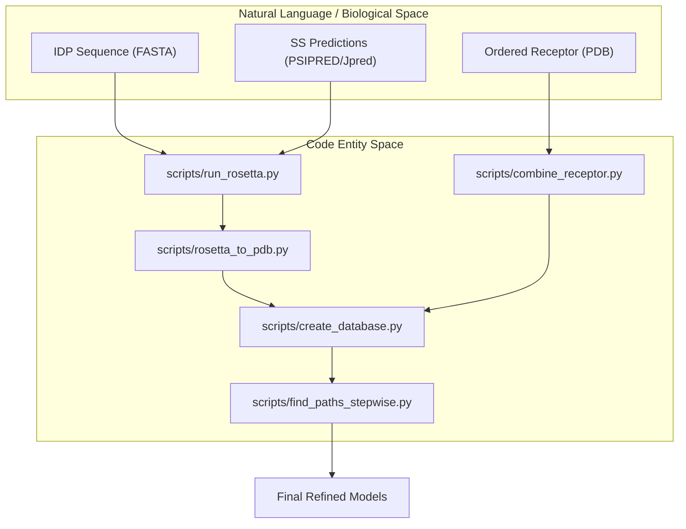
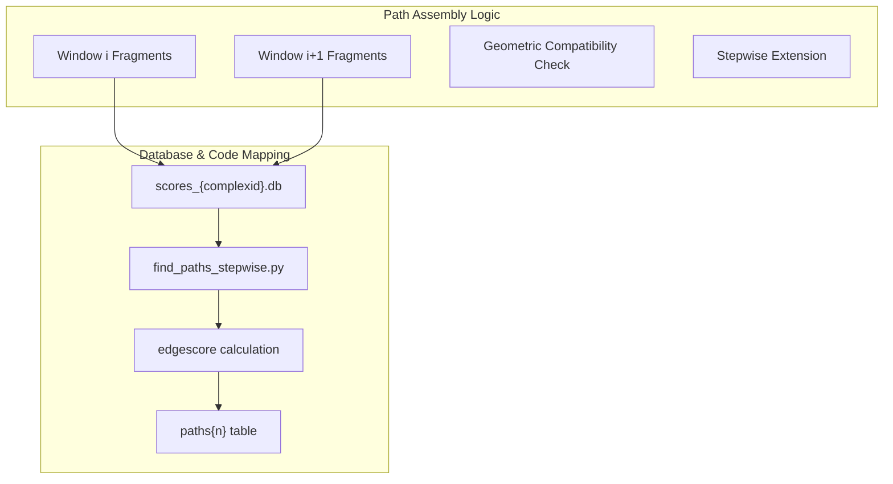

# IDP-LZerD Overview

> **Relevant source files**
> * [LICENSE.txt](https://github.com/kiharalab/idp_lzerd/blob/2d5565c2/LICENSE.txt)
> * [PATHS.ini](https://github.com/kiharalab/idp_lzerd/blob/2d5565c2/PATHS.ini)
> * [README.md](https://github.com/kiharalab/idp_lzerd/blob/2d5565c2/README.md?plain=1)

IDP-LZerD is a computational pipeline designed to model the bound conformation of an intrinsically disordered protein (IDP) when it interacts with an ordered globular protein [README.md L4-L7](https://github.com/kiharalab/idp_lzerd/blob/2d5565c2/README.md?plain=1#L4-L7)

 The system addresses the challenge of predicting docking poses for proteins that lack a stable tertiary structure in isolation but fold upon binding to a partner.

The pipeline utilizes a fragment-based approach, leveraging secondary structure predictions and Rosetta fragment picking to generate local conformational ensembles of the IDP. These fragments are then docked against the receptor using LZerD (or ZDOCK), scored, and assembled into full-length binding paths using a combinatorial optimization and clustering strategy [README.md L73-L81](https://github.com/kiharalab/idp_lzerd/blob/2d5565c2/README.md?plain=1#L73-L81)

### Core Scientific Problem

Traditional docking methods often assume a relatively rigid or pre-folded ligand. IDPs, however, exist as ensembles of fluctuating conformations. IDP-LZerD solves this by:

1. **Decomposition**: Breaking the IDP sequence into overlapping 9-mer windows [scripts/rosetta_to_pdb.py L100-L105](https://github.com/kiharalab/idp_lzerd/blob/2d5565c2/scripts/rosetta_to_pdb.py#L100-L105)
2. **Sampling**: Generating structural fragments for each window based on sequence-derived secondary structure propensities [scripts/run_rosetta.py L46-L52](https://github.com/kiharalab/idp_lzerd/blob/2d5565c2/scripts/run_rosetta.py#L46-L52)
3. **Assembly**: Recombining high-scoring docking poses of these fragments into a continuous, physically plausible full-length chain [scripts/find_paths_stepwise.py L12-L25](https://github.com/kiharalab/idp_lzerd/blob/2d5565c2/scripts/find_paths_stepwise.py#L12-L25)

### System Architecture

The following diagram illustrates the transition from biological sequence data to the code entities that process them.

**Diagram 1: Data Flow from Biology to Code Entities**

**Sources:** [README.md L64-L81](https://github.com/kiharalab/idp_lzerd/blob/2d5565c2/README.md?plain=1#L64-L81)

 [scripts/run_rosetta.py L1-L50](https://github.com/kiharalab/idp_lzerd/blob/2d5565c2/scripts/run_rosetta.py#L1-L50)

 [scripts/find_paths_stepwise.py L1-L30](https://github.com/kiharalab/idp_lzerd/blob/2d5565c2/scripts/find_paths_stepwise.py#L1-L30)

### Pipeline Components

The pipeline is divided into several functional stages, orchestrated primarily through Python scripts and shell wrappers.

| Stage | Primary Code Entities | Key Responsibility |
| --- | --- | --- |
| **Preprocessing** | `scripts/parse_ss.py`, `scripts/combine_receptor.py` | Normalizing SS predictions and preparing multi-chain receptors [scripts/combine_receptor.py L12-L20](https://github.com/kiharalab/idp_lzerd/blob/2d5565c2/scripts/combine_receptor.py#L12-L20) |
| **Fragment Gen** | `scripts/run_rosetta.py`, `scripts/rosetta_to_pdb.py` | Generating 9-mer structural fragments using Rosetta [scripts/rosetta_to_pdb.py L1-L20](https://github.com/kiharalab/idp_lzerd/blob/2d5565c2/scripts/rosetta_to_pdb.py#L1-L20) |
| **Docking & Scoring** | `test/test_decoys.sh`, `scripts/load_model_scores.py` | Running LZerD/ZDOCK and ingesting GOAP/ITScorePro values [scripts/load_model_scores.py L45-L60](https://github.com/kiharalab/idp_lzerd/blob/2d5565c2/scripts/load_model_scores.py#L45-L60) |
| **Assembly** | `scripts/find_paths_stepwise.py`, `scripts/cluster_heuristic.py` | Building full-length IDP paths and clustering by RMSD [scripts/cluster_heuristic.py L20-L40](https://github.com/kiharalab/idp_lzerd/blob/2d5565c2/scripts/cluster_heuristic.py#L20-L40) |
| **Refinement** | `scripts/select_paths.py`, `idp_relax.inp` | Ranking paths and performing CHARMM MD relaxation [README.md L59-L61](https://github.com/kiharalab/idp_lzerd/blob/2d5565c2/README.md?plain=1#L59-L61) |

**Sources:** [README.md L1-L81](https://github.com/kiharalab/idp_lzerd/blob/2d5565c2/README.md?plain=1#L1-L81)

 [scripts/shared.py L1-L100](https://github.com/kiharalab/idp_lzerd/blob/2d5565c2/scripts/shared.py#L1-L100)

### Code-to-Logic Mapping

The following diagram maps the high-level logic of path assembly to the specific database interactions and scripts involved.

**Diagram 2: Path Assembly Logic and Database Mapping**

**Sources:** [scripts/find_paths_stepwise.py L230-L280](https://github.com/kiharalab/idp_lzerd/blob/2d5565c2/scripts/find_paths_stepwise.py#L230-L280)

 [scripts/create_database.py L40-L70](https://github.com/kiharalab/idp_lzerd/blob/2d5565c2/scripts/create_database.py#L40-L70)

---

### Child Pages

#### Getting Started: Installation and Configuration

Covers the setup of binary dependencies such as Rosetta, LZerD, and BLAST, as well as the configuration of the `PATHS.ini` file required for the pipeline to locate external tools [PATHS.ini L1-L5](https://github.com/kiharalab/idp_lzerd/blob/2d5565c2/PATHS.ini#L1-L5)

*For details, see [Getting Started: Installation and Configuration](/kiharalab/idp_lzerd/1.1-getting-started:-installation-and-configuration).*

#### End-to-End Pipeline Walkthrough

A narrative guide following a single complex (e.g., 4ah2) through the entire workflow, from initial sequence files to the final CHARMM-refined PDB models [README.md L54-L61](https://github.com/kiharalab/idp_lzerd/blob/2d5565c2/README.md?plain=1#L54-L61)

*For details, see [End-to-End Pipeline Walkthrough](/kiharalab/idp_lzerd/1.2-end-to-end-pipeline-walkthrough).*

---

**Sources:**

* [README.md L1-L81](https://github.com/kiharalab/idp_lzerd/blob/2d5565c2/README.md?plain=1#L1-L81)
* [PATHS.ini L1-L5](https://github.com/kiharalab/idp_lzerd/blob/2d5565c2/PATHS.ini#L1-L5)
* [scripts/shared.py L1-L50](https://github.com/kiharalab/idp_lzerd/blob/2d5565c2/scripts/shared.py#L1-L50)
* [scripts/find_paths_stepwise.py L1-L50](https://github.com/kiharalab/idp_lzerd/blob/2d5565c2/scripts/find_paths_stepwise.py#L1-L50)