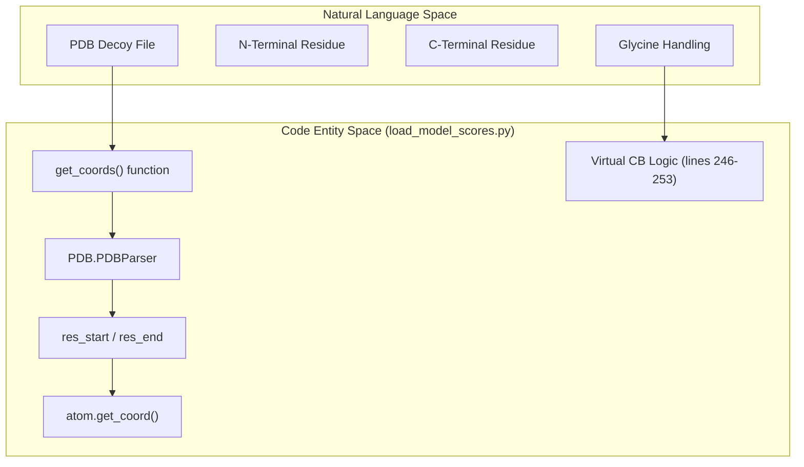
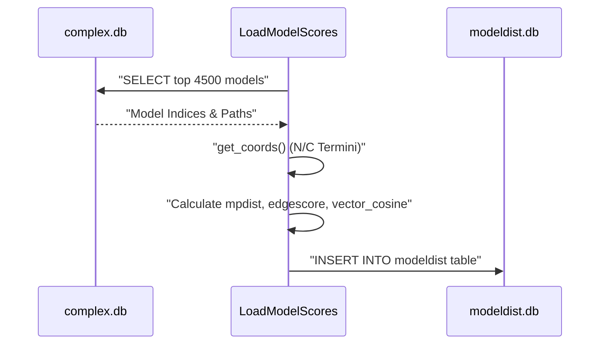

# Model Scoring and Geometric Filtering

> **Relevant source files**
> * [scripts/load_model_scores.py](https://github.com/kiharalab/idp_lzerd/blob/2d5565c2/scripts/load_model_scores.py)
> * [scripts/shared.py](https://github.com/kiharalab/idp_lzerd/blob/2d5565c2/scripts/shared.py)
> * [test/4ah2/4ah21/1/goap_score.txt](https://github.com/kiharalab/idp_lzerd/blob/2d5565c2/test/4ah2/4ah21/1/goap_score.txt)
> * [test/4ah2/4ah21/1/scores.itscore](https://github.com/kiharalab/idp_lzerd/blob/2d5565c2/test/4ah2/4ah21/1/scores.itscore)

This section provides a technical deep dive into the scoring and geometric compatibility pipeline within IDP-LZerD. The primary logic resides in `load_model_scores.py`, which handles the ingestion of statistical potentials (ITScore and GOAP/DFIRE), calculates composite scores, and prepares geometric data for downstream path assembly.

## Overview of Scoring Ingestion

The scoring process begins by reading raw score files generated during the docking phase for every decoy in every fragment window. The `LoadModelScores` class orchestrates the loading of these scores into the SQLite complex database.

### Score Types

1. **ITScore**: An iterative knowledge-based scoring function. Scores are read from `scores.itscore` [scripts/shared.py L216](https://github.com/kiharalab/idp_lzerd/blob/2d5565c2/scripts/shared.py#L216-L216)
2. **GOAP/DFIRE**: DFIRE scores are extracted from the GOAP output file `goap_score.txt` [scripts/shared.py L236](https://github.com/kiharalab/idp_lzerd/blob/2d5565c2/scripts/shared.py#L236-L236)

### Data Flow: Score Ingestion

The `load` method [scripts/load_model_scores.py L73-L131](https://github.com/kiharalab/idp_lzerd/blob/2d5565c2/scripts/load_model_scores.py#L73-L131)

 iterates through all fragments defined in the `fragment` table. For each fragment, it:

1. Locates the fragment's working directory [scripts/load_model_scores.py L102](https://github.com/kiharalab/idp_lzerd/blob/2d5565c2/scripts/load_model_scores.py#L102-L102)
2. Parses ITScore values using `shared.read_itscore` [scripts/load_model_scores.py L104-L105](https://github.com/kiharalab/idp_lzerd/blob/2d5565c2/scripts/load_model_scores.py#L104-L105)
3. Parses DFIRE values using `shared.read_dfire_from_goap` [scripts/load_model_scores.py L117-L118](https://github.com/kiharalab/idp_lzerd/blob/2d5565c2/scripts/load_model_scores.py#L117-L118)
4. Merges these scores into a single DataFrame based on the `modelindex` [scripts/load_model_scores.py L120](https://github.com/kiharalab/idp_lzerd/blob/2d5565c2/scripts/load_model_scores.py#L120-L120)
5. Inserts the records into the `allmodel` table [scripts/load_model_scores.py L130](https://github.com/kiharalab/idp_lzerd/blob/2d5565c2/scripts/load_model_scores.py#L130-L130)

| Feature | Implementation |
| --- | --- |
| **Table Name** | `allmodel` [scripts/load_model_scores.py L42](https://github.com/kiharalab/idp_lzerd/blob/2d5565c2/scripts/load_model_scores.py#L42-L42) |
| **Primary Key** | `modelid` [scripts/load_model_scores.py L44](https://github.com/kiharalab/idp_lzerd/blob/2d5565c2/scripts/load_model_scores.py#L44-L44) |
| **Foreign Keys** | `windowindex`, `fragmentindex` [scripts/load_model_scores.py L51-L52](https://github.com/kiharalab/idp_lzerd/blob/2d5565c2/scripts/load_model_scores.py#L51-L52) |

**Sources:** [scripts/load_model_scores.py L39-L131](https://github.com/kiharalab/idp_lzerd/blob/2d5565c2/scripts/load_model_scores.py#L39-L131)

 [scripts/shared.py L216-L250](https://github.com/kiharalab/idp_lzerd/blob/2d5565c2/scripts/shared.py#L216-L250)

## Composite Scoring ($d_i$) and Model Selection

After all scores are ingested, the pipeline selects the top $N$ models (default 4500) per window based on a composite score $d_i$.

### The $d_i$ Score Calculation

The $d_i$ score is a Euclidean distance in normalized score space, representing how close a model is to the "ideal" (minimum) observed scores for ITScore and DFIRE.

1. **Normalization**: Scores are scaled to a $[0, 1]$ range within each window using the `scale_scores` method [scripts/load_model_scores.py L166](https://github.com/kiharalab/idp_lzerd/blob/2d5565c2/scripts/load_model_scores.py#L166-L166)
2. **Distance Calculation**: The composite score is calculated as: $d_i = \sqrt{scaled_itscore^2 + scaled_dfire^2}$ This logic is implemented in `scale_scores` [scripts/load_model_scores.py L202-L212](https://github.com/kiharalab/idp_lzerd/blob/2d5565c2/scripts/load_model_scores.py#L202-L212)

### Selection Pipeline

The `choose` method [scripts/load_model_scores.py L132-L178](https://github.com/kiharalab/idp_lzerd/blob/2d5565c2/scripts/load_model_scores.py#L132-L178)

 performs the following:

1. Retrieves all models for a specific window.
2. Calculates the $d_i$ score.
3. Sorts models by $d_i$ in ascending order [scripts/load_model_scores.py L168](https://github.com/kiharalab/idp_lzerd/blob/2d5565c2/scripts/load_model_scores.py#L168-L168)
4. Takes the top 4500 models [scripts/load_model_scores.py L170](https://github.com/kiharalab/idp_lzerd/blob/2d5565c2/scripts/load_model_scores.py#L170-L170)
5. Extracts 3D coordinates for the selected models.

**Sources:** [scripts/load_model_scores.py L132-L212](https://github.com/kiharalab/idp_lzerd/blob/2d5565c2/scripts/load_model_scores.py#L132-L212)

## Geometric Filtering Infrastructure

To enable fast path assembly, the pipeline generates geometric metadata for each selected decoy, specifically targeting the N-terminal and C-terminal residues of the fragment.

### Virtual CB Generation for Glycine

Because Glycine lacks a $C\beta$ atom, the pipeline generates a "virtual" $C\beta$ to maintain consistency in distance calculations. The `get_coords` function [scripts/load_model_scores.py L214-L257](https://github.com/kiharalab/idp_lzerd/blob/2d5565c2/scripts/load_model_scores.py#L214-L257)

 handles this:

* It extracts $N, CA, C$ coordinates.
* If the residue is Glycine, it calculates a virtual $C\beta$ position based on the geometry of the backbone [scripts/load_model_scores.py L246-L253](https://github.com/kiharalab/idp_lzerd/blob/2d5565c2/scripts/load_model_scores.py#L246-L253)

### Model Distance Pipeline (modeldist)

The system calculates distances between fragments to determine geometric compatibility for assembly. This is stored in separate databases formatted as `{pdbid}_modeldist{windowid}.db` [scripts/load_model_scores.py L68](https://github.com/kiharalab/idp_lzerd/blob/2d5565c2/scripts/load_model_scores.py#L68-L68)

#### Data Entities: Bridge to Code

The following diagram maps the geometric concepts to the specific variables and functions in `load_model_scores.py`.

**Geometric Coordinate Extraction Logic**

**Sources:** [scripts/load_model_scores.py L214-L257](https://github.com/kiharalab/idp_lzerd/blob/2d5565c2/scripts/load_model_scores.py#L214-L257)

## Geometric Compatibility Metrics

The `modeldist` pipeline calculates three primary metrics to evaluate if two fragment decoys (from adjacent windows) can be joined.

### 1. Midpoint Distance (mpdist)

Calculates the distance between the C-terminus of window $i$ and the N-terminus of window $i+1$. The calculation uses $N, CA, C, CB$ atoms [scripts/load_model_scores.py L466-L476](https://github.com/kiharalab/idp_lzerd/blob/2d5565c2/scripts/load_model_scores.py#L466-L476)

### 2. Edge Score (edgescore)

The `edgescore` represents the RMSD of the overlapping residues between two windows. If window $A$ and window $B$ overlap by $k$ residues, the `edgescore` is the $CA$-RMSD of those $k$ residues [scripts/load_model_scores.py L532-L536](https://github.com/kiharalab/idp_lzerd/blob/2d5565c2/scripts/load_model_scores.py#L532-L536)

### 3. Vector Cosine (vector_cosine)

Measures the directional alignment between fragments. It calculates the cosine of the angle between vectors defined by the fragment termini. This is implemented within the distance calculation loops [scripts/load_model_scores.py L478-L485](https://github.com/kiharalab/idp_lzerd/blob/2d5565c2/scripts/load_model_scores.py#L478-L485)

### Data Flow: Compatibility Calculation

| Metric | Code Reference | Purpose |
| --- | --- | --- |
| **mpdist** | `calc_mpdist` [scripts/load_model_scores.py L466-L476](https://github.com/kiharalab/idp_lzerd/blob/2d5565c2/scripts/load_model_scores.py#L466-L476) | Physical distance between fragments |
| **edgescore** | `calc_edgescore` [scripts/load_model_scores.py L532-L536](https://github.com/kiharalab/idp_lzerd/blob/2d5565c2/scripts/load_model_scores.py#L532-L536) | Structural overlap similarity |
| **vector_cosine** | `calc_vector_cosine` [scripts/load_model_scores.py L478-L485](https://github.com/kiharalab/idp_lzerd/blob/2d5565c2/scripts/load_model_scores.py#L478-L485) | Relative orientation |

**Sources:** [scripts/load_model_scores.py L466-L536](https://github.com/kiharalab/idp_lzerd/blob/2d5565c2/scripts/load_model_scores.py#L466-L536)

 [scripts/load_model_scores.py L68](https://github.com/kiharalab/idp_lzerd/blob/2d5565c2/scripts/load_model_scores.py#L68-L68)