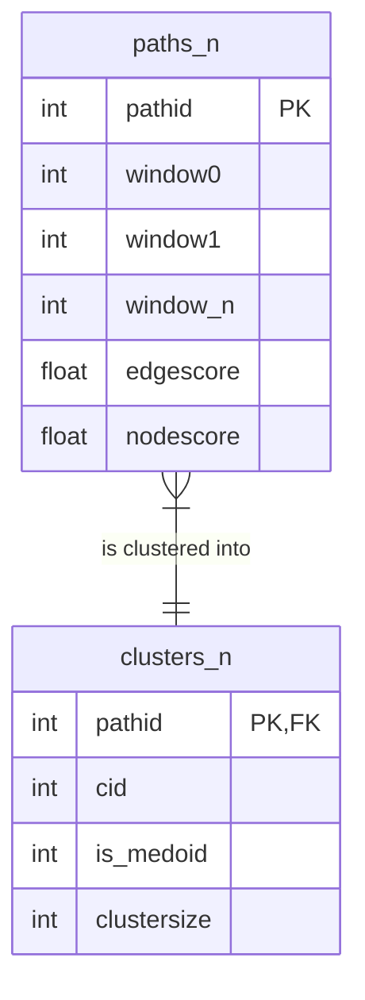

# Path Assembly and Clustering

> **Relevant source files**
> * [scripts/cluster_heuristic.py](https://github.com/kiharalab/idp_lzerd/blob/2d5565c2/scripts/cluster_heuristic.py)
> * [scripts/find_paths_stepwise.py](https://github.com/kiharalab/idp_lzerd/blob/2d5565c2/scripts/find_paths_stepwise.py)

The **Path Assembly and Clustering** stage is the combinatorial engine of IDP-LZerD. It transforms independent docking decoys from overlapping sequence windows into continuous, full-length structural models of the intrinsically disordered protein (IDP) bound to its receptor. This stage addresses the high dimensionality of IDP conformations by building paths incrementally and using heuristic clustering to maintain a manageable set of high-quality candidates.

### Process Overview

The assembly process follows a stepwise expansion strategy. Starting from the first two windows, the system identifies geometrically compatible fragment pairs and builds "paths." As each new window is added, the paths are extended, scored, and clustered to prevent an exponential explosion of possible combinations.

1. **Stepwise Construction**: Paths are built by joining a window $N$ to a previously assembled path of length $N-1$ based on geometric compatibility scores stored in the `modeldist` databases.
2. **Scoring**: Paths are evaluated using a combination of `nodescore` (internal fragment quality) and `edgescore` (geometric fit between adjacent fragments).
3. **Pruning via Clustering**: Because the number of possible paths grows exponentially, the pipeline performs clustering at every window addition. Only the "medoids" (representative models) of these clusters are typically used to extend paths further, significantly reducing the search space.

### System Entity Map

The following diagram illustrates how the path assembly logic interacts with the SQLite database infrastructure and the external clustering binaries.

**Sources:** [scripts/find_paths_stepwise.py L50-L135](https://github.com/kiharalab/idp_lzerd/blob/2d5565c2/scripts/find_paths_stepwise.py#L50-L135)

 [scripts/cluster_heuristic.py L96-L149](https://github.com/kiharalab/idp_lzerd/blob/2d5565c2/scripts/cluster_heuristic.py#L96-L149)

### Core Components

| Component | Code Entity | Responsibility |
| --- | --- | --- |
| **Path Builder** | `FindPathsStepwise` | Manages the loop from window 2 to $N$, calling path creation and clustering for each step. [scripts/find_paths_stepwise.py L50-L135](https://github.com/kiharalab/idp_lzerd/blob/2d5565c2/scripts/find_paths_stepwise.py#L50-L135) |
| **Heuristic Clusterer** | `ClusterPdb` | Manages the two-stage clustering (LB3Dclust for 10% sample, then RMSD assignment for the rest). [scripts/cluster_heuristic.py L96-L150](https://github.com/kiharalab/idp_lzerd/blob/2d5565c2/scripts/cluster_heuristic.py#L96-L150) |
| **Geometric Scoring** | `edgescore` | A pre-calculated metric in `modeldist` tables representing the spatial continuity between fragments. [scripts/find_paths_stepwise.py L59-L60](https://github.com/kiharalab/idp_lzerd/blob/2d5565c2/scripts/find_paths_stepwise.py#L59-L60) |
| **RMSD Calculator** | `ClusterLRMSD` | A NumPy-optimized class for calculating Ligand RMSD across thousands of paths simultaneously. [scripts/cluster_heuristic.py L41-L90](https://github.com/kiharalab/idp_lzerd/blob/2d5565c2/scripts/cluster_heuristic.py#L41-L90) |

### Data Flow and Database Schema

The assembly process relies heavily on SQLite for state management. The results are stored in `path_{complexid}_all.db`, which evolves as the IDP length increases.

**Sources:** [scripts/find_paths_stepwise.py L54-L63](https://github.com/kiharalab/idp_lzerd/blob/2d5565c2/scripts/find_paths_stepwise.py#L54-L63)

 [scripts/cluster_heuristic.py L125-L133](https://github.com/kiharalab/idp_lzerd/blob/2d5565c2/scripts/cluster_heuristic.py#L125-L133)

### Sub-pages

#### Stepwise Path Construction

Details the logic within `find_paths_stepwise.py`. This includes the `make_paths` function which uses SQL joins to find compatible fragment transitions and the `nodescore`/`edgescore` aggregation logic. It also explains the in-memory SQLite optimization used to speed up combinatorial joins.
*For details, see [Stepwise Path Construction](/kiharalab/idp_lzerd/5.1-stepwise-path-construction).*

#### Heuristic Clustering of Paths

Details the `cluster_heuristic.py` script. It explains why a 10% sampling strategy is used with the `LB3Dclust` binary and how the `ClusterLRMSD` class uses vectorized `numpy` operations to assign the remaining 90% of paths to the nearest cluster medoid based on structural similarity.
*For details, see [Heuristic Clustering of Paths](/kiharalab/idp_lzerd/5.2-heuristic-clustering-of-paths).*

**Sources:** [scripts/find_paths_stepwise.py L1-L40](https://github.com/kiharalab/idp_lzerd/blob/2d5565c2/scripts/find_paths_stepwise.py#L1-L40)

 [scripts/cluster_heuristic.py L1-L40](https://github.com/kiharalab/idp_lzerd/blob/2d5565c2/scripts/cluster_heuristic.py#L1-L40)