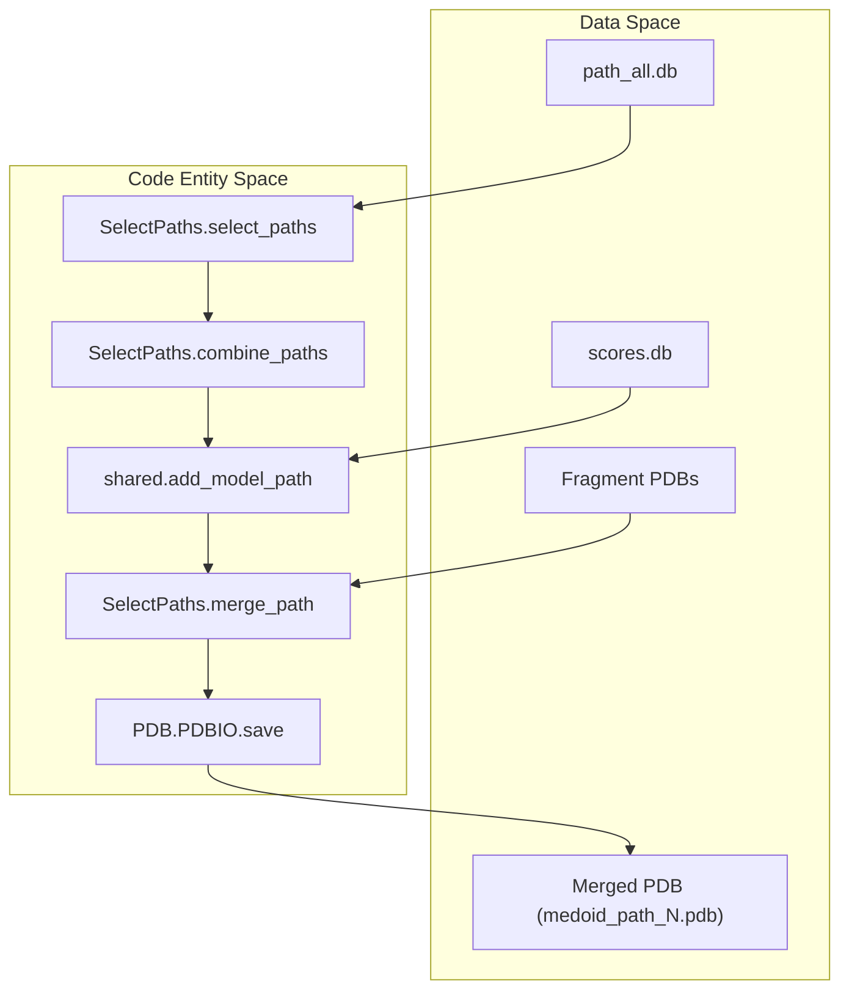

# Path Ranking and PDB Assembly

> **Relevant source files**
> * [scripts/combine_receptor.py](https://github.com/kiharalab/idp_lzerd/blob/2d5565c2/scripts/combine_receptor.py)
> * [scripts/select_paths.py](https://github.com/kiharalab/idp_lzerd/blob/2d5565c2/scripts/select_paths.py)
> * [scripts/shared.py](https://github.com/kiharalab/idp_lzerd/blob/2d5565c2/scripts/shared.py)

This stage represents the final selection and structural consolidation of the IDP-LZerD pipeline. It utilizes a multi-objective ranking system to identify the most biologically plausible binding poses from the assembled paths and merges the constituent fragments into full-length PDB models formatted for downstream refinement.

## Weighted Z-Score Ranking

The script `select_paths.py` implements a weighted Z-score ranking mechanism to select the top $N$ (default 100) paths for refinement [scripts/select_paths.py L51-L54](https://github.com/kiharalab/idp_lzerd/blob/2d5565c2/scripts/select_paths.py#L51-L54)

 This ranking combines four distinct metrics to balance local fragment fit, global path continuity, cluster density, and receptor interface preference.

### Scoring Components

The ranking is based on four primary scores defined in `neco_scores` [scripts/select_paths.py L38-L42](https://github.com/kiharalab/idp_lzerd/blob/2d5565c2/scripts/select_paths.py#L38-L42)

:

| Score Name | Source | Optimization Goal | Weight |
| --- | --- | --- | --- |
| `nodescore` | ITScore/GOAP/DFIRE | Minimize (lower is better) | 0.5 |
| `edgescores` | Geometric compatibility | Minimize (lower is better) | 0.1 |
| `clustersize` | Path clustering | Maximize (higher is better) | 0.3 |
| `occupancyscore` | Receptor contact density | Maximize (higher is better) | 0.1 |

### Calculation Implementation

The `SelectPaths.select_paths` function performs the following steps:

1. **Data Retrieval**: Fetches medoid paths from the `clusters{n}` and `paths{n}` tables in the `path_{complex}_all.db` database [scripts/select_paths.py L104-L113](https://github.com/kiharalab/idp_lzerd/blob/2d5565c2/scripts/select_paths.py#L104-L113)
2. **Occupancy Integration**: Merges the `occupancyscore` from the CSV generated in the previous step [scripts/select_paths.py L115-L124](https://github.com/kiharalab/idp_lzerd/blob/2d5565c2/scripts/select_paths.py#L115-L124)
3. **Z-Score Normalization**: Converts raw scores into Z-scores using `SelectPaths.zscore`. For scores where higher is better (clustersize, occupancy), the values are multiplied by -1 before Z-score calculation to unify the optimization direction [scripts/select_paths.py L130-L139](https://github.com/kiharalab/idp_lzerd/blob/2d5565c2/scripts/select_paths.py#L130-L139)
4. **Weighted Aggregation**: Calculates a final `weighted_score` by combining the best individual Z-score component (weighted by `b_weight` = 0.3) with the weighted sum of all components [scripts/select_paths.py L143-L147](https://github.com/kiharalab/idp_lzerd/blob/2d5565c2/scripts/select_paths.py#L143-L147)

**Sources:**

* [scripts/select_paths.py L37-L43](https://github.com/kiharalab/idp_lzerd/blob/2d5565c2/scripts/select_paths.py#L37-L43)  (Score definitions and weights)
* [scripts/select_paths.py L78-L154](https://github.com/kiharalab/idp_lzerd/blob/2d5565c2/scripts/select_paths.py#L78-L154)  (`select_paths` implementation)

## PDB Assembly and Residue Renumbering

Once paths are selected, `SelectPaths.combine_paths` orchestrates the construction of full-length PDB files by merging individual fragment models.

### Data Flow: Path to PDB

The following diagram illustrates how the system transitions from database path entries to a merged PDB structure.

**Path Assembly Logic**

**Sources:**

* [scripts/select_paths.py L160-L176](https://github.com/kiharalab/idp_lzerd/blob/2d5565c2/scripts/select_paths.py#L160-L176)  (`combine_paths` logic)
* [scripts/select_paths.py L202-L230](https://github.com/kiharalab/idp_lzerd/blob/2d5565c2/scripts/select_paths.py#L202-L230)  (`merge_path` implementation)
* [scripts/shared.py L246-L261](https://github.com/kiharalab/idp_lzerd/blob/2d5565c2/scripts/shared.py#L246-L261)  (`add_model_path` utility)

### Structural Merging (merge_path)

The `merge_path` function handles the physical concatenation of fragment coordinates [scripts/select_paths.py L202](https://github.com/kiharalab/idp_lzerd/blob/2d5565c2/scripts/select_paths.py#L202-L202)

 Key technical details include:

1. **Overlap Handling**: IDP fragments are generated with overlapping windows. For residues present in multiple windows, the coordinates are averaged to ensure a smooth transition [scripts/select_paths.py L218-L220](https://github.com/kiharalab/idp_lzerd/blob/2d5565c2/scripts/select_paths.py#L218-L220)
2. **Residue Renumbering**: Fragments are re-indexed to their global sequence positions using `window_starts` retrieved from the database [scripts/select_paths.py L179-L180](https://github.com/kiharalab/idp_lzerd/blob/2d5565c2/scripts/select_paths.py#L179-L180)
3. **Receptor Reintegration**: The script utilizes `CombineChain.undo` to restore the original receptor chain IDs and numbering from the `REMARK` metadata stored in the combined receptor file [scripts/select_paths.py L188-L198](https://github.com/kiharalab/idp_lzerd/blob/2d5565c2/scripts/select_paths.py#L188-L198)

**Sources:**

* [scripts/select_paths.py L202-L230](https://github.com/kiharalab/idp_lzerd/blob/2d5565c2/scripts/select_paths.py#L202-L230)  (`merge_path` logic)
* [scripts/combine_receptor.py L159-L182](https://github.com/kiharalab/idp_lzerd/blob/2d5565c2/scripts/combine_receptor.py#L159-L182)  (`CombineChain.undo` implementation)

## Output Layout for CHARMM Refinement

The final output is organized into a directory structure specifically formatted for the CHARMM relaxation stage. The script creates a directory named after the complex and window count (e.g., `4ah2a10`) [scripts/select_paths.py L70-L71](https://github.com/kiharalab/idp_lzerd/blob/2d5565c2/scripts/select_paths.py#L70-L71)

### File Layout

| File | Description |
| --- | --- |
| `path_scores.csv` | Ranked list of selected paths with their Z-scores [scripts/select_paths.py L152](https://github.com/kiharalab/idp_lzerd/blob/2d5565c2/scripts/select_paths.py#L152-L152) |
| `medoid_path_{N}.pdb` | Assembled IDP model (ligand only) for path index $N$ [scripts/select_paths.py L228](https://github.com/kiharalab/idp_lzerd/blob/2d5565c2/scripts/select_paths.py#L228-L228) |
| `complex_{N}.pdb` | The full complex (receptor + ligand) ready for CHARMM [scripts/select_paths.py L248-L251](https://github.com/kiharalab/idp_lzerd/blob/2d5565c2/scripts/select_paths.py#L248-L251) |
| `filelist.csv` | A manifest file used by the CHARMM relaxation scripts to iterate through models [scripts/select_paths.py L253-L257](https://github.com/kiharalab/idp_lzerd/blob/2d5565c2/scripts/select_paths.py#L253-L257) |

### CHARMM Compatibility

The assembly process ensures that the output PDBs are compatible with the `idp_relax.inp` CHARMM script by:

* Stripping hydrogens (re-added by CHARMM) [scripts/shared.py L181-L190](https://github.com/kiharalab/idp_lzerd/blob/2d5565c2/scripts/shared.py#L181-L190)
* Converting all filenames to lowercase, as CHARMM can be sensitive to mixed-case paths in certain environments [scripts/select_paths.py L98](https://github.com/kiharalab/idp_lzerd/blob/2d5565c2/scripts/select_paths.py#L98-L98)
* Providing the `filelist.csv` to facilitate batch processing of the top 100 models [scripts/select_paths.py L253](https://github.com/kiharalab/idp_lzerd/blob/2d5565c2/scripts/select_paths.py#L253-L253)

**Sources:**

* [scripts/select_paths.py L78-L100](https://github.com/kiharalab/idp_lzerd/blob/2d5565c2/scripts/select_paths.py#L78-L100)  (Directory setup)
* [scripts/select_paths.py L232-L262](https://github.com/kiharalab/idp_lzerd/blob/2d5565c2/scripts/select_paths.py#L232-L262)  (Final file writing)
* [scripts/shared.py L181-L190](https://github.com/kiharalab/idp_lzerd/blob/2d5565c2/scripts/shared.py#L181-L190)  (`strip_h` utility)