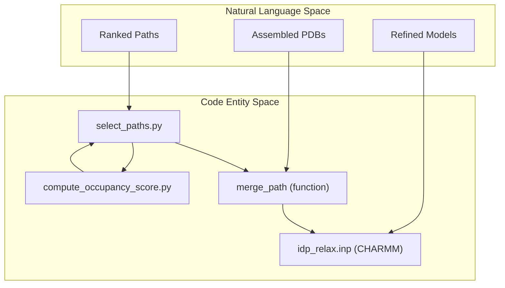
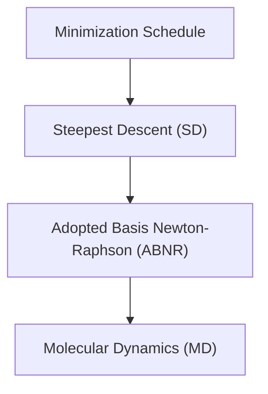

# Path Selection and Refinement

> **Relevant source files**
> * [idp_relax.inp](https://github.com/kiharalab/idp_lzerd/blob/2d5565c2/idp_relax.inp)
> * [scripts/compute_occupancy_score.py](https://github.com/kiharalab/idp_lzerd/blob/2d5565c2/scripts/compute_occupancy_score.py)
> * [scripts/select_paths.py](https://github.com/kiharalab/idp_lzerd/blob/2d5565c2/scripts/select_paths.py)

This stage represents the conclusion of the IDP-LZerD pipeline. After full-length paths have been assembled and clustered, the system must identify the most biologically plausible models, reconstruct their full atomic coordinates, and perform energy minimization to resolve steric clashes and refine interactions.

### Pipeline Integration

The refinement process bridges the gap between discrete fragment assembly and continuous structural biology models. It utilizes scoring metrics from the docking and path-finding stages, adds a global receptor occupancy metric, and applies the CHARMM force field for final relaxation.

**Sources:** [scripts/select_paths.py L1-L17](https://github.com/kiharalab/idp_lzerd/blob/2d5565c2/scripts/select_paths.py#L1-L17)

 [scripts/compute_occupancy_score.py L1-L17](https://github.com/kiharalab/idp_lzerd/blob/2d5565c2/scripts/compute_occupancy_score.py#L1-L17)

 [idp_relax.inp L1-L8](https://github.com/kiharalab/idp_lzerd/blob/2d5565c2/idp_relax.inp#L1-L8)

---

## 6.1 Receptor Occupancy Scoring

Before final selection, the system computes a "Receptor Occupancy Score." This metric identifies receptor residues that are frequently contacted by the medoid paths of the generated clusters.

* **Contact Counting**: The script uses `Bio.PDB.NeighborSearch` to identify contacts within a 5.0 Å cutoff between the IDP ligand and the receptor [scripts/compute_occupancy_score.py L120-L153](https://github.com/kiharalab/idp_lzerd/blob/2d5565c2/scripts/compute_occupancy_score.py#L120-L153)
* **Visualization**: Per-residue contact counts are mapped to the B-factor column of a receptor PDB file, allowing researchers to visualize "hotspots" of IDP interaction on the receptor surface [scripts/compute_occupancy_score.py L179-L181](https://github.com/kiharalab/idp_lzerd/blob/2d5565c2/scripts/compute_occupancy_score.py#L179-L181)
* **Scoring Integration**: These occupancy counts are exported to a CSV file and used as a weighted component in the final Z-score ranking [scripts/compute_occupancy_score.py L115-L121](https://github.com/kiharalab/idp_lzerd/blob/2d5565c2/scripts/compute_occupancy_score.py#L115-L121)

For details, see [Receptor Occupancy Scoring](/kiharalab/idp_lzerd/6.1-receptor-occupancy-scoring).

**Sources:** [scripts/compute_occupancy_score.py L103-L181](https://github.com/kiharalab/idp_lzerd/blob/2d5565c2/scripts/compute_occupancy_score.py#L103-L181)

---

## 6.2 Path Ranking and PDB Assembly

The `SelectPaths` class manages the transition from database entries to physical PDB files. It ranks the combinatorial paths using a composite Z-score and merges overlapping fragments into single continuous chains.

### Composite Z-Score Ranking

The system calculates a `weighted_score` by combining four primary metrics [scripts/select_paths.py L38-L47](https://github.com/kiharalab/idp_lzerd/blob/2d5565c2/scripts/select_paths.py#L38-L47)

:

1. **nodescore**: Sum of individual fragment docking scores.
2. **edgescores**: Sum of geometric compatibility scores between adjacent fragments.
3. **clustersize**: The number of paths represented by the cluster medoid.
4. **occupancyscore**: The global receptor contact frequency.

### PDB Merging Logic

The `merge_path` function assembles the full-length IDP ligand from individual window models. It handles residue re-numbering based on the original sequence and averages coordinates for overlapping residues between windows to ensure backbone continuity [scripts/select_paths.py L178-L185](https://github.com/kiharalab/idp_lzerd/blob/2d5565c2/scripts/select_paths.py#L178-L185)

For details, see [Path Ranking and PDB Assembly](/kiharalab/idp_lzerd/6.2-path-ranking-and-pdb-assembly).

**Sources:** [scripts/select_paths.py L37-L43](https://github.com/kiharalab/idp_lzerd/blob/2d5565c2/scripts/select_paths.py#L37-L43)

 [scripts/select_paths.py L104-L152](https://github.com/kiharalab/idp_lzerd/blob/2d5565c2/scripts/select_paths.py#L104-L152)

 [scripts/select_paths.py L160-L185](https://github.com/kiharalab/idp_lzerd/blob/2d5565c2/scripts/select_paths.py#L160-L185)

---

## 6.3 CHARMM Relaxation

The final step is structural refinement using the CHARMM27 force field. This process resolves unphysical geometries introduced during the fragment merging process.

* **Solvation**: The refinement uses the FACTS (Fast Analytical Continuum Treatment of Solvation) implicit solvation model [idp_relax.inp L42-L44](https://github.com/kiharalab/idp_lzerd/blob/2d5565c2/idp_relax.inp#L42-L44)
* **Constraints**: The receptor is typically kept fixed (`cons fix sele rec end`), while the IDP ligand is subjected to a decreasing harmonic constraint schedule (from 50.0 to 0.0 force constants) to allow for local structural adjustment without losing the predicted binding pose [idp_relax.inp L58-L88](https://github.com/kiharalab/idp_lzerd/blob/2d5565c2/idp_relax.inp#L58-L88)
* **MD Phase**: A brief 20,000-step (40 ps) MD simulation is performed to further explore the local energy landscape [idp_relax.inp L100-L109](https://github.com/kiharalab/idp_lzerd/blob/2d5565c2/idp_relax.inp#L100-L109)

For details, see [CHARMM Relaxation](/kiharalab/idp_lzerd/6.3-charmm-relaxation).

**Sources:** [idp_relax.inp L42-L44](https://github.com/kiharalab/idp_lzerd/blob/2d5565c2/idp_relax.inp#L42-L44)

 [idp_relax.inp L58-L88](https://github.com/kiharalab/idp_lzerd/blob/2d5565c2/idp_relax.inp#L58-L88)

 [idp_relax.inp L100-L110](https://github.com/kiharalab/idp_lzerd/blob/2d5565c2/idp_relax.inp#L100-L110)