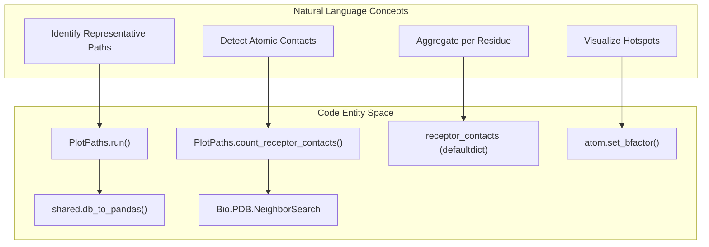
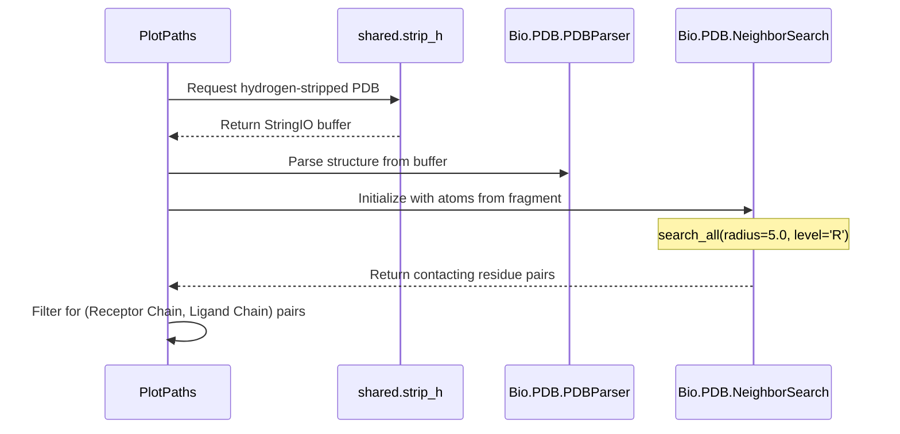

# Receptor Occupancy Scoring

> **Relevant source files**
> * [scripts/compute_occupancy_score.py](https://github.com/kiharalab/idp_lzerd/blob/2d5565c2/scripts/compute_occupancy_score.py)
> * [scripts/shared.py](https://github.com/kiharalab/idp_lzerd/blob/2d5565c2/scripts/shared.py)

Receptor Occupancy Scoring is a post-processing stage in the IDP-LZerD pipeline that quantifies the frequency with which specific receptor residues are contacted by the ensemble of predicted IDP binding paths. This analysis identifies "hotspots" on the receptor surface that are consistently occupied across top-ranked structural models. The implementation leverages `Bio.PDB` for spatial neighbor searches and outputs both raw occupancy data and B-factor-mapped PDB files for visual analysis in tools like PyMOL.

### Implementation Overview

The logic is encapsulated in the `PlotPaths` class within `scripts/compute_occupancy_score.py`. It processes medoid paths generated during the clustering stage, identifies interface residues, and aggregates contact counts.

#### Data Flow and Logic

1. **Path Retrieval**: The script queries the paths database to identify medoid paths (representative models for each cluster) using `shared.db_to_pandas` [scripts/compute_occupancy_score.py L80-L93](https://github.com/kiharalab/idp_lzerd/blob/2d5565c2/scripts/compute_occupancy_score.py#L80-L93)
2. **Contact Detection**: For each path, the script iterates through its constituent fragment models. It uses `Bio.PDB.NeighborSearch` to find all receptor atoms within a 5.0 Å cutoff of any ligand (IDP) atom [scripts/compute_occupancy_score.py L120-L154](https://github.com/kiharalab/idp_lzerd/blob/2d5565c2/scripts/compute_occupancy_score.py#L120-L154)
3. **Residue Mapping**: Contacts are mapped to specific receptor residues using a unique key consisting of the chain ID, residue name, and residue number [scripts/compute_occupancy_score.py L122-L125](https://github.com/kiharalab/idp_lzerd/blob/2d5565c2/scripts/compute_occupancy_score.py#L122-L125)
4. **Occupancy Calculation**: The occupancy score for a receptor residue is defined as the number of unique medoid paths that place at least one IDP atom within the distance cutoff of that residue [scripts/compute_occupancy_score.py L171-L179](https://github.com/kiharalab/idp_lzerd/blob/2d5565c2/scripts/compute_occupancy_score.py#L171-L179)
5. **B-factor Visualization**: The script generates a copy of the receptor PDB where the `bfactor` field of each atom is replaced by the occupancy score of its parent residue, allowing for heat-map visualization [scripts/compute_occupancy_score.py L180-L181](https://github.com/kiharalab/idp_lzerd/blob/2d5565c2/scripts/compute_occupancy_score.py#L180-L181)

#### Natural Language to Code Entity Mapping

The following diagram maps the conceptual steps of occupancy scoring to the specific classes and functions implemented in the codebase.

**Occupancy Scoring Logic Flow**

**Sources:** [scripts/compute_occupancy_score.py L67-L181](https://github.com/kiharalab/idp_lzerd/blob/2d5565c2/scripts/compute_occupancy_score.py#L67-L181)

 [scripts/shared.py L67-L79](https://github.com/kiharalab/idp_lzerd/blob/2d5565c2/scripts/shared.py#L67-L79)

### Key Functions and Classes

| Entity | Role |
| --- | --- |
| `PlotPaths` | Main class responsible for orchestrating data loading, contact counting, and PDB generation [scripts/compute_occupancy_score.py L46-L48](https://github.com/kiharalab/idp_lzerd/blob/2d5565c2/scripts/compute_occupancy_score.py#L46-L48) |
| `PlotPaths.run` | Class method that loads medoid path data and cluster sizes from the SQLite database [scripts/compute_occupancy_score.py L67-L100](https://github.com/kiharalab/idp_lzerd/blob/2d5565c2/scripts/compute_occupancy_score.py#L67-L100) |
| `PlotPaths.count_receptor_contacts` | Core computational loop. Performs spatial searches between receptor and IDP atoms [scripts/compute_occupancy_score.py L103-L181](https://github.com/kiharalab/idp_lzerd/blob/2d5565c2/scripts/compute_occupancy_score.py#L103-L181) |
| `shared.strip_h` | Utility used to remove hydrogens from PDB files before spatial searching to ensure consistent distance calculations [scripts/shared.py L181-L190](https://github.com/kiharalab/idp_lzerd/blob/2d5565c2/scripts/shared.py#L181-L190) |

### Spatial Search and Neighbor Detection

The script uses a radius-based search to determine if an IDP fragment is in contact with the receptor.

**NeighborSearch Integration**

**Sources:** [scripts/compute_occupancy_score.py L136-L160](https://github.com/kiharalab/idp_lzerd/blob/2d5565c2/scripts/compute_occupancy_score.py#L136-L160)

 [scripts/shared.py L181-L190](https://github.com/kiharalab/idp_lzerd/blob/2d5565c2/scripts/shared.py#L181-L190)

### Output Files

The execution of `compute_occupancy_score.py` produces two primary outputs in the model directory:

1. **`{complex}_path_contacts.pdb`**: A PDB file of the receptor where the B-factor column contains the occupancy count. High B-factors indicate residues that are frequently involved in the IDP interface [scripts/compute_occupancy_score.py L114-L115](https://github.com/kiharalab/idp_lzerd/blob/2d5565c2/scripts/compute_occupancy_score.py#L114-L115)
2. **`{complex}_receptor_occupancy.csv`**: A comma-separated file containing the raw occupancy counts per receptor residue for further statistical analysis [scripts/compute_occupancy_score.py L115](https://github.com/kiharalab/idp_lzerd/blob/2d5565c2/scripts/compute_occupancy_score.py#L115-L115)

**Sources:** [scripts/compute_occupancy_score.py L108-L118](https://github.com/kiharalab/idp_lzerd/blob/2d5565c2/scripts/compute_occupancy_score.py#L108-L118)