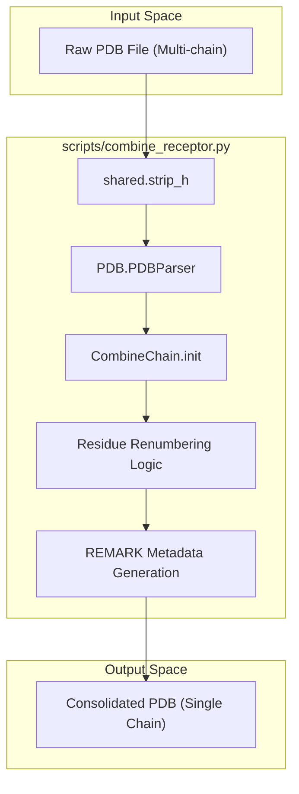
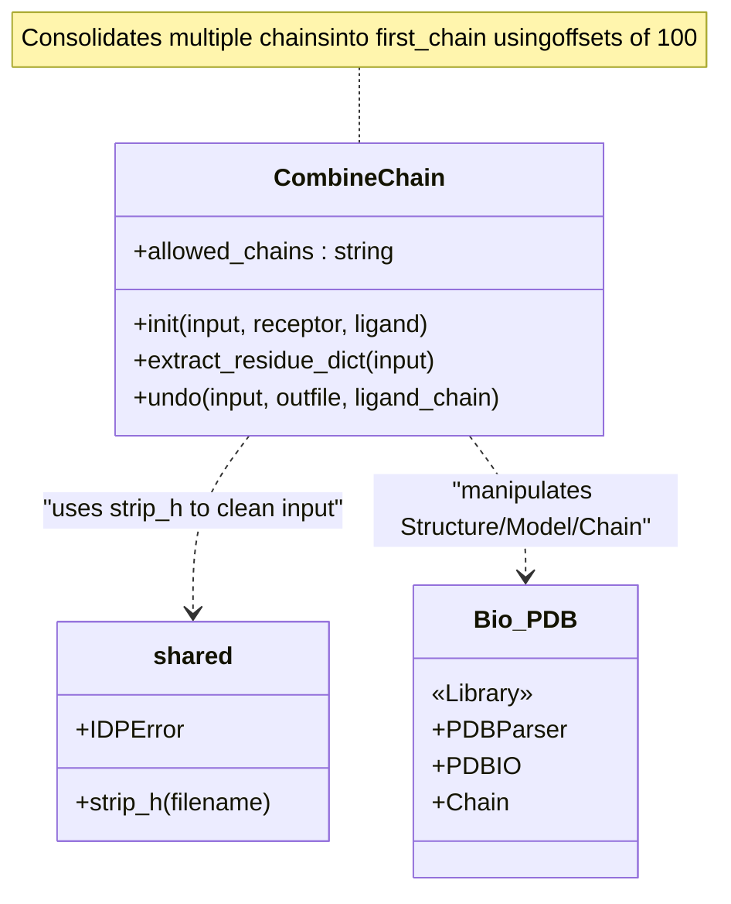

# Receptor Preprocessing: CombineChain

> **Relevant source files**
> - [scripts/combine\_receptor\.py](https://github.com/kiharalab/idp_lzerd/blob/2d5565c2/scripts/combine_receptor.py)
> - [scripts/shared\.py](https://github.com/kiharalab/idp_lzerd/blob/2d5565c2/scripts/shared.py)

 The `combine_receptor.py` script is a utility used to prepare multi\-chain receptor structures for docking within the IDP\-LZerD pipeline\. Because many docking algorithms \(such as LZerD or ZDOCK\) and downstream scoring tools expect a single receptor chain, this module provides a standardized method for consolidating multiple protein chains into a single logical entity while preserving the ability to map residues back to their original identifiers\.

### Purpose and Scope

 In IDP\-LZerD, the "receptor" is typically the ordered protein partner\. If this partner consists of multiple chains \(e\.g\., a dimer or a complex\), they must be merged into one chain to be processed as a single rigid body during fragment docking\. `combine_receptor.py` performs this consolidation by renumbering residues with large offsets and storing the original chain metadata in PDB `REMARK` lines [combine\_receptor\.py L139-L143](https://github.com/kiharalab/idp_lzerd/blob/2d5565c2/scripts/combine_receptor.py#L139-L143)\.

### Implementation Details

#### The CombineChain Class

 The core logic resides in the `CombineChain` class [combine\_receptor\.py L42-L144](https://github.com/kiharalab/idp_lzerd/blob/2d5565c2/scripts/combine_receptor.py#L42-L144)\. It utilizes `Bio.PDB` to manipulate the structural data\.

 1. **Hydrogen and Heteroatom Removal**: The script automatically strips hydrogens using `shared.strip_h` [combine\_receptor\.py L61](https://github.com/kiharalab/idp_lzerd/blob/2d5565c2/scripts/combine_receptor.py#L61-L61) and removes heteroatoms \(non\-protein residues\) from the chains [combine\_receptor\.py L91-L99](https://github.com/kiharalab/idp_lzerd/blob/2d5565c2/scripts/combine_receptor.py#L91-L99)\.
2. **Chain Selection**: Users specify which chains belong to the receptor and which \(if any\) is the ligand\. Any chains not specified in these sets are detached from the model [combine\_receptor\.py L88-L89](https://github.com/kiharalab/idp_lzerd/blob/2d5565c2/scripts/combine_receptor.py#L88-L89)\.
3. **Consolidation Strategy**: - The first receptor chain listed remains the "base" chain [combine\_receptor\.py L107-L108](https://github.com/kiharalab/idp_lzerd/blob/2d5565c2/scripts/combine_receptor.py#L107-L108)\. - Subsequent chains are appended to this base chain\. - To prevent residue ID collisions, an offset is calculated\. The script rounds the difference between the previous chain's end and the current chain's start up to the nearest 100 [combine\_receptor\.py L113-L116](https://github.com/kiharalab/idp_lzerd/blob/2d5565c2/scripts/combine_receptor.py#L113-L116)\. - Residues are renumbered by this offset and moved into the `first_chain` object [combine\_receptor\.py L120-L125](https://github.com/kiharalab/idp_lzerd/blob/2d5565c2/scripts/combine_receptor.py#L120-L125)\.

#### Metadata and Reversibility

 To ensure the process is reversible, the script writes `REMARK` lines to the top of the output PDB file\. These lines follow a specific schema: `REMARK RESIDUE={NewStart} CHAIN={OriginalChain} START={OriginalStart}` [combine\_receptor\.py L141](https://github.com/kiharalab/idp_lzerd/blob/2d5565c2/scripts/combine_receptor.py#L141-L141)\.

 The `undo` method [combine\_receptor\.py L160-L182](https://github.com/kiharalab/idp_lzerd/blob/2d5565c2/scripts/combine_receptor.py#L160-L182) and `extract_residue_dict` [combine\_receptor\.py L147-L157](https://github.com/kiharalab/idp_lzerd/blob/2d5565c2/scripts/combine_receptor.py#L147-L157) allow the system to reconstruct the original multi\-chain architecture from a consolidated file by parsing these REMARKs\.

### Data Flow: Receptor Consolidation

 The following diagram illustrates the transformation of a multi\-chain PDB into a consolidated single\-chain PDB suitable for docking\.

 **Receptor Chain Consolidation Workflow**

 **Sources:** [combine\_receptor\.py L46-L144](https://github.com/kiharalab/idp_lzerd/blob/2d5565c2/scripts/combine_receptor.py#L46-L144), [shared\.py L181-L190](https://github.com/kiharalab/idp_lzerd/blob/2d5565c2/scripts/shared.py#L181-L190)

### Code Entity Map

 This diagram bridges the functional concepts of receptor merging to the specific Python classes and methods implemented in the codebase\.

 **Entity Association Diagram**

 **Sources:** [combine\_receptor\.py L26-L29](https://github.com/kiharalab/idp_lzerd/blob/2d5565c2/scripts/combine_receptor.py#L26-L29), [combine\_receptor\.py L42-L45](https://github.com/kiharalab/idp_lzerd/blob/2d5565c2/scripts/combine_receptor.py#L42-L45), [combine\_receptor\.py L101-L127](https://github.com/kiharalab/idp_lzerd/blob/2d5565c2/scripts/combine_receptor.py#L101-L127), [shared\.py L181-L182](https://github.com/kiharalab/idp_lzerd/blob/2d5565c2/scripts/shared.py#L181-L182)

### Summary of Chain Offsets

 The renumbering logic ensures that residues from different original chains are easily distinguishable in the combined chain by creating large gaps in the residue sequence numbers\.

| Original Chain | Original Range | Offset Applied | New Range \(in Combined Chain\) |
| --- | --- | --- | --- |
| Chain A \(Base\) | 1 \- 150 | 0 | 1 \- 150 |
| Chain B | 1 \- 100 | 200 \(Ceil to 100s\) | 201 \- 300 |
| Chain C | 5 \- 50 | 400 \(Ceil to 100s\) | 405 \- 450 |

 **Sources:** [combine\_receptor\.py L109-L116](https://github.com/kiharalab/idp_lzerd/blob/2d5565c2/scripts/combine_receptor.py#L109-L116), [combine\_receptor\.py L121-L123](https://github.com/kiharalab/idp_lzerd/blob/2d5565c2/scripts/combine_receptor.py#L121-L123)

