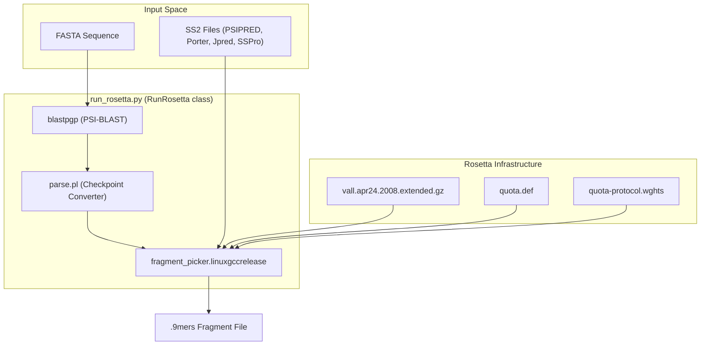

# Rosetta Fragment Picking

> **Relevant source files**
> * [scripts/parse.pl](https://github.com/kiharalab/idp_lzerd/blob/2d5565c2/scripts/parse.pl)
> * [scripts/rosetta_templates/quota-protocol.flags.template](https://github.com/kiharalab/idp_lzerd/blob/2d5565c2/scripts/rosetta_templates/quota-protocol.flags.template)
> * [scripts/rosetta_templates/quota-protocol.wghts](https://github.com/kiharalab/idp_lzerd/blob/2d5565c2/scripts/rosetta_templates/quota-protocol.wghts)
> * [scripts/rosetta_templates/quota.def](https://github.com/kiharalab/idp_lzerd/blob/2d5565c2/scripts/rosetta_templates/quota.def)
> * [scripts/run_rosetta.py](https://github.com/kiharalab/idp_lzerd/blob/2d5565c2/scripts/run_rosetta.py)

The Rosetta Fragment Picking stage is responsible for generating structural fragment candidates for the intrinsically disordered protein (IDP) sequence. It leverages evolutionary information via PSI-BLAST and secondary structure predictions from multiple sources (PSIPRED, Porter, Jpred, and SSPro) to select 9-mer fragments from the Rosetta `vall` database using a quota-based protocol.

## Implementation Overview

The process is orchestrated by the `RunRosetta` class in `run_rosetta.py`, which manages a multi-step workflow involving sequence profiling, checkpoint conversion, and the invocation of the Rosetta `fragment_picker` binary.

### Data Flow and Component Interaction

The following diagram illustrates the transition from sequence data and secondary structure predictions to the final `.9mers` fragment files.

**Fragment Picking Workflow**

**Sources:** [scripts/run_rosetta.py L39-L149](https://github.com/kiharalab/idp_lzerd/blob/2d5565c2/scripts/run_rosetta.py#L39-L149)

 [scripts/parse.pl L1-L33](https://github.com/kiharalab/idp_lzerd/blob/2d5565c2/scripts/parse.pl#L1-L33)

 [scripts/rosetta_templates/quota-protocol.flags.template L1-L37](https://github.com/kiharalab/idp_lzerd/blob/2d5565c2/scripts/rosetta_templates/quota-protocol.flags.template#L1-L37)

## Sequence Profiling and Checkpoint Conversion

Rosetta's fragment picker requires a sequence profile in a specific `.checkpoint` format. The pipeline generates this in two steps:

1. **PSI-BLAST Execution**: The `RunRosetta.run` method constructs a `blastpgp` command using parameters defined in `blastcmdfmt` [scripts/run_rosetta.py L42](https://github.com/kiharalab/idp_lzerd/blob/2d5565c2/scripts/run_rosetta.py#L42-L42)  This generates a binary `.chk` file and a `.pssm` file [scripts/run_rosetta.py L108-L110](https://github.com/kiharalab/idp_lzerd/blob/2d5565c2/scripts/run_rosetta.py#L108-L110)
2. **Checkpoint Parsing**: The binary `.chk` file is not directly readable by the Rosetta picker. The `scripts/parse.pl` script acts as a wrapper for Rosetta's `make_fragments.pl` utility. It calls `parse_checkpoint_file` and `finish_checkpoint_matrix` to convert the binary data into the plain-text `.checkpoint` format required by the `-in::file::checkpoint` flag [scripts/parse.pl L27-L33](https://github.com/kiharalab/idp_lzerd/blob/2d5565c2/scripts/parse.pl#L27-L33)  [scripts/rosetta_templates/quota-protocol.flags.template L11](https://github.com/kiharalab/idp_lzerd/blob/2d5565c2/scripts/rosetta_templates/quota-protocol.flags.template#L11-L11)

**Sources:** [scripts/run_rosetta.py L42-L43](https://github.com/kiharalab/idp_lzerd/blob/2d5565c2/scripts/run_rosetta.py#L42-L43)

 [scripts/run_rosetta.py L105-L113](https://github.com/kiharalab/idp_lzerd/blob/2d5565c2/scripts/run_rosetta.py#L105-L113)

 [scripts/parse.pl L20-L33](https://github.com/kiharalab/idp_lzerd/blob/2d5565c2/scripts/parse.pl#L20-L33)

## Quota Protocol Configuration

The pipeline uses a "Quota Protocol" to ensure that fragment selection is balanced across different secondary structure prediction methods.

### Quota Definition

The `quota.def` file specifies the fraction of fragments that should be picked based on each prediction method. By default, the four methods (PSIPRED, SSPro, Jpred, Porter) are given an equal share of 0.25 [scripts/rosetta_templates/quota.def L1-L5](https://github.com/kiharalab/idp_lzerd/blob/2d5565c2/scripts/rosetta_templates/quota.def#L1-L5)

### Scoring Weights

The `quota-protocol.wghts` file defines the priorities and weights for different scoring components used during picking:

* **SecondarySimilarity**: Compares the predicted secondary structure against the fragments in the `vall` database [scripts/rosetta_templates/quota-protocol.wghts L2-L5](https://github.com/kiharalab/idp_lzerd/blob/2d5565c2/scripts/rosetta_templates/quota-protocol.wghts#L2-L5)
* **RamaScore**: Evaluates the Ramachandran propensity [scripts/rosetta_templates/quota-protocol.wghts L6-L9](https://github.com/kiharalab/idp_lzerd/blob/2d5565c2/scripts/rosetta_templates/quota-protocol.wghts#L6-L9)
* **ProfileScoreL1**: Scores the sequence profile similarity [scripts/rosetta_templates/quota-protocol.wghts L11](https://github.com/kiharalab/idp_lzerd/blob/2d5565c2/scripts/rosetta_templates/quota-protocol.wghts#L11-L11)

**Sources:** [scripts/rosetta_templates/quota.def L1-L5](https://github.com/kiharalab/idp_lzerd/blob/2d5565c2/scripts/rosetta_templates/quota.def#L1-L5)

 [scripts/rosetta_templates/quota-protocol.wghts L1-L13](https://github.com/kiharalab/idp_lzerd/blob/2d5565c2/scripts/rosetta_templates/quota-protocol.wghts#L1-L13)

## Execution Details

The `RunRosetta.run` method performs the following environment setup before execution:

1. **Directory Structure**: Creates `input_files` and `output_files` subdirectories within the working directory [scripts/run_rosetta.py L82-L83](https://github.com/kiharalab/idp_lzerd/blob/2d5565c2/scripts/run_rosetta.py#L82-L83)
2. **Flag File Generation**: Populates the `quota-protocol.flags` file from a template, inserting paths for the `vall` database, secondary structure files, and the generated checkpoint [scripts/run_rosetta.py L124-L127](https://github.com/kiharalab/idp_lzerd/blob/2d5565c2/scripts/run_rosetta.py#L124-L127)
3. **Homolog Exclusion**: Generates a `.homolog_vall` file containing the query PDB ID to prevent picking fragments from the native structure itself [scripts/run_rosetta.py L120-L122](https://github.com/kiharalab/idp_lzerd/blob/2d5565c2/scripts/run_rosetta.py#L120-L122)  [scripts/rosetta_templates/quota-protocol.flags.template L37](https://github.com/kiharalab/idp_lzerd/blob/2d5565c2/scripts/rosetta_templates/quota-protocol.flags.template#L37-L37)
4. **Binary Invocation**: Executes `fragment_picker.linuxgccrelease` with the `@quota-protocol.flags` argument [scripts/run_rosetta.py L135-L141](https://github.com/kiharalab/idp_lzerd/blob/2d5565c2/scripts/run_rosetta.py#L135-L141)

### Code-to-System Mapping

The following diagram maps the high-level system operations to specific code entities and file interactions.

**System-to-Code Entity Mapping**

| System Component | Code Entity / File | Role |
| --- | --- | --- |
| **Orchestrator** | `RunRosetta.run` [scripts/run_rosetta.py L49](https://github.com/kiharalab/idp_lzerd/blob/2d5565c2/scripts/run_rosetta.py#L49-L49) | Manages subprocesses and file I/O |
| **Blast Config** | `blastcmdfmt` [scripts/run_rosetta.py L42](https://github.com/kiharalab/idp_lzerd/blob/2d5565c2/scripts/run_rosetta.py#L42-L42) | Template for PSI-BLAST command line |
| **Checkpoint Converter** | `parse.pl` [scripts/parse.pl L1](https://github.com/kiharalab/idp_lzerd/blob/2d5565c2/scripts/parse.pl#L1-L1) | Perl wrapper for Rosetta checkpoint logic |
| **Rosetta Picker** | `fragment_picker.linuxgccrelease` | Binary that performs fragment selection |
| **Flags Template** | `quota-protocol.flags.template` | Blueprint for Rosetta picker arguments |

**Sources:** [scripts/run_rosetta.py L39-L149](https://github.com/kiharalab/idp_lzerd/blob/2d5565c2/scripts/run_rosetta.py#L39-L149)

 [scripts/parse.pl L1-L33](https://github.com/kiharalab/idp_lzerd/blob/2d5565c2/scripts/parse.pl#L1-L33)

 [scripts/rosetta_templates/quota-protocol.flags.template L1-L37](https://github.com/kiharalab/idp_lzerd/blob/2d5565c2/scripts/rosetta_templates/quota-protocol.flags.template#L1-L37)