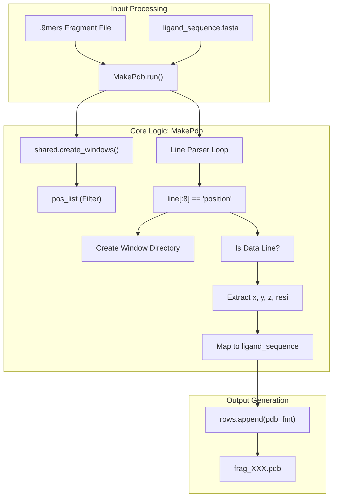
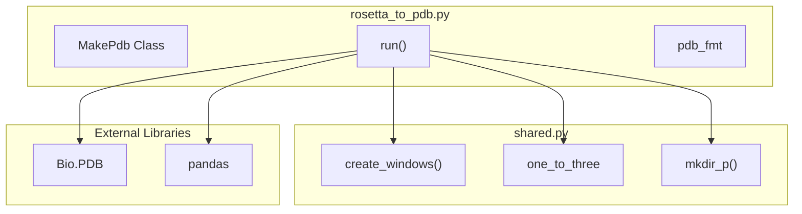

# Rosetta-to-PDB Conversion

> **Relevant source files**
> * [scripts/rosetta_to_pdb.py](https://github.com/kiharalab/idp_lzerd/blob/2d5565c2/scripts/rosetta_to_pdb.py)
> * [scripts/shared.py](https://github.com/kiharalab/idp_lzerd/blob/2d5565c2/scripts/shared.py)

The `rosetta_to_pdb.py` script serves as the bridge between Rosetta's fragment picking output and the downstream docking pipeline. It parses the `.9mers` (or similar) fragment files generated by Rosetta, extracts the backbone coordinates, and converts them into individual PDB files organized by sequence window.

## Overview and Purpose

Rosetta's `fragment_picker` outputs a flat text file containing structural candidates for overlapping segments of the IDP sequence. To use these fragments in docking tools like LZerD or ZDOCK, they must be converted into standard PDB format. `rosetta_to_pdb.py` performs this transformation while enforcing the sliding window logic defined in the pipeline configuration [scripts/rosetta_to_pdb.py L64-L71](https://github.com/kiharalab/idp_lzerd/blob/2d5565c2/scripts/rosetta_to_pdb.py#L64-L71)

### Key Responsibilities

* **Window Management**: Invokes `shared.create_windows` to determine which sequence positions require fragment PDBs [scripts/rosetta_to_pdb.py L69-L70](https://github.com/kiharalab/idp_lzerd/blob/2d5565c2/scripts/rosetta_to_pdb.py#L69-L70)
* **Coordinate Extraction**: Parses Rosetta fragment lines to extract Cartesian coordinates (X, Y, Z) and residue identities [scripts/rosetta_to_pdb.py L107-L129](https://github.com/kiharalab/idp_lzerd/blob/2d5565c2/scripts/rosetta_to_pdb.py#L107-L129)
* **Hierarchy Creation**: Generates a directory for each window position (e.g., `1/`, `7/`, `13/`) and populates them with `frag_XXX.pdb` files [scripts/rosetta_to_pdb.py L85-L99](https://github.com/kiharalab/idp_lzerd/blob/2d5565c2/scripts/rosetta_to_pdb.py#L85-L99)
* **Sequence Mapping**: Uses the provided FASTA file to ensure the residue names in the PDB match the target ligand sequence, rather than the source protein from which the fragment was derived [scripts/rosetta_to_pdb.py L116-L123](https://github.com/kiharalab/idp_lzerd/blob/2d5565c2/scripts/rosetta_to_pdb.py#L116-L123)

**Sources:** [scripts/rosetta_to_pdb.py L1-L131](https://github.com/kiharalab/idp_lzerd/blob/2d5565c2/scripts/rosetta_to_pdb.py#L1-L131)

 [scripts/shared.py L192-L199](https://github.com/kiharalab/idp_lzerd/blob/2d5565c2/scripts/shared.py#L192-L199)

## Data Flow: From Fragment File to PDB

The following diagram illustrates how the `MakePdb` class processes the Rosetta input file into the filesystem structure required for docking.

### Fragment Parsing Logic

"Natural Language Space" to "Code Entity Space" mapping:

**Sources:** [scripts/rosetta_to_pdb.py L64-L131](https://github.com/kiharalab/idp_lzerd/blob/2d5565c2/scripts/rosetta_to_pdb.py#L64-L131)

 [scripts/shared.py L230-L244](https://github.com/kiharalab/idp_lzerd/blob/2d5565c2/scripts/shared.py#L230-L244)

## The MakePdb Class

The `MakePdb` class handles the heavy lifting of string formatting and coordinate mapping. It uses a predefined PDB template to ensure consistency across all generated models.

### PDB Formatting

The class defines `pdb_fmt` and `pdb_default` to construct standard `ATOM` records. It specifically focuses on generating **CA-only** models or full backbone models based on the Rosetta input, though the default template provided in the code initializes with `CA` atom names [scripts/rosetta_to_pdb.py L44-L61](https://github.com/kiharalab/idp_lzerd/blob/2d5565c2/scripts/rosetta_to_pdb.py#L44-L61)

### Implementation Details

| Feature | Implementation |
| --- | --- |
| **Residue Translation** | Converts 1-letter FASTA codes to 3-letter PDB codes using `shared.one_to_three` [scripts/rosetta_to_pdb.py L123](https://github.com/kiharalab/idp_lzerd/blob/2d5565c2/scripts/rosetta_to_pdb.py#L123-L123) |
| **Window Filtering** | Only processes positions that exist in the `pos_list` generated by `shared.create_windows` [scripts/rosetta_to_pdb.py L87-L89](https://github.com/kiharalab/idp_lzerd/blob/2d5565c2/scripts/rosetta_to_pdb.py#L87-L89) |
| **PDB Metadata** | Prepends a `HEADER` line to each PDB containing the source PDB ID from which the fragment was picked [scripts/rosetta_to_pdb.py L111](https://github.com/kiharalab/idp_lzerd/blob/2d5565c2/scripts/rosetta_to_pdb.py#L111-L111) |
| **Atom Numbering** | Automatically increments residue and atom IDs based on the window's starting position in the query sequence [scripts/rosetta_to_pdb.py L121-L130](https://github.com/kiharalab/idp_lzerd/blob/2d5565c2/scripts/rosetta_to_pdb.py#L121-L130) |

**Sources:** [scripts/rosetta_to_pdb.py L42-L131](https://github.com/kiharalab/idp_lzerd/blob/2d5565c2/scripts/rosetta_to_pdb.py#L42-L131)

 [scripts/shared.py L198-L199](https://github.com/kiharalab/idp_lzerd/blob/2d5565c2/scripts/shared.py#L198-L199)

## Handling Sequence Truncation

A specific edge case occurs at the C-terminus of the IDP. If the final window does not align perfectly with the standard step size (typically 6 residues), the script performs a truncation step using `Bio.PDB` [scripts/rosetta_to_pdb.py L133-L165](https://github.com/kiharalab/idp_lzerd/blob/2d5565c2/scripts/rosetta_to_pdb.py#L133-L165)

### Truncation Workflow

1. **Identify Last Position**: Determines the final entry in `pos_file_dict` [scripts/rosetta_to_pdb.py L132-L133](https://github.com/kiharalab/idp_lzerd/blob/2d5565c2/scripts/rosetta_to_pdb.py#L132-L133)
2. **Calculate Offset**: If the position is not a standard start (e.g., `last_pos % 6 != 1`), it calculates the `new_start` from the window dataframe [scripts/rosetta_to_pdb.py L137-L142](https://github.com/kiharalab/idp_lzerd/blob/2d5565c2/scripts/rosetta_to_pdb.py#L137-L142)
3. **Structure Manipulation**: * Loads the fragment using `PDB.PDBParser` [scripts/rosetta_to_pdb.py L138](https://github.com/kiharalab/idp_lzerd/blob/2d5565c2/scripts/rosetta_to_pdb.py#L138-L138) * Calculates a `residue_remove_slice` to trim leading residues [scripts/rosetta_to_pdb.py L149](https://github.com/kiharalab/idp_lzerd/blob/2d5565c2/scripts/rosetta_to_pdb.py#L149-L149) * Uses `chain.detach_child` to remove residues that fall outside the target window [scripts/rosetta_to_pdb.py L158-L159](https://github.com/kiharalab/idp_lzerd/blob/2d5565c2/scripts/rosetta_to_pdb.py#L158-L159)
4. **Directory Cleanup**: Saves the new PDBs to the corrected directory and removes the temporary `last_pos_dir` [scripts/rosetta_to_pdb.py L163-L165](https://github.com/kiharalab/idp_lzerd/blob/2d5565c2/scripts/rosetta_to_pdb.py#L163-L165)

### Entity Association Diagram

**Sources:** [scripts/rosetta_to_pdb.py L133-L165](https://github.com/kiharalab/idp_lzerd/blob/2d5565c2/scripts/rosetta_to_pdb.py#L133-L165)

 [scripts/shared.py L230-L244](https://github.com/kiharalab/idp_lzerd/blob/2d5565c2/scripts/shared.py#L230-L244)