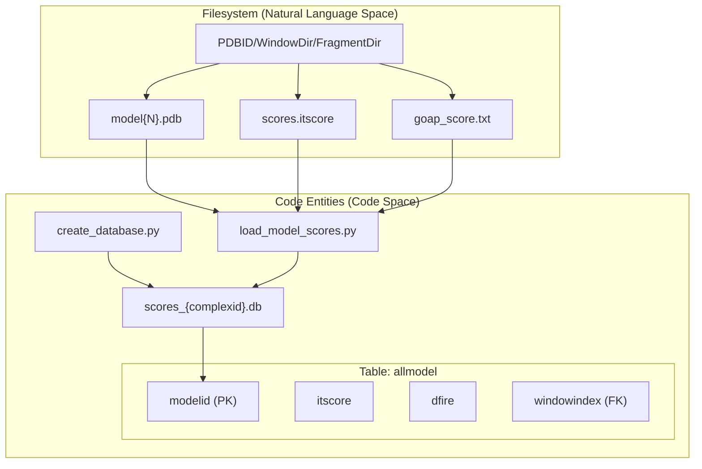
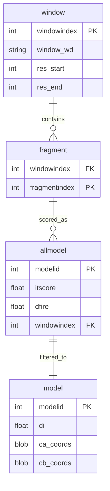

# Scoring and Database Management

> **Relevant source files**
> * [scripts/create_database.py](https://github.com/kiharalab/idp_lzerd/blob/2d5565c2/scripts/create_database.py)
> * [scripts/load_model_scores.py](https://github.com/kiharalab/idp_lzerd/blob/2d5565c2/scripts/load_model_scores.py)

This stage of the IDP-LZerD pipeline handles the ingestion of docking results, their normalization through composite scoring, and the storage of geometric data in SQLite databases. The system transitions from a file-based hierarchy of docking decoys to a relational structure that enables efficient path-finding and clustering.

### Database Infrastructure

The pipeline uses SQLite to manage the massive number of decoys generated during the docking phase. A central database, typically named `scores_{complexid}.db`, serves as the primary repository for fragment metadata and scoring metrics [scripts/create_database.py L62-L63](https://github.com/kiharalab/idp_lzerd/blob/2d5565c2/scripts/create_database.py#L62-L63)

The database is structured around two primary relational entities:

1. **Windows**: Representing the overlapping segments of the IDP sequence [scripts/create_database.py L29-L39](https://github.com/kiharalab/idp_lzerd/blob/2d5565c2/scripts/create_database.py#L29-L39)
2. **Fragments**: Representing the specific Rosetta-generated structural fragments used for docking within each window [scripts/create_database.py L41-L49](https://github.com/kiharalab/idp_lzerd/blob/2d5565c2/scripts/create_database.py#L41-L49)

For details on the schema and how the filesystem is ingested, see [Database Schema and Initialization](/kiharalab/idp_lzerd/4.1-database-schema-and-initialization).

### Scoring and Geometric Filtering

Once the database is initialized, the pipeline evaluates the docking decoys using a combination of physics-based and statistical potentials.

#### Composite Scoring ($d_i$)

The system calculates a composite score, $d_i$, by scaling and combining multiple scoring functions, primarily **ITScore** and **DFIRE** (extracted from GOAP outputs) [scripts/load_model_scores.py L104-L118](https://github.com/kiharalab/idp_lzerd/blob/2d5565c2/scripts/load_model_scores.py#L104-L118)

 This composite metric is used to rank and select the top candidates (defaulting to 4,500 models per window) for further analysis [scripts/load_model_scores.py L136-L170](https://github.com/kiharalab/idp_lzerd/blob/2d5565c2/scripts/load_model_scores.py#L136-L170)

#### Geometric Compatibility

To ensure that fragments can be realistically assembled into a continuous IDP chain, the pipeline computes geometric constraints between adjacent windows. This involves:

* **Virtual CB Generation**: Calculating $C\beta$ positions for Glycine residues to standardize distance calculations [scripts/load_model_scores.py L255-L274](https://github.com/kiharalab/idp_lzerd/blob/2d5565c2/scripts/load_model_scores.py#L255-L274)
* **ModelDist Pipeline**: Storing pairwise distances and orientation vectors (e.g., `vector_cosine`, `mpdist`) to validate the transition from one window to the next [scripts/load_model_scores.py L68-L70](https://github.com/kiharalab/idp_lzerd/blob/2d5565c2/scripts/load_model_scores.py#L68-L70)

For a deep dive into scoring algorithms and geometric filtering, see [Model Scoring and Geometric Filtering](/kiharalab/idp_lzerd/4.2-model-scoring-and-geometric-filtering).

### Data Flow Overview

The following diagram illustrates how the `create_database.py` and `load_model_scores.py` scripts transform raw decoy files into a structured relational format.

**Docking to Database Ingestion Flow**

**Sources:** [scripts/create_database.py L58-L107](https://github.com/kiharalab/idp_lzerd/blob/2d5565c2/scripts/create_database.py#L58-L107)

 [scripts/load_model_scores.py L39-L54](https://github.com/kiharalab/idp_lzerd/blob/2d5565c2/scripts/load_model_scores.py#L39-L54)

 [scripts/load_model_scores.py L93-L131](https://github.com/kiharalab/idp_lzerd/blob/2d5565c2/scripts/load_model_scores.py#L93-L131)

### Relational Mapping of Docking Decoys

The system maps the hierarchical directory structure created during docking into a relational schema to facilitate complex SQL queries during path assembly.

| Code Entity | Database Table | Purpose |
| --- | --- | --- |
| `window_row` | `window` | Stores sequence boundaries (`res_start`, `res_end`) and directory paths. |
| `fragment_row` | `fragment` | Links specific Rosetta fragments to their parent windows. |
| `modelrows` | `allmodel` | Stores raw ITScore and DFIRE values for every decoy. |
| `insert_rows` | `model` | Stores the final selected top-N decoys with $C\alpha$ and $C\beta$ coordinates. |

**Database Entity Relationship**

**Sources:** [scripts/create_database.py L29-L49](https://github.com/kiharalab/idp_lzerd/blob/2d5565c2/scripts/create_database.py#L29-L49)

 [scripts/load_model_scores.py L39-L54](https://github.com/kiharalab/idp_lzerd/blob/2d5565c2/scripts/load_model_scores.py#L39-L54)

 [scripts/load_model_scores.py L132-L178](https://github.com/kiharalab/idp_lzerd/blob/2d5565c2/scripts/load_model_scores.py#L132-L178)

---

### Child Pages

* [Database Schema and Initialization](/kiharalab/idp_lzerd/4.1-database-schema-and-initialization)
* [Model Scoring and Geometric Filtering](/kiharalab/idp_lzerd/4.2-model-scoring-and-geometric-filtering)