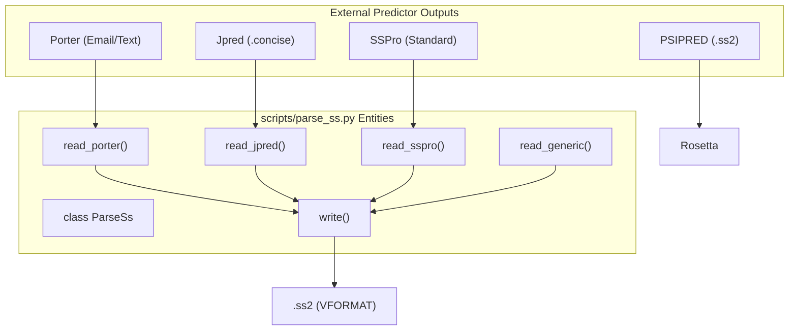
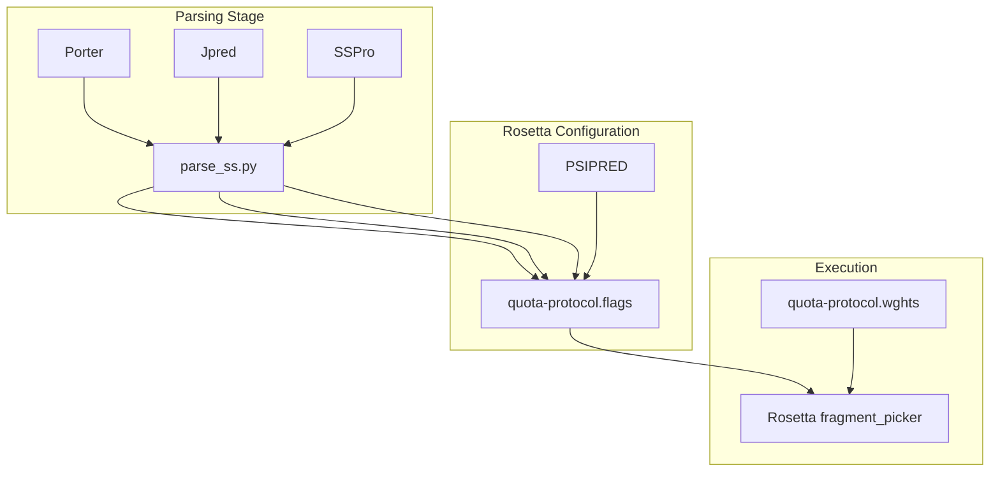

# Secondary Structure Prediction Parsing

> **Relevant source files**
> * [scripts/parse_ss.py](https://github.com/kiharalab/idp_lzerd/blob/2d5565c2/scripts/parse_ss.py)
> * [scripts/rosetta_templates/quota-protocol.flags.template](https://github.com/kiharalab/idp_lzerd/blob/2d5565c2/scripts/rosetta_templates/quota-protocol.flags.template)
> * [scripts/rosetta_templates/quota-protocol.wghts](https://github.com/kiharalab/idp_lzerd/blob/2d5565c2/scripts/rosetta_templates/quota-protocol.wghts)
> * [scripts/rosetta_templates/quota.def](https://github.com/kiharalab/idp_lzerd/blob/2d5565c2/scripts/rosetta_templates/quota.def)

The `parse_ss.py` script is a utility within the IDP-LZerD pipeline designed to normalize disparate secondary structure prediction formats into a unified format compatible with the Rosetta `fragment_picker`. Rosetta's quota-protocol requires specific `.ss2` (PSIPRED VFORMAT) files to calculate `SecondarySimilarity` and `RamaScore` weights during fragment generation [scripts/rosetta_templates/quota-protocol.wghts L1-L9](https://github.com/kiharalab/idp_lzerd/blob/2d5565c2/scripts/rosetta_templates/quota-protocol.wghts#L1-L9)

## Overview and Implementation

The script implements a dispatcher pattern via the `ParseSs` class to handle outputs from four major secondary structure predictors: **PSIPRED**, **Porter**, **Jpred**, and **SSPro** [scripts/parse_ss.py L33-L47](https://github.com/kiharalab/idp_lzerd/blob/2d5565c2/scripts/parse_ss.py#L33-L47)

The core objective is to map various prediction symbols (e.g., `-` for coil in Jpred) to the standard three-state classification:

* **H**: Alpha-helix
* **E**: Beta-sheet
* **C**: Coil (Loop)

### System Entity Mapping

The following diagram bridges the script's logic to the external predictor formats it consumes.

**Predictor to Parser Mapping**



Sources: [scripts/parse_ss.py L66-L195](https://github.com/kiharalab/idp_lzerd/blob/2d5565c2/scripts/parse_ss.py#L66-L195)

 [scripts/rosetta_templates/quota-protocol.flags.template L13](https://github.com/kiharalab/idp_lzerd/blob/2d5565c2/scripts/rosetta_templates/quota-protocol.flags.template#L13-L13)

## Data Normalization Logic

Because some predictors only provide the secondary structure state without confidence scores for all three states (H, E, C), `parse_ss.py` applies a default frequency distribution for these cases.

### Confidence Score Assignment

When a predictor does not provide explicit probabilities, the `ss_freq` method assigns a probability of **0.67** to the predicted state and **0.15** to the remaining two states [scripts/parse_ss.py L40-L42](https://github.com/kiharalab/idp_lzerd/blob/2d5565c2/scripts/parse_ss.py#L40-L42)

### Predictor-Specific Parsing Details

| Predictor | Method Name | Logic Summary |
| --- | --- | --- |
| **Porter** | `read_porter` | Parses text where sequence and prediction lines are interleaved. Validates against `aa_set` and `pred_set` [scripts/parse_ss.py L66-L85](https://github.com/kiharalab/idp_lzerd/blob/2d5565c2/scripts/parse_ss.py#L66-L85) |
| **Jpred** | `read_jpred` | Parses `.concise` CSV-style output. Maps `JNETPROPE`, `JNETPROPH`, and `JNETPROPC` to E, H, and C scores respectively [scripts/parse_ss.py L101-L123](https://github.com/kiharalab/idp_lzerd/blob/2d5565c2/scripts/parse_ss.py#L101-L123) |
| **SSPro** | `read_sspro` | Scans for "Amino Acids:" and "Predicted Secondary Structure" headers to extract strings [scripts/parse_ss.py L169-L182](https://github.com/kiharalab/idp_lzerd/blob/2d5565c2/scripts/parse_ss.py#L169-L182) |
| **Generic** | `read_generic` | A fallback parser that assumes the first non-comment line is the sequence and the second is the prediction [scripts/parse_ss.py L139-L152](https://github.com/kiharalab/idp_lzerd/blob/2d5565c2/scripts/parse_ss.py#L139-L152) |

Sources: [scripts/parse_ss.py L35-L42](https://github.com/kiharalab/idp_lzerd/blob/2d5565c2/scripts/parse_ss.py#L35-L42)

 [scripts/parse_ss.py L66-L195](https://github.com/kiharalab/idp_lzerd/blob/2d5565c2/scripts/parse_ss.py#L66-L195)

## Output Format (PSIPRED VFORMAT)

The normalized output follows the PSIPRED `.ss2` format, which is a fixed-width text file required by Rosetta. The `fmt_str` defines the structure [scripts/parse_ss.py L35](https://github.com/kiharalab/idp_lzerd/blob/2d5565c2/scripts/parse_ss.py#L35-L35)

:
`{index: >4} {aa} {ss}   {C:.3f}  {H:.3f}  {E:.3f}`

**Example Output Line:**

```
1 M C   0.670  0.150  0.150
```

## Integration with Rosetta Fragment Picking

The output of `parse_ss.py` is consumed by the Rosetta `fragment_picker` via the `quota-protocol.flags` file. The pipeline is configured to give equal weight (25% each) to all four predictors in the `quota.def` configuration [scripts/rosetta_templates/quota.def L1-L5](https://github.com/kiharalab/idp_lzerd/blob/2d5565c2/scripts/rosetta_templates/quota.def#L1-L5)

**Data Flow into Rosetta**



Sources: [scripts/rosetta_templates/quota-protocol.flags.template L13](https://github.com/kiharalab/idp_lzerd/blob/2d5565c2/scripts/rosetta_templates/quota-protocol.flags.template#L13-L13)

 [scripts/rosetta_templates/quota-protocol.wghts L1-L9](https://github.com/kiharalab/idp_lzerd/blob/2d5565c2/scripts/rosetta_templates/quota-protocol.wghts#L1-L9)

 [scripts/rosetta_templates/quota.def L1-L5](https://github.com/kiharalab/idp_lzerd/blob/2d5565c2/scripts/rosetta_templates/quota.def#L1-L5)