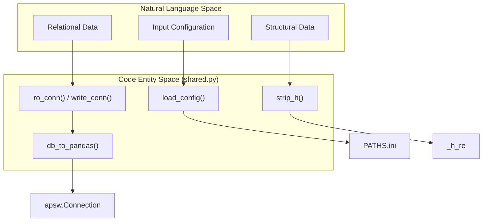

# Shared Utilities and Infrastructure

> **Relevant source files**
> * [PATHS.ini](https://github.com/kiharalab/idp_lzerd/blob/2d5565c2/PATHS.ini)
> * [scripts/shared.py](https://github.com/kiharalab/idp_lzerd/blob/2d5565c2/scripts/shared.py)

The `shared.py` module serves as the central utility library for the IDP-LZerD pipeline. it provides standardized interfaces for database management via SQLite/APSW, filesystem operations, PDB file preprocessing, and environment configuration validation. By centralizing these tasks, the pipeline ensures consistent data handling across the various stages of fragment generation, docking, and path assembly.

### Core Architecture and Data Flow

The infrastructure is designed to bridge the gap between raw biological data (PDB files, scoring outputs) and a relational data model managed through SQLite.

#### Natural Language to Code Entity Mapping: Infrastructure

| System Concept | Code Entity | File Reference |
| --- | --- | --- |
| **Database Connection** | `ro_conn`, `write_conn`, `new_conn` | [scripts/shared.py L40-L66](https://github.com/kiharalab/idp_lzerd/blob/2d5565c2/scripts/shared.py#L40-L66) |
| **SQL Helper** | `create_insert_statement`, `create_update_statement` | [scripts/shared.py L97-L136](https://github.com/kiharalab/idp_lzerd/blob/2d5565c2/scripts/shared.py#L97-L136) |
| **PDB Cleaner** | `strip_h` | [scripts/shared.py L181-L190](https://github.com/kiharalab/idp_lzerd/blob/2d5565c2/scripts/shared.py#L181-L190) |
| **Environment Config** | `load_config` | [scripts/shared.py L270-L286](https://github.com/kiharalab/idp_lzerd/blob/2d5565c2/scripts/shared.py#L270-L286) |
| **Window Logic** | `create_windows` | [scripts/shared.py L289-L305](https://github.com/kiharalab/idp_lzerd/blob/2d5565c2/scripts/shared.py#L289-L305) |



**Sources:** [scripts/shared.py L1-L305](https://github.com/kiharalab/idp_lzerd/blob/2d5565c2/scripts/shared.py#L1-L305)

 [PATHS.ini L1-L5](https://github.com/kiharalab/idp_lzerd/blob/2d5565c2/PATHS.ini#L1-L5)

---

### Database Management and SQL Helpers

IDP-LZerD utilizes `apsw` (Another Python SQLite Wrapper) for database interactions. The module provides context managers to ensure connections are properly opened and closed, preventing database locks during parallel processing.

* **Connection Contexts**: `ro_conn` (read-only) [scripts/shared.py L40-L47](https://github.com/kiharalab/idp_lzerd/blob/2d5565c2/scripts/shared.py#L40-L47)  `write_conn` (read-write) [scripts/shared.py L49-L56](https://github.com/kiharalab/idp_lzerd/blob/2d5565c2/scripts/shared.py#L49-L56)  and `new_conn` (create/write) [scripts/shared.py L58-L65](https://github.com/kiharalab/idp_lzerd/blob/2d5565c2/scripts/shared.py#L58-L65)  wrap `apsw.Connection` with specific flags.
* **Pandas Integration**: The `db_to_pandas` and `conn_to_pandas` functions facilitate the conversion of SQL query results directly into DataFrames for statistical analysis [scripts/shared.py L67-L96](https://github.com/kiharalab/idp_lzerd/blob/2d5565c2/scripts/shared.py#L67-L96)
* **Statement Builders**: To avoid manual string formatting, `create_insert_statement` and `create_update_statement` dynamically generate SQL strings based on table names and column lists [scripts/shared.py L97-L136](https://github.com/kiharalab/idp_lzerd/blob/2d5565c2/scripts/shared.py#L97-L136)

**Sources:** [scripts/shared.py L40-L136](https://github.com/kiharalab/idp_lzerd/blob/2d5565c2/scripts/shared.py#L40-L136)

---

### Structural Data Preprocessing

The pipeline requires specific PDB formats for different docking and scoring tools.

#### PDB Hydrogen Stripping

The `strip_h` function uses a compiled regular expression `_h_re` to identify and remove hydrogen atoms from PDB files [scripts/shared.py L179-L190](https://github.com/kiharalab/idp_lzerd/blob/2d5565c2/scripts/shared.py#L179-L190)

 This is critical for tools that are sensitive to non-standard hydrogen naming or for reducing computational overhead in initial docking steps.

#### Sequence Mapping

Standard residue mapping is provided via `three_to_one` and `one_to_three` dictionaries, ensuring consistent translation between three-letter and one-letter amino acid codes throughout the pipeline [scripts/shared.py L192-L198](https://github.com/kiharalab/idp_lzerd/blob/2d5565c2/scripts/shared.py#L192-L198)

**Sources:** [scripts/shared.py L179-L198](https://github.com/kiharalab/idp_lzerd/blob/2d5565c2/scripts/shared.py#L179-L198)

---

### Fragment and Window Logic

IDP-LZerD processes long IDP sequences by breaking them into overlapping fragments (windows).

* **Window Generation**: The `create_windows` function calculates the start and end indices for these fragments based on a specified `window_size` and `overlap` [scripts/shared.py L289-L305](https://github.com/kiharalab/idp_lzerd/blob/2d5565c2/scripts/shared.py#L289-L305)
* **Index Extraction**: The `df_extract_index` function uses regex patterns (`index_re`) to parse model and fragment indices from file names or data columns, converting them into integer types for database keys [scripts/shared.py L209-L214](https://github.com/kiharalab/idp_lzerd/blob/2d5565c2/scripts/shared.py#L209-L214)

```mermaid
sequenceDiagram
  participant Pipeline Script
  participant shared.py::create_windows
  participant shared.py::df_extract_index

  Pipeline Script->>shared.py::create_windows: Request windows (seq_len=20, size=9, overlap=5)
  shared.py::create_windows-->>Pipeline Script: Returns [(1,9), (5,13), (9,17), (12,20)]
  Pipeline Script->>shared.py::df_extract_index: Pass DataFrame with "frag_001_model_h.pdb"
  shared.py::df_extract_index->>shared.py::df_extract_index: Apply index_re['fragment']
  shared.py::df_extract_index-->>Pipeline Script: Returns DF with integer "fragmentindex"
```

**Sources:** [scripts/shared.py L201-L214](https://github.com/kiharalab/idp_lzerd/blob/2d5565c2/scripts/shared.py#L201-L214)

 [scripts/shared.py L289-L305](https://github.com/kiharalab/idp_lzerd/blob/2d5565c2/scripts/shared.py#L289-L305)

---

### Environment and Configuration Validation

The pipeline relies on external binaries (Rosetta, LZerD, BLAST). The `load_config` function parses the `PATHS.ini` file and validates that all required paths exist on the system [scripts/shared.py L270-L286](https://github.com/kiharalab/idp_lzerd/blob/2d5565c2/scripts/shared.py#L270-L286)

**Key Configuration Parameters (from PATHS.ini):**

* `lzerd_path`: Root directory for LZerD distribution binaries [PATHS.ini L2](https://github.com/kiharalab/idp_lzerd/blob/2d5565c2/PATHS.ini#L2-L2)
* `rosetta_path`: Installation path for Rosetta [PATHS.ini L3](https://github.com/kiharalab/idp_lzerd/blob/2d5565c2/PATHS.ini#L3-L3)
* `nr_path`: Path to the NCBI non-redundant database for BLAST [PATHS.ini L4](https://github.com/kiharalab/idp_lzerd/blob/2d5565c2/PATHS.ini#L4-L4)
* `blastpgp_exe`: Path to the `blastpgp` executable [PATHS.ini L5](https://github.com/kiharalab/idp_lzerd/blob/2d5565c2/PATHS.ini#L5-L5)

**Sources:** [scripts/shared.py L270-L286](https://github.com/kiharalab/idp_lzerd/blob/2d5565c2/scripts/shared.py#L270-L286)

 [PATHS.ini L1-L5](https://github.com/kiharalab/idp_lzerd/blob/2d5565c2/PATHS.ini#L1-L5)

---

### Scoring File Parsers

`shared.py` contains specialized parsers for various scoring outputs used in the IDP-LZerD pipeline:

| Function | Input File | Data Handled |
| --- | --- | --- |
| `read_itscore` | `scores.itscore` | Model indices and ITScore values [scripts/shared.py L220-L227](https://github.com/kiharalab/idp_lzerd/blob/2d5565c2/scripts/shared.py#L220-L227) |
| `read_goap` | `goap_score.txt` | DFIRE and GOAP scores [scripts/shared.py L236-L242](https://github.com/kiharalab/idp_lzerd/blob/2d5565c2/scripts/shared.py#L236-L242) |
| `read_lzerd` | `*.out` | LZerD docking scores (standard format) [scripts/shared.py L245-L252](https://github.com/kiharalab/idp_lzerd/blob/2d5565c2/scripts/shared.py#L245-L252) |

These functions utilize `pandas.read_table` with predefined headers and data types to ensure high-performance ingestion of large scoring files [scripts/shared.py L221-L224](https://github.com/kiharalab/idp_lzerd/blob/2d5565c2/scripts/shared.py#L221-L224)

**Sources:** [scripts/shared.py L216-L252](https://github.com/kiharalab/idp_lzerd/blob/2d5565c2/scripts/shared.py#L216-L252)