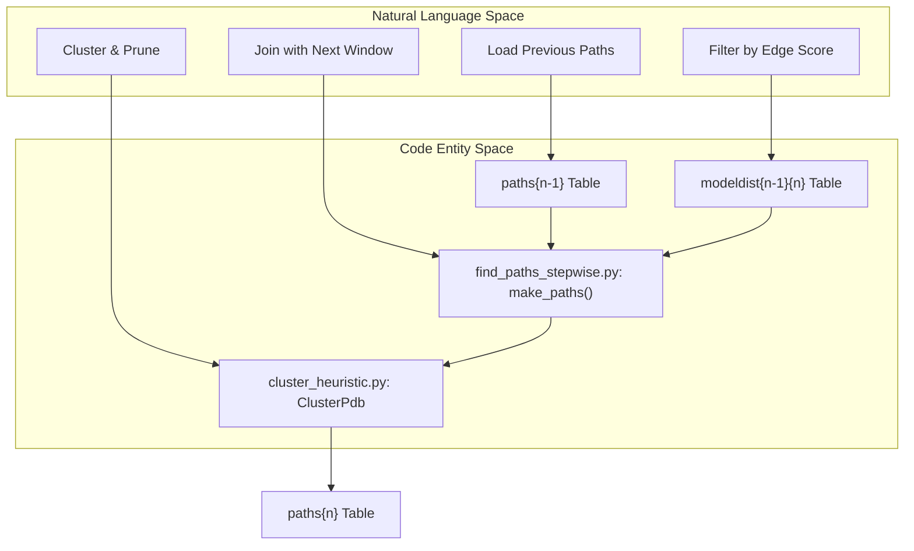
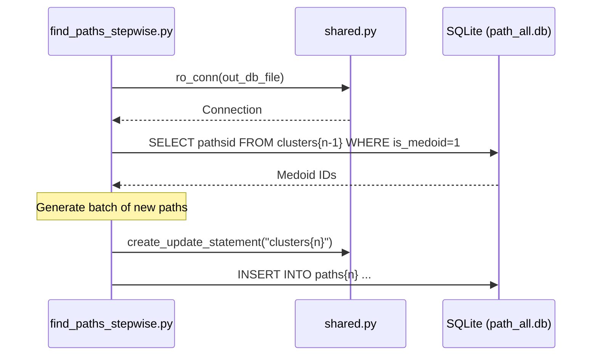

# Stepwise Path Construction

> **Relevant source files**
> * [scripts/find_paths_stepwise.py](https://github.com/kiharalab/idp_lzerd/blob/2d5565c2/scripts/find_paths_stepwise.py)
> * [scripts/shared.py](https://github.com/kiharalab/idp_lzerd/blob/2d5565c2/scripts/shared.py)

Stepwise path construction is the process of assembling full-length IDP binding poses by combinatorially joining structural fragments from adjacent windows. This process is managed by `find_paths_stepwise.py`, which utilizes a window-by-window growth strategy combined with medoid-based pruning to manage the exponential search space.

## Process Overview

The construction follows a dynamic programming-like approach where paths of length $N$ are built by extending paths of length $N-1$ using geometric compatibility scores stored in SQLite databases.

1. **Iterative Extension**: Starting from window 0, the system joins fragments to window 1, then window 2, and so on [scripts/find_paths_stepwise.py:82-88].
2. **Geometric Filtering**: Compatibility between adjacent fragments is determined by `edgescore` (calculated during the scoring phase), which represents the RMSD of overlapping residues [scripts/find_paths_stepwise.py:59-60].
3. **Medoid Pruning**: To prevent combinatorial explosion, paths are clustered after each extension step, and only medoids (representative paths) are used for further extension [scripts/find_paths_stepwise.py:97-103].
4. **Database Persistence**: Results are stored in a central `path_{complexid}_all.db` file, using a schema that tracks path members and aggregated scores [scripts/find_paths_stepwise.py:54-57].

### Path Construction Data Flow

This diagram maps the logical flow of path assembly to the specific code entities responsible for data movement.

| Step | Code Entity | Action |
| --- | --- | --- |
| **Initialization** | `FindPathsStepwise.__init__` | Orchestrates the loop from $n=2$ to $n=nwindows$ [scripts/find_paths_stepwise.py:64-82]. |
| **Path Generation** | `FindPathsStepwise.make_paths` | Executes SQL joins between `paths{n-1}` and `modeldist{n-1}{n}` [scripts/find_paths_stepwise.py:159-174]. |
| **Clustering** | `ClusterPdb` | Invokes heuristic clustering to reduce the path set [scripts/find_paths_stepwise.py:98-100]. |
| **Update** | `shared.create_update_statement` | Calculates and stores `clustersize` for the medoid paths [scripts/find_paths_stepwise.py:116-120]. |

Sources: [scripts/find_paths_stepwise.py:50-123], [scripts/find_paths_stepwise.py:159-174]

## Implementation Details

### SQLite Optimization

The script uses `apsw` (Another Python SQLite Wrapper) for high-performance database interactions. During path construction, it utilizes in-memory databases or attached databases to speed up the cross-window joins [scripts/find_paths_stepwise.py:28].

Key functions from `shared.py` are used to manage these connections:

* `ro_conn(dbfile)`: Opens a read-only connection [scripts/shared.py:41-47].
* `write_conn(dbfile)`: Opens a read-write connection for updating cluster sizes [scripts/shared.py:49-57].
* `create_update_statement()`: Generates optimized SQL for bulk updates of the `clusters{n}` tables [scripts/shared.py:113-136].

### Scoring Aggregation

As paths grow, two primary scores are aggregated:

1. **Nodescore**: The sum of individual fragment scores (e.g., ITScore, DFIRE) for all fragments in the path [scripts/find_paths_stepwise.py:60].
2. **Edgescore**: The sum of geometric compatibility scores for every junction between fragments [scripts/find_paths_stepwise.py:59].

### Database Schema

The path construction process populates the following tables in `path_{complexid}_all.db`:

| Table Name | Description | Key Columns |
| --- | --- | --- |
| `paths{n}` | Stores the sequence of model IDs forming a path of length `n`. | `pathsid`, `m0, m1, ... mn`, `nodescore`, `edgescores` |
| `clusters{n}` | Stores the clustering results for paths of length `n`. | `pathsid`, `cid` (Cluster ID), `is_medoid` |

Sources: [scripts/find_paths_stepwise.py:54-61], [scripts/shared.py:40-65], [scripts/shared.py:113-136]

## Path Extension Logic

The `make_paths` function handles the transition from $N$ windows to $N+1$ windows. It performs a join between the existing path table and the geometric distance table (`modeldist`) for the new window pair.

### Batch Processing

To avoid memory exhaustion, path construction is performed in batches defined by `default_batchsize = 10000` [scripts/find_paths_stepwise.py:52]. This allows the system to handle complexes with many windows by processing a subset of medoids at a time.

Sources: [scripts/find_paths_stepwise.py:52-61], [scripts/find_paths_stepwise.py:159-174], [scripts/shared.py:41-47]