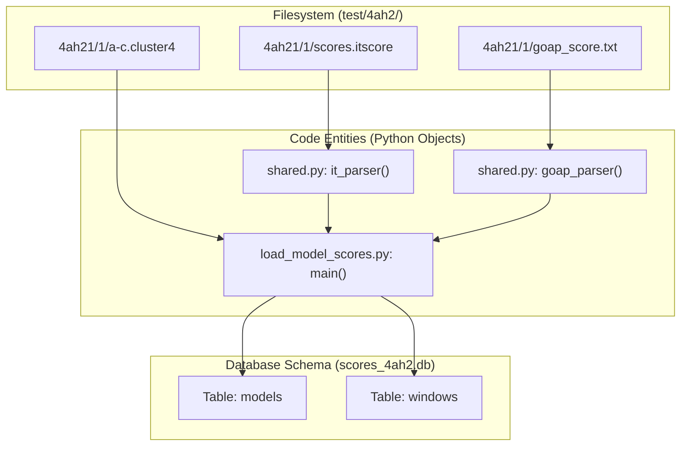
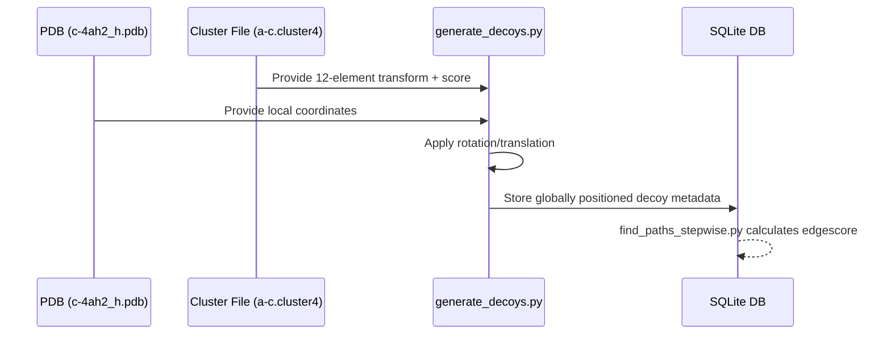

# Test Data Reference (4ah2 Complex)

> **Relevant source files**
> * [test/4ah2/4ah21/1/a-c.cluster4](https://github.com/kiharalab/idp_lzerd/blob/2d5565c2/test/4ah2/4ah21/1/a-c.cluster4)
> * [test/4ah2/4ah21/1/a-c.out](https://github.com/kiharalab/idp_lzerd/blob/2d5565c2/test/4ah2/4ah21/1/a-c.out)
> * [test/4ah2/4ah21/1/c-4ah2_h.pdb](https://github.com/kiharalab/idp_lzerd/blob/2d5565c2/test/4ah2/4ah21/1/c-4ah2_h.pdb)
> * [test/4ah2/4ah21/1/goap_score.txt](https://github.com/kiharalab/idp_lzerd/blob/2d5565c2/test/4ah2/4ah21/1/goap_score.txt)
> * [test/4ah2/4ah21/1/scores.itscore](https://github.com/kiharalab/idp_lzerd/blob/2d5565c2/test/4ah2/4ah21/1/scores.itscore)
> * [test/4ah2/4ah21/10/a-c.cluster4](https://github.com/kiharalab/idp_lzerd/blob/2d5565c2/test/4ah2/4ah21/10/a-c.cluster4)
> * [test/4ah2/4ah21/10/a-c.out](https://github.com/kiharalab/idp_lzerd/blob/2d5565c2/test/4ah2/4ah21/10/a-c.out)

This page provides a technical reference for the validation data located in the `test/4ah2` directory. This dataset represents the 4AH2 receptor/ligand complex and is used to verify the integrity of the docking, scoring, and path assembly pipelines.

## Purpose and Scope

The `test/4ah2` directory contains pre-computed structural fragments and docking decoys for the 4AH2 complex. It serves as a benchmark for:

1. **Scoring Validation**: Ensuring ITScore, GOAP, and DFIRE ingestion matches expected values.
2. **Geometric Filtering**: Testing the `modeldist` pipeline and `edgescore` calculations.
3. **Path Assembly**: Validating the stepwise path-finding and heuristic clustering algorithms.

Sources: [test/4ah2/4ah21/1/a-c.out](https://github.com/kiharalab/idp_lzerd/blob/2d5565c2/test/4ah2/4ah21/1/a-c.out)

 [test/4ah2/4ah21/1/a-c.cluster4](https://github.com/kiharalab/idp_lzerd/blob/2d5565c2/test/4ah2/4ah21/1/a-c.cluster4)

## Complex Setup: 4AH2

The 4AH2 complex is divided into a three-window configuration to simulate the IDP-LZerD fragment-based assembly approach.

| Window ID | Sub-directory | Description | Fragment Length |
| --- | --- | --- | --- |
| **4ah21** | `test/4ah2/4ah21` | Initial fragment window | 9 Residues |
| **4ah213** | `test/4ah2/4ah213` | Intermediate/Overlapping window | 9 Residues |
| **4ah27** | `test/4ah2/4ah27` | Terminal fragment window | 9 Residues |

Each window contains numbered sub-directories (e.g., `1/`, `10/`) representing specific Rosetta-generated structural fragments for that sequence segment.

Sources: [test/4ah2/4ah21/1/a-c.out](https://github.com/kiharalab/idp_lzerd/blob/2d5565c2/test/4ah2/4ah21/1/a-c.out)

 [test/4ah2/4ah21/10/a-c.out](https://github.com/kiharalab/idp_lzerd/blob/2d5565c2/test/4ah2/4ah21/10/a-c.out)

## Per-Fragment File Types

Within each fragment directory (e.g., `test/4ah2/4ah21/1/`), several standard files define the docking landscape and scoring metadata.

### Docking Decoy Metadata

* **`a-c.out`**: The raw output from the LZerD/ZDOCK docking engine. Each line represents a docking decoy with transformation parameters (rotation/translation) and the internal docking score.
* **`a-c.cluster4`**: A reduced set of decoys after initial structural clustering. This file is consumed by the scoring pipeline to represent the diverse poses of a fragment.

### Scoring Files

* **`scores.itscore`**: Contains the ITScore values for each model.
* **`goap_score.txt`**: Contains GOAP and DFIRE scores used for composite ranking. * *Column 3*: GOAP score. * *Column 4*: DFIRE score.

### Structural Data

* **`c-4ah2_h.pdb`**: The hydrogen-added PDB file of the fragment used as the "ligand" during docking generation.

Sources: [test/4ah2/4ah21/1/a-c.out L1-L10](https://github.com/kiharalab/idp_lzerd/blob/2d5565c2/test/4ah2/4ah21/1/a-c.out#L1-L10)

 [test/4ah2/4ah21/1/a-c.cluster4 L1-L10](https://github.com/kiharalab/idp_lzerd/blob/2d5565c2/test/4ah2/4ah21/1/a-c.cluster4#L1-L10)

 [test/4ah2/4ah21/1/scores.itscore L1-L10](https://github.com/kiharalab/idp_lzerd/blob/2d5565c2/test/4ah2/4ah21/1/scores.itscore#L1-L10)

 [test/4ah2/4ah21/1/goap_score.txt L1-L5](https://github.com/kiharalab/idp_lzerd/blob/2d5565c2/test/4ah2/4ah21/1/goap_score.txt#L1-L5)

 [test/4ah2/4ah21/1/c-4ah2_h.pdb L1-L10](https://github.com/kiharalab/idp_lzerd/blob/2d5565c2/test/4ah2/4ah21/1/c-4ah2_h.pdb#L1-L10)

## Data Flow: From Test Files to Database

The following diagram illustrates how the `test/` directory files are mapped to internal code entities and eventually to the SQLite database schema described in [create_database.py](https://github.com/kiharalab/idp_lzerd/blob/2d5565c2/create_database.py)

**Entity Mapping: Filesystem to Code Entities**

Sources: [create_database.py L1-L50](https://github.com/kiharalab/idp_lzerd/blob/2d5565c2/create_database.py#L1-L50)

 [load_model_scores.py L10-L100](https://github.com/kiharalab/idp_lzerd/blob/2d5565c2/load_model_scores.py#L10-L100)

 [shared.py L150-L200](https://github.com/kiharalab/idp_lzerd/blob/2d5565c2/shared.py#L150-L200)

## Interpreting Test Outputs

When running the pipeline against the 4AH2 test data, the assembly process follows a specific transformation flow. The transformation matrices in `a-c.cluster4` are applied to the fragment PDB to place it in the receptor coordinate space.

**Decoy Transformation Logic**

### Key Data Indicators in 4AH2 Tests:

1. **Coordinate Precision**: Transformation values in `a-c.cluster4` (Columns 1-12) are used by `PDBGEN` to generate coordinates. Small variations in these values during testing indicate floating-point discrepancies in the environment.
2. **Scoring Consistency**: The ITScore values in `scores.itscore` (e.g., `-18504.05` for model1) must exactly match the `itscore` column in the `models` table of the generated database.

Sources: [test/4ah2/4ah21/1/a-c.cluster4 L1-L5](https://github.com/kiharalab/idp_lzerd/blob/2d5565c2/test/4ah2/4ah21/1/a-c.cluster4#L1-L5)

 [test/4ah2/4ah21/1/scores.itscore L1-L5](https://github.com/kiharalab/idp_lzerd/blob/2d5565c2/test/4ah2/4ah21/1/scores.itscore#L1-L5)

 [generate_decoys.py L10-L40](https://github.com/kiharalab/idp_lzerd/blob/2d5565c2/generate_decoys.py#L10-L40)