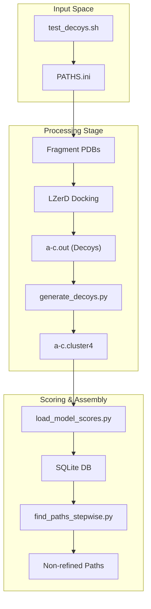

# Test Suite and Decoy Generation Script

> **Relevant source files**
> * [README.md](https://github.com/kiharalab/idp_lzerd/blob/2d5565c2/README.md?plain=1)
> * [test/4ah2/4ah21/1/a-c.cluster4](https://github.com/kiharalab/idp_lzerd/blob/2d5565c2/test/4ah2/4ah21/1/a-c.cluster4)
> * [test/4ah2/4ah21/1/a-c.out](https://github.com/kiharalab/idp_lzerd/blob/2d5565c2/test/4ah2/4ah21/1/a-c.out)
> * [test/4ah2/4ah21/1/c-4ah2_h.pdb](https://github.com/kiharalab/idp_lzerd/blob/2d5565c2/test/4ah2/4ah21/1/c-4ah2_h.pdb)

The IDP-LZerD test suite provides a controlled environment for validating the docking and assembly pipeline using the 4AH2 complex as a reference. It orchestrates the generation of docking decoys for intrinsically disordered protein (IDP) fragments against a structured receptor, facilitating the transition from individual fragment models to the full-length assembly.

### Test Directory Structure

The `test/` directory contains the necessary data and scripts to verify the pipeline. It uses a specific hierarchy where each IDP fragment window has its own subdirectory containing the docking results and scoring metrics.

* **`test/4ah2/`**: The root data directory for the 4AH2 test case [README.md L56-L57](https://github.com/kiharalab/idp_lzerd/blob/2d5565c2/README.md?plain=1#L56-L57)
* **Window Subdirectories**: (e.g., `4ah21/`, `4ah213/`, `4ah27/`) These represent specific sliding windows of the IDP sequence [README.md L78](https://github.com/kiharalab/idp_lzerd/blob/2d5565c2/README.md?plain=1#L78-L78)
* **Fragment Subdirectories**: Inside each window, subdirectories (e.g., `1/`, `2/`) contain the structural models for that specific fragment [test/4ah2/4ah21/1/c-4ah2_h.pdb L1](https://github.com/kiharalab/idp_lzerd/blob/2d5565c2/test/4ah2/4ah21/1/c-4ah2_h.pdb#L1-L1)

#### Per-Fragment File Layout

Each fragment directory contains the following critical files:

| File Name | Description |
| --- | --- |
| `a-c.out` | The raw output from the LZerD docking program [test/4ah2/4ah21/1/a-c.out L1](https://github.com/kiharalab/idp_lzerd/blob/2d5565c2/test/4ah2/4ah21/1/a-c.out#L1-L1) |
| `a-c.cluster4` | Clustered docking decoys, typically generated by `PDBGEN` [test/4ah2/4ah21/1/a-c.cluster4 L1](https://github.com/kiharalab/idp_lzerd/blob/2d5565c2/test/4ah2/4ah21/1/a-c.cluster4#L1-L1) |
| `c-4ah2_h.pdb` | The full-atom PDB structure of the IDP fragment [test/4ah2/4ah21/1/c-4ah2_h.pdb L4](https://github.com/kiharalab/idp_lzerd/blob/2d5565c2/test/4ah2/4ah21/1/c-4ah2_h.pdb#L4-L4) |
| `scores.itscore` | Statistical potential scores generated by ITScorePro [README.md L80](https://github.com/kiharalab/idp_lzerd/blob/2d5565c2/README.md?plain=1#L80-L80) |
| `goap_score.txt` | DFIRE-based scoring metrics from GOAP [README.md L80](https://github.com/kiharalab/idp_lzerd/blob/2d5565c2/README.md?plain=1#L80-L80) |

**Sources:** [README.md L56-L80](https://github.com/kiharalab/idp_lzerd/blob/2d5565c2/README.md?plain=1#L56-L80)

 [test/4ah2/4ah21/1/a-c.out L1-L10](https://github.com/kiharalab/idp_lzerd/blob/2d5565c2/test/4ah2/4ah21/1/a-c.out#L1-L10)

 [test/4ah2/4ah21/1/a-c.cluster4 L1-L10](https://github.com/kiharalab/idp_lzerd/blob/2d5565c2/test/4ah2/4ah21/1/a-c.cluster4#L1-L10)

 [test/4ah2/4ah21/1/c-4ah2_h.pdb L1-L10](https://github.com/kiharalab/idp_lzerd/blob/2d5565c2/test/4ah2/4ah21/1/c-4ah2_h.pdb#L1-L10)

---

### Decoy Generation Orchestration

The generation of docking decoys is managed by the `test_decoys.sh` script, which serves as the primary entry point for running the test suite.

#### Orchestration Data Flow

The following diagram illustrates how the test suite moves from fragment PDBs to the final non-refined paths.

**Diagram: Decoy Generation Pipeline**

**Sources:** [README.md L51-L58](https://github.com/kiharalab/idp_lzerd/blob/2d5565c2/README.md?plain=1#L51-L58)

 [README.md L79-L81](https://github.com/kiharalab/idp_lzerd/blob/2d5565c2/README.md?plain=1#L79-L81)

---

### Implementation Details: generate_decoys.py

The `generate_decoys.py` script (often used in conjunction with the LZerD suite's `PDBGEN` binary) is responsible for processing the transformation matrices found in the LZerD output files and converting them into physical PDB models.

#### Key Functions and Logic

1. **Transformation Parsing**: The script reads the rotation matrices and translation vectors from the `a-c.out` file [test/4ah2/4ah21/1/a-c.out L1-L10](https://github.com/kiharalab/idp_lzerd/blob/2d5565c2/test/4ah2/4ah21/1/a-c.out#L1-L10)
2. **PDB Reconstruction**: Using the fragment PDB as a template, it applies these transformations to generate the 3D coordinates of the IDP fragment in the context of the receptor.
3. **Clustering Integration**: It formats the output into the `.cluster4` format, which includes the transformation parameters and a representative score for downstream ranking [test/4ah2/4ah21/1/a-c.cluster4 L1-L10](https://github.com/kiharalab/idp_lzerd/blob/2d5565c2/test/4ah2/4ah21/1/a-c.cluster4#L1-L10)

**Code Entity Association**

| System Concept | Code Entity / File |
| --- | --- |
| Docking Orchestrator | `test/test_decoys.sh` [README.md L57](https://github.com/kiharalab/idp_lzerd/blob/2d5565c2/README.md?plain=1#L57-L57) |
| Transformation Matrix | `a-c.out` columns 1-12 [test/4ah2/4ah21/1/a-c.out L1](https://github.com/kiharalab/idp_lzerd/blob/2d5565c2/test/4ah2/4ah21/1/a-c.out#L1-L1) |
| Clustered Decoy Data | `a-c.cluster4` [test/4ah2/4ah21/1/a-c.cluster4 L1](https://github.com/kiharalab/idp_lzerd/blob/2d5565c2/test/4ah2/4ah21/1/a-c.cluster4#L1-L1) |
| Fragment Template | `c-{PDBID}_h.pdb` [test/4ah2/4ah21/1/c-4ah2_h.pdb L1](https://github.com/kiharalab/idp_lzerd/blob/2d5565c2/test/4ah2/4ah21/1/c-4ah2_h.pdb#L1-L1) |

**Sources:** [README.md L79-L80](https://github.com/kiharalab/idp_lzerd/blob/2d5565c2/README.md?plain=1#L79-L80)

 [test/4ah2/4ah21/1/a-c.out L1-L10](https://github.com/kiharalab/idp_lzerd/blob/2d5565c2/test/4ah2/4ah21/1/a-c.out#L1-L10)

 [test/4ah2/4ah21/1/a-c.cluster4 L1-L10](https://github.com/kiharalab/idp_lzerd/blob/2d5565c2/test/4ah2/4ah21/1/a-c.cluster4#L1-L10)

---

### Running the Test Suite

To execute the validation suite, the environment must be configured via `PATHS.ini` to point to the binary dependencies (LZerD, Rosetta, etc.) [README.md L51-L52](https://github.com/kiharalab/idp_lzerd/blob/2d5565c2/README.md?plain=1#L51-L52)

1. **Configuration**: Edit `test/test_decoys.sh` to define the `IDP-LZerD` root path [README.md L56](https://github.com/kiharalab/idp_lzerd/blob/2d5565c2/README.md?plain=1#L56-L56)
2. **Execution**: Run the script from the `test/` directory. Note that a full run can generate up to 250 GB of intermediate data [README.md L57](https://github.com/kiharalab/idp_lzerd/blob/2d5565c2/README.md?plain=1#L57-L57)
3. **Output**: The resulting non-refined paths are stored in a complex-specific directory (e.g., `test/4ah2ac3`) [README.md L58](https://github.com/kiharalab/idp_lzerd/blob/2d5565c2/README.md?plain=1#L58-L58)

**Sources:** [README.md L51-L60](https://github.com/kiharalab/idp_lzerd/blob/2d5565c2/README.md?plain=1#L51-L60)