---
slug:1-overview
blog_type:normal
---


**IDP-LZerD** 是一个计算流程，用于对蛋白质-蛋白质相互作用 (PPI) 的结合构象进行建模，其中一方是**本质无序蛋白 (IDP)**，另一方是有序（结构化）蛋白。仅给定无序蛋白的序列和有序受体的 3D 结构，IDP-LZerD 就能预测 IDP 在结合时如何折叠和对接——这是传统刚体对接工具无法解决的问题。该方法由普渡大学的 Lenna X. Peterson 和 Daisuke Kihara 开发，发表在 *PLoS Computational Biology* (2017) 上。

来源: [README.md](/README.md#L1-L82), [LICENSE.txt](/LICENSE.txt#L1-L4)

## IDP-LZerD 解决了什么问题？

传统的蛋白质对接算法假设两个蛋白质都是刚性的，或仅发生有限的构象变化。**本质无序蛋白**打破了这一假设——它们在游离状态下缺乏稳定的折叠结构，只有在与伴侣结合时才采取明确的构象（这种现象被称为**耦合折叠与结合**）。IDP-LZerD 通过将 IDP 分解为重叠的结构片段、将每个片段独立对接到受体上，然后通过组合路径搜索算法将得分最高的片段组合组装成全长的结合构象来解决这一问题。

来源: [README.md](/README.md#L1-L10)

## 流程架构一览

IDP-LZerD 的工作流程分为五个概念阶段，每个阶段实现为一个独立的 Python 脚本，通过读取和写入 SQLite 数据库及文件系统来运行：

```mermaid
flowchart LR
    subgraph SG1["1. 片段生成"]
        A["IDP 序列 +<br/>SS 预测"] --> B["Rosetta<br/>片段选择器"]
        B --> C["Rosetta→PDB<br/>转换"]
        C --> D["Pulchra +<br/>侧链建模"]
    end
    subgraph SG2["2. 对接与评分"]
        D --> E["LZerD<br/>局部对接"]
        E --> F["GOAP + ITScorePro<br/>模型评分"]
    end
    subgraph SG3["3. 数据库与过滤"]
        F --> G["create_database.py<br/>模式与索引"]
        G --> H["load_model_scores.py<br/>分数加载与<br/>几何过滤"]
    end
    subgraph SG4["4. 路径组装与排序"]
        H --> I["find_paths_stepwise.py<br/>组合搜索"]
        I --> J["cluster_heuristic.py<br/>LRMSD 聚类"]
        J --> K["compute_occupancy_score.py<br/>受体接触评分"]
        K --> L["select_paths.py<br/>加权 Z-Score 排序"]
    end
    subgraph SG5["5. 优化与输出"]
        L --> M["combine_receptor.py<br/>链合并"]
        M --> N["CHARMM<br/>弛豫协议"]
    end
    SG1 --> SG2 --> SG3 --> SG4 --> SG5
```



来源: [test/test_decoys.sh](/test/test_decoys.sh#L1-L27), [scripts/find_paths_stepwise.py](/scripts/find_paths_stepwise.py#L1-L50)

## 核心计算思想：滑动窗口与路径

IDP-LZerD 的核心创新在于对无序蛋白的**滑动窗口分解**。IDP 序列被划分为重叠的 9 残基窗口，每次步进 6 个残基（相邻窗口之间有 3 个残基的重叠）。对于每个窗口，Rosetta 生成一组候选结构片段。然后使用 LZerD 将每个片段对接到受体上，每个片段产生数千个对接诱体。

随后，流程执行**组合路径搜索**：“路径”是由每个窗口的一个对接模型组成的序列，其中相邻窗口必须满足几何兼容性约束（主链原子重叠、残基重叠、片段间距离、角度方向）。`find_paths_stepwise.py` 脚本逐步构建路径——首先将窗口 0 与窗口 1 配对，然后扩展到窗口 2，依此类推——同时计算边缘分数，对连续片段之间的几何冲突进行惩罚。这种逐步推进的方法避免了朴素暴力组合的指数级爆炸。

来源: [scripts/shared.py](/scripts/shared.py#L260-L278), [scripts/find_paths_stepwise.py](/scripts/find_paths_stepwise.py#L60-L120)

## 脚本清单

| 脚本 | 阶段 | 用途 |
|--------|-------|---------|
| `run_rosetta.py` | 片段生成 | 运行 PSI-BLAST 和 Rosetta 片段选择器以生成 9 聚体结构片段 |
| `rosetta_to_pdb.py` | 片段生成 | 将 Rosetta 内部片段格式转换为标准 PDB CA 轨迹文件 |
| `parse_ss.py` | 片段生成 | 将二级结构预测 (PSIPRED, Porter, Jpred, SSPro) 归一化为统一格式 |
| `parse.pl` | 片段生成 | Perl 桥接脚本，将 PSI-BLAST 二进制检查点转换为 Rosetta 兼容格式 |
| `create_database.py` | 数据库与过滤 | 创建 SQLite 数据库模式，对窗口、片段及其关系进行索引 |
| `load_model_scores.py` | 对接与评分 | 加载 GOAP/ITScorePro 分数，选择每个窗口的顶级模型，应用几何截断过滤，计算成对片段兼容性 |
| `find_paths_stepwise.py` | 路径组装 | 逐步组合搜索，在所有窗口中构建几何有效的片段路径 |
| `cluster_heuristic.py` | 路径组装 | 按配体 RMSD 对路径进行聚类，以识别代表性中心点并减少冗余 |
| `compute_occupancy_score.py` | 路径排序 | 计算每条路径的受体残基接触数，以得出基于占据率的分数 |
| `select_paths.py` | 路径排序 | 通过加权复合 Z-score（节点 + 边 + 聚类大小 + 占据率）对聚类中心点进行排序，并输出全原子 PDB 文件 |
| `combine_receptor.py` | 优化与输出 | 将多链受体 PDB 合并为单链，以兼容 CHARMM |
| `shared.py` | 实用工具 | 公共函数：数据库连接管理器、SQL 辅助函数、PDB I/O、评分解析器、窗口计算、配置加载 |

来源: [scripts/run_rosetta.py](/scripts/run_rosetta.py#L1-L30), [scripts/create_database.py](/scripts/create_database.py#L50-L80), [scripts/load_model_scores.py](/scripts/load_model_scores.py#L40-L80), [scripts/cluster_heuristic.py](/scripts/cluster_heuristic.py#L35-L70), [scripts/compute_occupancy_score.py](/scripts/compute_occupancy_score.py#L30-L60), [scripts/select_paths.py](/scripts/select_paths.py#L30-L50), [scripts/combine_receptor.py](/scripts/combine_receptor.py#L25-L55), [scripts/shared.py](/scripts/shared.py#L1-L50)

## 数据流与持久化

IDP-LZerD 使用 **SQLite 数据库**（通过 `apsw` 库）作为流程各阶段之间的主要持久层。两个关键的数据库文件负责协调数据流转：

| 数据库文件 | 创建者 | 包含内容 |
|---------------|-----------|----------|
| `scores_{complexid}.db` | `create_database.py` | 窗口/片段索引、模型分数 (ITScorePro, GOAP/DFIRE)、选定模型坐标、成对模型距离 |
| `path_{complexid}_all.db` | `find_paths_stepwise.py` | 每个窗口数的有效路径、LRMSD 聚类分配、聚类大小 |

流程还依赖于一个 **CSV 文件** (`{PDBID}_data.csv`)，该文件存储窗口分解元数据（位置、残基起始/结束、窗口索引），以及一个最终捕获所选路径加权排序的 `path_scores.csv` 文件。

来源: [scripts/create_database.py](/scripts/create_database.py#L50-L90), [scripts/find_paths_stepwise.py](/scripts/find_paths_stepwise.py#L60-L90), [scripts/shared.py](/scripts/shared.py#L50-L100)

## 外部依赖

IDP-LZerD 编排了多个外部生物信息学工具。这些工具的路径在 [PATHS.ini](/PATHS.ini#L1-L6) 中配置：

| 依赖项 | 作用 | 所需阶段 |
|-----------|------|-------------------|
| **Rosetta** (片段选择器) | 从序列 + SS 预测生成结构片段集合 | 片段生成 |
| **PSI-BLAST** (`blastpgp`) + **nr 数据库** | 为 Rosetta 片段选择构建序列谱 | 片段生成 |
| **LZerD** (PDBGEN, LB3Dclust) | 局部蛋白质-蛋白质对接和诱体聚类 | 对接与评分 |
| **Pulchra** | 从仅 CA 轨迹重建完整主链 | 片段生成 |
| **侧链建模** (SCComp / Scwrl4 / Oscar-star / RASP) | 为主链模型添加侧链 | 片段生成 |
| **GOAP** | 为对接模型评分（提供 DFIRE 子分数） | 对接与评分 |
| **ITScorePro** | 为对接模型评分（基于迭代知识的势能） | 对接与评分 |
| **CHARMM** | 最终模型的基于物理的弛豫/优化 | 优化与输出 |

来源: [README.md](/README.md#L20-L42), [PATHS.ini](/PATHS.ini#L1-L6)

## 项目结构

```
idp_lzerd/
├── PATHS.ini                          # 外部工具路径配置
├── idp_relax.inp                      # CHARMM 弛豫输入模板
├── LICENSE.txt                        # GPL v3
├── README.md                          # 安装与使用说明
├── scripts/
│   ├── cluster_heuristic.py           # 基于 LRMSD 的路径聚类
│   ├── combine_receptor.py            # 多链受体合并
│   ├── compute_occupancy_score.py     # 受体接触占据率评分
│   ├── create_database.py             # SQLite 模式与片段索引
│   ├── find_paths_stepwise.py         # 组合路径搜索
│   ├── load_model_scores.py           # 分数加载与几何过滤
│   ├── parse.pl                       # PSI-BLAST 检查点转换器
│   ├── parse_ss.py                    # 二级结构预测解析器
│   ├── rosetta_templates/             # Rosetta 片段选择器配置文件
│   │   ├── quota-protocol.flags.template
│   │   ├── quota-protocol.wghts
│   │   └── quota.def
│   ├── rosetta_to_pdb.py              # Rosetta 输出 → PDB 转换
│   ├── run_rosetta.py                 # Rosetta 片段选择器运行器
│   ├── select_paths.py                # 加权 Z-score 排序与输出
│   └── shared.py                      # 共享实用工具与数据库辅助函数
└── test/
    ├── 4ah2/                          # 测试用例: PDB 4ah2
    │   ├── 4ah21/ ... 4ah213/ 4ah27/ # 片段窗口子目录
    │   └── goap_score.txt
    ├── 4ah2_data.csv                  # 窗口分解数据
    ├── generate_decoys.py             # 测试辅助: 运行 LZerD 对接
    └── test_decoys.sh                 # 端到端测试脚本
```

来源: [README.md](/README.md#L1-L82), [scripts/shared.py](/scripts/shared.py#L22-L24)

## 排序方法论

`select_paths.py` 中的最终路径选择采用**四分量加权 Z-score** 对聚类中心点进行排序。每个评分分量被归一化为 Z-score，然后合并：

| 评分分量 | 方向 | 权重 | 含义 |
|----------------|-----------|--------|---------|
| `nodescore` | 越低越好 | 0.5 | 路径上各个模型对接分数的总和 |
| `edgescores` | 越低越好 | 0.1 | 相邻窗口之间几何兼容性惩罚的总和 |
| `clustersize` | 越大越好 | 0.3 | 同一 LRMSD 聚类中的路径数量（指示一致性） |
| `occupancyscore` | 越大越好 | 0.1 | 路径上的受体残基接触数量 |

这些分量通过**最佳分数权重** (`b_weight = 0.3`) 进行混合：最终分数的 30% 来自四个分量中单一最佳（最负）的 Z-score，70% 来自加权和。这在利用最强信号和跨所有评分标准的多样化之间取得了平衡。

<CgxTip>四个评分分量解决了根本不同的质量信号——对接准确性（节点）、结构连贯性（边）、构象共识（聚类）和界面的生物学合理性（占据率）。最佳分数权重可防止单个较差的分量主导排序。</CgxTip>

来源: [scripts/select_paths.py](/scripts/select_paths.py#L22-L30), [scripts/select_paths.py](/scripts/select_paths.py#L90-L130)

## 测试用例

本仓库包含一个基于 **PDB 4ah2**（A 链作为受体，C 链作为配体）的测试用例。测试脚本 `test/test_decoys.sh` 演练了从数据库创建到路径选择的完整流程。请注意，完整运行会产生约 **250 GB** 的中间文件，因为 LZerD 每个片段最多产生 50,000 个对接诱体，且组合搜索会探索所有几何有效的路径。

来源: [README.md](/README.md#L48-L55), [test/test_decoys.sh](/test/test_decoys.sh#L1-L27), [test/generate_decoys.py](/test/generate_decoys.py#L1-L30)

## 建议阅读路径

若要获取系统的导览，请按以下顺序阅读页面：

1. **[快速开始](2-quick-start)** — 端到端运行测试用例
2. **[外部依赖设置](3-external-dependencies-setup)** — 安装并配置所有必需工具
3. **[架构概述](4-architecture-overview)** — 深入了解流程的数据模型和控制流
4. **片段生成** → [Rosetta 片段选择器](5-rosetta-fragment-picker), [Rosetta 至 PDB 转换](6-rosetta-to-pdb-conversion), [二级结构解析](7-secondary-structure-parsing)
5. **对接与评分** → [数据库创建与模式](8-database-creation-and-schema), [模型分数加载](9-model-score-loading), [几何截断过滤](10-geometric-cutoff-filters)
6. **路径组装与排序** → [逐步路径搜索](11-stepwise-path-search), [启发式聚类](12-heuristic-clustering), [占据率分数计算](13-occupancy-score-computation), [路径选择与排序](14-path-selection-and-ranking)
7. **优化与输出** → [CHARMM 弛豫协议](15-charmm-relaxation-protocol), [受体链组合](16-receptor-chain-combination)
8. **参考** → [共享实用工具参考](17-shared-utilities-reference), [配置与 PATHS.ini](18-configuration-and-paths-ini)