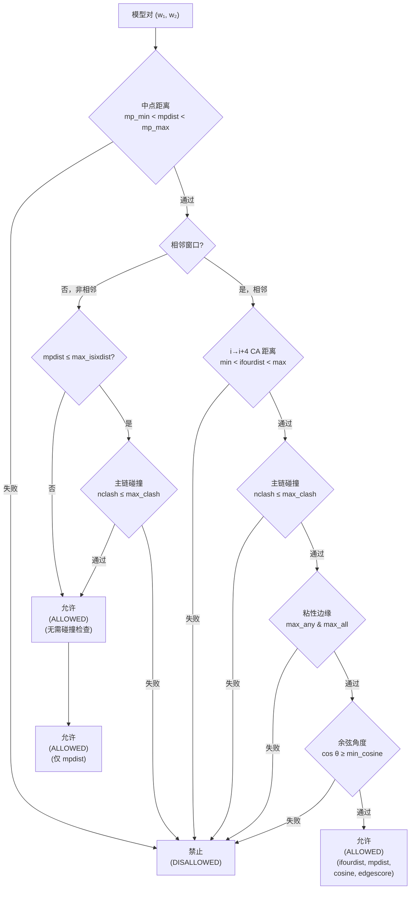
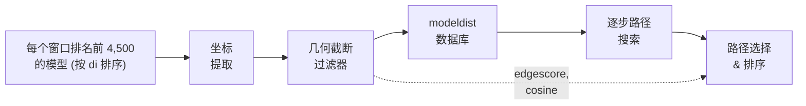

---
slug:10-geometric-cutoff-filters
blog_type:normal
---

几何截断过滤系统是 IDP-LZerD 对接流程中的关键质量门控，它决定了跨相邻序列窗口的对接模型对中，哪些能够被有效组装为连续的内在无序蛋白构象。该系统在 `LoadModelScores.load_modeldist()` 中实现，这些过滤器针对窗口间的每对模型组合评估五个独立的几何标准，存储通过所有检查的**允许**对及其计算出的几何分数，以及未通过任何检查的**禁止**对及其仅有的中点距离。这种二分划分直接决定了 [逐步路径搜索](11-stepwise-path-search) 中下游路径组装的可行搜索空间。

来源：[load_model_scores.py](/scripts/load_model_scores.py#L147-L398)

## 过滤流水线架构

来自相邻窗口的每对模型必须通过一系列级联的几何测试。这些过滤器以严格的短路顺序进行评估——如果任何较早的过滤器拒绝了该模型对，则所有后续（计算成本更高）的检查都会被跳过。这种排序是经过深思熟虑的：中点距离过滤器的计算成本最低（一次同时针对所有模型对的预计算 cdist 调用），而余弦和边缘分数过滤器则需要逐对进行向量算术运算。

相邻窗口对与非相邻窗口对之间的区别在架构上具有重要意义：相邻窗口共享一个 3 残基的重叠区域，并需要通过全部五个过滤器；而非相邻窗口仅需进行中点距离检查及条件性的碰撞检查。未通过中点测试的非相邻模型对会被记录为禁止对，以约束路径搜索空间。

来源：[load_model_scores.py](/scripts/load_model_scores.py#L227-L369)

## 五个几何过滤器

### 1. 中点距离过滤器

主要的几何约束。对于每个窗口，提取一个**中点坐标**——即位于 `res_overlap + 1` 位置残基的 Cα 原子（即从窗口 N 端算起的第 4 个残基）。对于 `res_overlap=3` 的 9 残基窗口，这是第 4 个残基的 Cα。对于 4 残基窗口，它是第 4 个（最后一个）残基的 Cα，在坐标数组末尾的索引位置为 `−4`。

两个窗口的所有模型之间的成对中点距离，通过 `scipy.spatial.distance.cdist` 在单次向量化调用中计算，然后进行阈值判断：

| 参数 | 默认值 | 缩放规则 |
|---|---|---|
| `min_isixdist` | 6.5 Å | 间隔 = 1（相邻）时的下界 |
| `max_isixdist` | 18.5 Å | 每单位间隔的上界；线性缩放 |
| `min_itwelvedist` | 3.8 Å | 间隔 ≥ 2（非相邻）时的下界 |

边界会根据窗口间隔自适应调整：对于相邻窗口（间隔=1），`mp_min = min_isixdist`；对于非相邻窗口（间隔≥2），`mp_min = min_itwelvedist`。上界始终按线性缩放：`mp_max = separation × max_isixdist`。这反映了生物学上的预期，即 Cα 距离沿着无序链随序列间隔成比例增长。

来源：[load_model_scores.py](/scripts/load_model_scores.py#L231-L269)

### 2. i→i+4 CA 距离过滤器

**仅适用于相邻窗口**。该过滤器检查残基 *i*（靠近窗口 *w₁* 的 C 端）的 Cα 与残基 *i+4*（靠近窗口 *w₂* 的 N 端）的 Cα 之间的距离。具体的原子索引计算如下：

- **i_idx** = `−n_atoms × (res_overlap + 1) + ca_index` —— 从 w₁ 坐标数组的末尾向后倒推 4 个残基，然后选择 Cα 原子
- **i4_idx** = `n_atoms × res_overlap + ca_index` —— 从 w₂ 坐标数组的开头向前推 3 个残基，然后选择 Cα 原子

其中 `n_atoms = 4` (N, CA, C, CB)，`ca_index = 1`（CA 是第二个存储的原子）。当 `res_overlap=3` 时，解析为 `i_idx = −16 + 1 = −15` 和 `i4_idx = 12 + 1 = 13`。

| 参数 | 默认值 | 依据 |
|---|---|---|
| `min_ifourdist` | 5.2 Å | i→i+4 间距的最小 Cα–Cα 距离 |
| `max_ifourdist` | 13.6 Å | i→i+4 间距的最大 Cα–Cα 距离 |

这些边界强制执行符合物理现实的局部链几何结构。在无序蛋白质中，相隔 4 个残基的典型 Cα–Cα 距离范围约为 5–14 Å。

来源：[load_model_scores.py](/scripts/load_model_scores.py#L281-L293)

### 3. 主链碰撞过滤器

防止重叠模型的主链原子之间发生空间碰撞。当两个模型之间的中点距离在 `max_isixdist`（默认为 18.5 Å）以内时，会触发此过滤器，表明模型足够接近，原子可能发生重叠。

对于**相邻窗口**，重叠区域（3 个残基 × 4 个原子 = 12 个原子）位于 w₂ 的起始处，通过 `w2_nooverlap = w2_coords[atom_overlap:]` 将其从碰撞检查中排除，因为根据构造，这些原子预计会靠近 w₁ 的 C 端原子。对于**非相邻窗口**，则检查 w₂ 的所有原子。

成对原子距离通过 `scipy.spatial.distance.cdist` 计算，任何距离在 `bb_threshold`（3.0 Å）以内的原子对均被计为碰撞。如果总碰撞数超过 `max_clash`（0），则拒绝该模型对。

| 参数 | 默认值 | 描述 |
|---|---|---|
| `bb_threshold` | 3.0 Å | 视为碰撞的原子间距离阈值 |
| `max_clash` | 0 | 允许的碰撞原子对最大数量 |
| `res_overlap` | 3 | 重叠残基数（决定原子重叠数 = res_overlap × n_atoms） |

零容忍的 `max_clash=0` 默认值意味着**任何单个主链原子碰撞**都会使该模型对失去资格，使其成为流水线中最严格的过滤器。

来源：[load_model_scores.py](/scripts/load_model_scores.py#L295-L307)

### 4. 粘性边缘过滤器

**仅适用于相邻窗口**。该过滤器验证重叠区域本身的几何连续性——即连续窗口之间共享的 3 残基片段。它将 w₁ 的最后 `atom_overlap`（12）个原子与 w₂ 的前 `atom_overlap`（12）个原子进行比较，如果模型在几何上兼容，这些原子应近乎相同。

使用对应原子之间的对角成对距离，应用两个独立的拒绝标准：

| 参数 | 默认值 | 拒绝条件 |
|---|---|---|
| `sticky_max_any` | 10.0 Å | 如果**任何**单个原子对距离超过此值 → 拒绝 |
| `sticky_max_all` | 6.0 Å | 如果**所有**原子对距离均超过此值 → 拒绝 |

`sticky_max_any` 标准用于捕捉灾难性的错位（一个原子严重偏移），而 `sticky_max_all` 标准用于捕捉系统性漂移（所有重叠原子均匀偏移）。如果两项检查均通过，则将所有重叠原子对的均方距离存储为 `edgescore`——这是一个稍后在路径排序中使用的连续质量度量。

<CgxTip>`edgescore` 是平方距离的均值（`np.mean(np.square(distances))`），而不是 RMSD。这比 RMSD 更严厉地惩罚较大的偏差，此设计专为 [路径选择与排序](14-path-selection-and-ranking) 中的路径排序而设。</CgxTip>

来源：[load_model_scores.py](/scripts/load_model_scores.py#L309-L319)

### 5. 余弦角度过滤器

**仅适用于相邻窗口**。该过滤器确保两个窗口交界处的主链方向在几何上是连续的，而不是弯折或反转的。它计算两个主链向量之间夹角的余弦值：

- **w₁ 向量**：从倒数第三个残基的 N 原子（`w1_coords[−12]`）指向最后一个残基的 C 原子（`w1_coords[−2]`）
- **w₂ 向量**：从第一个残基的 N 原子（`w2_coords[1]`）指向第三个残基的 C 原子（`w2_coords[11]`）

余弦值计算公式为 `cos(θ) = (a·b) / (|a| × |b|)`。当 `min_cosine = 0.1` 时，该过滤器会拒绝任何主链向量夹角大于 ~84°（arccos(0.1) ≈ 84.3°）的模型对，从而有效防止窗口交界处出现急剧的主链反转。

| 参数 | 默认值 | 几何含义 |
|---|---|---|
| `min_cosine` | 0.1 | 最小余弦值；角度必须 < ~84° |

余弦值为 1.0 表示向量完全共线（0° 夹角），0.0 表示垂直（90°），−1.0 表示反平行（180° 反转）。0.1 的宽松阈值允许相当大的角度变化，同时阻断病态的弯折。

来源：[load_model_scores.py](/scripts/load_model_scores.py#L321-L343)

## 默认参数参考

所有几何过滤器参数均定义在 `LoadModelScores` 的 `_p` 类属性中。`params` 属性根据这些默认值派生出额外的计算值：

| 参数 | 默认值 | 计算值 | 使用者 |
|---|---|---|---|
| `backbone_atoms` | `['N', 'CA', 'C']` | — | 坐标提取 |
| `cb` | `'CB'` | — | GLY 的虚拟 CB 生成 |
| `stored_atoms` | — | `backbone_atoms + [cb]` = `['N','CA','C','CB']` | 坐标数组布局 |
| `n_atoms` | — | `len(stored_atoms)` = 4 | 索引算术 |
| `ca_index` | — | `stored_atoms.index('CA')` = 1 | 中点/CA 提取 |
| `atom_overlap` | — | `res_overlap × n_atoms` = 12 | 碰撞/粘性边缘过滤器 |
| `res_overlap` | 3 | — | 窗口重叠定义 |
| `bb_threshold` | 3.0 Å | — | 主链碰撞过滤器 |
| `max_clash` | 0 | — | 主链碰撞过滤器 |
| `sticky_max_all` | 6.0 Å | — | 粘性边缘过滤器 |
| `sticky_max_any` | 10.0 Å | — | 粘性边缘过滤器 |
| `min_cosine` | 0.1 | — | 余弦角度过滤器 |
| `min_ifourdist` | 5.2 Å | — | i→i+4 CA 距离过滤器 |
| `max_ifourdist` | 13.6 Å | — | i→i+4 CA 距离过滤器 |
| `min_isixdist` | 6.5 Å | — | 中点距离（相邻） |
| `max_isixdist` | 18.5 Å | — | 中点距离（缩放因子） |
| `min_itwelvedist` | 3.8 Å | — | 中点距离（非相邻） |

来源：[load_model_scores.py](/scripts/load_model_scores.py#L480-L496), [load_model_scores.py](/scripts/load_model_scores.py#L545-L560)

## 输出：模型距离数据库

过滤结果持久化在以 `{pdbid}_modeldist{windowid}.db` 命名的按窗口划分的 SQLite 数据库中。每个数据库针对每个前序窗口包含两种类型的表：

**允许对**（表 `modeldist{prev}{cur}`）——对于相邻窗口，通过所有几何检查的模型；对于非相邻窗口，通过中点 + 碰撞检查的模型：

| 列 | 类型 | 描述 |
|---|---|---|
| `modela` | INTEGER | 较早窗口的 modelid |
| `modelb` | INTEGER | 较晚窗口的 modelid |
| `ifourdist` | REAL | i→i+4 Cα 距离（仅限相邻） |
| `mpdist` | REAL | 中点 Cα 距离 |
| `cosine` | REAL | 主链向量余弦（仅限相邻） |
| `edgescore` | REAL | 重叠距离均方值（仅限相邻） |

**禁止对**——未通过任何几何检查的模型：

| 列 | 类型 | 描述 |
|---|---|---|
| `modela` | INTEGER | 较早窗口的 modelid |
| `modelb` | INTEGER | 较晚窗口的 modelid |
| `mpdist` | REAL | 中点 Cα 距离（用于诊断目的） |

为每个表创建了基于 `modela` 的索引，以加速路径组装期间执行的连接查询。表结构由 `modeldist_sql()` 根据 `modeldist_sql_data` 类属性动态生成。

<CgxTip>禁止对仅针对**非相邻**窗口存储。对于相邻窗口，未通过任何过滤器的模型对会被直接省略——它们不会出现在任何表中。这种不对称性意味着，对于相邻窗口，允许表中缺少某对记录即足以将其标记为禁止对；而对于非相邻窗口，禁止表提供了用于约束路径搜索的显式记录。</CgxTip>

来源：[load_model_scores.py](/scripts/load_model_scores.py#L498-L540), [load_model_scores.py](/scripts/load_model_scores.py#L367-L397)

## 流水线集成

几何截断过滤器在 `LoadModelScores.choose()` 方法中执行，该方法首先基于 `itscore` 和 `dfire`（即 `di` 分数）的综合 Z 分数，为每个窗口选择排名前 4,500 的模型，提取其主链 + Cβ 坐标到 JSON 序列化数组中，然后调用 `load_modeldist()` 计算所有成对的几何关系。生成的模型距离数据库由 [逐步路径搜索](11-stepwise-path-search) 中的 `FindPathsStepwise.make_paths()` 消费，该方法使用允许对表构建有效的多窗口路径，并使用禁止对表修剪搜索空间。存储在允许对记录中的 `edgescore` 和 `cosine` 值通过路径组装，传递至 [路径选择与排序](14-path-selection-and-ranking) 使用的复合路径分数中。

