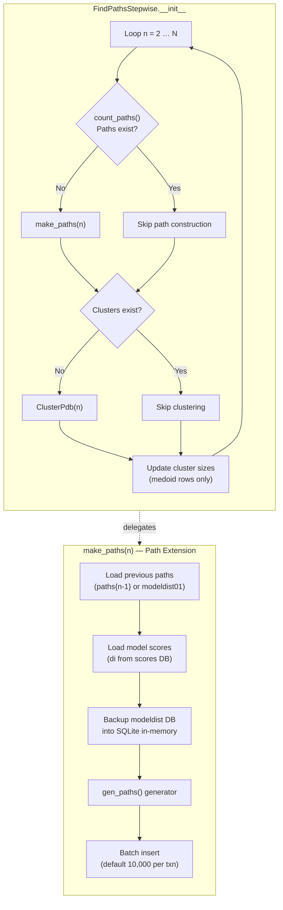
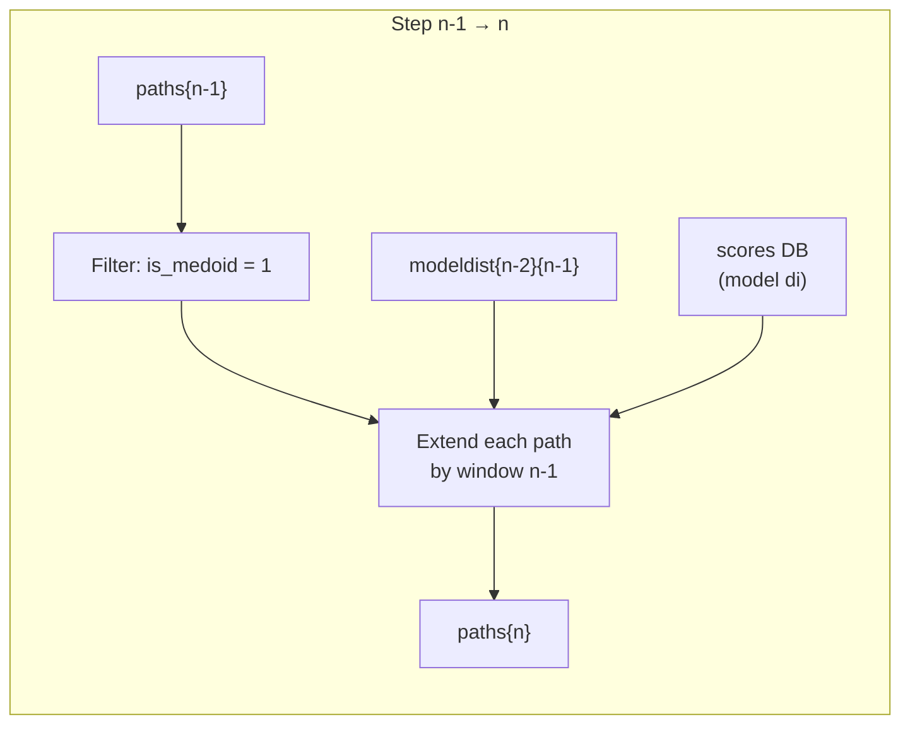

---
slug:11-stepwise-path-search
blog_type:normal
---


**逐步路径搜索**是 IDP-LZerD 路径组装流程的组合核心。它通过在连续残基窗口间逐步链接局部对接模型来构建候选的内在无序蛋白 (IDP) 构象——从双窗口的基准情况一直扩展到完整的目标窗口数。在每个归纳步骤中，已有的部分路径会向外扩展一个窗口，然后进行评分、基于聚类中心点进行过滤，并持久化到 SQLite 中。该算法通过基于中心点的剪枝、防碰撞约束以及批量事务写入，在穷举探索与计算可行性之间取得了平衡。

## 架构概述

逐步搜索由 `FindPathsStepwise` 类编排，该类迭代地为窗口数 *n* = 2, 3, …, *N* 构建路径。每次迭代遵循三阶段循环：**路径构建** → **聚类** → **聚类大小标注**。构造函数会循环遍历所有窗口大小，检查先前已计算的结果（支持中断后恢复），并对每个阶段进行计时以用于性能分析。



`__init__` 构造函数接受 `complexid`（例如 `1ppeEI`）、`nwindows`（总窗口数）、`batchsize`（插入批量大小）和 `directory`（数据库位置）作为参数。它驱动整个迭代流程，并报告每个阶段（路径构建、聚类和聚类大小更新）的耗时占比——即占总运行时间的比例。

来源：[find_paths_stepwise.py](/scripts/find_paths_stepwise.py#L50-L134)

## 路径数据模型

每条路径代表 IDP 在所有窗口上的一个候选构象。长度为 *n* 的路径作为一行存储在 `paths{n}` 表中，其结构如下：

| 列名 | 类型 | 描述 |
|--------|------|-------------|
| `pathsid` | `INTEGER PK` | 自动生成的路径标识符 |
| `window0` … `window{n-1}` | `INTEGER` | 为每个窗口选择的模型 ID |
| `edgescores` | `REAL` | 所有相邻窗口对的平均成对接口分数 |
| `nodescore` | `REAL` | 所有窗口的平均单体模型分数 (`di`) |
| `timestamp` | `DATE` | 自动填充的插入时间戳 |

**输出数据库**遵循命名模式 `path_{complexid}_all.db`，输出表命名为 `paths{nwindows}`。两者均派生自类级别的格式字符串 `out_db_fmt` 和 `out_tablename_fmt`。

来源：[find_paths_stepwise.py](/scripts/find_paths_stepwise.py#L54-L60), [find_paths_stepwise.py](/scripts/find_paths_stepwise.py#L176-L183)

## 归纳式路径构建

`make_paths` 方法实现了核心的归纳算法。它根据当前窗口数区分三种情况：

### 基准情况：nwindows = 2

双窗口情况是归纳的基础。它直接从输入数据库 `{complexid}_modeldist1.db` 的 `modeldist01` 表中读取数据。`modeldist01` 中的每一行代表一对兼容的对接模型（每个窗口一个），这些模型在[模型分数加载](9-model-score-loading)阶段已经过几何阈值过滤。查询选取 `modela AS window0, modelb AS window1, edgescore`，每一对都成为一条路径，其 `edgescores = edgescore`，`nodescore = mean(di_window0, di_window1)`。

### 基准情况：nwindows = 3

三窗口情况同样以 `modeldist01` 作为起始点进行读取（与 nwindows=2 的查询相同），但随后通过查询下一个 `modeldist` 表来扩展每条双窗口路径。存在此单独分支的原因是，其起始数据源仍然是原始的成对表，而非先前计算出的路径表。

### 归纳步骤：nwindows > 3

对于大于 3 的窗口数，算法从输出数据库的 `paths{n-1}` 中读取**已有路径**——但关键是，仅读取那些**聚类中心点**的路径（通过 `JOIN clusters{n-1} USING (pathsid) WHERE is_medoid=1` 实现）。这是主要的剪枝机制：每个聚类中只有代表性路径能够存活到下一轮，从而呈指数级缩减搜索空间。



来源：[find_paths_stepwise.py](/scripts/find_paths_stepwise.py#L159-L243)

## 路径扩展与防碰撞约束

`gen_paths` 内部生成器函数是 `make_paths` 的计算核心。对于每条先前路径，它会：

1. 从先前的路径元组中**提取窗口模型 ID**（截去分数部分）。
2. 针对内存中的 `modeldist` 数据库**构建子查询**，以寻找下一个窗口的兼容模型。
3. **应用防碰撞约束**：`NOT IN` 子查询确保新窗口的候选模型未被同一路径的任何先前窗口使用过。

子查询模板是动态构建的：

```sql
SELECT modelb AS window{n-1}, edgescore
FROM modeldist{n-2}{n-1}
WHERE modela = {path[n-2]}
  AND window{n-1} NOT IN (
    SELECT modelb FROM modeldist{0}{n-1} WHERE modela = {path[0]}
  )
  AND window{n-1} NOT IN (
    SELECT modelb FROM modeldist{1}{n-1} WHERE modela = {path[1]}
  )
  ...for each prior window
```

每个 `NOT IN` 子查询都会阻止候选模型与已分配给较早窗口位置的模型发生冲突。这保证了任何路径中都不会多次出现同一个模型 ID。

<CgxTip>防碰撞 `NOT IN` 子查询是通过编程方式为所有先前窗口（`range(prev_window)`）生成的，因此该约束会随路径长度而缩放。对于长路径，这会产生多子句 SQL——请确保内存数据库具有充足的查询计划缓存。</CgxTip>

来源：[find_paths_stepwise.py](/scripts/find_paths_stepwise.py#L234-L243), [find_paths_stepwise.py](/scripts/find_paths_stepwise.py#L269-L301)

## 分数累积

随着路径的增长，会维护两个累积分数：

**边缘分数 (`edgescores`)**：所有相邻窗口对的平均成对接口分数。当路径从 *n-1* 个窗口扩展到 *n* 个窗口时，先前的平均值会反归一化为总和（`prev_edgescore * n_prev_edges`），加上新的边缘分数后，再在新的边缘数 *n_edges* 上重新取平均。这避免了存储连续总和，并确保无论路径多长，存储的值始终是平均值。

**节点分数 (`nodescore`)**：所有窗口的平均单体模型分数 (`di`)。`di` 值在 `make_paths` 开始时从 `scores_{complexid}.db` 数据库中获取，并缓存在以 `modelid` 为键的字典中。随着每个新窗口模型被追加到路径中，其 `di` 值被添加到运行列表里并重新计算平均值。

| 分数 | 步骤 *n* 的公式 | 数据来源 |
|-------|---------------------|-------------|
| `edgescores` | `(prev_edgescores × (n-2) + new_edgescore) / (n-1)` | `modeldist` 表 |
| `nodescore` | `mean(di_0, di_1, …, di_{n-1})` | `scores_{complexid}.db` → `model.di` |

来源：[find_paths_stepwise.py](/scripts/find_paths_stepwise.py#L250-L254), [find_paths_stepwise.py](/scripts/find_paths_stepwise.py#L279-L301)

## 内存数据库优化

在第 257–265 行出现了一项重要的性能优化：当前窗口对的 `modeldist` 数据库通过 APSW 的备份 API 被完整加载到一个 **SQLite 内存数据库** 中。这意味着路径扩展期间的所有子查询都是针对驻留在 RAM 中的数据执行的，而非访问磁盘，这对于 `gen_paths` 生成器可能会发起数千次参数化查询的情况至关重要。

```python
in_db_disk = apsw.Connection(in_db_file, flags=apsw.SQLITE_OPEN_READONLY)
memcon = apsw.Connection(":memory:")
with memcon.backup("main", in_db_disk, "main") as backup:
    backup.step()
in_db_disk.close()
in_db = memcon.cursor()
```

磁盘连接在备份完成后立即关闭。内存连接 (`memcon`) 用于 `gen_paths` 内的所有后续查询，并在所有路径插入完毕后于清理代码块中关闭。

来源：[find_paths_stepwise.py](/scripts/find_paths_stepwise.py#L257-L265), [find_paths_stepwise.py](/scripts/find_paths_stepwise.py#L323-L325)

## 批量事务写入

路径通过由 `batchsize` 参数（默认值：10,000）控制的**批量**方式插入到输出数据库中。`gen_paths` 生成器通过 `itertools.izip_longest(*[iter(path_gen)] * batchsize)` 按块消费，每个块都包装在一个嵌套的 SQLite 事务中。这在写入性能（更少的提交点）、内存使用（受批量大小限制）和崩溃恢复（部分进度在批量边界处提交）之间取得了平衡。

外部事务包裹了整个 `make_paths` 调用，而内部事务则提交每个批次。插入 SQL 通过 `shared.create_insert_statement` 生成，产生诸如 `INSERT INTO paths3 (window0, window1, window2, edgescores, nodescore) VALUES (:window0, :window1, :window2, :edgescores, :nodescore)` 的参数化查询。

来源：[find_paths_stepwise.py](/scripts/find_paths_stepwise.py#L303-L322)

## 聚类集成与聚类大小更新

在每次调用 `make_paths` 之后，构造函数会调用 `ClusterPdb(complexid, nwindows, directory)` 对新生成的路径执行[启发式聚类](12-heuristic-clustering)。聚类完成后，构造函数会通过以下步骤更新 `clusters{n}` 表中的 `clustersize` 列：

1. 从聚类表中读取所有行（`pathsid`、`cid`、`is_medoid`）。
2. 通过 `groupby('cid').size()` 计算聚类大小。
3. 将大小合并回 DataFrame。
4. 过滤为**仅中心点行**（`is_medoid == 1`）。
5. 执行参数化的 `UPDATE` 语句，为每个中心点写入 `clustersize`。

只有中心点行会接收 `clustersize` 更新，因为中心点是在下一个归纳步骤中存活的唯一代表（通过 `make_paths` 中的 `WHERE is_medoid=1` 过滤器）。非中心点路径通过其 `cid` 关联隐式继承其聚类的大小。

来源：[find_paths_stepwise.py](/scripts/find_paths_stepwise.py#L97-L122)

## 恢复与幂等性

`count_paths` 类方法通过查询输出数据库中的 `paths{n}` 和 `clusters{n}` 表来检查给定窗口级别是否已被计算。如果任一表包含行，则跳过相应的阶段。这实现了**中断后恢复**——如果进程在窗口 *n* 期间崩溃，窗口 2 到 *n-1* 的所有已完成工作都将保留，并且不会被重新计算。

该检查使用 `apsw.SQLError` 异常处理来优雅地应对表尚不存在的情况（首次运行）。会首先短暂打开一个写连接以解析任何 SQLite 日志文件，然后再执行只读的计数查询。

来源：[find_paths_stepwise.py](/scripts/find_paths_stepwise.py#L136-L157)

## 数据库文件约定

逐步路径搜索与三类 SQLite 数据库进行交互：

| 数据库 | 命名模式 | 角色 | 方向 |
|----------|---------------|------|-----------|
| 模型距离 DB | `{complexid}_modeldist{cur_window}.db` | 相邻窗口间的成对接对模型，已通过几何阈值预过滤 | 输入 |
| 分数 DB | `scores_{complexid}.db` | 单体模型分数（来自 `model JOIN allmodel` 的 `di` 列） | 输入 |
| 路径 DB | `path_{complexid}_all.db` | 所有窗口级别的已构建路径（`paths{n}`）和聚类分配（`clusters{n}`） | 输出 |

输入表名遵循 `modeldist{prev_window}{cur_window}` 格式（例如 `modeldist01`、`modeldist12`）。模型距离数据库由[模型分数加载](9-model-score-loading)生成，分数数据库由[数据库创建与结构](8-database-creation-and-schema)创建。

来源：[find_paths_stepwise.py](/scripts/find_paths_stepwise.py#L54-L56), [find_paths_stepwise.py](/scripts/find_paths_stepwise.py#L71-L73)

## 命令行界面

该脚本可直接调用或通过 `commandline` 类方法调用：

```
python find_paths_stepwise.py <complexid> -n <nwindows> [-d DIR] [-b BATCHSIZE] [-v]
```

| 参数 | 必需 | 默认值 | 描述 |
|----------|----------|---------|-------------|
| `complexid` | 是 | — | 带有链后缀的 PDB 标识符（例如 `1ppeEI`） |
| `-n` / `--nwindows` | 是 | — | 要计算的总窗口数 |
| `-d` / `--directory` | 否 | 脚本目录 | 数据库文件的路径 |
| `-b` / `--batchsize` | 否 | 10000 | 每次插入批次的路径数 |
| `-v` / `--verbose` | 否 | `INFO` | 启用 `DEBUG` 级别日志 |

完成后，脚本会记录生成的路径总数和跳过的路径数。

来源：[find_paths_stepwise.py](/scripts/find_paths_stepwise.py#L330-L361)

## 流程位置与数据流

逐步路径搜索位于 IDP-LZerD 流程的中心，它消费经过预过滤的成对接结果，并生成分数化、聚类的路径，以供下游的排序和优化使用：


逐步搜索依赖于[模型分数加载](9-model-score-loading)提供的 `modeldist` 数据库和 `scores` 数据库。其输出（路径表和聚类表）会被[占据分数计算](13-occupancy-score-computation)和[路径选择与排序](14-path-selection-and-ranking)所消费。它内部触发的聚类步骤在[启发式聚类](12-heuristic-clustering)中单独记录。

<CgxTip>归纳步骤中基于中心点的剪枝意味着窗口 *n* 处的路径质量严重依赖于 *n-1* 处的聚类质量。较差的聚类（聚类过少、阈值错误）可能会提前剔除好的路径。请通过 DEBUG 日志输出监控每一级别的聚类计数，以确保具有充足的代表性。</CgxTip>