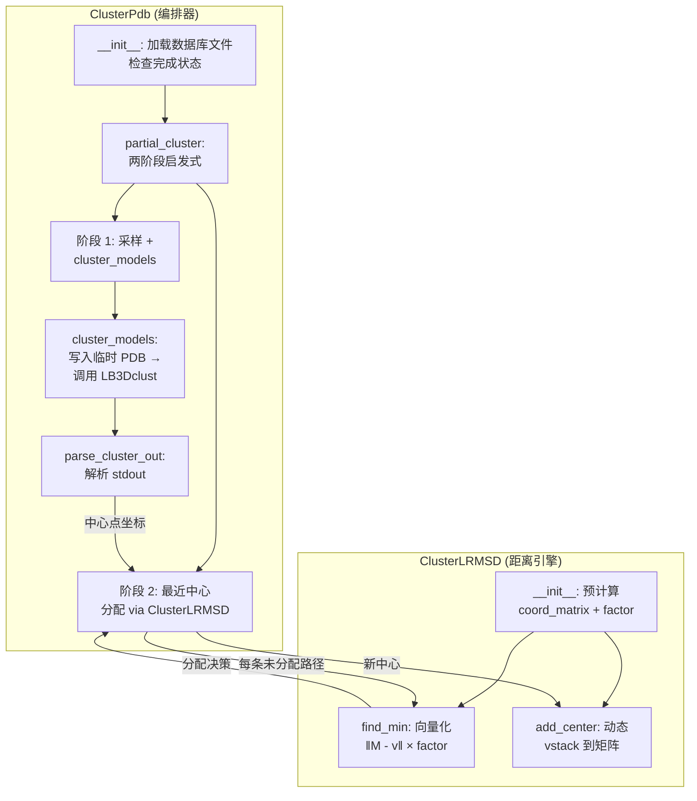
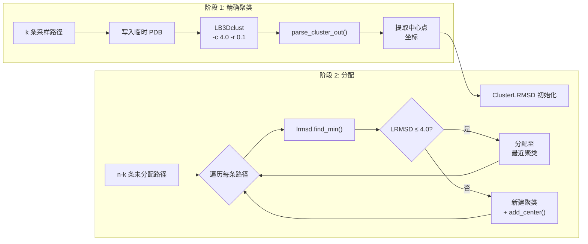

---
slug:12-heuristic-clustering
blog_type:normal
---


启发式聚类模块（`cluster_heuristic.py`）将[逐步路径搜索](11-stepwise-path-search)产生的候选路径的组合爆炸问题，简化为易于处理且结构多样的代表集合。该模块并未对可能多达数百万的路径执行全对比较，而是采用**两阶段策略**：先通过外部的 `LB3Dclust` 二进制文件对随机采样的子集进行精确聚类，随后利用向量化配体-RMSD（LRMSD）将其余路径分配至最近的聚类中心。结果持久化于路径数据库的 `clusters{nwindows}` 表中，使下游的[占据度分数计算](13-occupancy-score-computation)与[路径选择和排序](14-path-selection-and-ranking)能够基于聚类中心点而非原始路径进行运算。

来源：[cluster_heuristic.py](scripts/cluster_heuristic.py#L1-L448)

## 架构概述

本模块围绕两个协同工作的类构建，其职责清晰分离：**`ClusterPdb`** 负责编排整体聚类流程（数据库 I/O、外部进程调用、样本划分），而 **`ClusterLRMSD`** 则提供基于聚类中心进行向量化距离计算的纯数值引擎。这种分离确保了计算密集型的 LRMSD 运算能够得益于 NumPy 的向量化操作，而不会与 I/O 或进程管理逻辑交织在一起。



来源：[cluster_heuristic.py](scripts/cluster_heuristic.py#L41-L89), [cluster_heuristic.py](scripts/cluster_heuristic.py#L96-L200)

## 类：ClusterLRMSD — 向量化距离引擎

`ClusterLRMSD` 封装了第二阶段分配的数学核心。它为所有聚类中心预分配坐标矩阵，并通过 NumPy 的向量化 `linalg.norm` 同时计算目标结构与每个中心之间的配体 RMSD，从而彻底避免了对聚类中心进行 Python 级别的迭代。

**构造函数参数与内部状态：**

| 参数 | 类型 | 描述 |
|-----------|------|-------------|
| `center_coords` | `list of 2-tuples` | 每个元组为 `(pathsid, coords_dict)`，其中 `coords_dict` 将残基索引映射至 3D 坐标 |
| `n_res` | `int` | 配体中的残基数量；用于预计算 RMSD 归一化因子 |
| `ligand` | `str` | 配体的链标识符（默认为 `'B'`） |

**核心内部实现：**

- **`self.factor = n_res ** -0.5`** — RMSD 归一化常数，仅预计算一次。由于 RMSD = √(Σd²/N) = ‖Δ‖ × N^(-0.5)，每个中心的距离计算便简化为单次向量化范数乘以此标量。
- **`self.coord_matrix`** — 一个 `(n_centers, n_res × 3)` 的 float32 NumPy 矩阵。每行是某个聚类中心配体经展平后的 3D 坐标，提取方式为以步长 4 遍历坐标字典（仅从 `{residue: [x,y,z,bfactor]}` 结构中选择 CA 原子）。此步长 4 的提取方式对应于 Rosetta 片段坐标布局，其中每个残基存储 `[x, y, z, bfactor]`。
- **`self.center_ids`** — 一个平行列表，将每个行索引映射回其 `pathsid`，以便在执行 argmin 操作后识别最近的中心。

**`find_min(coords)`** 方法采用相同的步长 4 提取方式展平目标坐标，随后在单次向量化调用中计算 `np.linalg.norm(self.coord_matrix - fixed_coord, axis=1) * self.factor`，返回最近中心的 `pathsid` 和 LRMSD 以及展平后的目标坐标。**`add_center(pathsid, coords)`** 方法通过 `np.vstack` 动态扩展坐标矩阵，使得在分配阶段能够创建新的聚类中心，而无需重新初始化对象。

<CgxTip>步长 4 的坐标提取（`coords[y+1] for y in range(0, len(coords)-1, 4)`）会跳过每四个元素（即 B 因子），仅从每个残基的 `[x, y, z, bfactor]` 元组中选取 x、y、z。此模式必须与分数数据库中的坐标序列化格式相匹配，否则 LRMSD 值将不正确。</CgxTip>

来源：[cluster_heuristic.py](scripts/cluster_heuristic.py#L41-L89)

## 类：ClusterPdb — 流程编排器

`ClusterPdb` 管理完整的聚类生命周期：数据库校验、样本划分、外部聚类调用、第二阶段分配及结果持久化。它由 `FindPathsStepwise` 在每个窗口步骤（n=2, 3, …, N）中调用，这意味着聚类是在路径组装过程中增量执行的。

### 初始化与幂等性

构造函数接受 `complexid`、`nwindows`、`directory` 和 `limit` 参数。它会校验两个必需的数据库文件是否存在——`path_{complexid}_all.db`（包含来自逐步路径搜索的 `paths{nwindows}` 表）和 `scores_{complexid}.db`（包含模型坐标）——若任一文件缺失则抛出 `ClusterPdbError`。在执行计算前，它会检查 `clusters{nwindows}` 表中是否已包含所有路径的对应行（即 `cluster_count == path_count`）。若聚类已完成，则整体跳过；若部分完成（存在部分行而非全部），则抛出错误退出，以防出现不一致状态。

来源：[cluster_heuristic.py](scripts/cluster_heuristic.py#L150-L202)

### 两阶段启发式算法：`partial_cluster`

`partial_cluster` 方法实现了本模块的核心算法贡献。其命名反映了设计思路：先对*部分*（采样）路径集合进行精确聚类，然后启发式地分配其余路径。

**阶段 1 — 自适应采样与精确聚类：**

采样大小 *k* 由平衡精度与计算成本的自适应启发式算法确定：

| 条件 | 采样大小 *k* | 依据 |
|-----------|-----------------|-----------|
| n/2 ≤ 10,000 | n/2 | 小数据集：使用一半以提供足够的中心覆盖 |
| 10% of n > 10,000 | 10,000 | 超大数据集：设上限以限制 LB3Dclust 运行时间 |
| 其他 | 10% of n | 中等数据集：10% 即可提供充分的代表性 |

其中 *n* 为路径总数。通过 `np.random.choice(n, k, replace=False)` 均匀随机选取 *k* 条路径，然后从分数数据库中通过串联路径中每个模型的 JSON 反序列化坐标来组装其 3D 坐标。`cluster_models` 方法将这些坐标写为临时 PDB 文件（每个残基一个 CA 原子），并使用聚类截断值和 0.1 Å 的 RMSD 容差调用 `LB3Dclust`，最后解析结构化的标准输出，以生成带有中心点标志的聚类分配结果。

**阶段 2 — 最近中心分配：**

阶段 1 完成后，使用所有中心点结构的坐标初始化一个 `ClusterLRMSD` 实例。对于剩余的 (n − k) 条路径，算法逐一执行：

1. 加载并展平该路径的配体坐标
2. 调用 `lrmsd.find_min()` 寻找最近的中心点及其 LRMSD
3. **若 LRMSD ≤ 截断值**（默认 4.0 Å）：将该路径作为非中心点成员分配至该中心点的聚类中（`is_medoid=0`）
4. **若 LRMSD > 截断值**：以 `cid = max_cluster_id + 1` 创建新聚类，将该路径指定为新中心点（`is_medoid=1`），并调用 `lrmsd.add_center()` 扩充坐标矩阵用于后续比较

这构成了一种**中心点增长**策略：与任何现有中心均不相似的、结构新颖的路径会衍生出其自身的单例聚类，从而确保没有路径会被强行分配至距离不当的聚类中。



来源：[cluster_heuristic.py](scripts/cluster_heuristic.py#L237-L347)

### 残基数量计算

用于 LRMSD 归一化的残基数量（`n_res`）取决于当前窗口数是否等于总窗口数。当 `nwindows == total_windows` 时，正在对完整蛋白质进行建模，且重叠窗口每次重叠贡献 3 个额外残基：`n_res = nres + (total_windows - 1) * 3`。否则，使用简化估算 `nwindows * 9`（每窗口 9 个残基，反映片段生成流程中的默认窗口大小）。该值通过 `ClusterLRMSD` 中的 `n_res ** -0.5` 归一化因子直接影响 RMSD 量级。

来源：[cluster_heuristic.py](scripts/cluster_heuristic.py#L308-L314)

### 外部聚类：`cluster_models`

此方法在 Python 与 LZerD C++ 聚类二进制文件之间起到了桥接作用。对于样本中的每条路径，它会将仅包含 CA 原子的 PDB 文件写入临时 `{groupid}merged/` 目录。所有文件路径均记录在 `ligand_list_{groupid}.txt` 文件中，该文件连同截断值与 RMSD 容差参数一并传递给 `LB3Dclust`：

```
LB3Dclust -L ligand_list.txt -c 4.0 -r 0.1
```

该二进制文件的标准输出由 `parse_cluster_out()` 解析，此函数区分中心点行（前缀为 `CID=`）与子节点行（前缀为 `chil`），并从固定列位置提取聚类 ID 和模型文件名。不符合规范的行将被写入 `clusters_{groupid}_out.txt` 错误日志。解析完成后，除非设置 `cleanup=False`，否则将清理临时文件。

来源：[cluster_heuristic.py](scripts/cluster_heuristic.py#L348-L418), [cluster_heuristic.py](scripts/cluster_heuristic.py#L204-L235)

### 输出解析：`parse_cluster_out`

`LB3Dclust` 二进制文件输出结构化文本格式，包含两种行类型：

| 行前缀 | 保留列 | 列索引 | 含义 |
|-------------|-------------|----------------|---------|
| `CID=` | (1, 7) → `cid`, `model` | 聚类 ID 与 PDB 文件名 | 聚类的中心点（代表） |
| `chil` | (2, 6) → `cid`, `model` | 聚类 ID 与 PDB 文件名 | 子节点（非代表）成员 |

中心点行设置 `is_medoid=1`；子节点行设置 `is_medoid=0`。模型文件名随后通过在 PDB 文件创建期间建立的 `lig_file_dict` 反向查找映射回 `pathsid`。

来源：[cluster_heuristic.py](scripts/cluster_heuristic.py#L204-L235)

## 数据库模式与持久化

聚类结果存储于 `path_{complexid}_all.db` 的 `clusters{nwindows}` 表中。该表由 `make_sql()` 创建，其模式如下：

| 列名 | 类型 | 约束 | 描述 |
|--------|------|------------|-------------|
| `pathsid` | INTEGER | PRIMARY KEY, FK → `paths{nwindows}` | 唯一路径标识符（与路径表 1:1 对应） |
| `cid` | INTEGER | NOT NULL | 聚类分配标识符 |
| `is_medoid` | INTEGER | NOT NULL | 若该路径为聚类代表则为 1，否则为 0 |
| `clustersize` | INTEGER | — | 此聚类中的路径数（由 `FindPathsStepwise` 在聚类后更新） |

指向 `paths{nwindows}` 的外键关系确保了引用完整性：每条被聚类的路径必须存在于逐步搜索结果中。聚类行以 10,000 为一批插入，使用带有由 `shared.create_insert_statement()` 生成的命名参数绑定的 `executemany`，从而在处理大型路径集时最大限度减少数据库往返开销。

来源：[cluster_heuristic.py](scripts/cluster_heuristic.py#L101-L148), [cluster_heuristic.py](scripts/cluster_heuristic.py#L191-L199)

## 流程集成

在生产环境中，`ClusterPdb` 通常不从命令行直接调用——它在路径组装期间由 `FindPathsStepwise.__init__()` 在每个窗口步骤中调用。逐步搜索先为 `nwindows=2` 构建路径并聚类，随后推进至 `nwindows=3`，依此类推。每轮聚类完成后，`FindPathsStepwise` 会按 `cid` 分组计算每个中心点的 `clustersize` 并更新数据库。这些聚类大小成为[路径选择和排序](14-path-selection-and-ranking)中使用的四个评分维度之一，其中较小的聚类（代表罕见构象）可能会根据权重方案受到惩罚或青睐。

命令行接口确实可供独立使用：

```bash
python cluster_heuristic.py 4ah2AB -n 3 -d /path/to/db/files -v
```

| 参数 | 必需 | 描述 |
|----------|----------|-------------|
| `complexid` | 是 | PDB 代码 + 受体链 + 配体链（例如 `4ah2AB`） |
| `-n / --nwindows` | 是 | 要聚类的窗口数 |
| `-d / --directory` | 否 | 包含数据库文件的目录（默认：脚本所在目录） |
| `-v / --verbose` | 否 | 启用调试级别日志 |
| `-l / --limit` | 否 | 限制处理路径数的 SQL LIMIT |

<CgxTip>`clustersize` 列并非由 `ClusterPdb` 自身填充——它是在聚类完成后，由 `FindPathsStepwise` 使用 pandas 对 `cid` 进行 groupby 操作来更新的。任何对 `ClusterPdb` 的独立调用都将生成不含大小的聚类，若下游评分依赖于 `clustersize`，则需单独执行更新步骤。</CgxTip>

来源：[cluster_heuristic.py](scripts/cluster_heuristic.py#L420-L447), [find_paths_stepwise.py](scripts/find_paths_stepwise.py#L82-L123)

## 算法复杂度与性能特征

与全对聚类相比，两阶段设计显著降低了计算成本。假设路径总数为 *n*，采样路径数为 *k*：

| 方面 | 全对聚类 | 启发式聚类（本模块） |
|--------|-----------|------------------------|
| 距离计算 | O(n²) | O(k²) + O((n−k) × c)，其中 c = 最终中心数 |
| 外部聚类成本 | O(n² × d)，其中 d = 原子数 | O(k² × d) — 取决于阶段 1 |
| 内存（坐标矩阵） | O(n × d) | O(c × d) — 仅保留中心 |
| 临时 PDB I/O | n 个文件 | k 个文件（仅阶段 1） |

有效成本以 O(k × n) 而非 O(n²) 的规模增长，且由于 k = min(n/2, 0.1n, 10000)，对于大规模路径集，节省的计算量尤为可观。阶段 2 中 NumPy 的向量化距离计算进一步确保了单路径分配成本仅为单次矩阵减法与范数计算，而非对聚类中心执行 Python 循环。

来源：[cluster_heuristic.py](scripts/cluster_heuristic.py#L237-L347), [cluster_heuristic.py](scripts/cluster_heuristic.py#L71-L89)

## 下游消费

`clusters{nwindows}` 表作为流水线剩余部分的结构多样性过滤器。[占据度分数计算](13-occupancy-score-computation)模块使用聚类中心点（即 `is_medoid=1` 的行）计算受体表面的空间占据度。[路径选择和排序](14-path-selection-and-ranking)模块查询与路径分数、聚类大小及占据度分数相连接的中心点，以计算加权 Z 分数排序。若没有聚类，路径选择将不得不评估所有路径（成本高昂难以承受），或面临选出结构冗余候选者的风险——基于中心点的方法确保了最终模型集同时在效率与结构多样性上得到保障。