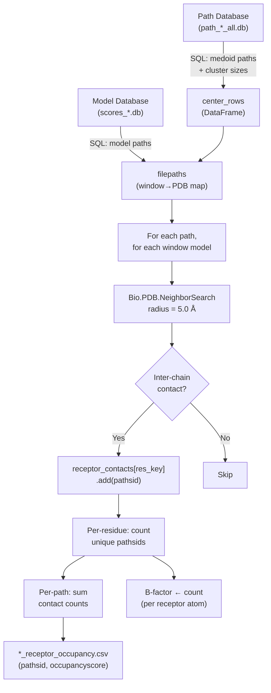
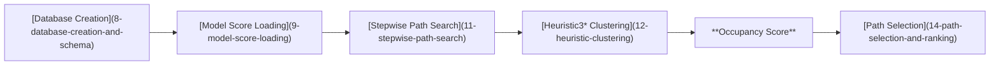

---
slug:13-occupancy-score-computation
blog_type:normal
---


**占据度分数**量化了每条组装路径与受体表面的接触广泛程度，生成一个奖励多样化界面覆盖的逐路径指标。这是路径选择前的最后一个评分组件，反映了一种生物物理直觉：一条接触多个受体残基的路径——尤其是那些也被其他高质量路径接触的残基——代表了一种结构上合理的对接排布。该计算在 `PlotPaths` 中实现，它遍历每条路径中的每个模型，在受体-配体界面上执行空间邻域搜索，并将接触计数聚合到逐残基的 B-factor 字段和逐路径的占据度 CSV 中，供下游的[路径选择与排序](14-path-selection-and-ranking)使用。

来源: [compute_occupancy_score.py](scripts/compute_occupancy_score.py#L1-L309)

## 算法概述

占据度分数的计算在概念上分为三个阶段：**数据加载**（从路径和模型数据库中查询）、**接触枚举**（在距离截断值内对受体-配体残基对进行空间搜索）和**分数聚合**（计算接触每个受体残基的路径数，然后按路径对这些计数求和）。下图展示了端到端的流程：



来源: [compute_occupancy_score.py](scripts/compute_occupancy_score.py#L67-L196)

## 数据加载与查询构建

`PlotPaths` 类通过 `find_db_files` 编排数据检索，该函数根据窗口数量动态构建 SQL 查询。涉及两个数据库：

| 数据库 | 文件名模式 | 内容 |
|---|---|---|
| 路径数据库 | `path_{pdbid}_all.db` | `paths{n}` 表（路径 ID → 窗口模型 ID），`clusters{n}` 表（聚类分配） |
| 模型数据库 | `scores_{pdbid}.db` | `model`、`allmodel` 和 `window` 表（模型 ID → 文件路径解析） |

构建了三个 SQL 查询并存储在 `query_dict` 中：

1. **`plot` 查询** — 通过连接 `clusters{nwindows}` 和 `paths{nwindows}`，检索中心点聚类中心及其 `pathsid`、`nodescore`、`edgescores`、`cid`、`clustersize` 和 `is_medoid` 标志。
2. **`clustersize` 查询** — 通过在逐渐变宽的 `paths` 表上执行级联 `JOIN` 操作，计算每条路径在所有窗口级别（从 `clusters3` 到 `clusters{nwindows}`）上的聚类大小总和。
3. **`paths` 查询** — 从 `paths{nwindows}` 中选择 `pathsid` 和所有 `window0…windowN-1` 列，随后由 `get_paths` 用于解析模型文件路径。

当 `nwindows` 为 `None` 时，该方法会内省数据库的 `sqlite_master` 表以查找最大的 `pathsN` 表，默认使用最精细的路径组装结果。

来源: [compute_occupancy_score.py](scripts/compute_occupancy_score.py#L208-L286)

## 接触枚举：`count_receptor_contacts`

这是计算的核心部分。在通过 `get_paths` → `shared.add_model_path` 解析每个窗口模型的 PDB 文件路径后，算法遍历每条路径及该路径下的每个模型文件：

1. **结构解析** — 每个模型 PDB 在通过 `shared.strip_h` 去除氢原子后，由 `Bio.PDB.PDBParser` 加载，生成原子结构。
2. **邻域搜索** — 根据结构中的所有原子构建 `Bio.PDB.NeighborSearch`。调用 `search_all(radius=5.0, level="R")` 返回原子间距离在 **5.0 Å** 以内的所有残基对。
3. **链间过滤** — 对于每个残基对 `(res1, res2)`，算法检查是否一个残基属于受体链而另一个属于配体链。同链残基对被丢弃。受体侧残基被识别并使用 `{chain}_{resname}{resid}` 格式生成键。
4. **路径注册** — 将 `pathsid` 添加到 `receptor_contacts` 默认字典中与该受体残基键关联的 `set` 中，确保每条路径在每个残基上最多被计数一次。

<CgxTip>5.0 Å 截断值是结构生物学中标准的接触距离，大致涵盖了范德华接触加上一个溶剂层。在此距离内的残基被认为是结合界面的一部分。</CgxTip>

来源: [compute_occupancy_score.py](scripts/compute_occupancy_score.py#L103-L169)

## 分数聚合与输出

处理完所有路径后，将生成两个输出：

### 逐残基接触计数（B-factor）

对于受体链中的每个残基，接触它的不同路径数计算为 `len(receptor_contacts[key])`。此计数被写入该残基中每个原子的 **B-factor** 字段。尽管源代码中 PDB 文件写入当前已被注释掉（第184–187行），但 B-factor 赋值在内存中仍然有效，从而支持下游的可视化或分析。

### 逐路径占据度分数（CSV）

每条路径的占据度分数通过遍历所有受体接触集并累加来计算：

```
对于每个受体残基 r：
    n_contacts = |receptor_contacts[r]|   # 接触 r 的路径数
    对于 receptor_contacts[r] 中的每个 pathid：
        path_score_dict[pathid] += n_contacts
```

这意味着，接触**高度共享**受体残基（被许多其他路径接触的残基）的路径，比接触**唯一占据**残基的路径获得更大的贡献。生成的 `path_score_dict` 被序列化为 `{pdbwindowid}_receptor_occupancy.csv`，包含 `pathid` 和 `occupancyscore` 列。

起始处的文件存在检查（`shared.missing(outfile) and shared.missing(path_score_file)`）确保在两个输出文件均已存在时跳过耗时的计算。

来源: [compute_occupancy_score.py](scripts/compute_occupancy_score.py#L170-L196)

## 残基键格式

受体残基由复合键标识：`{chain}_{resname}{resid}`。例如，A链42位的谷氨酸生成键 `A_E42`。`resid` 字段来自 `residue.get_full_id()`，它返回一个四元组，其中第四个元素是异质残基 ID 元组——`[1]` 索引提取整数序列位置。即使存在多条链或插入码，此键方案也能唯一标识残基。

来源: [compute_occupancy_score.py](scripts/compute_occupancy_score.py#L122-L125)

## 与路径选择的下游集成

占据度分数 CSV 由[路径选择与排序](14-path-selection-and-ranking)使用，在那里与其他评分组件合并。在 `select_paths.py` 中，四个分数组合为一个加权的复合分数：

| 分数 | 权重 | 方向 | 含义 |
|---|---|---|---|
| `nodescore` | 0.5 | 越低越好 | 逐窗口对接分数之和 |
| `edgescores` | 0.1 | 越低越好 | 成对窗口兼容性分数之和 |
| `clustersize` | 0.3 | 越高越好 | 同一聚类中的路径数 |
| `occupancyscore` | 0.1 | 越高越好 | 受体接触占据度 |

每个分数被转换为 Z 分数，最终的 `weighted_score` 混合了“最佳分数”组件（所有四个分数中最小 Z 分数的 30% 权重）与各个 Z 分数的加权和（70% 权重）。因此，占据度分数既直接贡献（占加权和的 10%），也间接贡献（作为最佳分数项的候选）。

来源: [select_paths.py](scripts/select_paths.py#L37-L152)

## 命令行接口

该脚本作为独立模块调用：

```
python compute_occupancy_score.py <complexname> \
    -r <receptor_chain> -l <ligand_chain> \
    -n <nwindows> [-d <directory>]
```

| 参数 | 必需 | 描述 |
|---|---|---|
| `complexname` | 是 | PDB 代码或标识符（位置参数） |
| `-r` / `--receptor_chain` | 是 | 受体链标识符 |
| `-l` / `--ligand_chain` | 是 | 配体链标识符 |
| `-n` / `--nwindows` | 是 | 路径组装中的窗口数 |
| `-d` / `--directory` | 否 | 数据库文件的位置（默认为脚本目录） |

来源: [compute_occupancy_score.py](scripts/compute_occupancy_score.py#L288-L308)

## 错误处理

在几种表明是上游流水线问题而非简单数据异常的场景下，会引发 `PlotPathsError` 异常：

| 条件 | 位置 | 消息 |
|---|---|---|
| `nwindows < 2` | 构造函数 | `"nwindows must be 2 or greater"` |
| 路径数据库文件缺失 | `find_db_files` | `"File %s not found"` |
| 未返回中心点行 | `run` | `"No rows"` |
| 聚类大小为空 | `run` | `"Null sumcsize, may need to rerun find"` |
| 结构文件为空 | `count_receptor_contacts` | `"No atoms in %s"` |
| 接触残基均不在受体上 | `count_receptor_contacts` | `"Neither %s nor %s is receptor"` |

空聚类大小检查尤为重要：它检测[启发式聚类](12-heuristic-clustering)是否未运行或未完成，因为 `sumcsize` 聚合依赖于已填充的 `clusters` 表。

来源: [compute_occupancy_score.py](scripts/compute_occupancy_score.py#L40-L166)

## 流水线位置与依赖关系

占据度分数计算位于 IDP-LZerD 流水线的靠后阶段，在路径组装和聚类之后、最终路径选择之前。它需要以下前置条件：



- **路径数据库**必须包含已填充 `clustersize` 值（通过[启发式聚类](12-heuristic-clustering)）的 `paths{n}` 和 `clusters{n}` 表。
- **模型数据库**必须包含具有正确文件路径（通过[数据库创建与模式](8-database-creation-and-schema)）的 `model`、`allmodel` 和 `window` 表。
- **模型 PDB 文件**必须存在于模型数据库记录的路径下的磁盘上。

计算出占据度分数后，流水线继续执行[路径选择与排序](14-path-selection-and-ranking)，将占据度分数集成到其加权评分函数中，最终进入 [CHARMM 弛豫协议](15-charmm-relaxation-protocol)进行结构精修。