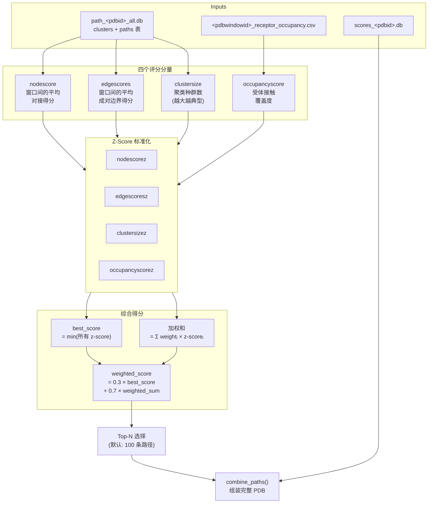
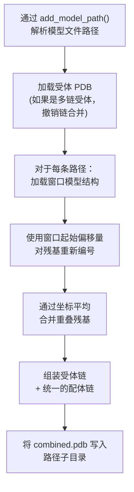

---
slug:14-path-selection-and-ranking
blog_type:normal
---


**路径选择与排序**阶段是 IDP-LZerD 流程的决定性阶段：它将四个独立计算的质量指标合成为一个综合得分，选择排名最高的构象路径，并将其按窗口的结构模型组装成完整的蛋白质复合物 PDB 文件，以备进行 CHARMM 优化。该阶段在 `select_paths.py` 中实现，此模块消耗[逐步路径搜索](11-stepwise-path-search)、[启发式聚类](12-heuristic-clustering)和[占据度得分计算](13-occupancy-score-computation)的输出，是整个评分流程的汇聚点。

来源：[select_paths.py](scripts/select_paths.py#L1-L304)

## 评分架构：四分量组合

排序系统沿四个正交的质量维度评估每个聚类中心路径。每个指标捕获一个独特的结构属性，并通过**双项加权公式**将它们组合起来，在起保护作用的“最佳得分”项与共识加权平均项之间取得平衡。



### 分量定义

| 得分 | 方向 | 权重 | 来源 | 描述 |
|---|---|---|---|---|
| **nodescore** | 越低越好 ↑ | 0.5 | `paths{nwindows}` 表 | 路径中所有窗口的逐窗口对接界面得分（`di` 值）的平均值 |
| **edgescores** | 越低越好 ↑ | 0.1 | `paths{nwindows}` 表 | 相邻窗口模型之间的平均成对几何兼容性得分 |
| **clustersize** | 越高越好 ↓ | 0.3 | `clusters{nwindows}` 表 | 分配给同一聚类的路径数量——较大的聚类代表更典型的构象 |
| **occupancyscore** | 越高越好 ↓ | 0.1 | `{pdbwindowid}_receptor_occupancy.csv` | 受体残基上的接触计数总和——衡量配体路径接触受体表面的充分程度 |

“方向”列指示原始得分是**升序**（越低越好）还是**降序**（越高越好）。这一区别对 Z-score 的计算至关重要：降序得分在标准化前需乘以 −1，以确保所有 Z-score 都共享“越低越好”的语义。

来源：[select_paths.py](scripts/select_paths.py#L37-L42)，[select_paths.py](scripts/select_paths.py#L130-L151)

## Z-Score 标准化与组合公式

四个原始得分中的每一个都使用应用于所有聚类中心路径的标准公式转换为 Z-score：

$$z_i = \frac{s_i - \mu}{\sigma}$$

对于**降序**指标（`clustersize`、`occupancyscore`），原始得分在进行 Z-score 转换前取负：`zscore(score × −1)`。此反转统一了所有四个 Z-score，使得**较低的值始终表示更好的质量**。

来源：[select_paths.py](scripts/select_paths.py#L130-L139)，[select_paths.py](scripts/select_paths.py#L276-L278)

### 双项加权得分

综合 `weighted_score` 计算如下：

```
best_score    = min(nodescorez, edgescoresz, clustersizez, occupancyscorez)
weighted_sum  = 0.5×nodescorez + 0.1×edgescoresz + 0.3×clustersizez + 0.1×occupancyscorez
weighted_score = 0.3 × best_score + 0.7 × weighted_sum
```

**best_score** 项充当安全网：它捕获所有分量中最坏情况（最低）的 Z-score，确保任何在单一指标上得分极差的路径不会获得高排名。**weighted_sum** 项编码了分析师调整的各指标的相对重要性。全局常量 `b_weight = 0.3` 控制这两个项之间的权衡。

<CgxTip>`b_weight` 参数 (0.3) 和 `neco_weights` 向量 ([0.5, 0.1, 0.3, 0.1]) 是模块级常量——修改它们需要直接编辑 `select_paths.py`。主要贡献者是 `nodescore`（权重 0.5），反映了逐窗口对接质量是首要的选择标准。</CgxTip>

来源：[select_paths.py](scripts/select_paths.py#L37-L38)，[select_paths.py](scripts/select_paths.py#L140-L151)

## 权重配置参考

| 参数 | 默认值 | 作用 |
|---|---|---|
| `b_weight` | 0.3 | best_score（最小 Z-score）项的权重 |
| `neco_weights[0]` | 0.5 | 加和中 `nodescorez` 的权重 |
| `neco_weights[1]` | 0.1 | 加和中 `edgescoresz` 的权重 |
| `neco_weights[2]` | 0.3 | 加和中 `clustersizez` 的权重 |
| `neco_weights[3]` | 0.1 | 加和中 `occupancyscorez` 的权重 |
| `default_count` | 100 | 如果省略 `--count`，要选择的顶级路径数量 |

`neco_weights` 内的权重总和必须为 1.0，且 `b_weight` 与加和项的 `(1 − b_weight) = 0.7` 互补。这确保了综合得分是这两个项的凸组合。

来源：[select_paths.py](scripts/select_paths.py#L37-L54)

## 数据检索：查询聚类中心

`select_paths` 方法构造一个 SQL 查询，连接 `clusters{nwindows}` 和 `paths{nwindows}` 表，并筛选为**仅聚类中心**（`is_medoid = 1`）。这是一个关键的设计选择：不对所有路径评分，而仅评估每个聚类的代表性中心，在保持结构多样性的同时大幅降低了计算成本。

```sql
SELECT pathsid, nodescore, edgescores, clustersize,
       window0, window1, ..., windowN
FROM clusters{nwindows}
JOIN paths{nwindows} USING (pathsid)
WHERE is_medoid = 1
```

然后通过在 `pathsid` 上进行左连接来合并占据度得分 CSV。如果任何中心缺少占据度得分，则会引发 `SelectPathsError`——这强制了数据完整性并防止了静默评分失败。

来源：[select_paths.py](scripts/select_paths.py#L78-L128)

## Top-N 选择与得分导出

为所有中心计算 `weighted_score` 后，DataFrame 按升序排序（越低越好），并保留前 `ct` 条路径。在目标目录中生成两个输出：

1. **`path_scores.csv`** — 包含每条选定路径的 `pathsid`、所有四个 Z-score、`best_score` 和 `weighted_score`，支持对排序决策进行事后分析。
2. **`filelist.csv`** — 包含每个组装的 `combined.pdb` 的文件路径，作为后续 [CHARMM 弛豫协议](15-charmm-relaxation-protocol) 的输入清单。

来源：[select_paths.py](scripts/select_paths.py#L149-L158)，[select_paths.py](scripts/select_paths.py#L272-L274)

## 路径组合：组装完整的复合物结构

`combine_paths` 方法将每条选定路径从逐窗口模型 ID 序列转换为单一连贯的 PDB 文件。这是模块中结构最复杂的操作，处理残基重新编号、重叠区坐标平均以及受体-配体组装。

### 逐步组装流程



**残基重新编号**：每个窗口模型包含从 1 开始编号的配体残基。`window_starts` 数组（从模型数据库的 `window` 表中查询）为每个窗口提供正确的起始残基编号。残基被分离，通过将每个残基 ID 加上 `(res_start − 1)` 重新编号，然后重新附加。

**重叠解决**：相邻窗口共享重叠残基（通常在每个边界处有 3 个残基）。当一个残基 ID 出现在两个窗口链中时，重叠原子将被**平均**——合并后的残基接收位于两个模型中间的坐标。这种平滑混合避免了窗口边界处的不连续性。

**受体整合**：受体结构仅加载一次并在所有路径中复用。如果受体原本是多链的（通过 `CombineChain` 合并），则 `undo` 操作会重建原始链分解。对于每条路径，构建一个包含所有受体链加上统一配体链的新结构，并保存为 `combined.pdb`。

<CgxTip>重叠平均假设在窗口边界处恰好有 2 个残基共享同一 ID。如果在相同位置发现 0 或 3 个以上残基，则会引发 `SelectPathsError`——这可防止路径数据损坏或窗口定义未对齐。</CgxTip>

来源：[select_paths.py](scripts/select_paths.py#L160-L274)，[shared.py](scripts/shared.py#L260-L290)，[combine_receptor.py](scripts/combine_receptor.py#L146-L157)

## 目录布局与输出结构

对于受体链为 `A`、配体链为 `C` 且有 7 个窗口的复合物 `4ah2`，输出目录的结构如下：

```
4ah2ac7/                      # 目标目录 (小写)
├── path_scores.csv           # Top-N 路径的 Z-score 和 weighted_score
├── filelist.csv              # combined.pdb 文件的路径 (CHARMM 输入)
├── 1/
│   └── combined.pdb          # pathsid 为 1 的组装复合物
├── 2/
│   └── combined.pdb
├── ...
└── 100/
    └── combined.pdb
```

来源：[select_paths.py](scripts/select_paths.py#L87-L99)，[select_paths.py](scripts/select_paths.py#L203-L207)

## 命令行接口

```
python select_paths.py <complexname> -r <receptor_chain> -l <ligand_chain> -n <nwindows> [-d DIR] [-c COUNT]
```

| 参数 | 必需 | 默认值 | 描述 |
|---|---|---|---|
| `complexname` | 是 | — | 4 字符 PDB 代码（例如 `4ah2`） |
| `-r, --receptor_chain` | 是 | — | 受体链标识符 |
| `-l, --ligand_chain` | 是 | — | 配体链标识符 |
| `-n, --nwindows` | 是 | — | 窗口数量 |
| `-d, --directory` | 否 | 脚本目录 | 数据库和占据度文件的位置 |
| `-c, --count` | 否 | 100 | 要选择的顶级路径数量 |

来源：[select_paths.py](scripts/select_paths.py#L280-L303)

## 错误处理

`SelectPaths` 类通过在以下情况引发 `SelectPathsError` 异常来强制执行严格的数据完整性：

- 缺少占据度 CSV 文件——占据度得分必须由[占据度得分计算](13-occupancy-score-computation)预先计算
- 合并后任何中心路径的占据度得分为空——表明评分数据不完整
- 任何评分列包含空值——防止未定义的 Z-score
- 重叠解决在同一位置遇到 0 或 3 个以上残基——表明结构不一致

来源：[select_paths.py](scripts/select_paths.py#L45-L48)，[select_paths.py](scripts/select_paths.py#L117-L128)，[select_paths.py](scripts/select_paths.py#L265-L266)

## 流程位置与依赖关系

路径选择与排序位于三个上游生产者的汇聚处，并将其输出直接送入优化阶段：

| 上游 | 提供 | 文件 |
|---|---|---|
| [逐步路径搜索](11-stepwise-path-search) | `path_{pdbid}_all.db` — 路径与聚类表 | `find_paths_stepwise.py` |
| [启发式聚类](12-heuristic-clustering) | `clusters{nwindows}` 中的聚类中心与大小 | `cluster_heuristic.py` |
| [占据度得分计算](13-occupancy-score-computation) | `{pdbwindowid}_receptor_occupancy.csv` | `compute_occupancy_score.py` |

| 下游 | 消耗 | 文件 |
|---|---|---|
| [CHARMM 弛豫协议](15-charmm-relaxation-protocol) | 每条路径的 `filelist.csv` → `combined.pdb` | `idp_relax.inp` |