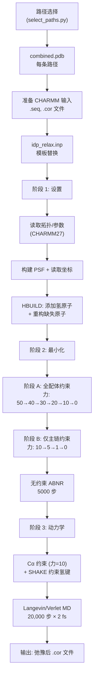

---
slug:15-charmm-relaxation-protocol
blog_type:normal
---

CHARMM 弛豫协议是 IDP-LZerD 流程中的最终精细化阶段，负责将原始组装路径转化为物理上合理的全原子复合物结构。该协议以 CHARMM 输入脚本（`idp_relax.inp`）实现，执行**三个顺序操作**：拓扑设置与氢键构建、带衰减谐和约束的分阶段能量最小化，以及短时分子动力学平衡。该协议是[路径选择与排序](14-path-selection-and-ranking)的组合路径组装输出与用于生物学分析的最终精细化模型之间的桥梁。

来源: [idp_relax.inp](/idp_relax.inp#L1-L119), [README.md](/README.md#L59-L61)

## 协议架构

弛豫协议遵循一种审慎的渐进升级策略——它从不突然移除约束。相反，谐和力常数以分阶段递增的方式衰减，允许配体（内在无序蛋白）在受体保持固定的情况下逐渐探索其局部能量景观。这可以防止灾难性的结构扭曲，因为如果包含片段拼接几何缺陷的组装路径在无约束的情况下进行最小化，就会发生这种扭曲。

来源: [idp_relax.inp](/idp_relax.inp#L1-L119), [scripts/select_paths.py](/scripts/select_paths.py#L160-L275)

## 模板变量与调用

`idp_relax.inp` 文件**并非**直接执行——它包含 Python 风格的花括号占位符，在 CHARMM 解析之前必须将其替换为具体值。`select_paths.py` 脚本准备了作为 CHARMM 输入的子目录结构和合并的 PDB 文件，但实际的变量替换和 CHARMM 执行需由用户手动完成（如 README 中所述："编辑 CHARMM 输入文件 `idp_relax.inp` 以运行 CHARMM"）。

| 占位符 | 描述 | 示例 |
|---|---|---|
| `{charmm_dir}` | CHARMM 安装的根目录 | `/apps/charmm` |
| `{working_dir}` | 包含 `.seq` 和 `.cor` 文件的工作目录 | `/data/4ah2ac3/1` |
| `{filename}` | 输入/输出文件的基本名称（不含扩展名） | `combined` |
| `{receptor_chain}` | 受体的 CHARMM 片段标识符 | `A` |
| `{ligand_chain}` | 配体/IDP 的 CHARMM 片段标识符 | `C` |

替换后，脚本期望在 `@dir` 中有两个输入文件：`@nam.seq`（CHARMM 序列文件）和 `@nam.cor`（CHARMM 坐标文件）。必须使用标准的 CHARMM 准备流程，从[路径选择与排序](14-path-selection-and-ranking)的 `combined.pdb` 输出中准备这些文件。

来源: [idp_relax.inp](/idp_relax.inp#L1-L8), [README.md](/README.md#L59-L61), [scripts/select_paths.py](/scripts/select_paths.py#L160-L164)

## 阶段 1：拓扑设置与氢键构建

脚本首先加载 **CHARMM27 全原子力场**（`top_all27_prot_na.rtf` 和 `par_all27_prot_na.prm`），该力场为蛋白质和核酸提供了残基模板以及成键/非键参数。序列从外部的 `.seq` 文件流式读入，生成蛋白质结构文件（PSF）并写入磁盘，随后从 `.cor` 文件读取坐标。

紧接着是一个关键步骤：**缺失原子检测与重构**。脚本识别缺乏初始化坐标的原子（氢原子除外），若发现此类原子，则构建内部坐标（`ic para` / `ic buil`）来定位它们。随后通过 `HBUILD` 无条件重构氢原子，这一步至关重要，因为片段组装流程通常只产生重原子结构。

| 操作 | CHARMM 命令 | 目的 |
|---|---|---|
| 读取拓扑 | `read rtf card` | 加载残基定义 |
| 读取参数 | `read para card` | 加载力场参数 |
| 流式读入序列 | `stream @nam.seq` | 定义序列连接性 |
| 写入 PSF | `write psf card` | 持久化结构拓扑 |
| 读取坐标 | `read coor card` | 加载原子位置 |
| 检查缺失原子 | `if @misn .gt. 0` | 检测未初始化的重原子 |
| 构建内部坐标 | `ic para` / `ic buil` | 重构缺失位置 |
| 构建氢原子 | `hbuild` | 添加所有氢原子 |

来源: [idp_relax.inp](/idp_relax.inp#L10-L27)

## 阶段 2：分阶段能量最小化

这是弛豫协议的核心。最小化通过**两个子阶段**进行，逐步放松谐和约束，并结合使用最速下降（SD）和类共轭梯度（ABNR）最小化器。受体原子在整个过程中保持**固定**（`cons fix sele rec end`），确保有序的伴侣蛋白保持刚性——这是一个具有物理动机的选择，因为假设受体是稳定折叠的。

### 非键能量设置

在最小化开始之前，脚本配置了两种互补的非键能量评估方法：

- **标准 NBOND**：基于原子的截断，具有恒定介电常数（ε = 1.0），10–12 Å 之间的切换函数，以及 14 Å 的邻近列表截断。用于处理短程静电和范德华相互作用。
- **FACTS**：快速解析连续溶剂化处理——一种隐式溶剂模型，表面张力参数 γ = 0.015，参考温度 298 K，以及类 GB 参数（tcps = 22, tkps = 8.0）。在没有显式水的情况下提供溶剂化自由能。注意：脚本中包含一条注释，指出 CHARMM 中关于这些值的 `tcil`/`tcic` 参数文档是**不正确的**。

来源: [idp_relax.inp](/idp_relax.inp#L29-L49)

### 阶段 A：全配体谐和约束

所有配体原子通过谐和势被约束在其初始位置。力常数在六个最小化循环中衰减：

| 循环 | 力常数 | 最小化器 | 步数 | 约束范围 |
|---|---|---|---|---|
| 1 | 50.0 | SD | 100 | 所有配体原子 |
| 2 | 50.0 → 40.0 | ABNR | 100 | 所有配体原子 |
| 3 | 40.0 → 30.0 | ABNR | 100 | 所有配体原子 |
| 4 | 30.0 → 20.0 | ABNR | 100 | 所有配体原子 |
| 5 | 20.0 → 10.0 | ABNR | 100 | 所有配体原子 |
| 6 | 10.0 → 0.0 | ABNR | 100 | 所有配体原子 |

第一个循环使用**最速下降**快速消除最严重的空间位阻，然后在后续精细化中切换到更高效的 **ABNR**（采用基牛顿-拉夫逊）最小化器。当力常数为 0.0 时，配体实际上已无约束，但在涉及氢的键上激活了 SHAKE，以便在后续动力学中使用更大的时间步长。

### 阶段 B：仅主链谐和约束

当全配体约束降至零后，**仅对配体主链原子**（N, CA, C, O）施加第二组约束序列，允许侧链自由弛豫：

| 循环 | 力常数 | 最小化器 | 步数 | 约束范围 |
|---|---|---|---|---|
| 7 | 10.0 | ABNR | 100 | 配体主链 |
| 8 | 10.0 → 5.0 | ABNR | 100 | 配体主链 |
| 9 | 5.0 → 1.0 | ABNR | 100 | 配体主链 |
| 10 | 1.0 → 0.0 | ABNR | 100 | 配体主链 |
| 11 | 0.0 | ABNR | 5000 | 无约束 |

最后 5000 步的无约束最小化允许整个复合物稳定至其最近的局部能量最小值。最小化后的坐标被写入 `@nam_min.cor`。

<CgxTip>分阶段的约束衰减并非随意设定——每个力常数步长使有效约束能量减半，形成一个几何级数，将结构从刚性平滑退火至柔性。跳过阶段（例如，力常数从 50 直接跳至 0）存在使结构陷入由片段拼接伪影导致的高能局部最小值的风险。</CgxTip>

来源: [idp_relax.inp](/idp_relax.inp#L57-L92)

## 阶段 3：分子动力学平衡

最小化之后，进行短时 **Langevin 动力学**模拟，通过允许热运动克服最小化无法穿越的小能量势垒，进一步弛豫结构。该设置在所有原子上施加弱 Cα 约束（力 = 10.0），并使用 **SHAKE** 约束涉及氢的键，从而启用 2 fs 的时间步长。

| 参数 | 值 | 描述 |
|---|---|---|
| 积分器 | Leapfrog Verlet | 辛算法，时间可逆 |
| 步数 | 20,000 | 总积分步数 |
| 时间步长 | 0.002 ps (2 fs) | 结合 SHAKE，蛋白质的标准设置 |
| 初始温度 | 100 K | 冷启动 |
| 最终温度 | 200 K | 温和加热（非生产温度） |
| 温度增量 | 每 1000 步 5.0 K | 在 20 个窗口内逐渐加热 |
| 温度窗口 | ±5.0 K | 恒温器容差 |
| 平衡频率 | 1000 步 | 重新分配速度的间隔 |
| 能量检查阈值 | 500.0 | 能量超过则中止 |
| 随机种子 | 893112, 766989, 542477, 934490 | 可复现轨迹 |

动力学轨迹每 1000 步保存一次（`nsavc`），速度每 1000 步保存一次（`nsavv`），完整的重启文件每 5000 步写入一次（`isvfrq`）。动力学后的最终坐标被写入 `@nam_relax.cor`——这是弛豫协议的**主要输出**。

来源: [idp_relax.inp](/idp_relax.inp#L94-L117)

## 输出文件

该协议在工作目录中生成一组明确定义的输出文件：

| 文件 | 格式 | 内容 | 写入时机 |
|---|---|---|---|
| `@nam.psf` | CHARMM PSF | 蛋白质结构文件（拓扑） | 设置之后 |
| `@nam_min.cor` | CHARMM coordinate | 最小化后的原子坐标 | 阶段 2 之后 |
| `@nam.rst` | CHARMM restart | 动力学重启状态 | 阶段 3 期间 |
| `@nam.trj` | CHARMM trajectory | 动力学轨迹帧 | 阶段 3 期间 |
| `@nam_relax.cor` | CHARMM coordinate | **最终弛豫坐标** | 阶段 3 之后 |

`@nam_relax.cor` 文件是最终交付物——完全弛豫的复合物结构，可用于下游分析、评分或提交。轨迹和重启文件使得在需要更长平衡时间时能够继续动力学模拟。

来源: [idp_relax.inp](/idp_relax.inp#L14-L115)

## 与 IDP-LZerD 流程的连接

CHARMM 弛豫协议在 IDP-LZerD 工作流程中占据最终位置。其输入结构由[路径选择与排序](14-path-selection-and-ranking)准备，该模块的 `combine_paths()` 方法为每条选定的路径创建一个子目录，每个子目录包含一个 `combined.pdb` 文件，其中受体和组装的配体片段合并为单一结构。在运行弛豫之前，必须将这些 PDB 文件转换为 CHARMM 格式（`.seq` + `.cor`）。

<CgxTip>该流程未自动化 CHARMM 执行——在 `select_paths.py` 生成 `combined.pdb` 文件和 `filelist.csv` 之后，用户必须手动将每个 PDB 转换为 CHARMM 格式，替换 `idp_relax.inp` 中的模板变量，并运行 CHARMM。这种分离是有意为之的，因为 CHARMM 格式转换通常需要根据具体情况调整（例如，处理非标准残基、链 ID 到 CHARMM 片段的映射）。</CgxTip>

对于具有多链受体的结构，在准备 CHARMM 之前可能需要逆转[受体链组合](16-receptor-chain-combination)模块（`CombineChain.undo()`），因为 CHARMM 期望不同的链具有独立的片段。