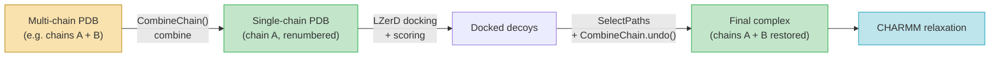

---
slug:16-receptor-chain-combination
blog_type:normal
---


**受体链组合**模块解决了 IDP-LZerD 流水线中的结构阻抗失配问题：LZerD 对接和 CHARMM 弛豫期望有序的受体伴侣作为**单条多肽链**，但生物受体经常跨越**多个 PDB 链**（例如，记录为链 A 和链 B 的同源二聚体）。`combine_receptor.py` 提供了一种可逆转换——将多个受体链**合并**为一条具有无冲突残基编号的连续链，并在下游处理完成后将其**拆分**回原始链标识。这种双向能力确保多链受体能够流经整个流水线而不丢失信息。

来源: [combine_receptor.py](scripts/combine_receptor.py#L1-L233)

## 流水线中的架构角色

组合步骤位于**对接输出与 CHARMM 精修**的交界处。在[路径选择与排序](14-path-selection-and-ranking)阶段，`select_paths.py` 导入 `CombineChain` 并调用 `CombineChain.undo()`，在组装最终复合物结构进行弛豫之前，恢复原始链边界。正向（组合）操作通常在更早的阶段被调用——在片段生成之后、LZerD 对接之前——以便对接将受体作为单一实体处理。反向（撤销）操作在路径组装时被调用，恢复真实的多链受体，以便每条链都能在输出 PDB 中被正确放置。



上图描绘了多链受体在整个流水线中的生命周期。组合操作是无损的，因为重新编号的元数据作为 `REMARK` 记录嵌入到输出 PDB 中，从而实现可靠的逆向还原。

来源: [select_paths.py](scripts/select_paths.py#L29-L30), [select_paths.py](scripts/select_paths.py#L190-L192)

## `CombineChain` 类

该模块暴露了一个单一类 `CombineChain`，包含三种操作：构造函数执行**正向组合**，`undo()` 执行**反向拆分**，而 `extract_residue_dict()` 读取使逆转成为可能的元数据。

### 类概述

| 方法 | 方向 | 目的 |
|---|---|---|
| `__init__(input, receptor, ligand)` | 正向 (组合) | 将受体链合并为一个，写入带有 `REMARK` 元数据的重新编号的 PDB |
| `undo(input, outfile, ligand_chain, residue_dict, write)` | 反向 (拆分) | 从组合后的 PDB 恢复原始多链结构 |
| `extract_residue_dict(input)` | 元数据读取 | 将 `REMARK RESIDUE=` 行解析为将残基编号映射到链标识的字典 |

`allowed_chains` 类属性将有效的链 ID 空间定义为所有 ASCII 字母和数字（`string.ascii_letters + string.digits`），以适应 PDB 链标识符的完整范围。

来源: [combine_receptor.py](scripts/combine_receptor.py#L42-L44), [combine_receptor.py](scripts/combine_receptor.py#L146-L157)

## 正向操作：组合链

当 `CombineChain` 实例化时，它会对输入 PDB 执行一系列**五种结构转换**：

1. **氢原子去除** — `shared.strip_h()` 在解析前去除所有氢原子，减少原子数量并避免 CHARMM 不兼容性。
2. **模型选择** — 丢弃第一个模型之后的所有模型，确保生成单模型结构。
3. **链过滤** — 移除不属于受体或配体的链。如果 PDB 中缺少指定的链，则抛出 `CombineChainError` 异常。
4. **杂原子去除** — 将具有非空白插入码的残基（杂原子、水分子）从每个剩余链中分离。
5. **带偏移重编号的链合并** — 核心算法，详见下文。

### 基于偏移的残基重编号

重编号算法确保来自第二个及后续受体链的残基占据第一个链最后一个残基之上的**非重叠数字范围**。偏移量被计算并向上取整到最接近的 **100 的倍数**，在残基编号中创建清晰的视觉边界：

```
raw_offset = prev_chain_end - cur_chain_start + 1
ceil_offset = ceil(raw_offset / 100) × 100
```

例如，如果链 A 在残基 150 处结束，链 B 从残基 1 开始，则原始偏移量为 150，取整偏移量变为 200。链 B 的残基被重新编号为 201、202、203……。然后，链 B 中的所有残基被**转移**到链 A 的 `Chain` 对象中，链 B 从模型中分离。最终结果是一条包含所有受体残基的单一链，呈单调递增且无冲突的序列。

<CgxTip>基于 100 的取整偏移是一个刻意的设计选择：它使得在检查残基编号时链边界变得即刻可见（例如，从 150 跳跃到 201 标志着前一个链边界），并且留出的间隙可以容纳 PDB 插入码而不会发生冲突。</CgxTip>

### 元数据持久化

重编号后，构造函数在 ATOM 条目**之前**将 `REMARK` 记录写入输出文件。每条备注记录了新的残基编号、原始链 ID 和原始起始残基：

```
REMARK RESIDUE=201 CHAIN=B START=1
```

这些记录是 `undo()` 能够重建原始链拓扑的唯一机制。输出文件名遵循模式 `{pdbcode}{receptor_chains}{ligand}.pdb`（例如，`4ah2ABC.pdb`）。

来源: [combine_receptor.py](scripts/combine_receptor.py#L46-L144), [shared.py](scripts/shared.py#L179-L190)

## 反向操作：拆分链

`undo()` 类方法执行逆变换：给定一个组合后的 PDB 文件，它使用 `REMARK` 元数据**恢复原始多链结构**。当 `len(receptor_chain) > 1` 时，`select_paths.py` 会调用此方法，确保最终组装的复合物在 CHARMM 弛豫之前携带受体的真实链拓扑。

该算法的工作原理如下：

1. **解析元数据** — `extract_residue_dict()` 读取所有 `REMARK RESIDUE=` 行，构建一个以重编号残基位置为键的字典，其值包含原始 `CHAIN` 和 `START` 字段。
2. **验证输入** — 该方法验证结构是否仅包含一个模型，并且受体由单链（组合链）组成。如果存在多个模型、非唯一链 ID 或缺少元数据，则会抛出 `CombineChainError` 异常。
3. **按链边界划分残基** — 元数据中排序后的残基键定义了转换点。对于每个边界，使用原始链 ID 创建一个新的 `Chain` 对象，并将组合链中序列号落在该边界范围内的所有残基转移至其中。
4. **写入输出** — 默认情况下，输出文件命名为 `{input}_split.pdb` 并放置在同一目录中。如果 `write=False`，则直接返回修改后的 `Structure` 对象供内存中使用。

<CgxTip>当从 `select_paths.py` 调用 `undo()` 时，它使用默认的 `write=True` 模式并以字符串形式返回输出文件路径。然后，该文件路径被传递给 `PDB.PDBParser` 以加载拆分后的受体结构用于路径组装。之所以存在两步往返过程（写入磁盘，然后重新解析），是因为 Biopython 的 PDBIO 需要文件句柄，但程序化调用时可使用内存中的 `write=False` 模式。</CgxTip>

来源: [combine_receptor.py](scripts/combine_receptor.py#L159-L213), [select_paths.py](scripts/select_paths.py#L188-L194)

## 命令行界面

该模块可以直接调用，用于流水线之外的独立使用：

```bash
# 组合受体的链 A 和 B，以链 C 作为配体
python scripts/combine_receptor.py input.pdb -r AB -l C
```

| 参数 | 标志 | 必需 | 描述 |
|---|---|---|---|
| `input` | 位置参数 | 是 | 输入 PDB 文件路径 |
| `receptor` | `-r` / `--receptor` | 否 | 作为连续字符串的受体链 ID（例如，`AB`）；默认为 `A` |
| `ligand` | `-l` / `--ligand` | 否 | 配体链 ID（恰好一个字符） |

`CombineChain.commandline()` 类方法负责参数解析和实例化。当省略 `ligand` 时，它在输出中保持原样。当省略 `receptor` 时，仅将链 A 视为受体。

来源: [combine_receptor.py](scripts/combine_receptor.py#L215-L232)

## 错误处理

所有异常条件均抛出 `CombineChainError`，它是 `RuntimeError` 的子类，确保流水线故障可与通用 Python 异常区分开来：

| 条件 | 错误消息模式 |
|---|---|
| 配体参数长度超过一个字符 | `"Ligand can only be one chain: %s"` |
| PDB 中缺少指定的受体/配体链 | `"Specified chains not found in %s"` |
| `undo()` 的输入中未找到 `REMARK` 元数据 | `"No residue dict"` |
| `undo()` 的输入具有多个模型 | `"Input has more than one model: %s"` |
| `undo()` 的输入中存在非唯一链 ID | `"Non-unique chain IDs"` |
| `undo()` 中移除配体后仍剩余多条链 | `"Input has more than one chain: %s"` |

来源: [combine_receptor.py](scripts/combine_receptor.py#L36-L39), [combine_receptor.py](scripts/combine_receptor.py#L51-L85), [combine_receptor.py](scripts/combine_receptor.py#L163-L181)

## 与 SelectPaths 的交互

流水线中 `CombineChain` 的主要消费者是 `SelectPaths.combine_paths()`。当受体跨越多条链时，该方法在将预组合的受体文件加载到内存之前对其调用 `CombineChain.undo()`。然后，拆分后的受体被用于**单独重新添加每条原始链**到输出结构中（`select_paths.py` 的第 238–239 行），保留 CHARMM 在受限最小化和动力学期间用于区分受体和配体的正确区段标识。

这种交互是有条件的：对于单链受体（`len(receptor_chain) == 1`），永远不会调用 `CombineChain.undo()`，而是直接加载受体 PDB。组合/拆分循环仅在受体真正需要多链表示时才被激活。

来源: [select_paths.py](scripts/select_paths.py#L160-L194), [select_paths.py](scripts/select_paths.py#L237-L239)

## 相关页面

- [路径选择与排序](14-path-selection-and-ranking) — 调用 `CombineChain.undo()` 的下游消费者
- [CHARMM 弛豫协议](15-charmm-relaxation-protocol) — 依赖于正确链/区段标识的精修步骤
- [共享工具参考](17-shared-utilities-reference) — 记录了组合期间用于去除氢原子的 `shared.strip_h()`
- [架构概述](4-architecture-overview) — 展示链组合所处位置的完整流水线上下文