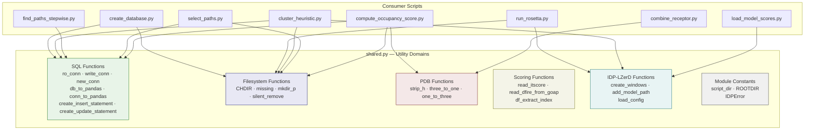
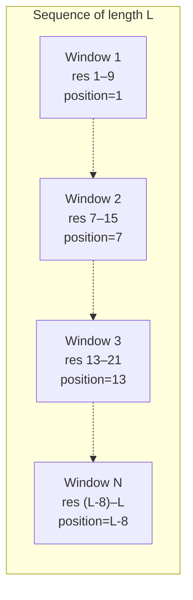

---
slug:17-shared-utilities-reference
blog_type:normal
---

`shared.py` 模块是 IDP-LZerD 的**横切工具层** —— 这是一个单一的、可导入的模块，它整合了 SQLite 数据库访问模式、文件系统辅助函数、PDB 操作原语、评分 I/O、领域特定的片段逻辑以及配置加载。每一个流水线脚本 —— 从[数据库创建与模式](8-database-creation-and-schema)到[路径选择与排序](14-path-selection-and-ranking) —— 都直接导入 `shared`，这使其成为整个代码库的架构脊梁。它的设计遵循务实的“库模块”模式：这里没有类来编排控制流；相反，独立的函数和上下文管理器提供了可复用的构建块，供消费端脚本组合成特定于流水线的逻辑。

来源：[shared.py](/scripts/shared.py#L1-L323)

## 模块常量与自定义异常

两个路径常量在导入时使用 `inspect` 进行解析，以定位执行文件所在的目录，然后推导出包的根目录：

| 常量 | 值 | 用途 |
|---|---|---|
| `script_dir` | `os.path.abspath(os.path.dirname(inspect.getfile(inspect.currentframe())))` | `scripts/` 目录的绝对路径 |
| `ROOTDIR` | `os.path.normpath(os.path.join(script_dir, os.pardir))` | 仓库根目录的绝对路径（`scripts/` 的上一级） |

**`IDPError`** 继承自 `RuntimeError`，作为整个流水线中抛出的领域特定异常类型 —— 由 `create_windows`（当序列长度过短时）和 `load_config`（当缺少必需的配置键时）抛出。像 `cluster_heuristic.py` 和 `combine_receptor.py` 这样的消费端脚本定义了它们自己的 `RuntimeError` 子类，而不是复用 `IDPError`，从而将其保留给真正共享的故障模式。

来源：[shared.py](/scripts/shared.py#L29-L37)

## SQL 函数

SQL 层提供了三个连接上下文管理器和四个查询构建/查询工具。所有数据库连接均使用 **APSW** (Another Python SQLite Wrapper) 库，而非标准库的 `sqlite3`，从而能够对 SQLite 打开标志进行更细粒度的控制。

### 连接上下文管理器

| 管理器 | SQLite 标志 | 用例 |
|---|---|---|
| `ro_conn(dbfile)` | `SQLITE_OPEN_READONLY` | 读取查询 —— 不获取写锁 |
| `write_conn(dbfile)` | `SQLITE_OPEN_READWRITE` | 更新现有数据库（路径评分、聚类大小） |
| `new_conn(dbfile)` | `SQLITE_OPEN_CREATE \| SQLITE_OPEN_READWRITE` | 全新数据库创建（初始模式 + 数据插入） |

这三者遵循相同的结构模式：它们在 `@contextmanager` 内部生成一个 `apsw.Connection`，并在打印出错的 `dbfile` 路径后重新抛出 `apsw.CantOpenError`。对于查询密集的阶段，`ro_conn` 管理器是最安全的默认选择；当更新行时（例如，在[逐步路径搜索](11-stepwise-path-search)中写入聚类大小），需要使用 `write_conn`；`new_conn` 仅在数据库文件尚不存在时由[数据库创建与模式](8-database-creation-and-schema)使用。

<CgxTip>对于读操作，请始终优先使用 `ro_conn`。SQLite 的 WAL 日志模式意味着读锁可能会在未解析的写日志上阻塞 —— 使用 `write_conn` 来“解析”日志（通过打开写连接并立即关闭）是一种在 `find_paths_stepwise.py` 的 `count_paths` 方法中可见的模式，即在真正的 `ro_conn` 读取之前，会进行一次短暂的 `write_conn` 打开。</CgxTip>

来源：[shared.py](/scripts/shared.py#L39-L65)

### 查询与语句构建器

**`db_to_pandas(select, dbf, **kwargs)`** 将 `ro_conn` 与 `conn_to_pandas` 组合 —— 它打开一个到 `dbf` 的只读连接，执行 `select` SQL 字符串，并返回一个 `pandas.DataFrame`。这是 `compute_occupancy_score.py` 和 `select_paths.py` 使用的**主要数据加载入口点**。

**`conn_to_pandas(select, conn, **kwargs)`** 封装了 `pd.read_sql_query` 并捕获 `apsw.ExecutionCompleteError`，在该异常发生时返回一个空的 `DataFrame`。这处理了查询完成但未产生结果集的边缘情况。

**`create_insert_statement(tablename, columns)`** 使用 SQLite 命名参数语法（`:column_name`）生成参数化的 `INSERT` 语句。例如，`create_insert_statement("window", ["windowindex", "window_wd"])` 会生成 `INSERT INTO window (windowindex, window_wd) VALUES (:windowindex, :window_wd)`。命名参数格式可直接与 `cursor.executemany()` 和 `DataFrame.to_dict("records")` 集成。

**`create_update_statement(tablename, columns, where)`** 生成参数化的 `UPDATE ... SET ... WHERE ...` 语句，使用 `AND` 连接多个 `WHERE` 列。例如，`create_update_statement("clusters3", ["clustersize"], ["pathsid"])` 会生成 `UPDATE clusters3 SET clustersize=:clustersize WHERE pathsid=:pathsid`。`columns` 和 `where` 均接受单个字符串（自动提升为列表）或列表。

来源：[shared.py](/scripts/shared.py#L67-L136)

## 文件系统函数

四个工具函数处理了在流水线各阶段中反复出现的常见文件系统操作：

### `CHDIR` —— 临时目录切换

一个上下文管理器（使用 `__enter__`/`__exit__` 协议，而非 `@contextmanager`），它在进入时保存当前工作目录，切换到 `dirname`，并在退出时恢复原始目录 —— 即使在异常传播的情况下也是如此。这对于 [Rosetta 片段选择器](5-rosetta-fragment-picker)的调用至关重要，因为 Rosetta 的 `fragment_picker` 二进制文件期望从包含 `input_files/` 和 `output_files/` 子目录的特定目录树中运行。用法：`with shared.CHDIR(input_dir): subprocess.check_call(cmd)`。

### `missing(*files)` —— 文件存在性检查

如果提供的任何文件路径不存在或长度为零，则返回 `True`。这是流水线的**守卫子句主力**：几乎每个阶段在执行昂贵计算之前都会检查 `shared.missing(output_file)`，从而实现安全的中断后恢复行为。长度为零的检查至关重要，因为 Rosetta 和 LZerD 可以在填充输出文件之前先创建它们 —— 空文件意味着运行未完成。

### `mkdir_p(path)` —— 递归创建目录

等效于 `mkdir -p` 的 Pythonic 实现：创建目录及其所有父目录，静默忽略 `EEXIST` 错误。在 Rosetta 工作目录设置和路径输出目录创建期间使用。

### `silent_remove(path)` —— 安全文件删除

删除文件，忽略 `ENOENT`（文件未找到）错误。任何其他 `OSError` 都将被传播。这提供了幂等的清理行为。

| 消费端脚本 | 使用的函数 |
|---|---|
| `run_rosetta.py` | `CHDIR`, `mkdir_p`, `missing`, `load_config` |
| `select_paths.py` | `mkdir_p`, `missing`, `db_to_pandas` |
| `cluster_heuristic.py` | `missing`, `load_config`, `create_insert_statement` |
| `create_database.py` | `missing`, `new_conn`, `create_insert_statement` |
| `find_paths_stepwise.py` | `ro_conn`, `write_conn`, `create_insert_statement`, `create_update_statement` |
| `compute_occupancy_score.py` | `db_to_pandas`, `missing`, `strip_h` |

来源：[shared.py](/scripts/shared.py#L138-L176)

## PDB 函数

### `strip_h(filename)` —— 移除氢原子

将整个 PDB 文件读入内存，并返回一个仅包含非氢 `ATOM` 记录的 `StringIO.StringIO` 对象。过滤正则表达式 `_h_re = re.compile(r"[123 ]*H.*")` 匹配 PDB 原子名称字段（第 13–16 列）中的氢原子名称，涵盖了常见的命名约定：` H  `，`1H  `，`2H  `，`3H  `，` HA ` 等。返回的 `StringIO` 对象**由 Biopython 的 `PDBParser` 消费** —— `combine_receptor.py` 和 `compute_occupancy_score.py` 都将此结果直接作为文件句柄参数传递给 `parser.get_structure()`。这避免了将临时文件写入磁盘。

<CgxTip>该函数在过滤之前会将整个文件加载到内存中。对于非常大的 PDB 文件（数千个模型），这可能会消耗大量内存。在当前流水线中，它是按片段 PDB（小文件）调用的，因此这是可接受的。如果要适配全蛋白质组规模的输入，请考虑使用流式替代方案。</CgxTip>

### 氨基酸代码映射

两个字典常量提供了双向的三字母 ↔ 一字母氨基酸翻译，涵盖了所有 20 种标准残基：

| 字典 | 键 → 值 | 大小 |
|---|---|---|
| `three_to_one` | `{'VAL': 'V', 'ILE': 'I', ...}` | 20 条目 |
| `one_to_three` | `{'V': 'VAL', 'I': 'ILE', ...}` | 20 条目（逆映射） |

`one_to_three` 在模块加载时通过字典推导式从 `three_to_one` 计算得出。非标准残基（例如，`MSE`，`SEP`）未包含在内，如果访问将抛出 `KeyError`。

来源：[shared.py](/scripts/shared.py#L178-L198)

## 评分函数

评分 I/O 层定义了对 LZerD 对接引擎生成的两种评分文件格式的结构化读取，以及一个通用的索引提取工具。

### 索引提取

**`df_extract_index(df, kind, colname="model")`** 使用正则表达式查找从字符串列中提取数字索引，并将其作为新列添加到 DataFrame 中。`kind` 参数从预定义的映射中进行选择：

| `kind` | 索引列名 | 正则表达式模式 | 匹配项 |
|---|---|---|---|
| `"model"` | `modelindex` | `r"model(\d+)\D*"` | `model3.pdb` → `3` |
| `"fragment"` | `fragmentindex` | `r'frag_(\d\d\d)_model_h.pdb'` | `frag_003_model_h.pdb` → `3` |
| `"relax"` | `pathsid` | `r"\D*(\d+)\D*"` | 通用数字提取 |

### ITScore 读取器

**`read_itscore(filename, kind=None)`** 读取一个 ITScore 文件（`scores.itscore`），包含列 `(model: str, itscore: float)`，使用空格分隔的解析方式。如果提供了 `kind`，则会应用 `df_extract_index` 来派生数字索引列。

### DFIRE 评分读取器

**`read_dfire_from_goap(filename, all=False, kind=None)`** 读取一个 GOAP 评分文件（`goap_score.txt`），包含列 `(index: str, model: str, goap: float, dfire: float, extra: float)`。当 `all=False`（默认值）时，仅加载 `model` 和 `dfire` 列 —— 针对仅需要 DFIRE 评分的常见情况优化了内存使用。`kind` 参数的工作方式与 `read_itscore` 完全相同。

| 格式常量 | 文件名 | 表头元组 |
|---|---|---|
| `itscore_file` | `scores.itscore` | `("model", "itscore")` |
| `goap_file` | `goap_score.txt` | `("index", "model", "goap", "dfire", "extra")` |

来源：[shared.py](/scripts/shared.py#L200-L242)

## IDP-LZerD 领域函数

### `create_windows(length)` —— 片段窗口生成器

一个生成器函数，为 IDP-LZerD 流水线生成滑动窗口定义。每个窗口代表沿着内在无序蛋白质序列的一个重叠的 9 残基片段，步长为 6 个残基，重叠度为 3：

每次生成的字典包含：

| 键 | 描述 |
|---|---|
| `position` | 窗口的起始残基（从 1 开始） |
| `res_start` | 对齐的起始残基（用于窗口索引） |
| `res_end` | 结束残基（在最后一个窗口中截断至 `length`） |
| `windowindex` | 与 `res_start` 相同，用作窗口的数据库主键 |

最后一个窗口经过特殊处理：当 `end >= length` 时，窗口被截断至序列长度，且 `position` 被重新计算为 `length - 8`（以确保完整的 9 残基窗口），同时 `res_start` 向回对齐到最近的 6 残基网格点。如果 `position < 1`，则抛出 `IDPError` —— 这可以防止序列短于 9 个残基的情况，因为这种序列无法产生单个有效片段。

来源：[shared.py](/scripts/shared.py#L244-L258)

### `add_model_path(windowrows, model_db_file)` —— 路径解析

将窗口-模型关联数据与数据库中的文件系统路径进行连接。它跨 `model`、`allmodel` 和 `window` 表执行 SQL 查询，将每个模型解析为其 PDB 文件路径（`<window_wd>/<fragmentindex>/decoys/model<N>.pdb`），然后将宽格式的窗口列熔融为长格式，与路径数据合并，再透视回去 —— 用实际文件路径替换模型 ID。这被[占据率评分计算](13-occupancy-score-computation)用于为每个组装的路径具体化 PDB 文件。

来源：[shared.py](/scripts/shared.py#L260-L290)

### `load_config()` —— 配置加载器

从仓库根目录读取并验证 `[PATHS.ini](../PATHS.ini)` 文件。解析器非常精简：它按 `:` 分割每行，去除空白字符，并跳过括号括起来的行（如 `[paths]` 这样的节头）。四个键是**必需的** —— 如果缺少任何一个，将抛出 `IDPError`：

| 必需键 | 用途 | 消费端 |
|---|---|---|
| `lzerd_path` | LZerD 发行版的根目录（包含 `LB3Dclust` 二进制文件） | `cluster_heuristic.py` |
| `rosetta_path` | Rosetta 安装的根目录 | `run_rosetta.py` |
| `nr_path` | NR BLAST 数据库的路径 | `run_rosetta.py` (PSI-BLAST) |
| `blastpgp_exe` | `blastpgp` 可执行文件的路径 | `run_rosetta.py` (PSI-BLAST) |

返回的 `dict` 由 `run_rosetta.py` 消费以定位 Rosetta 可执行文件，并由 `cluster_heuristic.py` 消费以定位 `LB3Dclust` 聚类二进制文件。完整的配置参考请参见[配置与 PATHS.ini](18-configuration-and-paths-ini)。

来源：[shared.py](/scripts/shared.py#L293-L323), [PATHS.ini](/PATHS.ini#L1-L6)

## 消费端导入映射

下表提供了每个流水线脚本导入哪些 `shared` 符号的完整映射，从而在修改任何工具时能够进行定向影响分析：

| 脚本 | `IDPError` | SQL (conn/stmt) | `db_to_pandas` | `missing` | `mkdir_p` | `CHDIR` | `strip_h` | `load_config` | `pd` |
|---|---|---|---|---|---|---|---|---|---|
| `create_database.py` | | `new_conn`, `create_insert_statement` | | ✓ | | | | | ✓ |
| `run_rosetta.py` | | | | ✓ | ✓ | ✓ | | ✓ | |
| `cluster_heuristic.py` | | `create_insert_statement` | | ✓ | | | | ✓ | |
| `find_paths_stepwise.py` | | `ro_conn`, `write_conn`, `create_insert_statement`, `create_update_statement` | | | | | | | |
| `select_paths.py` | | | ✓ | ✓ | ✓ | | | | |
| `compute_occupancy_score.py` | | | ✓ | ✓ | | | ✓ | | |
| `combine_receptor.py` | | | | | | | ✓ | | |