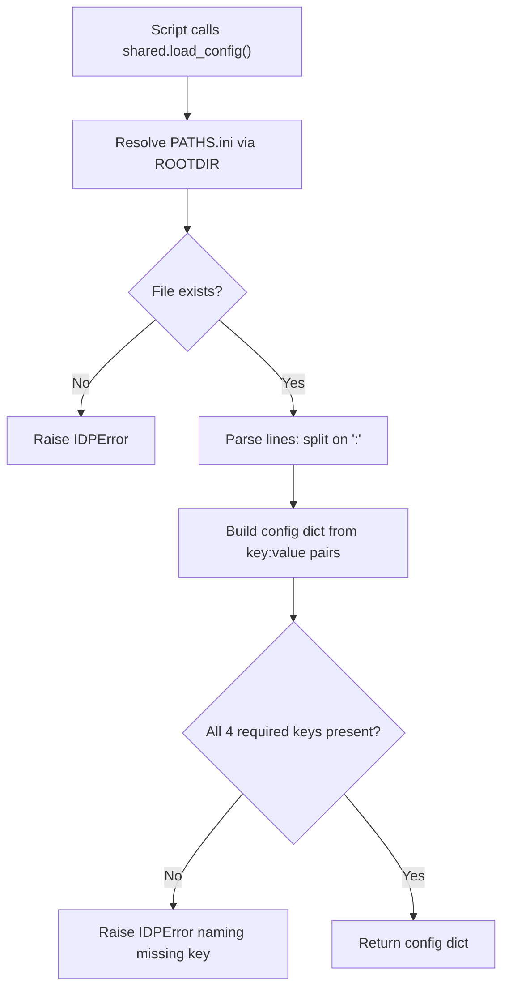
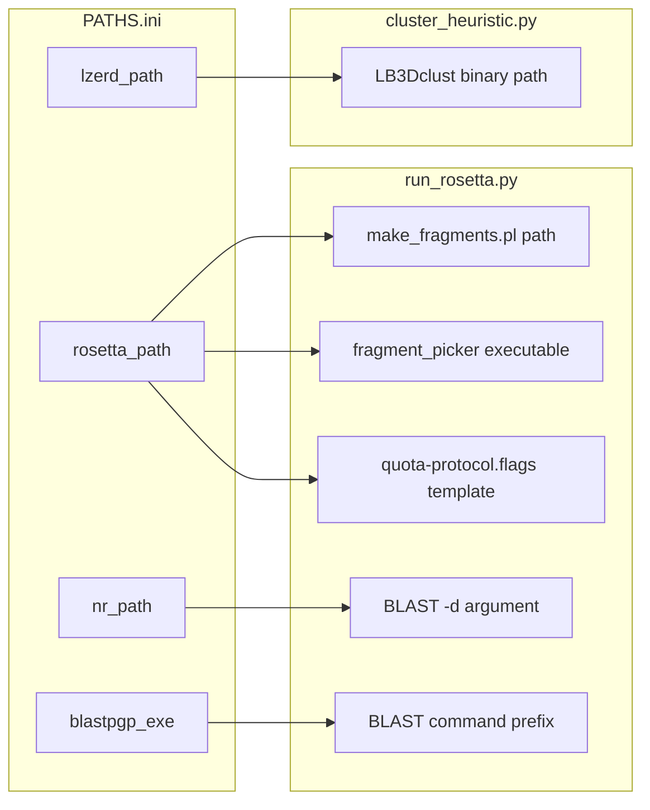

---
slug:18-configuration-and-paths-ini
blog_type:normal
---


PATHS.ini 是核心配置文件，用于指定 IDP-LZerD 在文件系统中查找外部二进制依赖的路径。在任何流水线脚本执行之前，此文件中定义的四个路径必须解析为有效的已安装位置——否则流水线在启动时会抛出 `IDPError`。理解该文件的结构、解析方式以及每个值的流向，对于在任何系统上正确部署 IDP-LZerD 至关重要。

来源: [PATHS.ini](/PATHS.ini#L1-L6), [shared.py](/scripts/shared.py#L293-L323)

## 文件格式与结构

PATHS.ini 采用了极简的 **INI 风格** 格式，包含一个 `[paths]` 节头，后跟以冒号分隔的键值对。仓库中提供的默认文件如下所示：

```ini
[paths]
lzerd_path: $HOME/lzerddistribution
rosetta_path: /apps/rosetta/w2016.08
nr_path: /apps/blast+/databases/nr
blastpgp_exe: /usr/bin/blastpgp
```

每行通过在首个冒号 (`:`) 字符处进行拆分来解析——而**不是**使用 Python 的 `ConfigParser` 模块。`shared.load_config()` 中的自定义解析器将恰好包含一个冒号的行视为键值对，并去除两侧的空白字符。以 `[` 开头并以 `]` 结尾的行会被识别为节头并静默跳过。任何不匹配这两种模式的行都会向标准输出 (stdout) 触发警告。这意味着值中不能包含冒号，且 `[paths]` 节头是必填的，但其名称不会被校验。

来源: [PATHS.ini](/PATHS.ini#L1-L6), [shared.py](/scripts/shared.py#L293-L323)

## 必需的配置键

全部四个键均为**必填项**。如果缺少任何键，`load_config()` 将抛出 `IDPError` 并指明缺失的键。下表概述了每个键、其用途以及消费它的流水线阶段。

| 键 | 用途 | 消费方 | 解析的二进制文件/资源 |
|---|---|---|---|
| `lzerd_path` | LZerD 发行版的根目录 | [cluster_heuristic.py](/scripts/cluster_heuristic.py) | `LB3Dclust`（3D 聚类二进制文件） |
| `rosetta_path` | Rosetta 安装的根目录 | [run_rosetta.py](/scripts/run_rosetta.py) | `fragment_picker` 可执行文件、片段工具、Rosetta 数据库 |
| `nr_path` | NCBI `nr` BLAST 数据库的路径 | [run_rosetta.py](/scripts/run_rosetta.py) | BLAST 序列搜索数据库 |
| `blastpgp_exe` | `blastpgp` 可执行文件的路径 | [run_rosetta.py](/scripts/run_rosetta.py) | 用于生成谱系的 PSI-BLAST 二进制文件 |

来源: [shared.py](/scripts/shared.py#L312-L322), [run_rosetta.py](/scripts/run_rosetta.py#L42-L108), [cluster_heuristic.py](/scripts/cluster_heuristic.py#L152-L153)

## 配置的加载方式

`shared.py` 中的 `load_config()` 函数会相对于包根目录 (`ROOTDIR`) 解析文件位置，该根目录被计算为 `scripts/` 文件夹的上一级目录。这意味着 PATHS.ini **必须**位于仓库根目录中。加载序列如下：



每次调用 `load_config()` 都会重新从磁盘读取并解析文件——没有缓存机制。这种设计意味着对 PATHS.ini 的运行时编辑会在下次脚本调用时生效，但同时也意味着缺失或格式错误的文件每次都会明确报错。

来源: [shared.py](/scripts/shared.py#L293-L322)

## 配置值在流水线中的流向

`load_config()` 返回的配置字典由两个脚本消费，每个脚本访问四个键的不同子集。下图展示了完整的传播过程：



### 在 `run_rosetta.py` 中 —— 片段生成

`run_rosetta.py` 在其 `run()` 类方法的开头调用 `load_config()`，并通过以下三种方式使用返回的字典：

1. **Rosetta 工具解析** —— `rosetta_path` 与已知子目录拼接，以定位 `tools/fragment_tools/make_fragments.pl` 和 `main/source/bin/fragment_picker.linuxgccrelease`。
2. **Rosetta 标志文件模板化** —— `rosetta_path` 作为 `{rosetta_path}` 传入 `quota-protocol.flags.template`，展开后用于设置 Rosetta 数据库 (`-in::path::database`) 和 vall 片段数据库 (`-in::file::vall`)。
3. **BLAST 命令构建** —— 整个配置字典通过 `**config` 解包到 `blastcmdfmt` 格式字符串中，该字符串将 `blastpgp_exe` 放置为命令前缀，将 `nr_path` 放置为 `-d` 数据库参数，其余键作为 PSI-BLAST 调用的一部分。

来源: [run_rosetta.py](/scripts/run_rosetta.py#L42-L108), [quota-protocol.flags.template](/scripts/rosetta_templates/quota-protocol.flags.template#L1-L38)

### 在 `cluster_heuristic.py` 中 —— 路径聚类

`cluster_heuristic.py` 在 `ClusterPdb.__init__()` 期间调用 `load_config()`，且**仅**使用 `lzerd_path`。它将该路径与二进制文件名 `LB3Dclust` 拼接，以构成聚类可执行文件路径：

```python
config = shared.load_config()
self.clust_bin = os.path.join(config['lzerd_path'], "LB3Dclust")
```

该二进制文件随后通过 `subprocess.Popen` 调用，并传入配体列表文件和聚类截断值作为参数。如果在解析的路径中未找到该二进制文件，子进程将失败并报操作系统级别的错误。

来源: [cluster_heuristic.py](/scripts/cluster_heuristic.py#L152-L153), [cluster_heuristic.py](/scripts/cluster_heuristic.py#L396-L407)

## 配置 PATHS.ini

要为你的环境配置 PATHS.ini，请按照以下步骤操作：

1. **安装所有二进制依赖**，如[外部依赖设置](3-external-dependencies-setup)中所列。记录每个依赖的安装根目录。
2. **打开仓库根目录中的 `PATHS.ini`**，将每个占位符值替换为你系统上的绝对路径。
3. **验证每个路径是否存在**，然后再运行流水线。一个常见的错误是将 `rosetta_path` 指向包装脚本，而不是 Rosetta 源码树的根目录（该根目录必须包含 `main/source/bin/` 和 `tools/fragment_tools/`）。
4. **对于 `lzerd_path`**，确保 LZerD 发行版目录直接包含 `LB3Dclust` 二进制文件（而不是在子目录中）。
5. **对于 `nr_path`**，它必须指向 BLAST 数据库文件（如 `nr.psq`、`nr.pin`、`nr.phr`），而不是包含它们的目录——该路径应为不带文件扩展名的前缀。

<CgxTip>解析器**不会**展开 `lzerd_path: $HOME/lzerddistribution` 中的 Shell 环境变量（如 `$HOME`）。字面字符串 `$HOME` 将被传递给 `os.path.join`，后者无法解析它。请始终使用绝对路径，或在写入 PATHS.ini 前手动展开变量。</CgxTip>

来源: [PATHS.ini](/PATHS.ini#L1-L6), [README.md](/README.md#L50-L52)

## 配置错误排查

下表将常见的故障症状映射到 PATHS.ini 配置中的根本原因：

| 症状 | 原因 | 解决方案 |
|---|---|---|
| `IDPError: Could not open .../PATHS.ini` | PATHS.ini 缺失或被移动 | 确保文件存在于仓库根目录中（与 `scripts/` 同级） |
| `IDPError: '.../PATHS.ini' did not contain required key 'lzerd_path'` | 文件中缺少键 | 使用冒号分隔符添加缺失的键 |
| `LB3Dclust` 上出现 `OSError: [Errno 2] No such file or directory` | `lzerd_path` 不包含该二进制文件 | 验证 `lzerd_path/LB3Dclust` 存在且可执行 |
| Rosetta `fragment_picker` 启动失败 | `rosetta_path` 不正确或二进制文件未构建 | 确认 `rosetta_path/main/source/bin/fragment_picker.linuxgccrelease` 存在 |
| BLAST 报告 "database not found" | `nr_path` 不正确 | 确保 `nr_path` 与 BLAST 数据库文件前缀匹配 |
| BLAST 报告 "command not found" | `blastpgp_exe` 不正确 | 验证 `blastpgp_exe` 是一个可执行文件路径 |

来源: [shared.py](/scripts/shared.py#L296-L320), [README.md](/README.md#L50-L52)

## 相关配置文件

PATHS.ini 是唯一的**运行时**配置文件，但仓库中的另外两个文件在不同阶段对流水线配置也有贡献：

| 文件 | 作用域 | 修改时机 |
|---|---|---|
| **PATHS.ini** | 二进制依赖位置 | 每次安装一次 |
| **idp_relax.inp** | CHARMM 弛豫参数（力常数、动力学步数、温度） | 每次精细化运行 |
| **quota-protocol.flags.template** | Rosetta 片段选择器标志（数据库路径、片段大小、配额配置） | 通常不修改；`rosetta_path` 在运行时注入 |

Rosetta 模板文件间接地从 PATHS.ini 接收 `rosetta_path`——`run_rosetta.py` 读取配置，用该值格式化模板，并写入具体的标志文件。有关该模板化过程的详细信息，请参阅 [Rosetta 片段选择器](5-rosetta-fragment-picker)。

来源: [idp_relax.inp](/idp_relax.inp#L1-L119), [quota-protocol.flags.template](/scripts/rosetta_templates/quota-protocol.flags.template#L1-L38), [run_rosetta.py](/scripts/run_rosetta.py#L78-L127)

## 下一步

正确配置 PATHS.ini 后，你就可以运行流水线了。你在此处设置的配置值将首先被 [Rosetta 片段选择器](5-rosetta-fragment-picker) 消费（通过 `rosetta_path`、`nr_path`、`blastpgp_exe`），随后被 [启发式聚类](12-heuristic-clustering) 消费（通过 `lzerd_path`）。如果你尚未安装外部二进制文件，请从[外部依赖设置](3-external-dependencies-setup)开始。