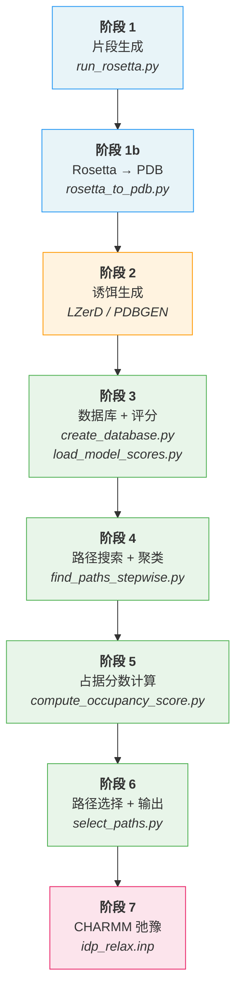
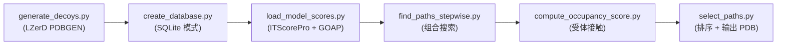
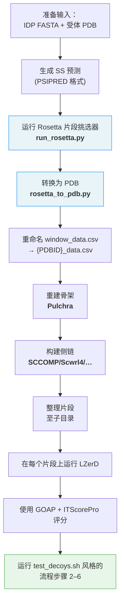

---
slug:2-quick-start
blog_type:normal
---


IDP-LZerD 用于对内在无序蛋白 (IDP) 与有序蛋白相互作用时的结合构象进行建模。本页将使用内置测试用例 (PDB: 4ah2) 作为具体参考，引导你完成**从配置到最终输出的最快运行路径**。

## 前置条件速览

在接触任何代码之前，请确认你的环境同时满足 Python 和二进制文件的依赖要求。下表汇总了所需依赖及其在流程中的用途。

| 类别 | 依赖项 | 流程中的作用 |
|---|---|---|
| **Python** | apsw, numpy, scipy, pandas, Biopython | 所有脚本的核心数据库、评分及 PDB I/O |
| **Python** | seaborn | 占据分数可视化 ([compute_occupancy_score.py](scripts/compute_occupancy_score.py#L30)) |
| **二进制文件** | Rosetta | 片段生成 ([run_rosetta.py](scripts/run_rosetta.py#L56)) |
| **二进制文件** | blastpgp + nr 数据库 | 用于片段挑选的 PSI-BLAST 特征谱 |
| **二进制文件** | LZerD (PDBGEN) | 两两对接诱饵生成 |
| **二进制文件** | Pulchra | CA → 全原子骨架重建 |
| **二进制文件** | SCCOMP / Scwrl4 / Oscar-star / RASP | 侧链建模（任选其一） |
| **二进制文件** | GOAP + ITScorePro | 对接模型评分 |
| **二进制文件** | CHARMM | 组装路径的最终弛豫 |

通过 conda 一键安装 Python 依赖：

```bash
conda install numpy scipy pandas biopython seaborn
conda install -c conda-forge apsw
```

来源：[README.md](README.md#L18-L31), [shared.py](scripts/shared.py#L17-L28)

## 步骤 0 — 配置 PATHS.ini

每次流程运行都会读取项目根目录下的 [`PATHS.ini`](PATHS.ini)。此 INI 风格的文件告知脚本去何处寻找四个**强制性**外部工具。打开该文件并将每个路径设置为与你的系统相匹配：

```ini
[paths]
lzerd_path: $HOME/lzerddistribution
rosetta_path: /apps/rosetta/w2016.08
nr_path: /apps/blast+/databases/nr
blastpgp_exe: /usr/bin/blastpgp
```

`shared.py` 中的 `load_config()` 函数会解析此文件，并验证 `lzerd_path`、`rosetta_path`、`nr_path` 和 `blastpgp_exe` 这四个键是否全部存在。缺少任何键都会立即引发 `IDPError`。**最常见的安装失败原因是跳过了 blastpgp 或 nr 数据库**；如果 Rosetta 报错并提及 "blast" 或 "nr"，请验证这些路径是否指向了实际安装的位置。

来源：[PATHS.ini](PATHS.ini#L1-L6), [shared.py](scripts/shared.py#L293-L322), [README.md](README.md#L50-L52)

## 流程概览

IDP-LZerD 执行包含六个阶段的流程。下方的流程图展示了完整的序列以及负责各阶段的脚本。



来源：[test_decoys.sh](test/test_decoys.sh#L1-L27), [README.md](README.md#L55-L81)

## 步骤 1 — 运行测试用例

内置测试用例的目标是 **PDB 4ah2**，其受体链为 A，配体链为 C。编排脚本 [`test_decoys.sh`](test/test_decoys.sh) 会在诱饵生成之后将流程的所有阶段串联起来。

### 1a. 编辑测试脚本

打开 `test/test_decoys.sh` 并将 `PACKAGE_DIR` 设置为 IDP-LZerD 根目录的绝对路径：

```bash
PACKAGE_DIR="/path/to/idp_lzerd"
```

该脚本在顶部定义了关键标识符：

| 变量 | 默认值 | 用途 |
|---|---|---|
| `PDBID` | `4ah2` | 复合物的 PDB 标识符 |
| `R_CH` | `A` | 受体链标识符 |
| `L_CH` | `C` | 配体 (IDP) 链标识符 |
| `N_WINDOWS` | `3` | 沿 IDP 重叠的 9-mer 窗口数量 |

来源：[test_decoys.sh](test/test_decoys.sh#L3-L8)

### 1b. 运行测试

```bash
cd test && ./test_decoys.sh
```

> ⚠️ **磁盘空间警告**：完整测试会生成约 **250 GB** 的中间文件（对接诱饵、数据库、坐标）。在启动前请确保有足够的可用磁盘空间。

该脚本会自动执行以下序列：



各命令及其作用：

| 步骤 | 命令 | 作用 |
|---|---|---|
| 1 | `python generate_decoys.py` | 对每个片段运行 LZerD 的 PDBGEN 以生成两两对接模型 |
| 2 | `python create_database.py -p 4ah2 -i 4ah2_data.csv -d .` | 创建具有窗口/片段模式的 SQLite 数据库 |
| 3 | `python load_model_scores.py -b scores_4ah2AC.db -p 4ah2 -r A -l C -d .` | 加载 ITScorePro 和 GOAP (DFIRE) 分数，为每个窗口选择前 4500 个模型，并计算模型间距离 |
| 4 | `python find_paths_stepwise.py 4ah2AC -n 3 -d .` | 带有启发式聚类的逐步组合路径搜索 |
| 5 | `python compute_occupancy_score.py 4ah2 -r A -l C -n 3 -d .` | 统计跨路径的受体残基接触 → 占据分数 |
| 6 | `python select_paths.py 4ah2 -r A -l C -n 3 -d .` | 按加权 Z 分数对路径排序，输出前 100 个组合 PDB 文件 |

来源：[test_decoys.sh](test/test_decoys.sh#L14-L27), [generate_decoys.py](test/generate_decoys.py#L57-L96)

### 1c. 定位输出

未经精修（CHARMM 处理前）的路径 PDB 文件会被写入 `test/4ah2ac3/`。该目录名遵循 `{pdbid}{receptor_chain}{ligand_chain}{n_windows}` 的小写模式。你可以在其中找到：

- **组合 PDB 文件** — 每条所选路径的完整复合物结构
- **`path_scores.csv`** — 每条路径的 Z 分数及加权复合分数

来源：[test_decoys.sh](test/test_decoys.sh#L8), [select_paths.py](scripts/select_paths.py#L64-L76)

## 步骤 2 — CHARMM 弛豫（流程后处理）

流程中的 `select_paths.py` 会产生结构上合理但未经精修的模型。若要进行最终的能量最小化和分子动力学弛豫，请使用内置的 [`idp_relax.inp`](idp_relax.inp) CHARMM 输入模板。

1. 为 CHARMM 准备 PDB 文件（添加缺失原子，生成 PSF/坐标文件）
2. 编辑 `idp_relax.inp` — 设置顶部的占位符变量：

| 变量 | 含义 |
|---|---|
| `{charmm_dir}` | CHARMM 源码/数据目录的路径 |
| `{working_dir}` | 包含 PSF、COR 和 SEQ 文件的目录 |
| `{filename}` | 输入/输出文件的基本名 |
| `{receptor_chain}` | 受体片段标识符 |
| `{ligand_chain}` | 配体片段标识符 |

3. 使用此输入文件运行 CHARMM

该弛豫方案采用**分阶段谐约束策略**：受体被固定，而配体经历逐步解约束的最小化（力常数：50→40→30→20→10→0），随后进行骨架约束最小化（10→5→1→0），最后是在 200 K 下进行 20 ps 的 Langevin 动力学模拟。

<CgxTip>分阶段的力常数计划至关重要——过快解除约束会导致 CHARMM 因不良接触而崩溃。默认计划已针对 IDP-LZerD 的输出进行了验证；只有在了解能量面影响的情况下才可进行修改。</CgxTip>

来源：[idp_relax.inp](idp_relax.inp#L1-L117), [README.md](README.md#L58-L60)

## 步骤 3 — 运行新蛋白

对于不在测试集中的蛋白，流程需要在应用类似 `test_decoys.sh` 的步骤之前进行额外的**上游准备工作**。完整的工作流程如下：



### 3a. 片段生成

```bash
scripts/run_rosetta.py -l <IDP_chain> -s <IDP.fasta> \
  --psipred_path <psipred.ss2> \
  --porter_path <porter.ss2> \
  --jpred_path <jpred.ss2> \
  --sspro_path <sspro.ss2> \
  -d ./ -n 30 <PDB_ID>
```

关键标志：`-l` 设置配体链 ID，`-s` 设置 FASTA 文件，`-n` 设置每个位置的片段数（默认为 30），每个 `--*_path` 指向 PSIPRED `.ss2` 格式的二级结构预测。该脚本在内部运行 blastpgp，调用 Rosetta 的 `make_fragments.pl`，然后使用配额协议执行 `fragment_picker.linuxgccrelease`。

### 3b. Rosetta 到 PDB 的转换

```bash
scripts/rosetta_to_pdb.py -p <PDB_ID> -l <IDP_chain> -s <IDP.fasta> \
  -f output_files/<PDB_ID><IDP_chain>.30.9mers
```

此步骤读取 Rosetta 9-mer 片段文件，将每个片段位置映射到滑动窗口（通过 `create_windows()` 计算），并写入按位置组织的单个仅含 CA 的 PDB 文件。它还会生成包含窗口索引、残基起始/结束位置以及各窗口位置的 `window_data.csv`——**请将其重命名为 `{PDBID}_data.csv`**（例如 `4ah2_data.csv`）。

### 3c. 骨架和侧链重建

```bash
# 从 CA 轨迹重建全原子骨架
find ./ -name "frag_???.pdb" -print0 | xargs -0 -n1 pulchra

# 然后在你选择的侧链建模工具上运行每个文件
```

### 3d. 对接与评分

将片段整理至目录结构 `<PDBID>/<windowindex>/<fragmentindex>/` 中，镜像参考 `test/4ah2/4ah21/1/`。在每个片段上运行 LZerD 以生成聚类文件（例如 `a-c.cluster4`），然后使用 GOAP 和 ITScorePro 对所有对接模型进行评分。

### 3e. 流程执行

复制并修改 `test/test_decoys.sh` 中的 PDB ID、链标识符和窗口数量，然后如步骤 1 所示运行步骤 2–6。

<CgxTip>窗口数量 (`N_WINDOWS`) 由 IDP 序列长度通过 `shared.py` 中的 `create_windows()` 决定。对于 20 个残基的 IDP，这会产生 3 个窗口（位置 1、7、12）。来自 `rosetta_to_pdb.py` 的 CSV 文件对此进行了编码——请勿在不与 CSV 交叉核对的情况下手动设置 `N_WINDOWS`。</CgxTip>

来源：[README.md](README.md#L64-L81), [run_rosetta.py](scripts/run_rosetta.py#L48-L74), [rosetta_to_pdb.py](scripts/rosetta_to_pdb.py#L63-L71), [shared.py](scripts/shared.py#L245-L258), [4ah2_data.csv](test/4ah2_data.csv#L1-L5)

## 快速参考：脚本清单

| 脚本 | 阶段 | 关键参数 | 一句话总结 |
|---|---|---|---|
| `run_rosetta.py` | 1 | `-l`, `-s`, `--psipred_path`, `-n` | 为 IDP 运行 Rosetta 片段挑选器 |
| `rosetta_to_pdb.py` | 1b | `-p`, `-l`, `-s`, `-f` | 将 Rosetta 片段转换为 PDB + 窗口 CSV |
| `parse_ss.py` | 1 (准备) | 特定方法参数 | 将 SS 预测解析为 PSIPRED .ss2 格式 |
| `create_database.py` | 3 | `-p`, `-i`, `-d` | 构建具有窗口/片段模式的 SQLite 数据库 |
| `load_model_scores.py` | 3 | `-b`, `-p`, `-r`, `-l` | 加载 GOAP/ITScorePro 分数，选择顶部模型，计算距离 |
| `find_paths_stepwise.py` | 4 | `complexid`, `-n` | 带有聚类的组合路径搜索 |
| `compute_occupancy_score.py` | 5 | `PDBID`, `-r`, `-l`, `-n` | 计算每条路径的受体占据分数 |
| `select_paths.py` | 6 | `PDBID`, `-r`, `-l`, `-n` | 按复合 Z 分数对路径排序，输出 PDB |
| `combine_receptor.py` | 6 (辅助) | `--input`, `--receptor` | 将多链受体合并/还原为单链 |
| `cluster_heuristic.py` | 4 (内部) | 由 find_paths_stepwise 调用 | 基于 LRMSD 启发式的 PDB 聚类 |

来源：[test_decoys.sh](test/test_decoys.sh#L14-L27), [run_rosetta.py](scripts/run_rosetta.py#L151-L177), [rosetta_to_pdb.py](scripts/rosetta_to_pdb.py#L168-L183), [create_database.py](scripts/create_database.py#L108-L122), [load_model_scores.py](scripts/load_model_scores.py#L63-L71)

## 故障排除

| 症状 | 可能原因 | 解决方案 |
|---|---|---|
| Rosetta 退出并提示 "blast" 或 "nr" 错误 | `PATHS.ini` 指向错误/不存在的 blastpgp 或 nr 路径 | 验证 `PATHS.ini` 中的 `blastpgp_exe` 和 `nr_path` |
| `IDPError: Could not open PATHS.ini` | 从错误的目录运行脚本，或缺少 `PATHS.ini` | 确保 `PATHS.ini` 存在于项目根目录；从正确的工作目录运行脚本 |
| `IDPError: 'PATHS.ini' did not contain required key 'lzerd_path'` | INI 文件缺少必需的键 | 添加所有四个键：`lzerd_path`、`rosetta_path`、`nr_path`、`blastpgp_exe` |
| `RunRosettaError: File not found` (SS 文件) | 二级结构预测文件路径错误或文件缺失 | 检查 `--psipred_path`、`--porter_path`、`--jpred_path`、`--sspro_path` 参数 |
| `LoadModelScoresError: Score number mismatch` | ITScorePro 和 GOAP 生成的评分模型数量不一致 | 重新运行评分；确保两个评分器都处理了所有诱饵 |
| `SelectPathsError: No occupancy score` | 跳过了 `compute_occupancy_score.py` 或其运行失败 | 在路径选择之前运行占据分数计算 |

来源：[shared.py](scripts/shared.py#L293-L322), [run_rosetta.py](scripts/run_rosetta.py#L85-L89), [load_model_scores.py](scripts/load_model_scores.py#L123-L126), [select_paths.py](scripts/select_paths.py#L117-L119)

## 后续步骤

既然你已经能够端到端地运行此流程：

- 深入理解每个脚本的具体功能 → [架构概览](4-architecture-overview)
- 正确设置所有外部二进制文件 → [外部依赖设置](3-external-dependencies-setup)
- 深入了解片段生成机制 → [Rosetta 片段挑选器](5-rosetta-fragment-picker)
- 探索数据库模式和评分逻辑 → [数据库创建与模式](8-database-creation-and-schema)
- 学习路径如何组装和排序 → [逐步路径搜索](11-stepwise-path-search)