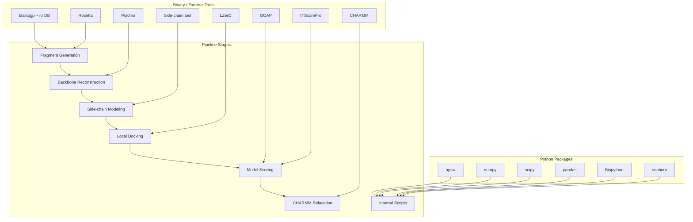
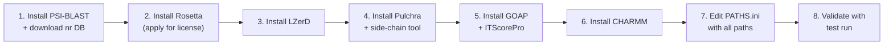

---
slug:3-external-dependencies-setup
blog_type:normal
---


IDP-LZerD 编排了一个多步骤的结构生物学流程，该流程将**基于 Python 的脚本**与多个**编译好的科学二进制文件**及**外部数据库**桥接在一起。在运行任何流程阶段之前，必须安装每个外部工具并将其路径注册到项目的核心配置文件中。本页将引导你了解每个依赖类别，解释其在流程中的作用，并准确展示如何进行配置。

来源: [README.md](/README.md#L18-L46), [PATHS.ini](/PATHS.ini#L1-L6), [scripts/shared.py](/scripts/shared.py#L293-L322)

## 依赖全景

下图将每个外部依赖映射到使用它的流程阶段。在进入单独的安装说明之前，请将此作为心智模型参考。



来源: [scripts/run_rosetta.py](/scripts/run_rosetta.py#L42-L56), [scripts/load_model_scores.py](/scripts/load_model_scores.py#L28-L32), [scripts/compute_occupancy_score.py](/scripts/compute_occupancy_score.py#L27-L31), [idp_relax.inp](/idp_relax.inp#L1-L10)

## Python 包依赖

项目的内部脚本共需要五个核心 Python 包（外加一个可视化库）。下表列出了每个包、其用途以及导入它的脚本。

| 包 | 用途 | 导入脚本 |
|---------|---------|-------------------|
| **apsw** | Another Python SQLite Wrapper — 提供 SQLite 数据库引擎绑定，用于所有 `.db` 评分和模型文件 | `shared.py`, `find_paths_stepwise.py` |
| **numpy** | 数值数组操作 — 坐标操作、距离计算 | `load_model_scores.py`, `find_paths_stepwise.py`, `cluster_heuristic.py`, `select_paths.py` |
| **scipy** | 科学计算 — 空间距离计算 (`scipy.spatial`) | `load_model_scores.py` |
| **pandas** | 表格数据操作 — CSV/SQL 加载、评分合并、基于 DataFrame 的流程逻辑 | 几乎所有脚本 |
| **Biopython** | 生物信息学 I/O — `Bio.PDB` 用于结构解析，`Bio.SeqIO` 用于 FASTA 读取 | `rosetta_to_pdb.py`, `load_model_scores.py`, `compute_occupancy_score.py`, `select_paths.py`, `combine_receptor.py` |
| **seaborn** | 统计可视化 — 占据度评分图 | `compute_occupancy_score.py` |

### 安装 Python 包

推荐使用 **conda** 进行安装，它能解决 `pip` 无法处理的 `apsw` 二进制依赖问题：

```bash
# 核心依赖
conda install numpy scipy pandas biopython

# apsw 需要 conda-forge 频道
conda install -c conda-forge apsw

# 可视化（可选，用于生成占据度图）
conda install seaborn
```

> <CgxTip>如果你使用 `pip` 而非 conda，请注意 `apsw` 会针对系统的 SQLite 头文件进行编译。在运行 `pip install apsw` 之前，请确保已安装 `sqlite3` 开发包（在 Debian/Ubuntu 上为 `libsqlite3-dev`）。</CgxTip>

来源: [README.md](/README.md#L23-L31), [scripts/shared.py](/scripts/shared.py#L26-L28), [scripts/load_model_scores.py](/scripts/load_model_scores.py#L28-L32)

## 二进制和外部工具依赖

IDP-LZerD 将计算密集型步骤委托给专业的结构生物学工具。这些工具**并未捆绑**在代码仓库中，必须单独安装。

### 必需的外部工具

| 工具 | 在流程中的用途 | 官方来源 |
|------|---------------------|-----------------|
| **PSI-BLAST** (`blastpgp` + `nr` 数据库) | 生成 Rosetta 片段选取器使用的序列谱 (PSSM) | [NCBI BLAST](https://blast.ncbi.nlm.nih.gov/Blast.cgi) |
| **Rosetta** | 片段选取器 (`fragment_picker.linuxgccrelease`) 生成 9-mer 结构片段 | [RosettaCommons](https://www.rosettacommons.org) |
| **LZerD** | 局部蛋白质-蛋白质对接 — 为每个片段生成诱饵复合物 | [kiharalab.org](http://kiharalab.org/proteindocking/lzerd.php) |
| **Pulchra** | 从仅含 Cα 的片段结构重建全原子骨架 | [Georgia Tech](http://cssb.biology.gatech.edu/PULCHRA) |
| **侧链工具**（任选其一） | 在重建的骨架上构建侧链原子 | 见下表 |
| **GOAP** | 评分函数 — 为对接模型计算 GOAP 和 DFIRE 分数 | [Georgia Tech](http://cssb.biology.gatech.edu/GOAP/index.html) |
| **ITScorePro** | 评分函数 — 为对接模型计算 ITScore 分数 | [Zou Lab](http://zoulab.dalton.missouri.edu/resources.html) |
| **CHARMM** | 对最终组装的路径进行分子动力学弛豫 | [CHARMM.org](https://www.charmm.org) |

### 侧链建模选项

你**必须至少安装以下侧链建模工具中的一种**。对于 IDP-LZerD 的用途，所有工具均产生等效的输出；你可以根据授权协议和平台可用性进行选择。

| 工具 | 许可协议 | 来源 |
|------|---------|--------|
| **SCCOMP** | 学术版 | [SHEBA Cancer](http://www.sheba-cancer.org.il/cgi-bin/sccomp/sccomp1.cgi) |
| **Scwrl4** | 学术版 | [Dunbrack Lab](http://dunbrack.fccc.edu/scwrl4/) |
| **Oscar-star** | 学术版 | [Osaka University](http://sysimm.ifrec.osaka-u.ac.jp/OSCAR) |
| **RASP** | 学术版 | [Jiang Lab](http://jianglab.ibp.ac.cn/lims/rasp/rasp) |

来源: [README.md](/README.md#L34-L46), [scripts/run_rosetta.py](/scripts/run_rosetta.py#L42-L56), [idp_relax.inp](/idp_relax.inp#L1-L10)

## 配置 PATHS.ini

代码仓库根目录下的 `PATHS.ini` 文件是所有二进制路径的**唯一可信源**。IDP-LZerD 的 Python 脚本在运行时通过 `shared.load_config()` 函数读取此文件，该函数会验证每个必需的键是否都存在。

### 当前模板

```ini
[paths]
lzerd_path: $HOME/lzerddistribution
rosetta_path: /apps/rosetta/w2016.08
nr_path: /apps/blast+/databases/nr
blastpgp_exe: /usr/bin/blastpgp
```

### 键值参考

| 键 | 描述 | 示例值 |
|-----|-------------|---------------|
| `lzerd_path` | LZerD 发行版的根目录 | `$HOME/lzerddistribution` |
| `rosetta_path` | Rosetta 安装的根目录 | `/apps/rosetta/w2016.08` |
| `nr_path` | BLAST `nr` 序列数据库的路径 | `/apps/blast+/databases/nr` |
| `blastpgp_exe` | `blastpgp` 可执行文件的路径 | `/usr/bin/blastpgp` |

### PATHS.ini 的解析方式

`shared.py` 中的 `load_config()` 函数逐行读取 `PATHS.ini`，在首个 `:` 处分割以提取键值对。随后，它会验证所有四个必需的键（`lzerd_path`、`rosetta_path`、`nr_path`、`blastpgp_exe`）是否存在，若缺少任何一个则抛出 `IDPError` 异常。

来源: [PATHS.ini](/PATHS.ini#L1-L6), [scripts/shared.py](/scripts/shared.py#L293-L322)

### 逐步安装配置流程



请按照以下顺序安装和配置所有依赖：

**步骤 1 — PSI-BLAST 和 nr 数据库。** 安装 NCBI BLAST+ 工具包并下载 `nr`（非冗余）蛋白质序列数据库。`blastpgp` 可执行文件必须位于你的 `PATH` 中，或者显式指定其路径。`nr` 数据库体积庞大（压缩后约 50 GB）；请确保留有充足的磁盘空间。在 `PATHS.ini` 中设置 `blastpgp_exe` 和 `nr_path`。

**步骤 2 — Rosetta。** 在 [rosettacommons.org](https://www.rosettacommons.org) 申请 Rosetta 许可证并下载源码或二进制发行版。IDP-LZerD 需要 Rosetta 目录树中的两个特定路径：`main/source/bin/fragment_picker.linuxgccrelease`（片段选取器二进制文件）和 `tools/fragment_tools/make_fragments.pl`（检查点解析器）。将 `rosetta_path` 设置为 Rosetta 根目录——脚本将从该路径构造子路径。

**步骤 3 — LZerD。** 从 [kiharalab.org](http://kiharalab.org/proteindocking/lzerd.php) 下载。将 `lzerd_path` 设置为发行版根目录。

**步骤 4 — Pulchra 和侧链工具。** 安装 Pulchra 用于 Cα 到骨架的重建。然后安装一种侧链建模工具（SCCOMP、Scwrl4、Oscar-star 或 RASP）。这些工具在流程步骤之间手动调用（无需在 `PATHS.ini` 中配置）。

**步骤 5 — GOAP 和 ITScorePro。** 安装这两个评分工具。它们需在对接诱饵上手动运行，以生成流程读取的 `goap_score.txt` 和 `scores.itscore` 文件。

**步骤 6 — CHARMM。** 安装 CHARMM 用于最终的弛豫步骤。在运行弛豫之前，编辑 `idp_relax.inp` 将 `{charmm_dir}` 设置为你的 CHARMM 安装路径。

**步骤 7 — 编辑 PATHS.ini。** 更新所有四个键以匹配你的安装位置。

**步骤 8 — 验证。** 运行测试流程（`cd test && ./test_decoys.sh`）以确认所有路径都能正确解析。

> <CgxTip>一个常见错误是跳过安装 `blastpgp` 和/或 `nr` 数据库。如果 Rosetta 在运行时尝试下载软件，或者报告提及 "blast" 或 "nr" 的错误，请验证 `PATHS.ini` 中的值是否与你实际的安装路径相匹配。</CgxTip>

来源: [README.md](/README.md#L49-L52), [scripts/run_rosetta.py](/scripts/run_rosetta.py#L54-L56), [idp_relax.inp](/idp_relax.inp#L4-L4)

## Rosetta 如何使用 PATHS.ini 键

`run_rosetta.py` 脚本演示了 `PATHS.ini` 的值如何流入具体的 Rosetta 命令。在 `load_config()` 返回配置字典后，该脚本构造了两个关键路径：

```
make_fragments.pl → {rosetta_path}/tools/fragment_tools/make_fragments.pl
fragment_picker   → {rosetta_path}/main/source/bin/fragment_picker.linuxgccrelease
```

`blastpgp_exe` 和 `nr_path` 的值被直接代入 PSI-BLAST 命令模板中以生成序列谱：

```
blastpgp -t 1 -i {id}.fasta -F F -j2 -o {id}.blast
       -d {nr_path} -v10000 -b10000 -K1000
       -h0.0009 -e0.0009
       -C {id}.chk -Q {id}.pssm
```

Rosetta 片段选取器标志文件模板（`quota-protocol.flags.template`）也引用了 `{rosetta_path}` 以定位 Rosetta 数据库和 vall 片段库：

```
-in::path::database    {rosetta_path}/main/database
-in::file::vall        {rosetta_path}/tools/fragment_tools/vall.apr24.2008.extended.gz
```

来源: [scripts/run_rosetta.py](/scripts/run_rosetta.py#L42-L56), [scripts/run_rosetta.py](/scripts/run_rosetta.py#L102-L113), [scripts/rosetta_templates/quota-protocol.flags.template](/scripts/rosetta_templates/quota-protocol.flags.template#L1-L6)

## 不在 PATHS.ini 中的依赖

部分工具在流程阶段之间**手动**调用，且未在 `PATHS.ini` 中配置。下表列出了每个此类工具、使用它的流程步骤，以及预期的输入/输出约定。

| 工具 | 使用时机 | 输入 → 输出 | 约定 |
|------|-----------|----------------|------------|
| **Pulchra** | 片段生成之后 | `frag_???.pdb`（仅含 Cα） → 全原子骨架 PDB | 运行：`find ./ -name "frag_???.pdb" -print0 \| xargs -0 -n1 pulchra` |
| **侧链工具** | Pulchra 之后 | 骨架 PDB → 带有侧链的全原子 PDB | 工具特定的调用方式 |
| **GOAP** | LZerD 对接之后 | 对接模型 → `goap_score.txt` | 必须在片段目录中生成名为 `goap_score.txt` 的文件 |
| **ITScorePro** | LZerD 对接之后 | 对接模型 → `scores.itscore` | 必须在片段目录中生成名为 `scores.itscore` 的文件 |
| **CHARMM** | 路径组装之后 | 组合 PDB + `idp_relax.inp` → 弛豫结构 | 编辑 `idp_relax.inp` 以设置 `charmm_dir` 和工作目录 |

`shared.py` 模块硬编码了 GOAP 和 ITScorePro 输出的预期文件名（`goap_score.txt` 和 `scores.itscore`），因此你必须确保评分运行在每个片段的 `decoys/` 子目录中生成具有这些确切名称的文件。

来源: [README.md](/README.md#L76-L80), [scripts/shared.py](/scripts/shared.py#L216-L242), [idp_relax.inp](/idp_relax.inp#L1-L10)

## 常见安装问题排查

| 症状 | 根本原因 | 解决方案 |
|---------|------------|------------|
| Rosetta 以非零代码退出 | 未找到 `fragment_picker` 二进制文件或架构不匹配 | 验证 `rosetta_path` 指向了包含你平台已编译二进制文件的完整 Rosetta 安装目录 |
| "Could not open PATHS.ini" | 代码仓库根目录中缺少 `PATHS.ini` | 确保你是从代码仓库目录树内运行脚本，或者 `ROOTDIR` 解析正确 |
| 缺少配置键时出现 `IDPError` | `PATHS.ini` 缺少四个必需键之一 | 添加缺少的键（`lzerd_path`、`rosetta_path`、`nr_path` 或 `blastpgp_exe`） |
| Rosetta 报告 "blast" 或 "nr" 错误 | `blastpgp_exe` 或 `nr_path` 不正确 | 确认 `blastpgp` 可执行，并且 `nr` 数据库文件存在于指定路径 |
| 数据库文件出现 `apsw.CantOpenError` | 数据库文件缺失或不可读 | 首先运行 `create_database.py` 以生成 SQLite 数据库，然后再运行 `load_model_scores.py` |
| 找不到 `scores.itscore` 或 `goap_score.txt` | 未在对接模型上运行 ITScorePro/GOAP | 在运行 `load_model_scores.py` 之前，对每个片段的诱饵目录运行评分工具 |

来源: [scripts/shared.py](/scripts/shared.py#L296-L322), [scripts/run_rosetta.py](/scripts/run_rosetta.py#L140-L148), [README.md](/README.md#L51-L52)

## 接下来去哪里

一旦所有依赖安装完毕且 `PATHS.ini` 配置完成，你就准备好运行流程了。逻辑上的下一步是**快速入门**指南，它将引导你端到端地运行测试蛋白质：

→ [快速入门](2-quick-start)

若要更深入地了解这些依赖如何在流程架构中连接：

→ [架构概览](4-architecture-overview)

有关 `PATHS.ini` 解析方式及配置如何在代码库中流转的详细信息：

→ [配置与 PATHS.ini](18-configuration-and-paths-ini)