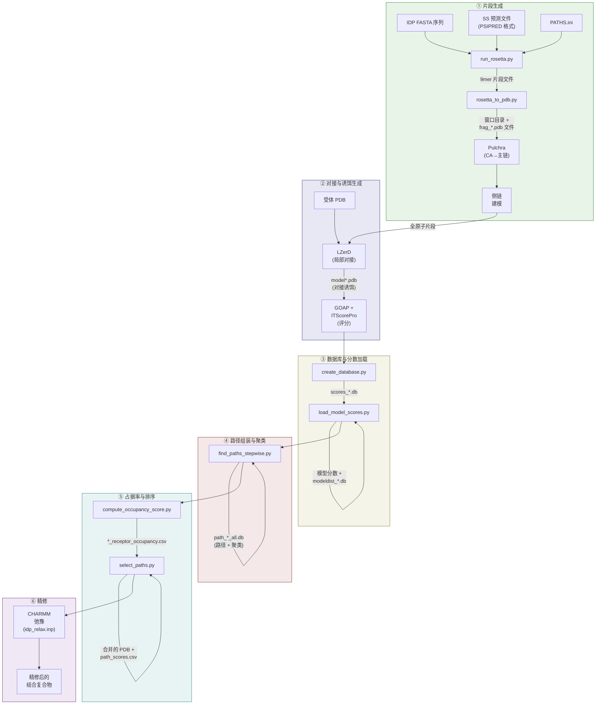
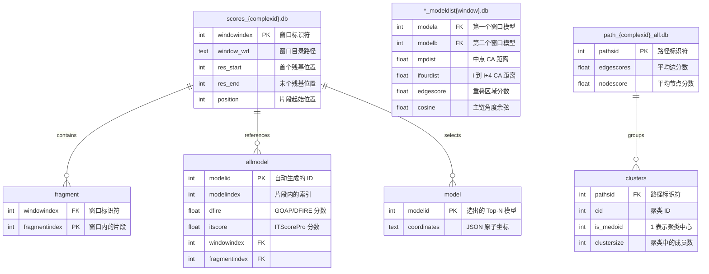
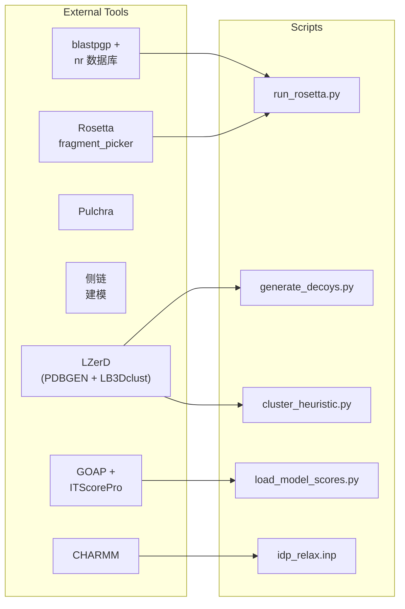

---
slug:4-architecture-overview
blog_type:normal
---


IDP-LZerD 是一个计算流水线，用于对**天然无序蛋白 (IDP) 与有序受体蛋白相互作用时的结合构象**进行建模。该系统将 IDP 序列分解为重叠的 9 残基窗口，通过 Rosetta 为每个窗口生成结构片段，使用 LZerD 将每个片段与受体进行对接，然后对兼容的片段放置位置执行组合路径搜索，以组装全长的结合构象。其架构是一个**分阶段批处理流水线** —— 每个阶段产生被下游阶段消费的持久化产物（SQLite 数据库、PDB 文件、CSV），脚本之间没有内存数据传递。这种设计允许在每个阶段设置检查点并在故障后恢复，鉴于该流水线单个测试用例的输出规模就达到约 250 GB，这一点至关重要。

来源: [README.md](/README.md#L1-L82), [test_decoys.sh](/test/test_decoys.sh#L1-L27)

## 流水线架构

完整的 IDP-LZerD 工作流分为六个逻辑阶段进行，每个阶段都实现为一个从 Shell 调用的独立 Python 脚本。下面的 Mermaid 图展示了端到端的数据流；请从上至下阅读，其中每个节点代表一个脚本或外部工具，边代表文件级的数据依赖关系。



来源: [test_decoys.sh](/test/test_decoys.sh#L1-L27), [README.md](/README.md#L49-L82)

## 核心子系统

每个子系统封装了不同的计算职责。下表将每个脚本映射到其流水线阶段、主类、输入产物和输出产物 —— 为追踪数据溯源提供快速参考。

| 脚本 | 阶段 | 主类 | 输入 | 输出 |
|---|---|---|---|---|
| `run_rosetta.py` | 片段生成 | `RunRosetta` | FASTA, SS 预测 | 9mer 片段文件, `.fsc` 分数文件 |
| `rosetta_to_pdb.py` | 片段生成 | `MakePdb` | 9mer 片段文件 | 窗口目录, `*_data.csv` |
| `parse_ss.py` | 片段生成 | `ParseSs` | Porter/Jpred/SSPro 文件 | PSIPRED 格式的 `.ss2` 文件 |
| `create_database.py` | 数据库创建 | `main()` | 窗口目录, `*_data.csv` | `scores_*.db` (SQLite) |
| `load_model_scores.py` | 对接与评分 | `LoadModelScores` | `scores_*.db`, 诱饵 PDB | 更新的 `scores_*.db`, `*_modeldist*.db` |
| `find_paths_stepwise.py` | 路径组装 | `FindPathsStepwise` | `scores_*.db`, `*_modeldist*.db` | `path_*_all.db` (SQLite) |
| `cluster_heuristic.py` | 路径组装 | `ClusterPdb` / `ClusterLRMSD` | `path_*_all.db`, `scores_*.db` | `path_*_all.db` 中的聚类表 |
| `compute_occupancy_score.py` | 占据率评分 | `PlotPaths` | `path_*_all.db`, `scores_*.db` | `*_receptor_occupancy.csv` |
| `select_paths.py` | 路径排序 | `SelectPaths` | 所有数据库, 占据率 CSV | 合并的 PDB, `path_scores.csv` |
| `combine_receptor.py` | 精修 | `CombineChain` | 多链受体 PDB | 单链受体 PDB |
| `shared.py` | 跨阶段通用 | — | `PATHS.ini` | 配置字典, 实用工具函数 |

来源: [run_rosetta.py](/scripts/run_rosetta.py#L42-L182), [create_database.py](/scripts/create_database.py#L50-L126), [load_model_scores.py](/scripts/load_model_scores.py#L35-L200), [find_paths_stepwise.py](/scripts/find_paths_stepwise.py#L35-L200), [cluster_heuristic.py](/scripts/cluster_heuristic.py#L33-L200), [compute_occupancy_score.py](/scripts/compute_occupancy_score.py#L31-L200), [select_paths.py](/scripts/select_paths.py#L31-L200), [shared.py](/scripts/shared.py#L23-L323)

## 数据持久化模型

IDP-LZerD 使用 **SQLite (通过 APSW)** 作为其唯一的结构化持久化机制。数据库模式在流水线的各个阶段中演化 —— 每个阶段添加表或整个数据库文件，而不是修改现有模式，遵循**仅追加积累**模式。三个不同的数据库文件构成了持久化的骨干：



**分数数据库**是核心枢纽：`create_database.py` 初始化 `window` 和 `fragment` 表；`load_model_scores.py` 用原始分数填充 `allmodel`，选择 Top-N 模型进入嵌入坐标 JSON 的 `model`，然后生成成对的**模型距离数据库** (`*_modeldist*.db`)，编码连续窗口之间的几何兼容性。**路径数据库**由 `find_paths_stepwise.py` 增量构建 —— 对于从 2 到 *N* 的每个窗口计数 *n*，通过将上一级路径与当前窗口的 modeldist 表连接来创建 `paths{n}` 表，然后 `cluster_heuristic.py` 添加一个 `clusters{n}` 表，按结构相似性 (LRMSD) 对这些路径进行分区。

来源: [create_database.py](/scripts/create_database.py#L31-L49), [load_model_scores.py](/scripts/load_model_scores.py#L35-L100), [find_paths_stepwise.py](/scripts/find_paths_stepwise.py#L48-L100), [shared.py](/scripts/shared.py#L30-L110)

## 窗口分解策略

IDP 序列被分解为**重叠的 9 残基窗口**，偏移量为 6 个残基，由 `shared.py` 中的 `create_windows()` 实现。对于长度为 *L* 的序列，窗口从残基位置 1, 7, 13, 19, ... 开始 —— 每个覆盖 9 个残基，与其相邻窗口在每个边界上有 3 个残基的重叠。最后一个窗口被截断至序列长度，并调整其起始位置以维持重叠不变性。这种滑动窗口设计是整个流水线的核心：每个窗口生成独立的片段结构，3 残基重叠提供了在路径组装期间使用的几何约束表面（边分数、余弦检查、冲突检测），以确保跨越窗口边界的结构连续性。

来源: [shared.py](/scripts/shared.py#L279-L295), [rosetta_to_pdb.py](/scripts/rosetta_to_pdb.py#L55-L130)

## 几何兼容性过滤器

当 `load_model_scores.py` 计算窗口间的成对模型距离时，它应用**五级几何过滤器级联**来确定两个对接的片段放置位置在结构上是否兼容。这些过滤器对作为 JSON 存储在 `model` 表中的预提取坐标数组进行操作，其阈值在 `LoadModelScores` 中被参数化为类级别默认值：

| 过滤器 | 计算 | 目的 |
|---|---|---|
| **中点距离** | 每个窗口重叠中点处 CA 原子间的欧氏距离 | 确保两个片段在 3D 空间中彼此位置相近 |
| **i 到 i+4 CA 距离** | 窗口 *k* 的最后一个重叠 CA 与窗口 *k+1* 的第一个重叠后 CA 之间的距离 | 验证连接处的主链连续性 |
| **主链冲突** | 重叠区域中所有主链原子间的成对距离矩阵；统计低于阈值的原子对数量 | 拒绝重叠残基间的空间位阻冲突 |
| **边分数** | 对应重叠区域原子间距离的均方值 | 量化共享残基区域的结构一致性 |
| **余弦检查** | 连接处主链方向向量间夹角的余弦值 | 防止窗口边界处出现不切实际的主链弯折 |

对于相邻窗口通过所有过滤器的模型，被记录为 `modeldist` 表中的**允许对**；对于非相邻窗口未通过的模型，被记录为**不允许对**，以在路径搜索期间强制执行长程排除。

来源: [load_model_scores.py](/scripts/load_model_scores.py#L200-L350)

## 路径组装算法

`find_paths_stepwise.py` 实现了一种**自底向上的动态规划**方法来组装全长 IDP 构象。该算法增量构建路径：

1. **基本情况 (n=2)**：直接查询第一个 `modeldist` 表 —— 每个允许对 成为一条 2 窗口路径，其 `edgescores` = 对的边分数，`nodescore` = 单个模型 `di` 分数的平均值。
2. **归纳步骤 (n→n+1)**：对于每条现有的 *n* 窗口路径（对于 *n* ≥ 3，限制为聚类中心点），查询 `modeldist` 表以在窗口 *n+1* 中找到兼容模型，排除已被早期窗口禁止的模型。扩展路径，将 `edgescores` 更新为运行平均值，将 `nodescore` 更新为所有窗口 `di` 值的平均值。
3. **聚类**：在每一层之后，`cluster_heuristic.py` 使用 LZerD 的 `LB3Dclust` 二进制文件以 4.0 Å 截断值按 LRMSD 对路径进行分组，存储聚类分配和中心点标志。只有中心点作为下一层的扩展种子，从而实现了搜索空间的指数级缩减。

批量插入策略（默认每事务 10,000 行）以及通过 APSW 备份 API 将 `modeldist` 数据库全量加载到内存中，是关键的性能优化 —— 若无聚类，片段放置位置的组合爆炸将使搜索变得不可行。

来源: [find_paths_stepwise.py](/scripts/find_paths_stepwise.py#L100-L361), [cluster_heuristic.py](/scripts/cluster_heuristic.py#L33-L200)

## 路径评分与选择

`select_paths.py` 实现了一个**多标准排序**系统，将四个正交分数组合成一个单一的加权度量。每个分数首先在所有聚类中心点之间转换为 Z 分数，然后进行组合：

| 分数组件 | 来源 | 方向 | 权重 | 依据 |
|---|---|---|---|---|
| `nodescore` | 每个窗口的平均 `di` (缩放后的 ITScorePro+GOAP) | 越低越好 | 0.5 | 单个片段放置位置的对接质量 |
| `edgescores` | 跨窗口边界的平均边分数 | 越低越好 | 0.1 | 重叠处的结构一致性 |
| `clustersize` | LRMSD 聚类中的路径数 | 越大越好 | 0.3 | 来自结构共识的置信度 |
| `occupancyscore` | 聚类中所有路径的受体接触计数 | 越大越好 | 0.1 | 结合界面的生物学合理性 |

最终的 `weighted_score` 混合了一个“最佳分数”项（β=0.3，取所有四个度量的最小 Z 分数）与所有四个 Z 分数的加权和（1−β=0.7，使用上述权重）。这种混合公式奖励至少在一个标准上表现优异的路径，同时仍要求在所有维度上具有合理的表现。选择前 *N* 条路径（默认 100），将其片段 PDB 与受体结构合并，并将组合的复合物写出以供 CHARMM 精修。

来源: [select_paths.py](/scripts/select_paths.py#L31-L150), [compute_occupancy_score.py](/scripts/compute_occupancy_score.py#L31-L200)

## 外部依赖拓扑

IDP-LZerD 编排了七个外部工具，每个工具在特定的流水线阶段被调用。依赖拓扑通过 `PATHS.ini` 配置，该文件将四个键（`lzerd_path`、`rosetta_path`、`nr_path`、`blastpgp_exe`）映射到文件系统路径。下图显示了哪些脚本调用了哪些外部工具：



请注意，Pulchra、侧链建模、GOAP 和 ITScorePro 是在 Python 流水线**之外**调用的 —— 用户需按照 README 中的文档说明在阶段间手动运行它们。这反映了该流水线被设计为脚本编排层，而非单体框架。

来源: [PATHS.ini](/PATHS.ini#L1-L6), [shared.py](/scripts/shared.py#L298-L323), [README.md](/README.md#L19-L45)

## 共享工具与配置

`shared.py` 充当被每个流水线脚本导入的**跨阶段通用基础层**。它提供三大类功能：

**数据库访问** —— 基于 APSW 的上下文托管 SQLite 连接工厂（`ro_conn`、`write_conn`、`new_conn`），以及用于将查询转换为 DataFrame 的 `db_to_pandas()` 和 `conn_to_pandas()`，还有用于类型安全参数化 SQL 生成的 `create_insert_statement()` / `create_update_statement()`。

**文件系统实用工具** —— 用于安全目录更改的 `CHDIR` 上下文管理器，用于幂等目录创建的 `mkdir_p()`，用作流水线阶段守卫的文件存在性检查 `missing()`，以及容错清理的 `silent_remove()`。

**领域特定辅助工具** —— 用于 9-mer 窗口分解的 `create_windows()`，用于带必填键验证的 `PATHS.ini` 解析的 `load_config()`，用于从 PDB 文件中去除氢原子的 `strip_h()`，氨基酸映射字典（`three_to_one`、`one_to_three`），以及分数文件解析器（`read_itscore`、`read_dfire_from_goap`）。

来源: [shared.py](/scripts/shared.py#L23-L323)

## 项目结构

```
idp_lzerd/
├── PATHS.ini                        # 外部工具路径配置
├── idp_relax.inp                    # CHARMM 弛豫输入模板
├── scripts/
│   ├── run_rosetta.py               # ① Rosetta 片段生成
│   ├── rosetta_to_pdb.py            # ① 片段格式转换
│   ├── parse_ss.py                  # ① 二级结构归一化
│   ├── rosetta_templates/           # ① Rosetta 标志/权重模板
│   │   ├── quota-protocol.flags.template
│   │   ├── quota-protocol.wghts
│   │   └── quota.def
│   ├── create_database.py           # ③ SQLite 模式初始化
│   ├── load_model_scores.py         # ③ 分数加载 + 几何过滤
│   ├── find_paths_stepwise.py       # ④ 组合路径搜索
│   ├── cluster_heuristic.py         # ④ 基于 LRMSD 的路径聚类
│   ├── compute_occupancy_score.py   # ⑤ 受体接触占据率
│   ├── select_paths.py              # ⑤ 多标准路径排序
│   ├── combine_receptor.py          # ⑥ 多链受体合并
│   ├── parse.pl                     # ① BLAST 检查点转换
│   └── shared.py                    # 跨阶段通用工具
└── test/
    ├── 4ah2/                        # 测试用例片段目录
    ├── 4ah2_data.csv                # 测试用例的窗口元数据
    ├── generate_decoys.py           # ② LZerD 诱饵生成包装器
    └── test_decoys.sh               # 端到端测试编排
```

来源: [README.md](/README.md#L1-L82), [test_decoys.sh](/test/test_decoys.sh#L1-L27)

<CgxTip>每个流水线脚本都使用 `shared.missing()` 来守卫其核心计算 —— 如果输出文件已存在，则跳过该阶段。这意味着你可以通过简单地重新执行 Shell 脚本来恢复失败的流水线运行，而无需清理已完成阶段的部分输出。</CgxTip>

<CgxTip>在路径搜索期间，`modeldist` 数据库通过 APSW 的备份 API（带有 `backup.step()` 的 `apsw.Connection(":memory:")`）完全加载到内存中。对于具有许多窗口的蛋白质，这可能会消耗大量 RAM —— 若在受限系统上运行，请监控内存使用情况。</CgxTip>

## 建议阅读顺序

你刚刚阅读的架构概述建立了完整的流水线上下文。为了加深理解，请按照以下顺序阅读目录：

1. **片段生成** —— 从 [Rosetta Fragment Picker](5-rosetta-fragment-picker) 开始，了解结构片段是如何生成的，然后阅读 [Rosetta-to-PDB Conversion](6-rosetta-to-pdb-conversion) 和 [Secondary Structure Parsing](7-secondary-structure-parsing) 以了解格式处理。
2. **对接与评分** —— [Database Creation and Schema](8-database-creation-and-schema) 解释了持久化模型，[Model Score Loading](9-model-score-loading) 涵盖了分数摄取和几何过滤，[Geometric Cutoff Filters](10-geometric-cutoff-filters) 详述了兼容性级联。
3. **路径组装** —— [Stepwise Path Search](11-stepwise-path-search) 是算法核心，由 [Heuristic Clustering](12-heuristic-clustering)、[Occupancy Score Computation](13-occupancy-score-computation) 和 [Path Selection and Ranking](14-path-selection-and-ranking) 提供支持。
4. **精修** —— [CHARMM Relaxation Protocol](15-charmm-relaxation-protocol) 和 [Receptor Chain Combination](16-receptor-chain-combination) 涵盖了最终的输出阶段。
5. **参考** —— [Shared Utilities Reference](17-shared-utilities-reference) 和 [Configuration and PATHS.ini](18-configuration-and-paths-ini) 提供了查阅材料。