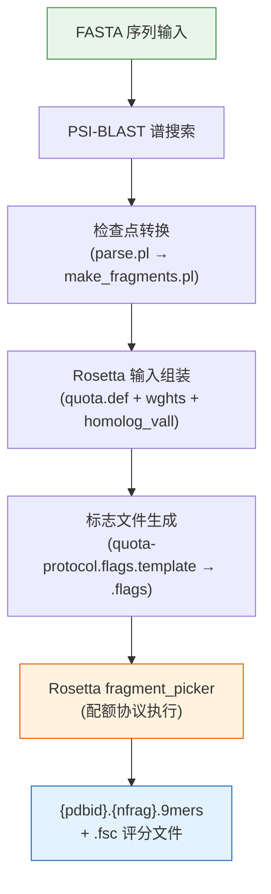

---
slug:5-rosetta-fragment-picker
blog_type:normal
---


Rosetta 片段选择器是 IDP-LZerD 片段生成流程的第一阶段，负责从内在无序蛋白 (IDP) 序列中生成结构片段库。它封装了 Rosetta 的**基于配额的片段选择器**，将来自 PSI-BLAST 的序列谱信息与来自四种独立方法（PSIPRED、Porter、Jpred 和 SSPro）的共识二级结构预测相结合，生成位置特异性的 9 残基片段候选物，作为下游对接和路径组装的结构构建块。

## 流程架构

片段选择器作为一个由 `RunRosetta` 类完全编排的五阶段流程运行。每个阶段都会产生一个供下一阶段使用的中间产物，整个流程由**输出存在性检查**保护，当片段文件已存在时跳过重新计算。



来源: [run_rosetta.py](scripts/run_rosetta.py#L39-L148), [parse.pl](scripts/parse.pl#L1-L34)

## RunRosetta 编排器

`RunRosetta` 类将完整的片段生成流程封装为类方法 `run()`，并附带一个用于 CLI 调用的 `parse_args()` 方法。它被设计为**无状态编排器**——所有流程状态都通过局部变量和文件系统传递，绝不通过实例属性传递。

### 类级别配置

| 属性 | 值 | 用途 |
|---|---|---|
| `blastcmdfmt` | 格式化的 PSI-BLAST 命令字符串 | 用于生成谱的模板，最大命中数 1000，e 值 0.0009 |
| `convert_blast` | `parse.pl` 的路径 | 委托检查点格式转换 |
| `ss_methods` | `("psipred", "porter", "jpred", "sspro")` | 所需的二级结构预测方法 |
| `default_nfrag` | `30` | 每个位置的默认片段数 |

PSI-BLAST 命令模板编码了激进搜索参数：`-K1000`（最大 1000 次比对），`-h0.0009 -e0.0009`（包含阈值和 e 值阈值），以及 `-v10000 -b10000`（输出限制）。这些参数确保了片段选择器序列相似性评分的深度谱覆盖。

来源: [run_rosetta.py](scripts/run_rosetta.py#L42-L46), [run_rosetta.py](scripts/run_rosetta.py#L106-L110)

## 阶段 1：PSI-BLAST 谱生成

当 Rosetta 检查点文件 (`.checkpoint`) 不存在时，流程首先检查 PSI-BLAST 二进制检查点 (`.chk`)。如果该文件也不存在，则针对 `nr` 数据库执行 PSI-BLAST：

```
blastpgp -t 1 -i {id}.fasta -F F -j2 -o {id}.blast
         -d {nr_path} -v10000 -b10000 -K1000
         -h0.0009 -e0.0009 -C {id}.chk -Q {id}.pssm
```

关键标志：`-j2` 运行 2 次 PSI-BLAST 迭代；`-F F` 禁用低复杂度过滤；`-C` 生成二进制检查点；`-Q` 生成 PSSM。blast 可执行文件路径和 `nr` 数据库路径通过 `shared.load_config()` 从 [PATHS.ini](PATHS.ini#L1-L6) 读取。

来源: [run_rosetta.py](scripts/run_rosetta.py#L42-L43), [run_rosetta.py](scripts/run_rosetta.py#L104-L110), [PATHS.ini](PATHS.ini#L1-L6)

## 阶段 2：检查点格式转换

`parse.pl` 脚本桥接了 PSI-BLAST 二进制检查点格式和 Rosetta 期望的纯文本 `.checkpoint` 格式。它的操作方式是**将 Rosetta 自身的 `make_fragments.pl` 作为 Perl 模块加载**（通过 `do $make_fragments_path`），然后从中调用三个函数：

1. `read_fasta($fasta_file)` — 解析查询序列
2. `parse_checkpoint_file($chk_file)` — 读取二进制 PSI-BLAST 检查点
3. `finish_checkpoint_matrix($sequence, @checkpoint_matrix)` — 完成谱矩阵
4. `write_checkpoint_file($outfile, $sequence, @checkpoint_matrix)` — 写入 Rosetta 格式的输出

这种委托策略意味着 IDP-LZerD 依赖 Rosetta 自身的检查点解析逻辑，而不是重新实现它，从而确保了跨 Rosetta 版本的格式兼容性。

<CgxTip>`parse.pl` 脚本恰好需要 3 个位置参数：Rosetta 的 `make_fragments.pl` 路径、FASTA 文件和 `.chk` 文件。如果缺少任何一项，脚本将终止并输出用法信息。</CgxTip>

来源: [parse.pl](scripts/parse.pl#L1-L34), [run_rosetta.py](scripts/run_rosetta.py#L112-L113)

## 阶段 3：输入文件组装

在运行片段选择器之前，`RunRosetta.run()` 会组装一个工作目录树，并使用所需的输入文件填充它：

```
quota{complexname}/
├── input_files/
│   ├── {pdbid}.fasta          ← 从 ligand_sequence 复制
│   ├── {pdbid}.checkpoint     ← 由阶段 2 生成
│   ├── quota.def              ← 从 rosetta_templates/ 复制
│   ├── quota-protocol.wghts   ← 从 rosetta_templates/ 复制
│   └── {pdbid}.homolog_vall   ← 生成（仅包含 pdbid）
├── output_files/              ← 创建为空；fragment_picker 在此写入
└── quota-protocol.flags       ← 由阶段 4 中的模板生成
```

**同源排除文件** (`{pdbid}.homolog_vall`) 是一个简单的单行文件，包含 PDB ID。这防止了片段选择器选择源自查询结构本身的片段，消除了片段库中的同源偏差。

来源: [run_rosetta.py](scripts/run_rosetta.py#L81-L127)

## 阶段 4：标志文件生成

片段选择器通过**模板替换**生成的标志文件进行配置。模板 `quota-protocol.flags.template` 包含在运行时解析的 Python 格式占位符（`{rosetta_path}`、`{pdbid}`、`{nfrag}`、`{psipred_path}` 等）：

| 模板占位符 | 来源 | 示例值 |
|---|---|---|
| `{rosetta_path}` | `PATHS.ini` 配置 | `/apps/rosetta/w2016.08` |
| `{pdbid}` | `complexname + ligand_chain` | `4ah2A` |
| `{nfrag}` | CLI 参数或默认值 | `30` |
| `{psipred_path}` | CLI `--psipred_path` | SS 预测文件的绝对路径 |
| `{native_line}` | 空字符串（无天然结构） | `""` |
| `{protocol_type}` | 空字符串 | `""` |

<CgxTip>`{native_line}` 和 `{protocol_type}` 占位符当前被硬编码为空字符串，这意味着没有用于评分的天然参考结构，并且权重文件始终为 `quota-protocol.wghts`（而非 `quota-protocol<type>.wghts`）。这对于没有可用结合态结构的 IDP 用例是有意为之的。</CgxTip>

来源: [run_rosetta.py](scripts/run_rosetta.py#L79-L127), [quota-protocol.flags.template](scripts/rosetta_templates/quota-protocol.flags.template#L1-L38)

## 阶段 5：配额协议执行

组装好的标志文件驱动 Rosetta 的 `fragment_picker.linuxgccrelease` 二进制文件。**配额协议**是核心策略：它不是从单一评分机制中选择所有片段，而是将片段预算分配到多个**配额池**中，每个配额池与一种二级结构预测方法相关联。

### 配额池分布

`quota.def` 文件定义了 30 个片段槽的划分方式：

| 池 ID | 方法 | 比例 | 片段数（共 30） |
|---|---|---|---|
| 1 | psipred | 0.25 | 7–8 |
| 2 | sspro | 0.25 | 7–8 |
| 3 | jpred | 0.25 | 7–8 |
| 4 | porter | 0.25 | 7–8 |

这种均等分配确保了**跨 SS 预测器的多样性**：如果一种方法错误预测了某个区域的二级结构，来自其他方法的片段仍能提供结构上截然不同的候选物。1000 个候选物 (`-frags::n_candidates 1000`) 为跨所有四种方法的基于配额的选择提供了足够大的池。

### 评分机制

`quota-protocol.wghts` 文件定义了一个**多信号复合评分函数**，包含按优先级加权的组件：

| 评分项 | 优先级 | 权重 | SS 方法绑定 | 信号类型 |
|---|---|---|---|---|
| SecondarySimilarity | 350 | 0.5 | psipred | SS 共识一致性 |
| SecondarySimilarity | 250 | 0.5 | porter | SS 共识一致性 |
| SecondarySimilarity | 250 | 0.5 | jpred | SS 共识一致性 |
| SecondarySimilarity | 250 | 0.5 | sspro | SS 共识一致性 |
| RamaScore | 150 | 1.0 | psipred | 拉氏偏好 |
| RamaScore | 150 | 1.0 | porter | 拉氏偏好 |
| RamaScore | 150 | 1.0 | jpred | 拉氏偏好 |
| RamaScore | 150 | 1.0 | sspro | 拉氏偏好 |
| ProfileScoreL1 | 200 | 1.0 | — | 序列谱（L1 距离） |

**优先级**列决定评估顺序（数值越高越先评估）；**权重**缩放每个评分的贡献。PSIPRED 的 `SecondarySimilarity` 获得最高优先级 (350)，使其在其配额池内对片段排名产生最强影响。`ProfileScoreL1` 使用 L1 范数将查询的 PSI-BLAST 谱与 vall 数据库谱进行比较，提供了一个独立于所有四种 SS 方法的正交序列相似性信号。存在两个被注释掉的评分项（`PhiPsiSquareWell` 和 `FragmentCrmsd`），但已被禁用——可能是因为它们需要天然结构参考，而这对于 IDP 是不可用的。

来源: [quota-protocol.wghts](scripts/rosetta_templates/quota-protocol.wghts#L1-L14), [quota.def](scripts/rosetta_templates/quota.def#L1-L6), [quota-protocol.flags.template](scripts/rosetta_templates/quota-protocol.flags.template#L13-L37)

## 输出产物

成功执行后，`output_files/` 中会出现两个文件：

| 文件 | 模式 | 内容 |
|---|---|---|
| 片段文件 | `{pdbid}.{nfrag}.9mers` | 具有 CA 坐标的选定 9 残基片段 |
| 评分文件 | `{pdbid}.fsc.{nfrag}.9mers` | 所有候选片段的逐片段评分明细 |

片段文件是 [Rosetta 转 PDB 转换](6-rosetta-to-pdb-conversion) 的主要输入，该转换将 Rosetta 的内部片段格式转换为标准 PDB 文件。评分文件支持对片段质量和选择行为进行事后分析。流程通过检查这两个文件是否存在来验证完成情况；如果 Rosetta 以代码 0 退出但未能生成它们，将引发 `RunRosettaError`，并显示消息 "Rosetta did not finish but exited 0"。

来源: [run_rosetta.py](scripts/run_rosetta.py#L71-L78), [run_rosetta.py](scripts/run_rosetta.py#L146-L148)

## CLI 参考

该脚本作为独立模块使用以下参数调用：

```
python scripts/run_rosetta.py <PDB_ID> [options]
```

| 参数 | 必需 | 默认值 | 描述 |
|---|---|---|---|
| `complexname` | 是 | — | 复合物的 PDB ID |
| `-l` / `--ligand_chain` | 否 | — | IDP 配体的链标识符 |
| `-s` / `--ligand_sequence` | 否 | — | 配体序列的 FASTA 文件路径 |
| `--psipred_path` | 否 | — | PSIPRED 二级结构预测路径 |
| `--porter_path` | 否 | — | Porter 二级结构预测路径 |
| `--jpred_path` | 否 | — | Jpred 二级结构预测路径 |
| `--sspro_path` | 否 | — | SSPro 二级结构预测路径 |
| `-d` / `--directory` | 否 | `quota{complexname}` | Rosetta 运行的工作目录 |
| `-n` / `--nfrag` | 否 | `30` | 每个位置的片段数 |

所有四个 SS 预测文件必须存在于磁盘上；如果缺少任何一个，将在流程开始时引发 `RunRosettaError`。二级结构文件必须采用 **PSIPRED VFORMAT**（由[二级结构解析](7-secondary-structure-parsing)生成）。

来源: [run_rosetta.py](scripts/run_rosetta.py#L150-L181), [run_rosetta.py](scripts/run_rosetta.py#L84-L89)

## 外部依赖

片段选择器需要几个外部工具，均通过 [PATHS.ini](PATHS.ini#L1-L6) 配置：

| 依赖项 | 配置键 | 流程中的作用 |
|---|---|---|
| PSI-BLAST (`blastpgp`) | `blastpgp_exe` | 序列谱生成 |
| NR 数据库 | `nr_path` | PSI-BLAST 搜索数据库 |
| Rosetta | `rosetta_path` | 片段选择器二进制文件 + `make_fragments.pl` + vall 数据库 |

Rosetta 安装必须包含位于 `{rosetta_path}/main/source/bin/fragment_picker.linuxgccrelease` 的已编译片段选择器二进制文件，以及位于 `{rosetta_path}/tools/fragment_tools/` 的片段工具（用于 `make_fragments.pl` 和 `vall.apr24.2008.extended.gz` 片段数据库）。

来源: [run_rosetta.py](scripts/run_rosetta.py#L55-L56), [quota-protocol.flags.template](scripts/rosetta_templates/quota-protocol.flags.template#L3-L5), [PATHS.ini](PATHS.ini#L1-L6)

## 后续步骤

此流程生成的 9-mer 片段文件将直接输入到 [Rosetta 转 PDB 转换](6-rosetta-to-pdb-conversion) 中，该转换将 Rosetta 的内部片段表示转换为适合使用 Pulchra 进行骨架重建以及后续 LZerD 对接的 PDB 格式文件。此处使用的二级结构预测由[二级结构解析](7-secondary-structure-parsing) 准备，它将每个预测服务器的输出标准化为配额协议所需的 PSIPRED VFORMAT。