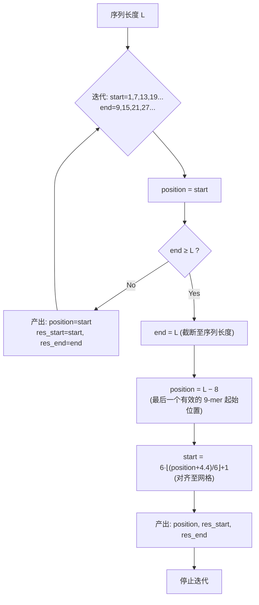
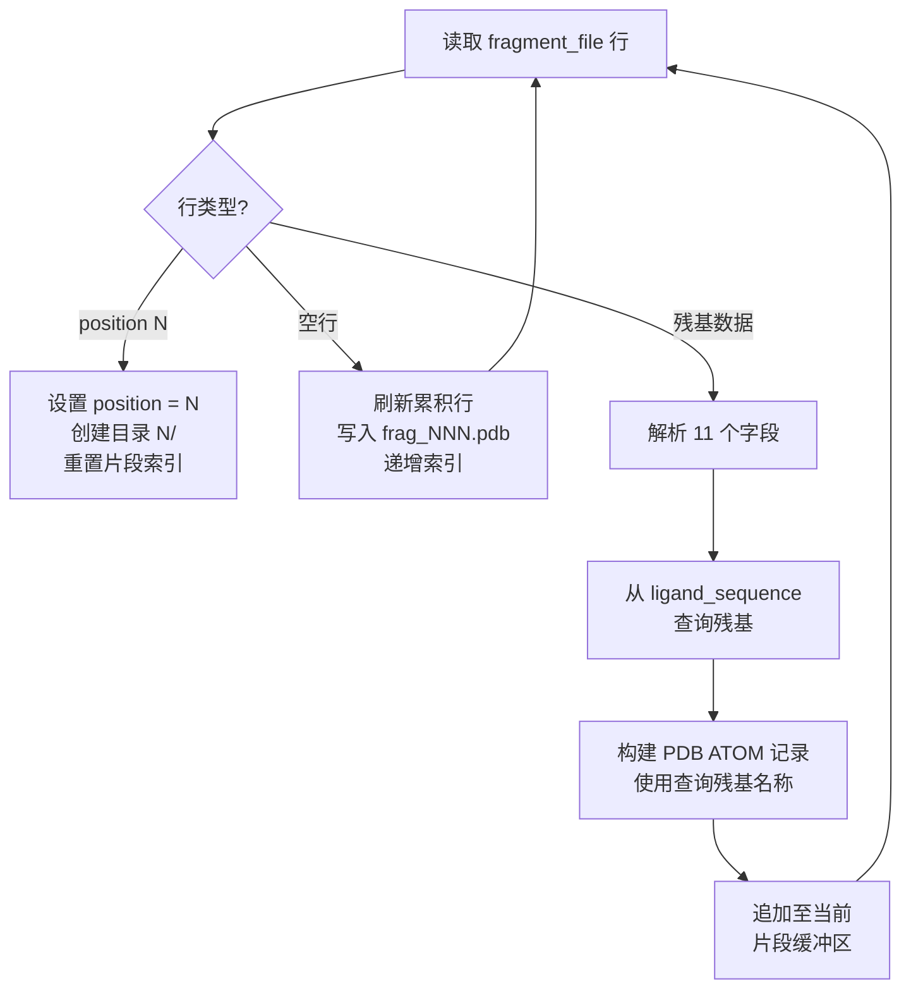
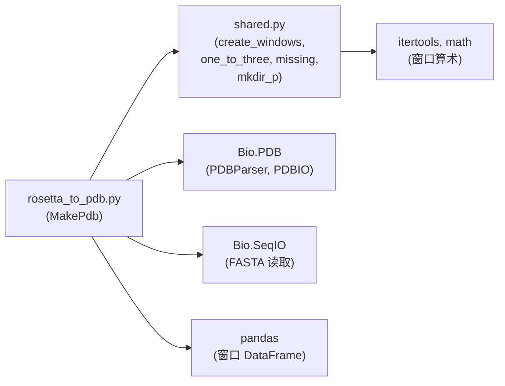
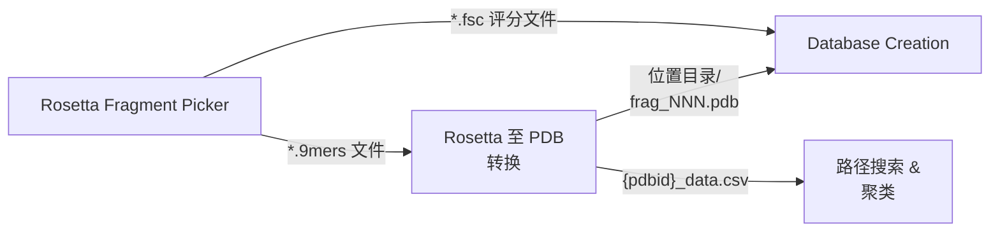

---
slug:6-rosetta-to-pdb-conversion
blog_type:normal
---


`rosetta_to_pdb.py` 脚本是 IDP-LZerD 流水线中的**关键格式桥梁**：它将 Rosetta 片段选择器专有的输出转换为仅包含 Cα 原子的标准 PDB 文件。此转换是必要的，因为下游的对接和评分阶段仅对 PDB 格式的结构进行操作，而 Rosetta 片段选择器输出的是其自身的紧凑文本格式，该格式编码了主链二面角和 Cα 坐标。该脚本不仅仅进行格式重整——它还将源 PDB 片段的**残基标识重新映射**到查询配体序列上，将片段划分到平铺窗口中，并在序列长度与 6 残基滑动网格无法完全对齐时，对最后一个窗口执行校正性截断。

来源：[rosetta_to_pdb.py](/scripts/rosetta_to_pdb.py#L1-L185), [shared.py](/scripts/shared.py#L245-L258)

## 输入与输出契约

`MakePdb` 类暴露了一个类方法 `run()`，该方法接受四个必需参数并生成基于目录的输出结构。下表概述了该接口：

| 参数 | CLI 标志 | 描述 |
|-----------|----------|-------------|
| `fragment_file` | `-f` | Rosetta 片段选择器输出路径（例如 `4ah2I.30.9mers`） |
| `ligand_chain` | `-l` | 在输出 PDB 文件中分配的单字符链标识符 |
| `ligand_sequence` | `-s` | 包含查询配体氨基酸序列的 FASTA 文件 |
| `pdbid` | `-p` | 用于命名输出文件和目录的 PDB 标识符 |

输出由一个**位置目录树**和一个**窗口 CSV 文件**组成。对于每个有效的窗口位置 *p*，会在与片段文件相同的基础目录下创建一个名为 *p* 的子目录。在每个位置目录中，单独的片段 PDB 文件被写入为 `frag_001.pdb`、`frag_002.pdb` ……直至 Rosetta 选择的片段数量（通常为 30）。此外，基础目录中还会写入一个 `{pdbid}_data.csv` 文件，用于编码窗口到位置的映射。

来源：[rosetta_to_pdb.py](/scripts/rosetta_to_pdb.py#L63-L71), [rosetta_to_pdb.py](/scripts/rosetta_to_pdb.py#L168-L180)

## Rosetta 片段文件格式

在分析转换逻辑之前，有必要了解 Rosetta 片段选择器的输出格式。当使用配额协议调用片段选择器时（参见 [Rosetta Fragment Picker](5-rosetta-fragment-picker)），它会写入具有以下结构的 9-mer 片段文件：

```
position 1
  1a3k A  13  VAL  E  -121.8  132.5  179.7   5.231  12.456  -3.789
  1a3k A  14  GLN  E  -118.2  128.1  178.9   6.112  13.201  -2.456
  ...
  1a3k A  21  LYS  E  -105.3  141.2  179.2  11.340  17.892   1.234

position 7
  2b4m B   5  ALA  H   -62.1  -42.3  179.8   3.456   8.901   0.123
  ...
```

每个片段块以 `position N` 行开始，指示查询序列中 9-mer 窗口的起始残基。随后的行中，每个残基包含 **11 个以空格分隔的字段**：`pdbcode`、`pdbchain`、`resi`、`resn`、`ss`、`phi`、`psi`、`omega`、`x`、`y`、`z`。空行用于分隔同一位置内的各个片段。每个位置包含 *N* 个候选片段（通常为 30），每个片段有 9 行残基数据。

来源：[rosetta_to_pdb.py](/scripts/rosetta_to_pdb.py#L77-L130), [quota-protocol.flags.template](/scripts/rosetta_templates/quota-protocol.flags.template#L24-L31)

## 窗口计算：滑动网格

`shared.py` 中的 `create_windows()` 函数决定查询序列中**哪些位置**会接收片段集合。这不是一个简单的滑动窗口——它遵循具有边界校正的特定算术网格。



网格在 **1, 7, 13, 19, 25, …**（即 `k = 0, 1, 2, …` 时的 `6k + 1`）处生成位置，每个窗口跨越 9 个残基。这会产生**步长为 6** 且**重叠为 3** 的窗口——前 9 个残基之后的每个残基至少被两个连续窗口覆盖，从而为下游对接一致性提供冗余。当序列末尾在网格对齐位置之前到达时，最后一个窗口的位置会被重新计算为 `L − 8`（最后一个有效的 9-mer 起始索引），其起始位置通过 `6·⌊(position + 4.4)/6⌋ + 1` 回溯对齐到最近的网格点。生成的窗口元数据被写入 `{pdbid}_data.csv`，包含 `windowindex`、`res_start`、`res_end` 和 `position` 列。

例如，对于 20 个残基的序列，输出的 CSV 与测试数据相匹配：

| windowindex | res_start | res_end | position |
|-------------|-----------|---------|----------|
| 1 | 1 | 9 | 1 |
| 7 | 7 | 15 | 7 |
| 13 | 13 | 20 | 12 |

注意最终位置是 **12**（而不是 13），因为 `L − 8 = 20 − 8 = 12`，并且网格对齐得出 `res_start = 13`。

来源：[shared.py](/scripts/shared.py#L245-L258), [rosetta_to_pdb.py](/scripts/rosetta_to_pdb.py#L69-L71), [4ah2_data.csv](/test/4ah2_data.csv#L1-L4)

## 转换流水线：Rosetta 文本行到 PDB ATOM 记录

核心转换循环逐行解析片段文件并生成标准 PDB ATOM 记录。下图展示了完整的处理流程：



### 残基标识重映射

一个微妙但在架构上意义重大的方面是**残基标识重映射**。Rosetta 片段文件记录的是*源*残基名称（来自提取片段的 PDB 结构），但输出 PDB 必须使用配体 FASTA 序列中的*查询*残基名称。这是因为片段的目的是提供**结构主链几何**（Cα 坐标和二面角），而不是复制源残基标识。重映射过程如下：

1. 计算 `query_idx = res_id - 1`（序列的从 0 开始的索引）
2. 获取 `query_resn = ligand_sequence[query_idx]`（来自 FASTA 的单字母代码）
3. 通过 `shared.one_to_three[query_resn]` 转换为三字母代码
4. 将此三字母代码分配给 ATOM 记录的残基名称字段

如果索引超出序列长度，将打印诊断信息并引发 `IndexError`——这可以防止格式错误的片段文件声称其位置超出了查询序列范围。

### PDB 格式模板

每个残基使用包含 16 个字段的严格 PDB 格式字符串作为单行 ATOM 输出。模板默认值为：

| 字段 | 默认值 | 含义 |
|-------|---------|---------|
| 记录类型 | `ATOM` | PDB 记录标识符 |
| 原子序号 | *(按残基设置)* | 顺序原子序列号 |
| 原子名称 | ` CA ` | Cα 原子——仅写入主链 Cα |
| 替代位置指示符 | *(空)* | 无替代位置指示符 |
| 残基名称 | *(来自查询序列)* | 通过 `one_to_three` 转换的三字母代码 |
| 链 | *(来自 `ligand_chain` 参数)* | 用户指定的链标识符 |
| 残基序号 | *(按残基设置)* | 从 1 开始的残基序列号 |
| 插入代码 | *(空)* | 无插入代码 |
| X, Y, Z | *(来自 Rosetta 输出)* | 片段的 Cα 坐标 |
| 占位率 | `1.00` | 固定的完全占位 |
| B 因子 | `0.00` | 固定的零温度因子 |
| 元素 | `C` | 碳元素符号 |
| 电荷 | *(空)* | 无电荷 |

每个片段文件还会接收一个 HEADER 记录，标识最初提取片段的源 PDB+链（例如 `HEADER 1a3kA`）。

来源：[rosetta_to_pdb.py](/scripts/rosetta_to_pdb.py#L44-L61), [rosetta_to_pdb.py](/scripts/rosetta_to_pdb.py#L106-L130), [shared.py](/scripts/shared.py#L192-L198)

## 末位截断

当最后一个窗口位置**未与网格对齐**（即 `position % 6 != 1`）时，转换会执行校正性截断步骤。出现这种情况是因为 `create_windows()` 可能会将最后一个窗口重新定位到 `L − 8`，而这不一定落在 `6k + 1` 网格点上。截断逻辑如下：

1. 使用 `Bio.PDB.PDBParser` 从未对齐的位置目录读取每个片段 PDB
2. 验证每个结构是否恰好包含一个模型和一条链
3. 计算 `residue_remove_slice = slice(new_start - last_pos)`——要移除的前导残基数量
4. 从链对象中分离这些前导残基
5. 将截断后的结构写入以网格对齐的 `new_start` 命名的新目录中
6. 通过 `shutil.rmtree()` 移除旧的未对齐目录

这确保了下游消费者始终会遇到以网格对齐位置（1, 7, 13, …）命名的目录，即使 Rosetta 片段选择器可能在未对齐位置生成了片段。网格对齐的 `new_start` 从窗口 DataFrame 中检索：`windowdf[windowdf['position'] == last_pos]['res_start']`。

<CgxTip>截断步骤对于路径组装兼容性至关重要——[Stepwise Path Search](11-stepwise-path-search) 和 [Heuristic Clustering](12-heuristic-clustering) 假定片段目录遵循 6k+1 命名约定。未对齐的目录将导致路径组装遗漏 C 端窗口处的片段。</CgxTip>

来源：[rosetta_to_pdb.py](/scripts/rosetta_to_pdb.py#L132-L165)

## 位置过滤与跳过逻辑

并非 Rosetta 片段文件中的所有位置都会被转换——仅处理 `pos_list` 中存在的位置（派生自 `create_windows()`）。此过滤发生在 `position` 头行处：`keep_position = position in pos_list`。当 `keep_position` 为 `False` 时，该位置的所有残基行都会被静默跳过。这防止了转换落在计算窗口方案之外的片段位置，如果 Rosetta 片段选择器在运行时使用了与预期不同的窗口配置，则可能发生这种情况。

此外，仅当单个片段 PDB 文件在磁盘上尚不存在时（`shared.missing(filepath)`）才会被写入，这使转换具有**幂等性**——对相同输入重新运行不会覆盖现有片段文件，这在恢复中断的流水线运行时非常重要。

来源：[rosetta_to_pdb.py](/scripts/rosetta_to_pdb.py#L87-L103), [shared.py](/scripts/shared.py#L151-L154)

## 错误处理

该模块定义了一个自定义 `MakePdbError` 异常（继承自 `RuntimeError`），在截断步骤中结构验证失败时使用。在截断期间对每个片段 PDB 执行两项特定检查：

| 检查项 | 条件 | 异常信息 |
|-------|-----------|-------------------|
| 单一模型 | `len(structure.child_list) != 1` | `"More than one model in {filename}"` |
| 单一链 | `len(model.child_list) != 1` | `"More than one chain in {filename}"` |

在残基标识查找期间，如果 `query_idx` 超出配体序列长度，也可能引发 `IndexError`，这表明片段文件与 FASTA 序列之间存在数据一致性问题。

来源：[rosetta_to_pdb.py](/scripts/rosetta_to_pdb.py#L36-L39), [rosetta_to_pdb.py](/scripts/rosetta_to_pdb.py#L115-L120), [rosetta_to_pdb.py](/scripts/rosetta_to_pdb.py#L152-L156)

## 依赖图



该脚本依赖 `shared.py` 提供四个实用工具：`create_windows()`（窗口网格计算）、`one_to_three`（氨基酸代码转换）、`missing()`（文件存在性检查）和 `mkdir_p()`（递归目录创建）。Biopython 的 `PDB` 模块仅在截断步骤中用于读取和写入 PDB 结构，而 `SeqIO` 用于读取配体 FASTA 文件。Pandas 用于构建和序列化窗口 DataFrame。

来源：[rosetta_to_pdb.py](/scripts/rosetta_to_pdb.py#L19-L31), [shared.py](/scripts/shared.py#L151-L166), [shared.py](/scripts/shared.py#L192-L198)

## 流水线上下文

Rosetta 到 PDB 的转换位于 IDP-LZerD 流水线中片段生成和数据库创建之间。其上游相邻环节是 [Rosetta Fragment Picker](5-rosetta-fragment-picker)，它生成作为主要输入的 `.9mers` 片段文件。其下游消费者是 [Database Creation and Schema](8-database-creation-and-schema)，它摄取按位置划分的片段 PDB 目录，以及最终的 [Stepwise Path Search](11-stepwise-path-search)，它跨位置索引的片段集组装路径。此处生成的窗口 CSV（`{pdbid}_data.csv`）也会被下游阶段使用，以在窗口索引和残基位置之间进行映射。



<CgxTip>此阶段写入的片段 PDB 文件**仅包含 Cα 原子**，因为 Rosetta 片段选择器在调用时使用了 `-frags::write_ca_coordinates` 标志（参见 [quota-protocol.flags.template](/scripts/rosetta_templates/quota-protocol.flags.template#L26)）。全原子重构发生在稍后的 [CHARMM Relaxation Protocol](15-charmm-relaxation-protocol) 期间，而非此阶段。</CgxTip>