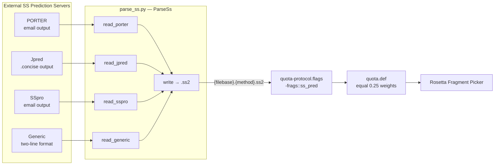

---
slug:7-secondary-structure-parsing
blog_type:normal
---


二级结构预测是 IDP-LZerD 中生成片段的关键前提。`parse_ss.py` 模块充当**格式归一化层**——它接收来自四个不同二级结构预测服务器（PORTER、Jpred、SSpro 和通用的双行格式）的原始输出，验证序列与预测长度的一致性，合成置信度分数，并输出统一的 **PSIPRED VFORMAT** `.ss2` 文件，供 Rosetta Fragment Picker 直接使用。若没有此归一化步骤，Rosetta 基于配额的片段选择机制将无法整合多个 SS 预测器来丰富片段质量。

来源：[parse_ss.py](scripts/parse_ss.py#L1-L34), [run_rosetta.py](scripts/run_rosetta.py#L44-L44)

## 归一化问题

各个二级结构预测服务器均以其特有的格式生成输出——PORTER 将预测结果嵌入电子邮件格式的文本中，Jpred 使用带有标签段的逗号分隔 `.concise` 文件，SSpro 采用行前缀键值对布局，而临时预测器可能仅输出双行序列-预测对。然而，Rosetta Fragment Picker 要求所有预测器提供单一标准格式的文件：**PSIPRED `.ss2` 格式**，该格式逐行记录残基索引、氨基酸、预测类别以及三个置信度值（对应卷曲 C、螺旋 H 和折叠 E）。`ParseSs` 类通过实现**基于分发的读取器模式**来解决此问题——`read_file` 方法接收一个方法名称字符串，通过 `getattr` 动态解析相应的 `read_<method>` 处理器，并将原始文件内容路由至适当的解析器。

来源：[parse_ss.py](scripts/parse_ss.py#L47-L64), [parse_ss.py](scripts/parse_ss.py#L197-L202)

## 架构与数据流

下图说明了 `parse_ss.py` 如何融入更广泛的片段生成流程：从原始 SS 预测器输出，经过归一化，直至 Rosetta 基于配额的片段选择：



每个预测器的输出都会通过其专用的读取器，经过验证并补充置信度分数后，被写入独立的 `.ss2` 文件。随后，Rosetta 通过 `-frags::ss_pred` 标志同时读取所有四个 `.ss2` 文件，为每个预测器分配相等的 **0.25 配额份额**，从而确保片段候选源自所有四种预测的共识。

来源：[parse_ss.py](scripts/parse_ss.py#L47-L64), [quota-protocol.flags.template](scripts/rosetta_templates/quota-protocol.flags.template#L13-L13), [quota.def](scripts/rosetta_templates/quota.def#L1-L6)

## ParseSs 类 — 核心 API

`ParseSs` 类围绕三大设计支柱构建：**基于分发的读取**、**统一的置信度评分**和**标准输出写入**。

### 类级常量

| 常量 | 用途 | 值 |
|---|---|---|
| `fmt_str` | `.ss2` 行的输出格式模板 | `"{index: >4} {aa} {ss}   {C:.3f}  {H:.3f}  {E:.3f}\n"` |
| `pred_set` | 有效的 3 类二级结构类型 | `{'C', 'E', 'H'}`（Coil、Strand、Helix） |
| `aa_set` | 有效的 20 种标准氨基酸单字母代码 | `{'R','H','K','D','E','S','T','N','Q','C','G','P','A','V','I','L','M','F','Y','W'}` |

`fmt_str` 严格匹配 PSIPRED V3.3 `.ss2` 的列布局：右对齐的 4 字符残基索引、氨基酸、预测类别，随后是三个以空格分隔的浮点置信度值。

来源：[parse_ss.py](scripts/parse_ss.py#L35-L38)

### 置信度分数合成

`ss_freq` 类方法为给定预测生成 3 类置信度分布：

```python
@classmethod
def ss_freq(cls, ss):
    return {k: 0.67 if ss == k else 0.15 for k in cls.pred_set}
```

此方法为预测类别分配 **0.67 的置信度**，为其余两个类别各分配 **0.15**（0.67 + 0.15 + 0.15 = 0.97，并不精确等于 1.0——这是 Rosetta 可以容忍的 deliberate 或 incidental 近似）。对于 Jpred 的输出，由于原始预测器提供了经验置信度值，因此直接使用这些原始值（直接从 `JNETPROPE`、`JNETPROPH` 和 `JNETPROPC` 字段中读取）。这种双重策略意味着 Jpred 受益于真实的逐残基置信度校准，而 PORTER、SSpro 和通用输入则接收固定的合成分布。

来源：[parse_ss.py](scripts/parse_ss.py#L40-L42), [parse_ss.py](scripts/parse_ss.py#L101-L137)

## 读取器实现

每个读取器方法将原始特定于预测器的文本转换为包含键 `{index, aa, ss, C, H, E}` 的字典列表。所有读取器都强制执行**序列-预测长度不变性**——如果氨基酸序列与二级结构预测的长度不同，则会抛出 `SSError`。下表比较了这四种读取器：

| 读取器 | 方法标志 | 输入格式 | 序列检测 | 预测检测 | 置信度来源 |
|---|---|---|---|---|---|
| `read_porter` | `--porter` | 粘贴的电子邮件文本 | 所有字符均在 `aa_set` 中的行 | 紧跟序列行之后，且所有字符均在 `pred_set` 中的行 | 合成 (`ss_freq`) |
| `read_jpred` | `--jpred` | `.concise` 逗号分隔 | `align1;` 标签段 | `jnetpred` 标签段；`JNETPROPE/H/C` 提供置信度 | 原始经验值 |
| `read_generic` | `--generic` | 两条非注释行 | 首个非注释行（最后一个空格分隔的词元） | 第二个非注释行（最后一个空格分隔的词元） | 合成 (`ss_freq`) |
| `read_sspro` | `--sspro` | 键前缀文本 | `"Amino Acids:"` 之后的行 | `"Predicted Secondary Structure"` 之后的行 | 合成 (`ss_freq`) |

来源：[parse_ss.py](scripts/parse_ss.py#L66-L195)

### PORTER 读取器 — 状态机解析

`read_porter` 方法使用**有状态的逐行自动机**从非结构化的电子邮件文本中分离序列与预测。它维护一个 `prev_line_seq` 布尔标志：当某行通过氨基酸成员测试（`all(c in self.aa_set for c in line)`）时，将其追加至序列缓冲区并将标志设为 `True`。随后对下一行进行 SS 成员测试（`all(c in self.pred_set for c in line)`），若测试通过，则将其追加至预测缓冲区。包含小写字符的注释行将被完全跳过。此方法能够处理 PORTER 电子邮件输出中典型的交错多行格式。

来源：[parse_ss.py](scripts/parse_ss.py#L66-L99)

### Jpred 读取器 — 标签段提取

`read_jpred` 方法解析 `.concise` 格式，其中每个段由标签（如 `jnetpred:`、`align1;:`、`JNETPROPE:`）引入，后跟逗号分隔的值。`match_key_dict` 将这些标签映射到规范键（`ss`、`aa`、`E`、`H`、`C`）。一个值得注意的细节：序列标签键使用 `align1;`（带分号），以避免与 `align19` 等其他 `align` 变体发生错误匹配。提取后，所有置信度列均通过 `pd.to_numeric` 转换为数值，预测列中的卷曲指示符 `-` 被替换为 `C`。最终结果通过 `to_dict("records")` 从 `pandas.DataFrame` 转换为字典列表。

来源：[parse_ss.py](scripts/parse_ss.py#L101-L137)

### Generic 和 SSpro 读取器 — 固定位置解析

`read_generic` 读取器被明确标注为**脆弱的**——它假定首个非注释、非空行包含序列，第二行包含预测，并分别提取每行最后一个以空格分隔的词元。`read_sspro` 读取器则更为稳健，它会扫描哨兵前缀 `"Amino Acids:"` 和 `"Predicted Secondary Structure"` 并读取紧随其后的行。这两个读取器均应用 `-` → `C` 的卷曲归一化，并使用合成的置信度分数。

来源：[parse_ss.py](scripts/parse_ss.py#L139-L195)

## 输出格式与文件命名

`write` 方法在目标目录中生成名为 `{filebase}.{method}.ss2` 的文件，其中 `filebase` 默认为去除扩展名的输入文件名，`method` 为预测器名称字符串。每个文件以 `# PSIPRED VFORMAT (PSIPRED V3.3)` 头部开始，后跟一个空行，然后是每个残基的一行格式化输出。以下是残基 42 被预测为螺旋的输出示例：

```
  42 A H     0.150  0.670  0.150
```

Rosetta 的 `-frags::ss_pred` 标志所消费的正是这种标准格式。在 quota-protocol 标志模板中，所有四个预测器在一行内注册：

```
-frags::ss_pred {psipred_path} psipred {porter_path} porter {jpred_path} jpred {sspro_path} sspro
```

每个路径-标签对告知 Rosetta 将哪个 `.ss2` 文件与哪个配额池相关联。随后，`quota.def` 文件为每个池分配相等的 **0.25 份额**，确保没有任何单一预测器主导片段选择。

来源：[parse_ss.py](scripts/parse_ss.py#L197-L202), [quota-protocol.flags.template](scripts/rosetta_templates/quota-protocol.flags.template#L13-L13), [quota.def](scripts/rosetta_templates/quota.def#L1-L6)

## 验证与错误处理

该模块定义了专用的 `SSError` 异常类（继承自 `RuntimeError`），每当违反**序列-预测长度不变性**时便会抛出此异常。每个读取器方法在解析后都会检查此不变性，若检查失败，在抛出异常前会将序列和预测及其长度打印到 `stdout` 以供诊断。对于 Jpred，额外的检查 `len(set([len(v) for v in data_dict.values()])) != 1` 确保所有提取的列（序列、预测和三个置信度数组）长度相等。若将无法识别的方法名称传递给 `read_file`，`getattr(self, "read_%s" % method)` 将隐式抛出 `AttributeError`。

来源：[parse_ss.py](scripts/parse_ss.py#L28-L31), [parse_ss.py](scripts/parse_ss.py#L86-L89), [parse_ss.py](scripts/parse_ss.py#L125-L128), [parse_ss.py](scripts/parse_ss.py#L59-L60)

<CgxTip>当为流程准备 SS 预测文件时，请注意 `run_rosetta.py` 需要**所有四个** SS 预测路径（`--psipred_path`、`--porter_path`、`--jpred_path`、`--sspro_path`）——缺失文件将触发 `RunRosettaError`。如果某个预测器不可用，你仍必须提供占位符 `.ss2` 文件（例如，通过 `parse_ss.py --generic` 从简单的双行文件生成）以满足流程需求。</CgxTip>

## 命令行用法

`ParseSs.commandline` 类方法暴露了四个互不排斥的参数，允许单次调用同时转换多个预测器的输出：

```bash
# 转换单个预测器
python parse_ss.py --porter porter_output.txt

# 同时转换所有预测器
python parse_ss.py \
  --porter porter_output.txt \
  --jpred jpred_concise.txt \
  --sspro sspro_output.txt \
  --generic generic_ss.txt
```

每个参数都会触发一次独立的 `read_file` 调用，为每种方法生成独立的 `.ss2` 文件。除非通过程序指定 `destdir`，否则输出文件将写入与输入文件相同的目录。

来源：[parse_ss.py](scripts/parse_ss.py#L204-L233)

## 与 parse.pl 的关系

伴随脚本 `parse.pl` 处理不同的转换任务：它将 **PSI-BLAST 二进制检查点文件**（`.chk`）转换为 Rosetta 片段选择器期望的纯文本检查点格式（`.checkpoint`），用于序列谱输入。此脚本在运行 `blastpgp` 生成 PSSM 之后、启动片段选择器之前，由 `run_rosetta.py` 调用。`parse_ss.py` 归一化二级结构预测，而 `parse.pl` 归一化序列谱——两者均为 Rosetta 配额协议的必要前置转换。

来源：[parse.pl](scripts/parse.pl#L1-L34), [run_rosetta.py](scripts/run_rosetta.py#L103-L113)

## 流程集成总结

下表总结了 SS 解析产物在流程中的流转路径：

| 产物 | 生产者 | 消费者 | Rosetta 标志 |
|---|---|---|---|
| `{pdbid}.checkpoint` | `parse.pl`（来自 PSI-BLAST `.chk`） | Rosetta Fragment Picker | `-in::file::checkpoint` |
| `{filebase}.porter.ss2` | `parse_ss.py --porter` | Rosetta Fragment Picker | `-frags::ss_pred ... porter` |
| `{filebase}.jpred.ss2` | `parse_ss.py --jpred` | Rosetta Fragment Picker | `-frags::ss_pred ... jpred` |
| `{filebase}.sspro.ss2` | `parse_ss.py --sspro` | Rosetta Fragment Picker | `-frags::ss_pred ... sspro` |
| `{filebase}.psipred.ss2` | PSIPRED（外部） | Rosetta Fragment Picker | `-frags::ss_pred ... psipred` |

请注意，PSIPRED 的 `.ss2` 文件是外部生成并直接提供的——它已符合标准格式，因此无需通过 `parse_ss.py` 进行解析。

来源：[run_rosetta.py](scripts/run_rosetta.py#L84-L91), [quota-protocol.flags.template](scripts/rosetta_templates/quota-protocol.flags.template#L11-L13)

<CgxTip>`ss_freq` 合成置信度分布 (0.67 / 0.15 / 0.15) 的总和不为 1.0。这在 PSIPRED VFORMAT 约定中是故意的——Rosetta 片段选择器将这些值作为相对权重而非严格概率使用。如果你提供自定义 `.ss2` 文件，请确保三个置信度列的量级在各预测器间大致可比，因为配额系统会将它们视为同量纲分数。</CgxTip>

## 后续步骤

一旦二级结构预测被归一化为 `.ss2` 文件，流程将继续进入 [Rosetta Fragment Picker](5-rosetta-fragment-picker) 进行片段生成，以及 [Rosetta-to-PDB 转换](6-rosetta-to-pdb-conversion) 进行格式转换。有关完整的端到端流程上下文，请参阅[架构概述](4-architecture-overview)。