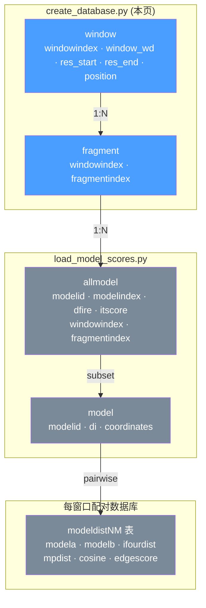
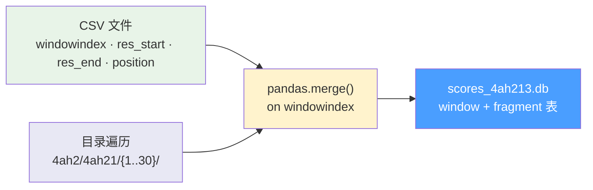

---
slug:8-database-creation-and-schema
blog_type:normal
---


IDP-LZerD 流水线使用 SQLite 数据库作为所有下游阶段的核心协调基底——从对接分数存储、路径组装到最终排名。`create_database.py` 脚本是**此关系型基底的入口点**：它通过将文件系统结构与 CSV 窗口元数据融合为一个可查询的工件，物化了前两张表（`window` 和 `fragment`）。流水线的每个后续阶段都会读取或扩展该数据库，使其模式成为将整个工作流绑定在一起的结构契约。

## 核心数据库：`scores_{complexid}.db`

主数据库文件遵循命名规范 `scores_{pdbid}{r_ch}{l_ch}.db`，其中复合标识符由 PDB ID 与受体链和配体链标签拼接而成。例如，PDB ID 为 `4ah2`、受体链为 `1`、配体链为 `3` 的复合物将生成 `scores_4ah213.db`。此文件在由 `--directory` 参数指定的工作目录中创建。

创建逻辑强制执行**幂等性保护**：如果目标数据库文件已存在且非空，函数将立即返回而不作任何修改。这可防止流水线重新运行期间发生意外覆盖，并表明数据库已被物化。

来源：[create_database.py](scripts/create_database.py#L58-L66)

## 模式定义：两张基础表

数据库最初只包含两张表，它们编码了**窗口**（沿内在无序蛋白质滑动的残基范围）和**片段**（每个窗口由 Rosetta 生成的结构候选）之间的层级关系。这两张表是结构骨干；后续阶段添加的所有下游表均通过外键引用它们。

### `window` 表

| 列 | 类型 | 约束 | 描述 |
|--------|------|------------|-------------|
| `windowindex` | INTEGER | PRIMARY KEY NOT NULL | 窗口的数字标识符，派生自目录名 |
| `window_wd` | TEXT | NOT NULL | 磁盘上窗口工作目录的绝对路径 |
| `res_start` | INTEGER | NOT NULL | 窗口的起始残基位置 |
| `res_end` | INTEGER | NOT NULL | 窗口的结束残基位置 |
| `position` | INTEGER | NOT NULL | 完整序列内的对齐位置 |
| `timestamp` | DATE | DEFAULT `datetime('now','localtime')` | 自动记录的插入时间戳 |

`windowindex` 作为主键，也是将窗口连接到片段及下游模型数据的唯一连接列。`window_wd` 列在操作上至关重要：它存储每个窗口目录的绝对文件系统路径，使下游阶段能够定位片段子目录和诱饵 PDB 文件，而无需维护单独的路径注册表。

### `fragment` 表

| 列 | 类型 | 约束 | 描述 |
|--------|------|------------|-------------|
| `windowindex` | INTEGER | NOT NULL | 对父窗口的外键引用 |
| `fragmentindex` | INTEGER | NOT NULL | 窗口内片段的数字标识符 |
| `timestamp` | DATE | DEFAULT `datetime('now','localtime')` | 自动记录的插入时间戳 |

复合主键 `(windowindex, fragmentindex)` 确保每个片段在其父窗口内被唯一标识。此复合键是 `allmodel` 表（稍后由[模型分数加载](9-model-score-loading)添加）使用的连接目标，用于将对接分数与其结构上下文相关联。

来源：[create_database.py](scripts/create_database.py#L29-L49)

## 模式演进：下游阶段添加的表

`scores_{complexid}.db` 不是一个静态工件——它随着流水线的推进而增长。`create_database.py` 脚本建立了初始的双表模式，但后续阶段通过附加表对其进行扩展。理解这种演进对于在任何流水线检查点解释数据库至关重要。



**蓝色**表由 `create_database.py` 创建（本文档说明）。**灰色**表由下游阶段添加——具体而言，`allmodel` 和 `model` 由[模型分数加载](9-model-score-loading)添加，而 `modeldist` 配对表位于独立的每窗口数据库中。外键链单向流动：`window` → `fragment` → `allmodel` → `model`，`modeldist` 表引用 `model` 表中的 `modelid` 值。

### `allmodel` 表（由模型分数加载添加）

| 列 | 类型 | 约束 | 描述 |
|--------|------|------------|-------------|
| `modelid` | INTEGER | PRIMARY KEY NOT NULL | 自动生成的唯一模型标识符 |
| `modelindex` | INTEGER | NOT NULL | 片段诱饵集内的模型编号 |
| `dfire` | REAL | nullable | DFIRE 统计势分数 |
| `itscore` | REAL | NOT NULL | ITScore（界面分数） |
| `windowindex` | INTEGER | NOT NULL | 外键 → `fragment(windowindex)` |
| `fragmentindex` | INTEGER | NOT NULL | 外键 → `fragment(fragmentindex)` |
| `timestamp` | DATE | DEFAULT `datetime('now','localtime')` | 插入时间戳 |

### `model` 表（由模型分数加载添加）

| 列 | 类型 | 约束 | 描述 |
|--------|------|------------|-------------|
| `modelid` | INTEGER | PRIMARY KEY NOT NULL | 外键 → `allmodel(modelid)` |
| `di` | REAL | NOT NULL | 组合缩放分数（dfire + itscore，Z 归一化） |
| `coordinates` | TEXT | NOT NULL | 所选原子的 JSON 序列化 3D 坐标 |

`model` 表是 `allmodel` 的**精选子集**——仅包含每个窗口中按组合 `di` 分数排名的顶级 *N* 个模型（默认 4,500）。`coordinates` 列将骨架原子位置（N, CA, C, CB）存储为 JSON 数组，从而无需重新解析 PDB 文件即可进行几何兼容性检查。

来源：[load_model_scores.py](scripts/load_model_scores.py#L39-L53), [load_model_scores.py](scripts/load_model_scores.py#L478-L485)

## 数据摄取：文件系统 → 关系型映射

数据库创建过程执行双源合并：**CSV 元数据**提供残基范围信息，而**文件系统目录结构**提供窗口和片段标识符以及工作目录路径。理解此映射对于调试格式错误的数据库至关重要。

### 输入来源

脚本接受两个必须**彼此一致**的输入：

1. **窗口 CSV**（`--input`）：一个逗号分隔文件，包含列 `windowindex`、`res_start`、`res_end`、`position`。每行描述沿 IDP 序列的一个滑动窗口。此文件通常由 `shared.py` 中的 `create_windows()` 实用函数生成，该函数计算步长为 6 个残基的重叠 9 残基窗口，并对末端窗口进行特殊处理。

2. **目录结构**（`--directory` + `--pdbid`）：`{directory}/{pdbid}/` 下的文件系统必须包含名为 `{pdbid}{windowindex}` 的二级子目录（例如 `4ah21`、`4ah27`），每个子目录包含由其 `fragmentindex` 命名的三级子目录（例如 `1/`、`2/`、… `30/`）。

### 具体示例

给定 PDB ID `4ah2`、受体链 `1` 和配体链 `3`，以及如下 CSV：

```
windowindex,res_start,res_end,position
1,1,9,1
7,7,15,7
13,13,20,12
```

脚本遍历目录 `4ah2/4ah21/` 提取片段目录（`1/` 至 `30/`），然后与 CSV 行 `windowindex=1` 合并，生成 `res_start=1, res_end=9, position=1` 的 `window` 行，以及为找到的每个片段目录生成包含 `(windowindex=1, fragmentindex=N)` 的 `fragment` 行。



此合并是在 CSV DataFrame 和派生自文件系统的窗口列表之间基于 `windowindex` 的**内连接**。这意味着 CSV 中存在但文件系统中缺失的任何窗口（反之亦然）将被静默丢弃——如果输入未对齐，这可能是数据丢失的潜在来源。

来源：[create_database.py](scripts/create_database.py#L69-L106), [shared.py](scripts/shared.py#L245-L258), [4ah2_data.csv](test/4ah2_data.csv#L1-L4)

## 目录结构契约

数据库创建脚本对磁盘布局做出了严格假设。预期的三级层次结构通过目录嵌套隐式编码窗口-片段关系：

```
{directory}/
└── {pdbid}/                          ← PDB 级目录
    ├── {pdbid}{windowindex}/         ← 窗口目录（第 2 级）
    │   ├── {fragmentindex}/          ← 片段目录（第 3 级）
    │   │   ├── scores.itscore        ← ITScore 文件（下游使用）
    │   │   ├── goap_score.txt        ← GOAP/DFIRE 文件（下游使用）
    │   │   └── a-c.cluster4          ← LZerD 聚类文件（下游使用）
    │   └── ...
    └── ...
```

窗口目录名必须遵循模式 `{pdbid}{windowindex}`——对于 PDB ID `4ah2`，有效名称包括 `4ah21`、`4ah27`、`4ah213`。脚本通过剥离 PDB ID 前缀（不区分大小写）并将剩余部分转换为整数来提取 `windowindex`。如果剩余部分无法解析为整数，则会引发 `CreateDatabaseError`，并提示消息 `"Expected window directory format $PDBID$WINDOWINDEX"`。

片段目录是每个窗口目录内的**三级子目录**。其名称必须可解析为整数，并直接用作 `fragmentindex` 值。片段目录内的文件（如 `scores.itscore` 和 `goap_score.txt`）**不会被** `create_database.py` 读取——它们稍后由[模型分数加载](9-model-score-loading)消费。

来源：[create_database.py](scripts/create_database.py#L73-L92)

## SQLite 连接管理

所有数据库操作均使用 **APSW**（Another Python SQLite Wrapper）库，而非标准库的 `sqlite3` 模块。`shared.py` 模块提供三个上下文管理的连接工厂，对应三种 SQLite 打开模式：

| 工厂 | 标志 | 用例 |
|---------|-------|----------|
| `ro_conn(dbfile)` | `SQLITE_OPEN_READONLY` | 查询现有数据库而无变异风险 |
| `write_conn(dbfile)` | `SQLITE_OPEN_READWRITE` | 扩展现有数据库（添加表/行） |
| `new_conn(dbfile)` | `SQLITE_OPEN_CREATE \| SQLITE_OPEN_READWRITE` | 创建新数据库或打开现有数据库以进行写入 |

每个工厂都是用 `@contextmanager` 装饰的生成器，产出 `apsw.Connection` 并通过在重新抛出前打印数据库路径来处理 `CantOpenError`。`create_database.py` 脚本独占使用 `new_conn`，因为它从头创建数据库文件。下游阶段使用 `write_conn` 扩展模式，使用 `ro_conn` 进行只读查询。

<CgxTip>APSW 在几个方面不同于 Python 内置的 `sqlite3`：它提供了更接近 C API 的轻量级封装，原生支持通过保存点实现嵌套事务，并且其游标 `executemany` 直接接受字典（匹配整个代码库中使用的命名参数绑定风格 `:param`）。这就是 `create_insert_statement` 辅助函数生成如 `VALUES (:windowindex, :fragmentindex)` 绑定而非位置 `?` 占位符的原因。</CgxTip>

来源：[shared.py](scripts/shared.py#L40-L65), [shared.py](scripts/shared.py#L97-L111)

## 插入语句生成

`shared.create_insert_statement()` 实用函数使用**命名参数绑定**生成参数化 SQL 插入语句——这是 SQLite 中占位符以 `:` 为前缀的约定。给定表名和列列表，它生成：

```sql
INSERT INTO window (windowindex, window_wd, res_start, res_end, position) 
VALUES (:windowindex, :window_wd, :res_start, :res_end, :position)
```

当使用字典列表（如 `DataFrame.to_dict("records")` 生成的列表）调用时，此风格与 `cursor.executemany()` 无缝集成，因为每个字典键与命名参数匹配。`create_database.py` 脚本对两次表插入均使用此模式：`window` 插入使用所有合并后的 DataFrame 列，而 `fragment` 插入仅使用 `["windowindex", "fragmentindex"]`。

来源：[shared.py](scripts/shared.py#L97-L111), [create_database.py](scripts/create_database.py#L100-L106)

## 命令行接口

该脚本可直接调用或作为模块导入。其参数解析器接受五个参数：

| 参数 | 标志 | 必需 | 描述 |
|----------|------|----------|-------------|
| `directory` | `-d` | 是 | 包含 PDB 子目录的根工作目录 |
| `pdbid` | `-p` | 是 | PDB 标识符（命名一级子目录） |
| `r_ch` | `-r` | 是 | 受体链标识符（用于数据库文件名） |
| `l_ch` | `-l` | 是 | 配体链标识符（用于数据库文件名） |
| `input` | `-i` | 是 | 窗口数据 CSV 文件路径 |

调用示例：

```bash
python create_database.py \
  -d /path/to/working \
  -p 4ah2 \
  -r 1 \
  -l 3 \
  -i /path/to/4ah2_data.csv
```

此命令生成 `/path/to/working/scores_4ah213.db`，其中包含已填充的 `window` 和 `fragment` 表。

来源：[create_database.py](scripts/create_database.py#L108-L125)

## 窗口计算：`create_windows()` 函数

`create_database.py` 消费的窗口 CSV 通常由 `shared.py` 中的 `create_windows()` 函数生成。此生成器沿 IDP 序列生成重叠窗口，参数如下：

- **窗口长度**：9 个残基（固定）
- **步长**：6 个残基
- **起始模式**：窗口始于残基 1, 7, 13, 19, …（即 `6k + 1`）
- **末端处理**：调整最后一个窗口使 `res_end` 等于完整序列长度，并将 `position` 设为 `res_end - 8` 以维持 9 残基窗口约束

对于 20 残基的序列，这恰好生成测试 CSV 中的三个窗口：`(1,9,1)`、`(7,15,7)`、`(13,20,12)`。每个窗口的 `windowindex` 等于其 `res_start`，形成自然排序键。6 残基步长与 9 残基窗口确保连续窗口间有 **3 残基重叠**——此重叠在[模型分数加载](9-model-score-loading)和[几何截断过滤器](10-geometric-cutoff-filters)的模型距离计算期间进行几何验证。

<CgxTip>相邻窗口间的 3 残基重叠并非任意——它提供了在窗口边界处验证骨架连续性所需的最小结构上下文。`load_model_scores.py` 中的 `res_overlap=3` 参数直接对应此重叠，几何兼容性检查（i 至 i+4 CA 距离、骨架冲突、粘性原子距离和余弦角）均在此重叠区域内操作。</CgxTip>

来源：[shared.py](scripts/shared.py#L245-L258)

## 下游消费者与模式依赖

`window` 和 `fragment` 表作为每个后续流水线阶段的关系基础。下表总结了各下游阶段依赖的表及其依赖方式：

| 阶段 | 读取表 | 写入表 | 关键连接模式 |
|-------|-------------|----------------|------------------|
| [模型分数加载](9-model-score-loading) | `window`, `fragment` | `allmodel`, `model` | `fragment JOIN window USING(windowindex)` |
| [逐步路径搜索](11-stepwise-path-search) | `model`, `allmodel`, `fragment` | `pathsN`, `clustersN`（在独立路径数据库中） | `model JOIN allmodel USING(modelid) JOIN fragment USING(windowindex, fragmentindex)` |
| [占据分数计算](13-occupancy-score-computation) | `window`（用于排序） | 占据分数 | `window ORDER BY res_start` |

模式作为**可增量扩展契约**的设计意味着，`create_database.py` 可以独立运行以建立基础表，并且只要所需的前驱表存在，每个下游阶段都可以独立运行（或重新运行）。这种解耦使得部分流水线重新执行和单个阶段调试成为可能。

来源：[load_model_scores.py](scripts/load_model_scores.py#L78-L84), [find_paths_stepwise.py](scripts/find_paths_stepwise.py#L54-L63)

## 下一步

随着数据库的创建以及 `window`/`fragment` 表的填充，下一阶段将每个片段的对接分数加载到 `allmodel` 和 `model` 表中。请继续阅读[模型分数加载](9-model-score-loading)以了解如何摄取 ITScore 和 DFIRE 值、如何按组合分数对模型进行排名，以及如何将 3D 坐标序列化到数据库中。有关在距离计算阶段过滤模型兼容性的几何约束，请参阅[几何截断过滤器](10-geometric-cutoff-filters)。