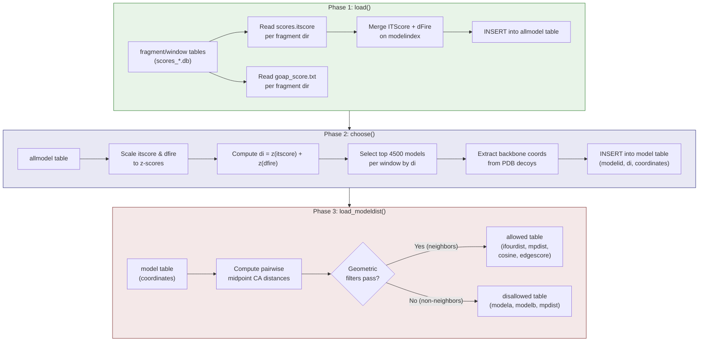
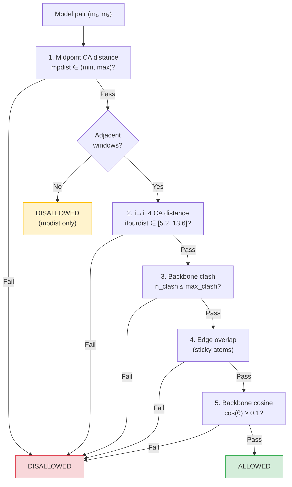

---
slug:9-model-score-loading
blog_type:normal
---


`LoadModelScores` 类是核心编排器，它将对接打分势能的评分与几何兼容性计算连接起来。它执行三个连续阶段——**评分摄取**、**模型选择与坐标加载**以及**成对模型间距离计算**——将原始的逐片段评分文件转换为存储在各窗口 SQLite 数据库中、可供查询的兼容模型对图。此流水线直接输入到[逐步路径搜索](11-stepwise-path-search)算法中，用于组装全长 IDP 构象。

## 架构概述

三阶段流水线处理由[数据库创建与模式](8-database-creation-and-schema)生成的数据，并生成供[几何截断过滤器](10-geometric-cutoff-filters)及下游路径搜索使用的 `modeldist` 数据库：



来源: [load_model_scores.py](scripts/load_model_scores.py#L63-L181), [load_model_scores.py](scripts/load_model_scores.py#L182-L373)

## 阶段 1：评分摄取 — `load()`

`load` 方法从每个片段目录读取两个原始评分输出，并填充复合数据库中的 **`allmodel`** 表。它遍历每个片段行（从 `create_database.py` 创建的 `fragment` 和 `window` 表连接而来），从文件系统读取评分并插入合并后的行。

### 输入评分文件

每个片段目录（例如，`4ah21/1/`、`4ah21/2/`）包含由 LZerD 对接引擎生成的两个评分文件：

| 文件 | 格式 | 读取列 | 描述 |
|------|--------|-------------|-------------|
| `scores.itscore` | 空格分隔 | `model`, `itscore` | 每个势能的 LZerD ITScore（界面评分） |
| `goap_score.txt` | 空格分隔 | `model`, `dfire` | GOAP 综合评分；提取 dFire（依赖于距离的有限理想气体参考） |

`scores.itscore` 文件使用诸如 `model1`、`model10`、`model1000` 的模型名称，通过正则表达式 `model(\d+)\D*` 从中提取数字索引。`goap_score.txt` 文件包含 GOAP 总分、dFire 和额外列；仅保留 dFire 用于模型选择。

来源: [shared.py](scripts/shared.py#L216-L242), [load_model_scores.py](scripts/load_model_scores.py#L73-L130)

### allmodel 表模式

`allmodel` 表存储每个已评分的势能，并通过外键链接回生成它的片段和窗口：

```sql
CREATE TABLE IF NOT EXISTS allmodel
    (
        modelid INTEGER PRIMARY KEY NOT NULL,
        modelindex INTEGER NOT NULL,
        dfire REAL,
        itscore REAL NOT NULL,
        windowindex INTEGER NOT NULL,
        fragmentindex INTEGER NOT NULL,
        timestamp DATE DEFAULT (datetime('now', 'localtime')),
        FOREIGN KEY(windowindex) REFERENCES fragment(windowindex),
        FOREIGN KEY(fragmentindex) REFERENCES fragment(fragmentindex)
    );
```

关键设计点：**`dfire` 可为空**（`REAL` 没有 `NOT NULL`），因为如果某个模型只出现在一个文件而未出现在另一个文件中，ITScore 和 dFire DataFrame 之间的左连接可能会产生空值。**`itscore` 是必需的**（`NOT NULL`），因为它是主要的对接质量指示器。两个文件之间的**评分计数不匹配**会立即引发 `LoadModelScoresError`，从而防止损坏或截断的对接输出。

来源: [load_model_scores.py](scripts/load_model_scores.py#L39-L54), [load_model_scores.py](scripts/load_model_scores.py#L104-L130)

### 部分表处理

该方法通过比较给定片段/窗口对在 `allmodel` 中已有的行数与当前 `scores.itscore` 文件中的模型数量，来检测部分加载的表。如果 `nmodelrows < nmodels` 且 `nmodelrows > 0`，则在重新插入之前删除现有的部分行。如果 `nmodelrows == nmodels`，则完全跳过该片段——这使得流水线的**安全重新执行**成为可能，而不会重复数据。

来源: [load_model_scores.py](scripts/load_model_scores.py#L108-L130)

## 阶段 2：模型选择与坐标加载 — `choose()`

`choose` 方法执行从**评分空间**到**几何空间**的关键转换：它选择每个窗口中评分最高的模型，从 PDB 文件读取其 3D 坐标，并将综合评分和序列化坐标插入到 **`model`** 表中。

### 综合评分：`di`

两个评分函数独立进行 z-score 归一化并求和，以生成综合选择度量 `di`：

$$d_i = z(\text{itscore}) + z(\text{dfire})$$

其中 z-score 归一化为：

$$z(x) = \frac{x - \mu}{\sigma}$$

两个评分均使用 `ascending=True`（值越低越好），因此不应用符号反转。静态方法 `scale_scores` 逐窗口计算此值，这意味着 z-score 基准是**每个窗口局部的**，而不是全局的——这可以防止具有内在不同评分分布的窗口使选择产生偏差。

来源: [load_model_scores.py](scripts/load_model_scores.py#L456-L468), [load_model_scores.py](scripts/load_model_scores.py#L140-L141)

### 选择策略

对于每个窗口，该方法查询**同时**具有 `itscore` 和 `dfire` 值的所有模型（`WHERE ... AND m.dfire IS NOT NULL` 子句过滤掉缺少 dFire 评分的模型），按 `di` 排序，并保留前 **4500 个模型**。此常量 `models_per_window` 控制着下游的组合爆炸：每个窗口约有 30 个片段，4500 的选择量代表了从原始势能池（每个片段可能包含 6000+ 个模型）中进行的激进剪枝。

如果某个窗口已有 4500 个选定的模型，则跳过该窗口——这是流水线重新运行的另一个幂等保护。

来源: [load_model_scores.py](scripts/load_model_scores.py#L132-L177)

### model 表模式

`model` 表（与 `allmodel` 不同）仅存储选定的子集及其坐标：

```sql
CREATE TABLE IF NOT EXISTS model
    (
        modelid INTEGER PRIMARY KEY NOT NULL,
        di REAL NOT NULL,
        coordinates TEXT NOT NULL,
        FOREIGN KEY(modelid) REFERENCES allmodel(modelid)
    );
```

`coordinates` 列存储 **JSON 序列化的 3D 坐标**，作为所有残基中每个存储原子的 `[x, y, z]` 三元组的扁平列表。此序列化格式对阶段 3 至关重要，阶段 3 通过 `json.loads()` 将其反序列化为适合 NumPy 数组构建的列表。

来源: [load_model_scores.py](scripts/load_model_scores.py#L478-L485), [load_model_scores.py](scripts/load_model_scores.py#L451-L454)

### 坐标提取 — `get_coords()`

`get_coords` 方法使用 Biopython 的 `PDBParser` 解析每个选定的 PDB 势能文件，并提取每个残基特定**存储原子**集的坐标：

| 原子集 | 成员 | 用途 |
|----------|---------|---------|
| `backbone_atoms` | N, CA, C | 用于碰撞检测和距离计算的主链几何 |
| `cb` (CB) | CB（或 GLY 的虚拟 CB） | 用于重叠评估的侧链质心代理 |
| `stored_atoms` | N, CA, C, CB | 上述的并集；每个模型 4 个原子 × 残基 |

**甘氨酸的虚拟 CB 生成**：由于 GLY 缺少 CB 原子，通过将 CA→N 向量绕 CA→C 轴旋转 −120°，然后平移回 CA 位置来计算虚拟 CB。这保留了真实 CB 与主链之间应有的几何关系。

在解析之前，会通过 `shared.strip_h()` 去除氢原子，并且插入码会被拒绝（引发 `LoadModelScoresError`）。残基计数将根据预期的窗口 `length` 进行验证。

来源: [load_model_scores.py](scripts/load_model_scores.py#L403-L454)

## 阶段 3：成对模型间距离计算 — `load_modeldist()`

这是计算最密集的阶段。对于每对相邻（和不相邻）的窗口，它计算所有模型对之间的几何兼容性，应用一系列过滤器来确定哪些模型可以在全长 IDP 构象中物理共存。

### 几何过滤器级联

对于来自窗口 $w_1$ 和 $w_2$ 的每对模型，依次应用以下过滤器。模型对必须通过**所有**适用的过滤器才能存储为“允许”：



来源: [load_model_scores.py](scripts/load_model_scores.py#L250-L353)

### 过滤器参数与物理原理

| 参数 | 默认值 | 应用位置 | 原理 |
|-----------|---------|------------|-----------|
| `min_isixdist` | 6.5 Å | 相邻中点 CA 距离（下限） | 相邻窗口中残基 i+3 的 CA 原子之间的最小间距 |
| `max_isixdist` | 18.5 Å | 相邻中点 CA 距离（上限） | 最大间距；对于不相邻对，按窗口间距缩放 |
| `min_itwelvedist` | 3.8 Å | 不相邻中点 CA 距离（下限） | 间隔 ≥2 个位置的窗口的放宽下限 |
| `min_ifourdist` | 5.2 Å | i→i+4 CA 距离（下限） | 跨越 4 个残基的 CA–CA 距离的生物学范围 |
| `max_ifourdist` | 13.6 Å | i→i+4 CA 距离（上限） | 4 残基 CA 跨距的生物学上限 |
| `bb_threshold` | 3.0 Å | 主链碰撞检测 | 距离小于此值的任意两个原子处于空间碰撞中 |
| `max_clash` | 0 | 碰撞容忍度 | 允许的碰撞原子对的最大数量 |
| `sticky_max_all` | 6.0 Å | 边缘重叠——所有原子 | 所有重叠区域的原子对距离必须在此值内 |
| `sticky_max_any` | 10.0 Å | 边缘重叠——任意原子 | 至少有一对重叠原子距离必须在此值内 |
| `min_cosine` | 0.1 | 主链方向余弦 | 连接处主链向量间夹角余弦的最小值 |
| `res_overlap` | 3 | 重叠区域大小 | 相邻窗口之间共享的残基数量 |

<CgxTip>`res_overlap=3` 参数定义了相邻窗口共享残基的重叠区域。`atom_overlap` 计算为 `res_overlap × n_atoms`（3 × 4 = 12 个原子），这决定了在边界处检查多少个原子以确定“粘性”兼容性和碰撞检测。</CgxTip>

来源: [load_model_scores.py](scripts/load_model_scores.py#L515-L529), [load_model_scores.py](scripts/load_model_scores.py#L574-L582)

### 距离计算详述

**中点 CA 距离**：对于每个窗口，识别一个“中点”CA 原子。对于长度 >4 的窗口，这是距末端 `res_overlap + 1` 个位置的残基的 CA（使用索引 `n_atoms * (res_overlap + 1) + ca_index`）。对于长度为 4 的窗口，它是距末端第 4 个残基的 CA（索引 `-4`）。两个窗口的所有中点 CA 之间的成对距离通过 `scipy.spatial.distance.cdist` 计算——这是一种向量化的 O(n₁×n₂) 操作。

**i→i+4 CA 距离**：对于相邻窗口，$w_1$ 中重叠起始残基的 CA（索引 `-n_atoms * (res_overlap + 1) + ca_index`）和 $w_2$ 中第 4 个残基的 CA（索引 `n_atoms * res_overlap + ca_index`）必须落在 `[min_ifourdist, max_ifourdist]` 范围内。

**主链碰撞**：计算 $w_1$ 的完整坐标数组与 $w_2$ 的非重叠部分之间所有成对原子距离。任何低于 `bb_threshold` 的对计为一次碰撞；如果 `n_clash > max_clash`，则拒绝该模型对。

**边缘评分（粘性检查）**：将 $w_1$ 的最后 `atom_overlap` 个原子与 $w_2$ 的前 `atom_overlap` 个原子通过 `cdist` 的对角线逐元素比较。如果**任何**距离超过 `sticky_max_any` 或**所有**距离超过 `sticky_max_all`，则拒绝该对。否则，`edgescore = mean(distances²)`。

**余弦**：连接处的主链方向向量由 $w_1$ 的最后三个残基（倒数第三的 N → 最后的 C）和 $w_2$ 的前三个残基（第一个的 N → 第三个的 C）计算得出。这些向量之间夹角的余弦必须超过 `min_cosine`，以确保主链方向大致连续。

来源: [load_model_scores.py](scripts/load_model_scores.py#L218-L344)

### modeldist 数据库结构

每个窗口都有自己的 SQLite 数据库文件，命名为 `{pdbid}_modeldist{windowid}.db`（例如，`4ah2ac_modeldist2.db`）。在每个数据库中，创建了**一个允许表**（用于紧邻的前一个窗口）和**多个不允许表**（用于所有更早的窗口）：

**允许表**（通过了所有过滤器的相邻窗口对）：

```sql
CREATE TABLE modeldist{prev}{cur}
(
    modela INTEGER NOT NULL,
    modelb INTEGER NOT NULL,
    ifourdist REAL NOT NULL,
    mpdist REAL NOT NULL,
    cosine REAL NOT NULL,
    edgescore REAL NOT NULL,
    PRIMARY KEY (modela, modelb)
);
```

**不允许表**（不相邻或被过滤掉的对）：

```sql
CREATE TABLE modeldist{prev}{cur}
(
    modela INTEGER NOT NULL,
    modelb INTEGER NOT NULL,
    mpdist REAL NOT NULL,
    PRIMARY KEY (modela, modelb)
);
```

允许表存储[逐步路径搜索](11-stepwise-path-search)路径评分所需的完整几何度量，而不允许表仅存储 `mpdist`——足以将该对标记为不兼容，而不会在未使用的度量上浪费存储空间。为每个表创建了 `modela` 上的索引，以加速连接密集的路径搜索查询。

<CgxTip>将允许/不允许对分离到不同的表中是路径搜索阶段的刻意优化。路径组装仅在允许表上针对相邻窗口进行连接；不允许表仅用于非相邻约束。这种模式拆分避免了在查询时过滤数百万个被拒绝的对。</CgxTip>

来源: [load_model_scores.py](scripts/load_model_scores.py#L375-L401), [load_model_scores.py](scripts/load_model_scores.py#L531-L572)

## 类初始化与执行流程

`LoadModelScores` 构造函数链式调用所有三个阶段：

```python
def __init__(self, working_dir, **kwargs):
    self.modeldist_sql_data['db_name_fmt'] = os.path.join(working_dir, "{pdbid}_modeldist{windowid}.db")
    self.load(**kwargs)    # 阶段 1：评分摄取
    self.choose(**kwargs)  # 阶段 2：模型选择 + 坐标
```

阶段 3（`load_modeldist`）在所有窗口处理完毕后，于 `choose()` 的末尾被调用。`**kwargs` 模式将所有 CLI 参数（复合数据库路径、PDB ID、链标识符）传播通过这两个阶段，而无需显式列出参数。

### CLI 接口

| 参数 | 标志 | 描述 |
|----------|------|-------------|
| `working_dir` | `-d` | modeldist 数据库的根工作目录 |
| `complexdb` | `-b` | 复合评分数据库的路径（`scores_*.db`） |
| `complexname` | `-p` | PDB 标识符（例如，`4ah2`） |
| `receptor_chain` | `-r` | 受体链标识符 |
| `ligand_chain` | `-l` | 配体链标识符 |

`pdbid` 组合为 `complexname + receptor_chain + ligand_chain`（例如，`4ah2ac`），它作为所有 modeldist 数据库文件名的前缀。

来源: [load_model_scores.py](scripts/load_model_scores.py#L65-L71), [load_model_scores.py](scripts/load_model_scores.py#L584-L602)

## 数据流总结

下表追溯了从原始评分文件到 modeldist 数据库的完整数据谱系：

| 阶段 | 输入 | 输出 | 记录 |
|-------|-------|--------|---------|
| `load()` | 每个片段的 `scores.itscore` + `goap_score.txt` | `scores_*.db` 中的 `allmodel` 表 | 所有已评分的势能（约 6000/片段） |
| `choose()` | `allmodel` 表 + PDB 势能文件 | `scores_*.db` 中的 `model` 表 | 带有坐标的每个窗口前 4500 个模型 |
| `load_modeldist()` | `model` 表坐标 | `{pdbid}_modeldist{n}.db` | 允许 + 不允许对表 |

`model` 表充当流水线的**窄腰**：它将每个窗口的数千个原始势能减少为 4500 个具有预计算坐标数组的选定模型，从而使 O(n²) 的成对距离计算变得可行。每个窗口有 4500 个模型和约 30 个片段，单个相邻窗口比较涉及多达 4500 × 4500 = 2025 万次成对检查——但中点距离预过滤器（仅对中点坐标执行 `cdist`）在昂贵的全坐标碰撞和余弦检查之前，就排除了绝大多数检查。

来源: [load_model_scores.py](scripts/load_model_scores.py#L63-L180), [load_model_scores.py](scripts/load_model_scores.py#L182-L373)

## 下游消费

此模块生成的 modeldist 数据库是以下模块的主要输入：

- **[几何截断过滤器](10-geometric-cutoff-filters)**：对允许/不允许对表应用额外的几何约束
- **[逐步路径搜索](11-stepwise-path-search)**：遍历允许对图以组装全长构象，使用 `edgescore`、`ifourdist` 和 `cosine` 进行路径质量评分
- **[启发式聚类](12-heuristic-clustering)**：使用模型坐标按结构相似性对组装路径进行聚类