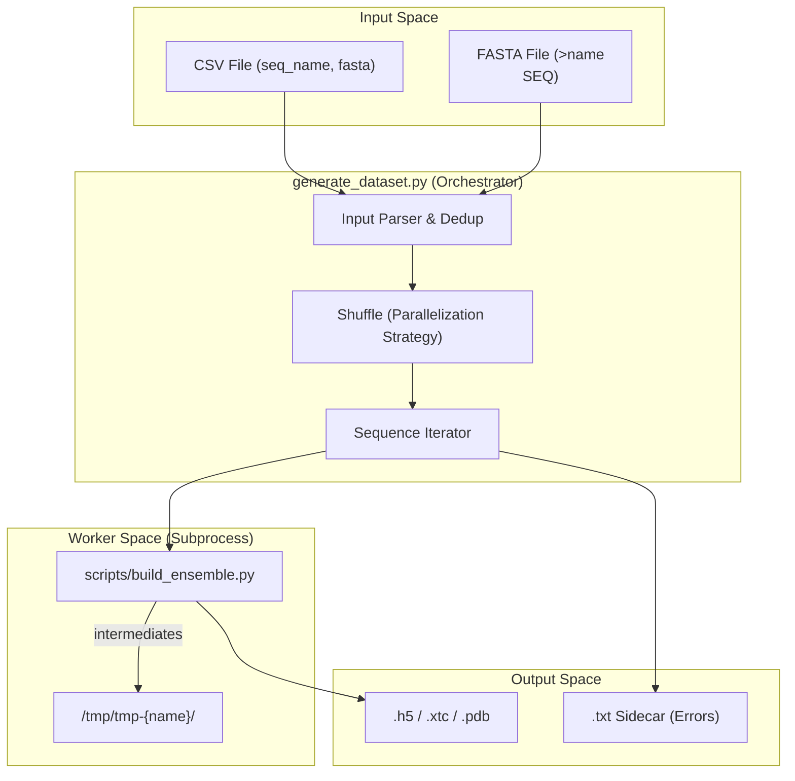
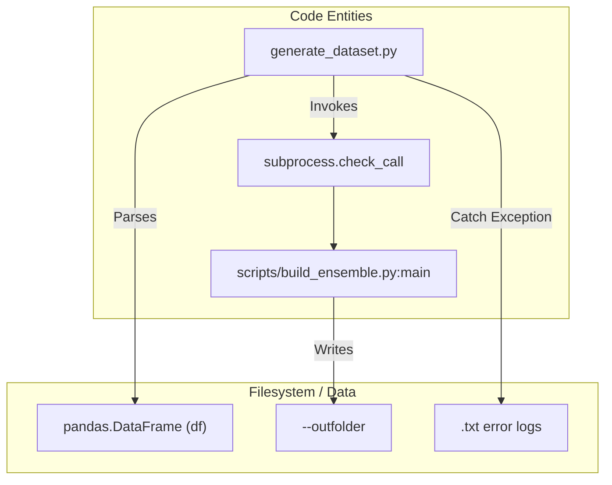

# Batch Dataset Generator: generate\_dataset\.py

> **Relevant source files**
> - [generate\_dataset\.py](https://github.com/PeptoneLtd/IDP-o/blob/93f72d31/generate_dataset.py)
> - [scripts/build\_ensemble\.py](https://github.com/PeptoneLtd/IDP-o/blob/93f72d31/scripts/build_ensemble.py)

 The `generate_dataset.py` script serves as the high\-level batch processing entry point for the IDP\-o pipeline\. It is designed to consume large\-scale sequence datasets \(such as the IDRome\-o collection\) and orchestrate the ensemble generation process for each sequence by delegating to the single\-sequence builder\. It manages input parsing, duplicate handling, filesystem isolation, and parallelization\-friendly execution ordering\.

## Purpose and Scope

 While `build_ensemble.py` handles the scientific logic of fragment search and assembly for a single protein, `generate_dataset.py` provides the infrastructure for high\-throughput production\. Its primary responsibilities include:

 - **Input Handling**: Parsing bulk sequence data from CSV or FASTA formats [generate\_dataset\.py L29-L81](https://github.com/PeptoneLtd/IDP-o/blob/93f72d31/generate_dataset.py#L29-L81)
- **Data Integrity**: Automatic detection and removal of duplicate sequences or identifiers [generate\_dataset\.py L84-L88](https://github.com/PeptoneLtd/IDP-o/blob/93f72d31/generate_dataset.py#L84-L88)
- **Process Isolation**: Creating unique scratch directories per sequence to prevent race conditions [generate\_dataset\.py L101-L111](https://github.com/PeptoneLtd/IDP-o/blob/93f72d31/generate_dataset.py#L101-L111)
- **Fault Tolerance**: Capturing subprocess failures into sidecar `.txt` log files to ensure the batch continues even if specific sequences fail [generate\_dataset\.py L120-L124](https://github.com/PeptoneLtd/IDP-o/blob/93f72d31/generate_dataset.py#L120-L124)

## System Data Flow

 The following diagram illustrates how `generate_dataset.py` transforms raw sequence files into a structured dataset of structural ensembles\.

### Data Transformation Workflow

 **Sources:** [generate\_dataset\.py L24-L59](https://github.com/PeptoneLtd/IDP-o/blob/93f72d31/generate_dataset.py#L24-L59) [generate\_dataset\.py L97-L124](https://github.com/PeptoneLtd/IDP-o/blob/93f72d31/generate_dataset.py#L97-L124)

---

## Implementation Details

### Input Parsing and Configuration

 The script supports two primary input formats:

 1. **FASTA**: Standard format where headers \(prefixed with `>`\) are treated as sequence IDs and the following line as the amino acid sequence [generate\_dataset\.py L68-L76](https://github.com/PeptoneLtd/IDP-o/blob/93f72d31/generate_dataset.py#L68-L76)
2. **CSV**: A delimited file where column names for the identifier and the sequence can be configured via the `--column_names` argument \(defaulting to `seq_name,fasta`\) [generate\_dataset\.py L45-L49](https://github.com/PeptoneLtd/IDP-o/blob/93f72d31/generate_dataset.py#L45-L49) [generate\_dataset\.py L77-L79](https://github.com/PeptoneLtd/IDP-o/blob/93f72d31/generate_dataset.py#L77-L79)

### Parallelization Strategy: The Shuffle Mechanism

 The script includes a `--shuffle` flag [generate\_dataset\.py L50](https://github.com/PeptoneLtd/IDP-o/blob/93f72d31/generate_dataset.py#L50-L50) When enabled, the internal DataFrame of sequences is randomized before processing [generate\_dataset\.py L94-L96](https://github.com/PeptoneLtd/IDP-o/blob/93f72d31/generate_dataset.py#L94-L96)

 This is a critical feature for distributed computing: multiple instances of `generate_dataset.py` can be pointed at the same input file and output directory\. Because the order is randomized and the script checks for existing output files \(or skips them unless `--overwrite` is set\), multiple workers can effectively "graze" the dataset without explicit MPI coordination, significantly increasing throughput on GPU clusters\.

### Subprocess Delegation

 Rather than importing `build_ensemble.py` as a module, `generate_dataset.py` invokes it via `subprocess.check_call` [generate\_dataset\.py L118](https://github.com/PeptoneLtd/IDP-o/blob/93f72d31/generate_dataset.py#L118-L118) This provides several technical advantages:

 - **Memory Recovery**: JAX and CuPy memory allocations are fully released when the subprocess exits, preventing GPU memory fragmentation over long batch runs\.
- **Environment Isolation**: Each sequence run starts with a clean state\.
- **Error Sidecars**: If a subprocess fails, the traceback is captured and written to a `.txt` file with the same base name as the intended output ensemble [generate\_dataset\.py L121-L124](https://github.com/PeptoneLtd/IDP-o/blob/93f72d31/generate_dataset.py#L121-L124) This allows researchers to easily identify and debug "difficult" sequences \(e\.g\., those with no fragment hits\) after the batch completes\.

### Sequence Processing Logic

 For every row in the input, the script performs the following steps:

 1. **Path Resolution**: Determines the final output path based on the provided `--format` \(h5, xtc, pdb, pdb\.gz, or dcd\) [generate\_dataset\.py L52-L57](https://github.com/PeptoneLtd/IDP-o/blob/93f72d31/generate_dataset.py#L52-L57) [generate\_dataset\.py L100](https://github.com/PeptoneLtd/IDP-o/blob/93f72d31/generate_dataset.py#L100-L100)
2. **Scratch Isolation**: Defines a unique directory in `/tmp` using the sequence name to store `byte_starts.pkl` and intermediate fragment HDF5 files [generate\_dataset\.py L101-L102](https://github.com/PeptoneLtd/IDP-o/blob/93f72d31/generate_dataset.py#L101-L102)
3. **Execution**: Constructs and executes the CLI command for `build_ensemble.py` [generate\_dataset\.py L103-L114](https://github.com/PeptoneLtd/IDP-o/blob/93f72d31/generate_dataset.py#L103-L114)

 **Sources:** [generate\_dataset\.py L97-L125](https://github.com/PeptoneLtd/IDP-o/blob/93f72d31/generate_dataset.py#L97-L125) [build\_ensemble\.py L25-L80](https://github.com/PeptoneLtd/IDP-o/blob/93f72d31/scripts/build_ensemble.py#L25-L80)

---

## Code Entity Map

 The following diagrams map the high\-level batch operations to the specific code entities and filesystem artifacts they interact with\.

### Batch Execution Entity Mapping

 **Sources:** [generate\_dataset\.py L75](https://github.com/PeptoneLtd/IDP-o/blob/93f72d31/generate_dataset.py#L75-L75) [generate\_dataset\.py L105](https://github.com/PeptoneLtd/IDP-o/blob/93f72d31/generate_dataset.py#L105-L105) [generate\_dataset\.py L118](https://github.com/PeptoneLtd/IDP-o/blob/93f72d31/generate_dataset.py#L118-L118) [generate\_dataset\.py L123](https://github.com/PeptoneLtd/IDP-o/blob/93f72d31/generate_dataset.py#L123-L123)

### Per\-Sequence Execution Flow

| Step | Code Reference | Description |
| --- | --- | --- |
| Dedup | generate\_dataset\.py84\-88 | Removes duplicate sequences and names from the input df\. |
| Shuffle | generate\_dataset\.py94\-96 | Randomizes df rows for parallel worker distribution\. |
| Isolation | generate\_dataset\.py101\-102 | Creates /tmp/tmp\-\{name\} for intermediate artifacts\. |
| Delegation | generate\_dataset\.py103\-118 | Calls build\_ensemble\.py via check\_call\. |
| Logging | generate\_dataset\.py120\-124 | Writes traceback\.format\_exc\(\) to sidecar \.txt on failure\. |

 **Sources:** [generate\_dataset\.py L84-L124](https://github.com/PeptoneLtd/IDP-o/blob/93f72d31/generate_dataset.py#L84-L124)
