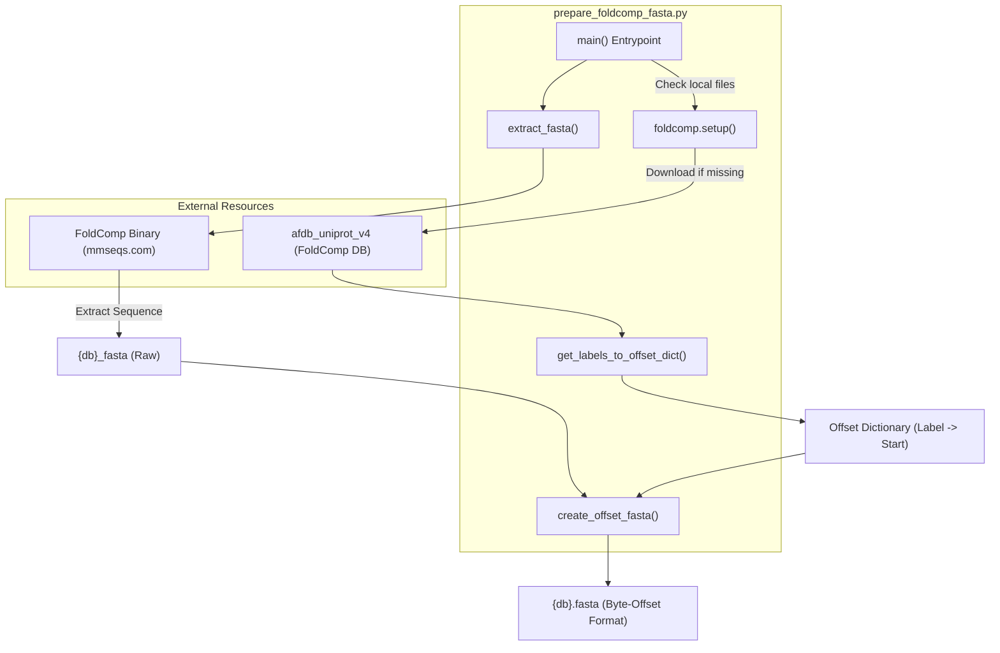
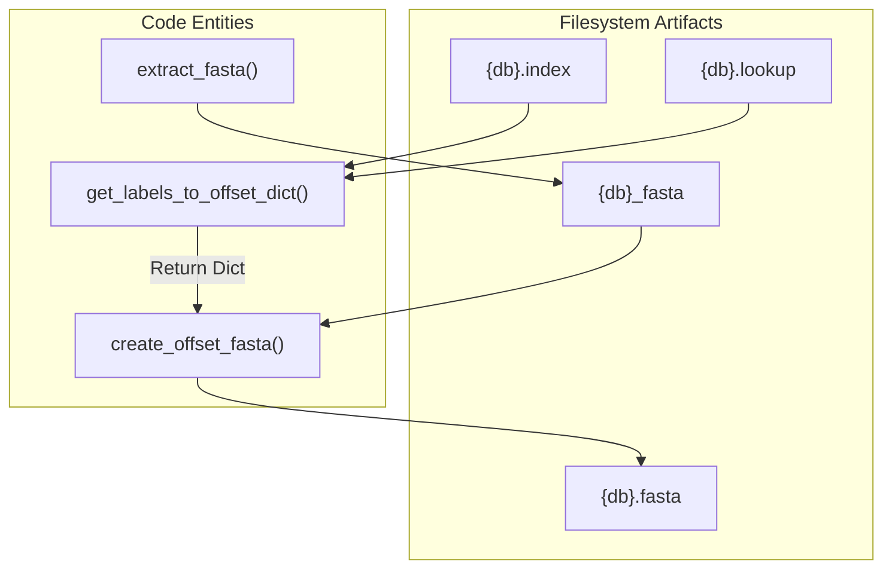

# Database Preparation: prepare\_foldcomp\_fasta\.py

> **Relevant source files**
> - [README\.md](https://github.com/PeptoneLtd/IDP-o/blob/93f72d31/README.md?plain=1)
> - [scripts/prepare\_foldcomp\_fasta\.py](https://github.com/PeptoneLtd/IDP-o/blob/93f72d31/scripts/prepare_foldcomp_fasta.py)

 The `prepare_foldcomp_fasta.py` script is a critical pre\-processing utility designed to bootstrap the IDP\-o pipeline by preparing the necessary structural and sequence databases\. Its primary responsibility is to transform the standard FoldComp database format into a specialized "byte\-offset FASTA" format required for high\-speed fragment searching in downstream stages [README\.md?plain=1 L23-L32](https://github.com/PeptoneLtd/IDP-o/blob/93f72d31/README.md?plain=1#L23-L32)

## Purpose and Scope

 IDP\-o relies on a specific FASTA format where the header of each sequence entry contains the exact byte offset of the corresponding structure within the FoldComp binary database [README\.md?plain=1 L27-L30](https://github.com/PeptoneLtd/IDP-o/blob/93f72d31/README.md?plain=1#L27-L30) This allows the `fasta_search_in_foldcomp_database.py` stage to immediately identify the physical location of structural data for any sequence match, bypassing expensive database lookups during the search phase\.

 The script automates three main tasks:

 1. **Database Acquisition**: Downloading the `afdb_uniprot_v4` FoldComp database \(~1\.1 TB\) if not present [prepare\_foldcomp\_fasta\.py L133-L135](https://github.com/PeptoneLtd/IDP-o/blob/93f72d31/scripts/prepare_foldcomp_fasta.py#L133-L135)
2. **Binary Provisioning**: Automatically detecting or downloading the platform\-specific `foldcomp` binary \(Linux, macOS, or Windows\) to perform sequence extraction [prepare\_foldcomp\_fasta\.py L60-L98](https://github.com/PeptoneLtd/IDP-o/blob/93f72d31/scripts/prepare_foldcomp_fasta.py#L60-L98)
3. **Index Joining**: Merging FoldComp `.index` and `.lookup` files to map UniProt labels to binary offsets [prepare\_foldcomp\_fasta\.py L33-L50](https://github.com/PeptoneLtd/IDP-o/blob/93f72d31/scripts/prepare_foldcomp_fasta.py#L33-L50)

## Data Flow and Logic

 The script orchestrates the flow from raw database files to the specialized FASTA index\.

### Database Preparation Workflow

 "Logic Flow of prepare\_foldcomp\_fasta\.py"



 **Sources:** [prepare\_foldcomp\_fasta\.py L120-L149](https://github.com/PeptoneLtd/IDP-o/blob/93f72d31/scripts/prepare_foldcomp_fasta.py#L120-L149) [prepare\_foldcomp\_fasta\.py L52-L105](https://github.com/PeptoneLtd/IDP-o/blob/93f72d31/scripts/prepare_foldcomp_fasta.py#L52-L105) [prepare\_foldcomp\_fasta\.py L106-L118](https://github.com/PeptoneLtd/IDP-o/blob/93f72d31/scripts/prepare_foldcomp_fasta.py#L106-L118)

## Implementation Details

### Offset Mapping Logic

 The core of the preparation lies in `get_labels_to_offset_dict`\. FoldComp databases store structural data in a binary blob, with metadata split across two files:

 - `.index`: Contains the `id`, `start` byte, and `end` byte [prepare\_foldcomp\_fasta\.py L35](https://github.com/PeptoneLtd/IDP-o/blob/93f72d31/scripts/prepare_foldcomp_fasta.py#L35-L35)
- `.lookup`: Contains the `id` and the human\-readable `label` \(e\.g\., UniProt accession\) [prepare\_foldcomp\_fasta\.py L41-L45](https://github.com/PeptoneLtd/IDP-o/blob/93f72d31/scripts/prepare_foldcomp_fasta.py#L41-L45)

 The function performs an inner join on the `id` column using `pandas` to create a direct mapping from the `label` to the `start` byte offset [prepare\_foldcomp\_fasta\.py L49](https://github.com/PeptoneLtd/IDP-o/blob/93f72d31/scripts/prepare_foldcomp_fasta.py#L49-L49)

### The Byte\-Offset FASTA Format

 After extracting the raw sequences using the `foldcomp extract --fasta` command [prepare\_foldcomp\_fasta\.py L103](https://github.com/PeptoneLtd/IDP-o/blob/93f72d31/scripts/prepare_foldcomp_fasta.py#L103-L103) the script iterates through the resulting file\. It replaces the standard FASTA headers \(UniProt labels\) with the integer byte\-offset retrieved from the mapping dictionary [prepare\_foldcomp\_fasta\.py L112-L115](https://github.com/PeptoneLtd/IDP-o/blob/93f72d31/scripts/prepare_foldcomp_fasta.py#L112-L115)

 **Format Example:**

```
>1024MKVLVLDDANR...>50482MLILIDDHALL...
```

 *In this example, `1024` is the byte position in the binary `.afdb_uniprot_v4` file where the structure for the first sequence begins\.*

### Cross\-Platform Binary Management

 To ensure portability, `extract_fasta` checks for an existing `foldcomp` installation [prepare\_foldcomp\_fasta\.py L54-L56](https://github.com/PeptoneLtd/IDP-o/blob/93f72d31/scripts/prepare_foldcomp_fasta.py#L54-L56) If not found, it detects the OS \(`platform.system()`\) and architecture \(`platform.machine()`\) to download the appropriate pre\-compiled binary from `mmseqs.com` [prepare\_foldcomp\_fasta\.py L62-L85](https://github.com/PeptoneLtd/IDP-o/blob/93f72d31/scripts/prepare_foldcomp_fasta.py#L62-L85) It handles `.zip` extraction for Windows and `.tar.gz` for Unix\-like systems, including setting executable permissions via `os.chmod` [prepare\_foldcomp\_fasta\.py L87-L96](https://github.com/PeptoneLtd/IDP-o/blob/93f72d31/scripts/prepare_foldcomp_fasta.py#L87-L96)

## Component Interaction

 The following diagram maps the Python functions to the file artifacts they manipulate\.

 "Code Entity to File Artifact Mapping"



 **Sources:** [prepare\_foldcomp\_fasta\.py L33-L50](https://github.com/PeptoneLtd/IDP-o/blob/93f72d31/scripts/prepare_foldcomp_fasta.py#L33-L50) [prepare\_foldcomp\_fasta\.py L52-L105](https://github.com/PeptoneLtd/IDP-o/blob/93f72d31/scripts/prepare_foldcomp_fasta.py#L52-L105) [prepare\_foldcomp\_fasta\.py L106-L118](https://github.com/PeptoneLtd/IDP-o/blob/93f72d31/scripts/prepare_foldcomp_fasta.py#L106-L118)

## Execution Arguments

| Argument | Default | Description |
| --- | --- | --- |
| \-\-foldcomp\-db | afdb\_uniprot\_v4 | The name/path of the FoldComp database to process scripts/prepare\_foldcomp\_fasta\.py125 |
| \-\-threads | 8 | Number of threads to use for foldcomp extract scripts/prepare\_foldcomp\_fasta\.py126 |
| \-\-workdir | /data/foldcomp\_db | Directory where the database will be downloaded and processed scripts/prepare\_foldcomp\_fasta\.py127 |

 **Sources:** [prepare\_foldcomp\_fasta\.py L121-L128](https://github.com/PeptoneLtd/IDP-o/blob/93f72d31/scripts/prepare_foldcomp_fasta.py#L121-L128)

