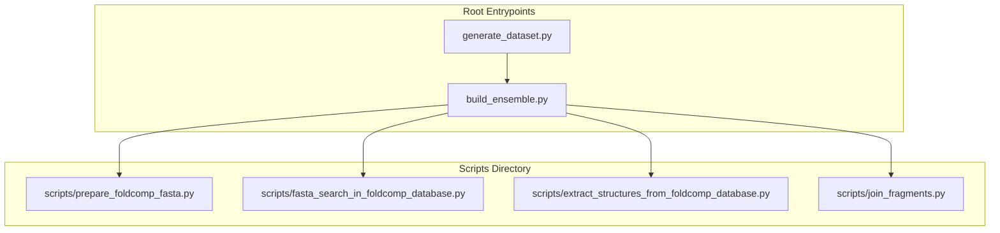
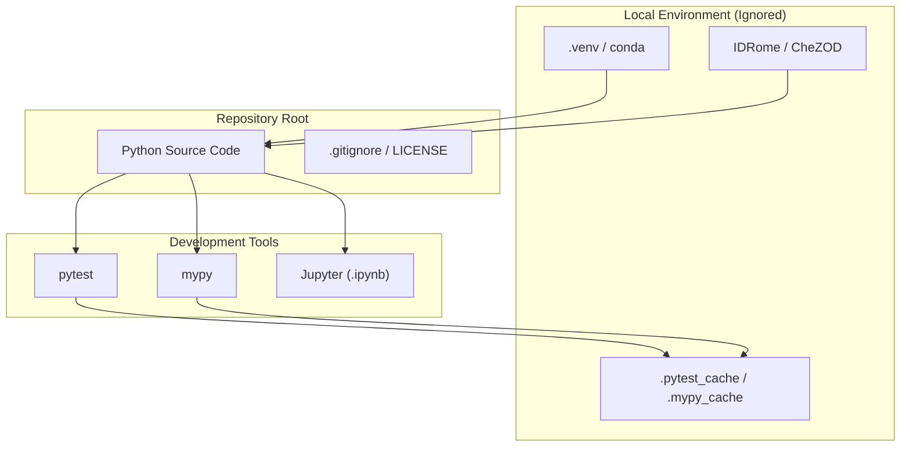

# Development Environment and Repository Layout

> **Relevant source files**
> * [.gitignore](https://github.com/PeptoneLtd/IDP-o/blob/93f72d31/.gitignore)
> * [LICENSE](https://github.com/PeptoneLtd/IDP-o/blob/93f72d31/LICENSE)
> * [assets/idp-o.png](https://github.com/PeptoneLtd/IDP-o/blob/93f72d31/assets/idp-o.png)

This page provides a technical overview of the IDP-o repository structure, the configuration of the Python development environment, and the licensing terms governing the codebase. It details how the project integrates various tooling for testing, type checking, and data management.

## Repository Structure

The IDP-o repository is organized to separate core logic, orchestration scripts, and static assets. The root directory contains the primary entrypoints for users, while the `scripts/` directory houses the modular pipeline stages.

### Directory Organization

| Path | Description |
| --- | --- |
| `build_ensemble.py` | The primary CLI entrypoint for single-sequence processing. |
| `generate_dataset.py` | Batch processing script for large-scale ensemble generation. |
| `scripts/` | Contains the four core pipeline modules (`prepare_foldcomp_fasta.py`, `fasta_search_in_foldcomp_database.py`, `extract_structures_from_foldcomp_database.py`, `join_fragments.py`). |
| `assets/` | Static project assets, including the project logo `idp-o.png`. |
| `tests/` | (Implicit) Target for `pytest` integration. |
| `.gitignore` | Defines excluded files, including environment folders and large datasets. |

### Data Flow and Code Entity Mapping

The following diagram maps the logical pipeline stages to their corresponding script entities within the repository.

**Pipeline Entity Mapping**

**Sources:** `build_ensemble.py`, `generate_dataset.py`, `scripts/` directory contents.

---

## Python Environment and Tooling

IDP-o requires a specialized environment due to its heavy reliance on GPU acceleration (CuPy, JAX) and structural biology libraries.

### Environment Management

The repository is configured to support standard Python environment managers. Common environment directories are explicitly ignored by version control to prevent local configuration leaks [.gitignore L122-L130](https://github.com/PeptoneLtd/IDP-o/blob/93f72d31/.gitignore#L122-L130)

.

* **Virtual Environments:** Supported via `venv/`, `.venv/`, or `env/` [.gitignore L124-L126](https://github.com/PeptoneLtd/IDP-o/blob/93f72d31/.gitignore#L124-L126) .
* **Conda/Mamba:** Recommended for managing CUDA toolkit dependencies, though not explicitly defined by a `conda.yaml` in the root.
* **Pipenv/Poetry:** The repository includes configurations to ignore lock files if they are generated locally [.gitignore L90-L102](https://github.com/PeptoneLtd/IDP-o/blob/93f72d31/.gitignore#L90-L102) .

### Tooling Integrations

The project integrates with several standard Python quality assurance tools:

* **pytest:** Unit and integration testing. Cache files are excluded [.gitignore L51](https://github.com/PeptoneLtd/IDP-o/blob/93f72d31/.gitignore#L51-L51) .
* **mypy:** Static type checking. The `.mypy_cache/` is excluded to maintain a clean workspace [.gitignore L142](https://github.com/PeptoneLtd/IDP-o/blob/93f72d31/.gitignore#L142-L142) .
* **Jupyter:** Used for prototyping and data analysis. Notebook checkpoints are ignored [.gitignore L79](https://github.com/PeptoneLtd/IDP-o/blob/93f72d31/.gitignore#L79-L79) .
* **Rope/PyCharm/Spyder:** IDE-specific metadata and project settings are filtered out to ensure cross-IDE compatibility [.gitignore L131-L160](https://github.com/PeptoneLtd/IDP-o/blob/93f72d31/.gitignore#L131-L160) .

**Sources:** [.gitignore L1-L160](https://github.com/PeptoneLtd/IDP-o/blob/93f72d31/.gitignore#L1-L160)

---

## Excluded Datasets

To maintain repository performance and adhere to data storage best practices, large-scale biological datasets and intermediate results are excluded from Git tracking. Developers must ensure these datasets are provisioned in the local environment as described in the **Getting Started** guide.

| Dataset / Pattern | Description |
| --- | --- |
| `IDR-30` | Redundant IDR dataset used for benchmarking [.gitignore L168](https://github.com/PeptoneLtd/IDP-o/blob/93f72d31/.gitignore#L168-L168)   . |
| `CheZOD*` | Chemical shift-based disorder datasets [.gitignore L170](https://github.com/PeptoneLtd/IDP-o/blob/93f72d31/.gitignore#L170-L170)   . |
| `IDRome` | The full IDRome structural ensemble collection [.gitignore L172](https://github.com/PeptoneLtd/IDP-o/blob/93f72d31/.gitignore#L172-L172)   . |
| `trizod/2024-05-09/` | Specific versioned snapshots of disorder data [.gitignore L171](https://github.com/PeptoneLtd/IDP-o/blob/93f72d31/.gitignore#L171-L171)   . |
| `old-IDRs` | Legacy IDR data files [.gitignore L169](https://github.com/PeptoneLtd/IDP-o/blob/93f72d31/.gitignore#L169-L169)   . |

**Sources:** [.gitignore L167-L172](https://github.com/PeptoneLtd/IDP-o/blob/93f72d31/.gitignore#L167-L172)

---

## License Terms

IDP-o is released under the **Apache License, Version 2.0**. This license is a permissive free software license written by the Apache Software Foundation (ASF).

### Key Provisions

* **Grant of Copyright License:** Contributors grant a perpetual, worldwide, non-exclusive, no-charge, royalty-free, irrevocable copyright license to reproduce, prepare derivative works of, and distribute the Work [LICENSE L66-L71](https://github.com/PeptoneLtd/IDP-o/blob/93f72d31/LICENSE#L66-L71) .
* **Grant of Patent License:** Contributors grant a patent license for any patent claims necessarily infringed by their contributions [LICENSE L73-L81](https://github.com/PeptoneLtd/IDP-o/blob/93f72d31/LICENSE#L73-L81) .
* **Redistribution:** You may reproduce and distribute copies of the Work or Derivative Works in any medium, provided you give recipients a copy of the license and retain all copyright, patent, and trademark notices [LICENSE L89-L104](https://github.com/PeptoneLtd/IDP-o/blob/93f72d31/LICENSE#L89-L104) .
* **Trademarks:** The license does not grant permission to use the trade names, trademarks, service marks, or product names of the Licensor (Peptone Ltd) [LICENSE L130-L131](https://github.com/PeptoneLtd/IDP-o/blob/93f72d31/LICENSE#L130-L131)  (implied by standard Apache 2.0 terms).

**Sources:** [LICENSE L1-L131](https://github.com/PeptoneLtd/IDP-o/blob/93f72d31/LICENSE#L1-L131)

---

## Infrastructure Summary

The following diagram illustrates the relationship between the repository layout and the development tools.

**Environment and Tooling Interaction**

**Sources:** [.gitignore L1-L172](https://github.com/PeptoneLtd/IDP-o/blob/93f72d31/.gitignore#L1-L172)

, [LICENSE L1-L131](https://github.com/PeptoneLtd/IDP-o/blob/93f72d31/LICENSE#L1-L131)