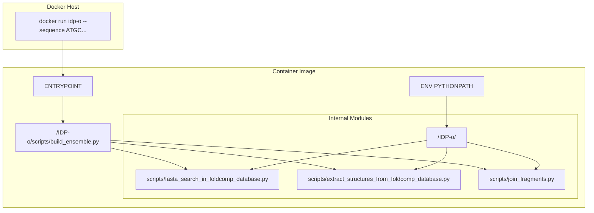
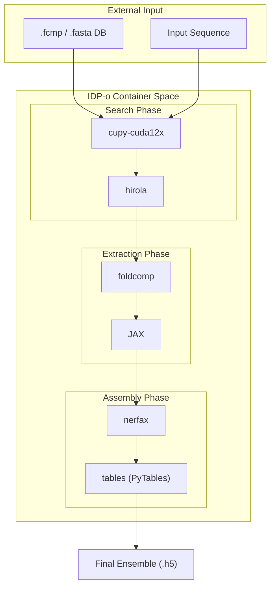

# Docker Container

> **Relevant source files**
> * [.dockerignore](https://github.com/PeptoneLtd/IDP-o/blob/93f72d31/.dockerignore)
> * [Dockerfile](https://github.com/PeptoneLtd/IDP-o/blob/93f72d31/Dockerfile)

The IDP-o pipeline is distributed as a containerized environment to ensure reproducible execution across different GPU-accelerated infrastructures. The container encapsulates the complex intersection of JAX-based structural biology tools, NVIDIA CUDA libraries, and high-performance data structures required for fragment-based ensemble generation.

## Base Image and Environment

The container is built upon the official NVIDIA JAX image: `nvcr.io/nvidia/jax:24.10-py3` [Dockerfile L1](https://github.com/PeptoneLtd/IDP-o/blob/93f72d31/Dockerfile#L1-L1)

 This base provides a pre-configured environment with `JAX`, `CUDA`, and `cuDNN` optimized for NVIDIA hardware, which is critical for the vectorized operations in the assembly and extraction stages.

The `PYTHONPATH` is explicitly set to `/IDP-o/` to ensure that the orchestration scripts can resolve internal module dependencies when executed from the root [Dockerfile L6](https://github.com/PeptoneLtd/IDP-o/blob/93f72d31/Dockerfile#L6-L6)

### Build Exclusions

To maintain a lean image size and prevent local development artifacts from polluting the container, the `.dockerignore` file excludes the `.docker-cache` directory [.dockerignore L1](https://github.com/PeptoneLtd/IDP-o/blob/93f72d31/.dockerignore#L1-L1)

## Dependency Stack

The container installs several specialized libraries via `pip` to handle structural data, high-speed indexing, and coordinate geometry [Dockerfile L3](https://github.com/PeptoneLtd/IDP-o/blob/93f72d31/Dockerfile#L3-L3)

| Dependency | Purpose in IDP-o |
| --- | --- |
| `nerfax` | A JAX-based implementation of the Natural Extension Reference Frame (NeRF). Used for backbone reconstruction and hydrogen placement [Dockerfile L3](https://github.com/PeptoneLtd/IDP-o/blob/93f72d31/Dockerfile#L3-L3) |
| `foldcomp` | Provides the binary decompression logic for `.fcmp` files to retrieve discretized torsion angles [Dockerfile L3](https://github.com/PeptoneLtd/IDP-o/blob/93f72d31/Dockerfile#L3-L3) |
| `cupy-cuda12x` | Enables GPU-accelerated byte-stream matching for sequence fragment searches [Dockerfile L3](https://github.com/PeptoneLtd/IDP-o/blob/93f72d31/Dockerfile#L3-L3) |
| `hirola` | High-performance hash maps used for efficient indexing and deduplication of fragment hits [Dockerfile L3](https://github.com/PeptoneLtd/IDP-o/blob/93f72d31/Dockerfile#L3-L3) |
| `tables` (PyTables) | Manages the HDF5 storage backend for intermediate structural fragments and final ensembles [Dockerfile L3](https://github.com/PeptoneLtd/IDP-o/blob/93f72d31/Dockerfile#L3-L3) |
| `pynmrstar` | Provides parsing capabilities for NMR-STAR files, supporting experimental data integration [Dockerfile L3](https://github.com/PeptoneLtd/IDP-o/blob/93f72d31/Dockerfile#L3-L3) |
| `joblib` | Facilitates CPU-bound parallelization for tasks such as FASTA indexing and batch file I/O [Dockerfile L3](https://github.com/PeptoneLtd/IDP-o/blob/93f72d31/Dockerfile#L3-L3) |

**Sources:**

* [Dockerfile L1-L6](https://github.com/PeptoneLtd/IDP-o/blob/93f72d31/Dockerfile#L1-L6)
* [.dockerignore L1](https://github.com/PeptoneLtd/IDP-o/blob/93f72d31/.dockerignore#L1-L1)

## Execution Model and Entrypoint

The container is designed as an executable tool rather than a persistent service. The `ENTRYPOINT` is configured to trigger the single-sequence ensemble generation pipeline [Dockerfile L8](https://github.com/PeptoneLtd/IDP-o/blob/93f72d31/Dockerfile#L8-L8)

### Code Entity Space to Natural Language Space

The following diagram illustrates how the Docker configuration maps to the execution of the Python source code within the container filesystem.

**Container Execution Mapping**

**Sources:**

* [Dockerfile L5-L8](https://github.com/PeptoneLtd/IDP-o/blob/93f72d31/Dockerfile#L5-L8)

## Data Flow and Dependency Interaction

The containerized environment facilitates the flow of data from raw FoldComp databases to refined ensembles by providing the necessary C++ extensions (via `foldcomp`) and GPU kernels (via `cupy` and `jax`).

**Dependency Interaction Diagram**

**Sources:**

* [Dockerfile L3](https://github.com/PeptoneLtd/IDP-o/blob/93f72d31/Dockerfile#L3-L3)
* [Dockerfile L8](https://github.com/PeptoneLtd/IDP-o/blob/93f72d31/Dockerfile#L8-L8)