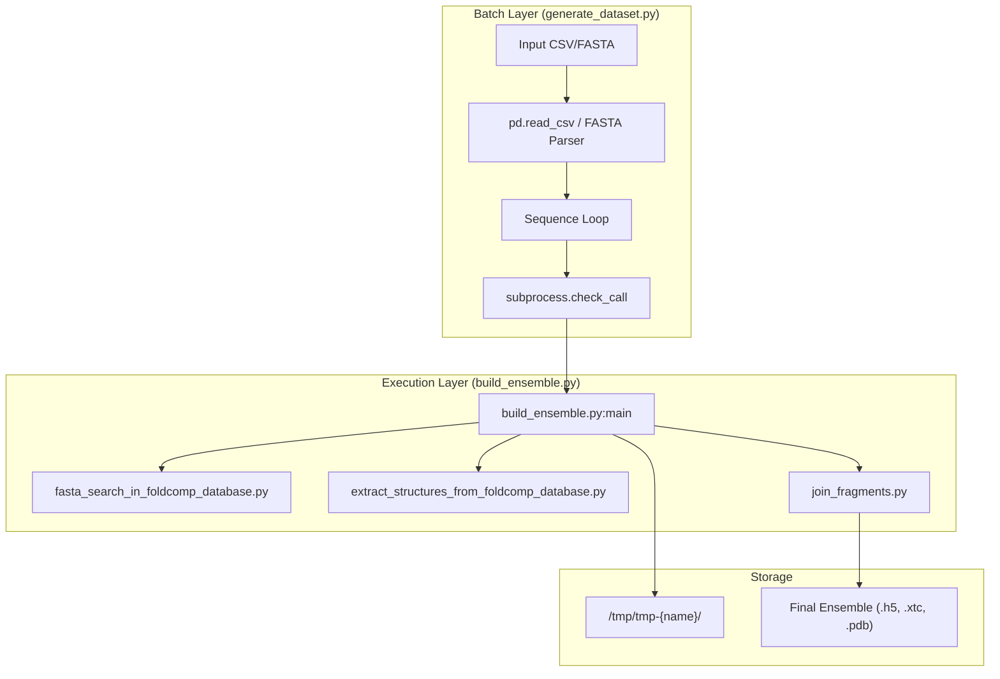
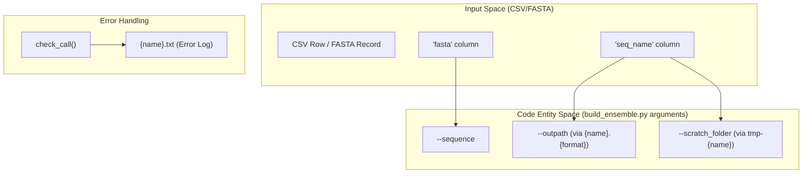

# Entrypoints and Batch Processing

> **Relevant source files**
> * [generate_dataset.py](https://github.com/PeptoneLtd/IDP-o/blob/93f72d31/generate_dataset.py)
> * [scripts/build_ensemble.py](https://github.com/PeptoneLtd/IDP-o/blob/93f72d31/scripts/build_ensemble.py)

This page provides an overview of the two primary ways to interact with the IDP-o pipeline: the single-sequence CLI and the batch dataset generator. While the core logic of ensemble generation resides in specialized modules, these entrypoints orchestrate the flow of data, manage scratch space, and handle output serialization.

## Overview of Entrypoints

IDP-o provides two main scripts for users to generate structural ensembles:

1. **`scripts/build_ensemble.py`**: The primary CLI for processing a single protein sequence. It orchestrates the entire four-stage pipeline (search, extraction, and assembly) for one target.
2. **`generate_dataset.py`**: A high-level batch processor that consumes CSV or FASTA files containing multiple sequences. It functions as a wrapper that delegates work to `build_ensemble.py` via subprocesses.

### System Orchestration Diagram

The following diagram illustrates how the batch generator interfaces with the single-sequence builder and the underlying pipeline modules.

**Sources:** [scripts/build_ensemble.py L25-L38](https://github.com/PeptoneLtd/IDP-o/blob/93f72d31/scripts/build_ensemble.py#L25-L38)

 [scripts/build_ensemble.py L61-L80](https://github.com/PeptoneLtd/IDP-o/blob/93f72d31/scripts/build_ensemble.py#L61-L80)

 [generate_dataset.py L97-L118](https://github.com/PeptoneLtd/IDP-o/blob/93f72d31/generate_dataset.py#L97-L118)

---

## Single-Sequence Ensemble Builder: build_ensemble.py

The `build_ensemble.py` script is the central orchestrator for a single sequence. It is responsible for validating the input amino acid sequence [scripts/build_ensemble.py L47-L50](https://github.com/PeptoneLtd/IDP-o/blob/93f72d31/scripts/build_ensemble.py#L47-L50)

 setting up the temporary directory structure for intermediate files [scripts/build_ensemble.py L52-L58](https://github.com/PeptoneLtd/IDP-o/blob/93f72d31/scripts/build_ensemble.py#L52-L58)

 and calling the three main pipeline stages in order.

For a detailed reference on CLI arguments, output formats, and internal logic, see **[Single-Sequence Ensemble Builder: build_ensemble.py](/PeptoneLtd/IDP-o/3.1-single-sequence-ensemble-builder:-build_ensemble.py)**.

### Key Responsibilities

* **Pipeline Orchestration**: Sequentially executes `fasta_search`, `extract_structures`, and `join_fragments` [scripts/build_ensemble.py L61-L80](https://github.com/PeptoneLtd/IDP-o/blob/93f72d31/scripts/build_ensemble.py#L61-L80)
* **Format Support**: Manages the final assembly into various formats including HDF5 (`.h5`), XTC, DCD, and PDB [scripts/build_ensemble.py L117-L119](https://github.com/PeptoneLtd/IDP-o/blob/93f72d31/scripts/build_ensemble.py#L117-L119)
* **Intermediate Management**: Handles the creation and cleanup of `byte_starts.pkl` and fragment ensemble directories within a designated `--scratch_folder` [scripts/build_ensemble.py L52-L57](https://github.com/PeptoneLtd/IDP-o/blob/93f72d31/scripts/build_ensemble.py#L52-L57)

**Sources:** [scripts/build_ensemble.py L15-L81](https://github.com/PeptoneLtd/IDP-o/blob/93f72d31/scripts/build_ensemble.py#L15-L81)

---

## Batch Dataset Generator: generate_dataset.py

The `generate_dataset.py` script is designed for large-scale dataset production, such as the creation of the **IDRome-o** dataset. It provides robust handling for input files, duplicate removal, and error logging.

For details on input parsing, parallelization strategies, and error sidecar files, see **[Batch Dataset Generator: generate_dataset.py](/PeptoneLtd/IDP-o/3.2-batch-dataset-generator:-generate_dataset.py)**.

### Execution Flow

The script maps sequence data from a source file to a series of CLI calls. It isolates each sequence by creating unique scratch folders under `/tmp/tmp-{name}` to prevent data collisions during concurrent execution [generate_dataset.py L101-L114](https://github.com/PeptoneLtd/IDP-o/blob/93f72d31/generate_dataset.py#L101-L114)

### Data Flow Mapping

The diagram below shows how `generate_dataset.py` maps natural language/CSV concepts to code entities used by `build_ensemble.py`.

**Sources:** [generate_dataset.py L67-L81](https://github.com/PeptoneLtd/IDP-o/blob/93f72d31/generate_dataset.py#L67-L81)

 [generate_dataset.py L100-L114](https://github.com/PeptoneLtd/IDP-o/blob/93f72d31/generate_dataset.py#L100-L114)

 [generate_dataset.py L120-L124](https://github.com/PeptoneLtd/IDP-o/blob/93f72d31/generate_dataset.py#L120-L124)

### Key Features

* **Input Flexibility**: Supports both FASTA headers and CSV columns defined via `--column_names` [generate_dataset.py L45-L49](https://github.com/PeptoneLtd/IDP-o/blob/93f72d31/generate_dataset.py#L45-L49)
* **Parallelization Strategy**: Includes a `--shuffle` flag to randomize the processing order, allowing multiple instances of the script to run on the same input file with a lower probability of processing the same sequence simultaneously [generate_dataset.py L50-L51](https://github.com/PeptoneLtd/IDP-o/blob/93f72d31/generate_dataset.py#L50-L51)  [generate_dataset.py L94-L96](https://github.com/PeptoneLtd/IDP-o/blob/93f72d31/generate_dataset.py#L94-L96)
* **Fault Tolerance**: If a sequence fails to build, the script captures the `traceback` and writes it to a `.txt` sidecar file next to the intended output path, then continues to the next sequence [generate_dataset.py L120-L124](https://github.com/PeptoneLtd/IDP-o/blob/93f72d31/generate_dataset.py#L120-L124)

**Sources:** [generate_dataset.py L24-L59](https://github.com/PeptoneLtd/IDP-o/blob/93f72d31/generate_dataset.py#L24-L59)

 [generate_dataset.py L84-L88](https://github.com/PeptoneLtd/IDP-o/blob/93f72d31/generate_dataset.py#L84-L88)